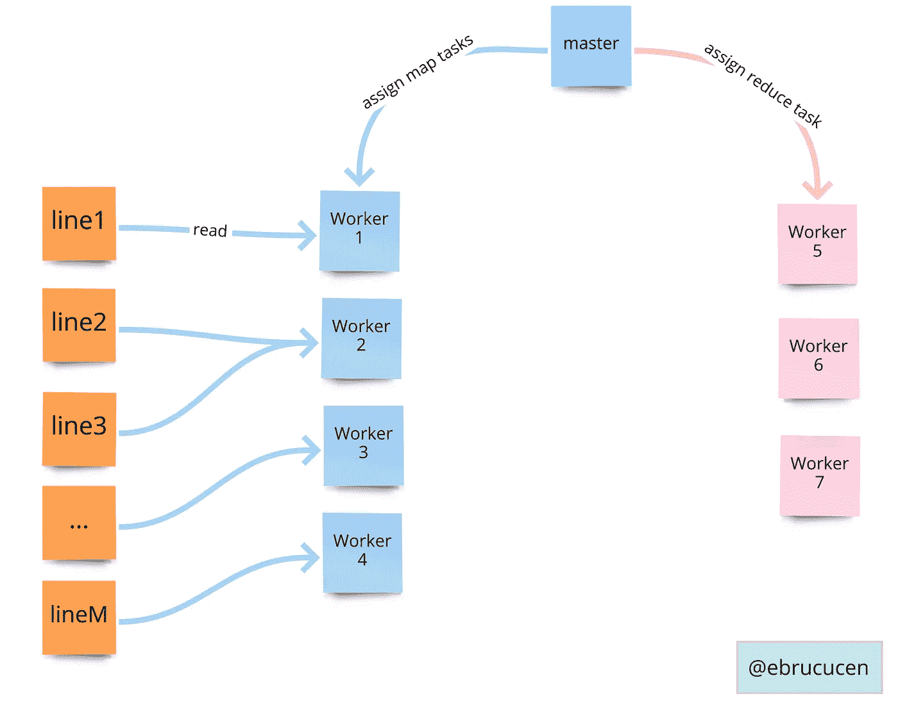
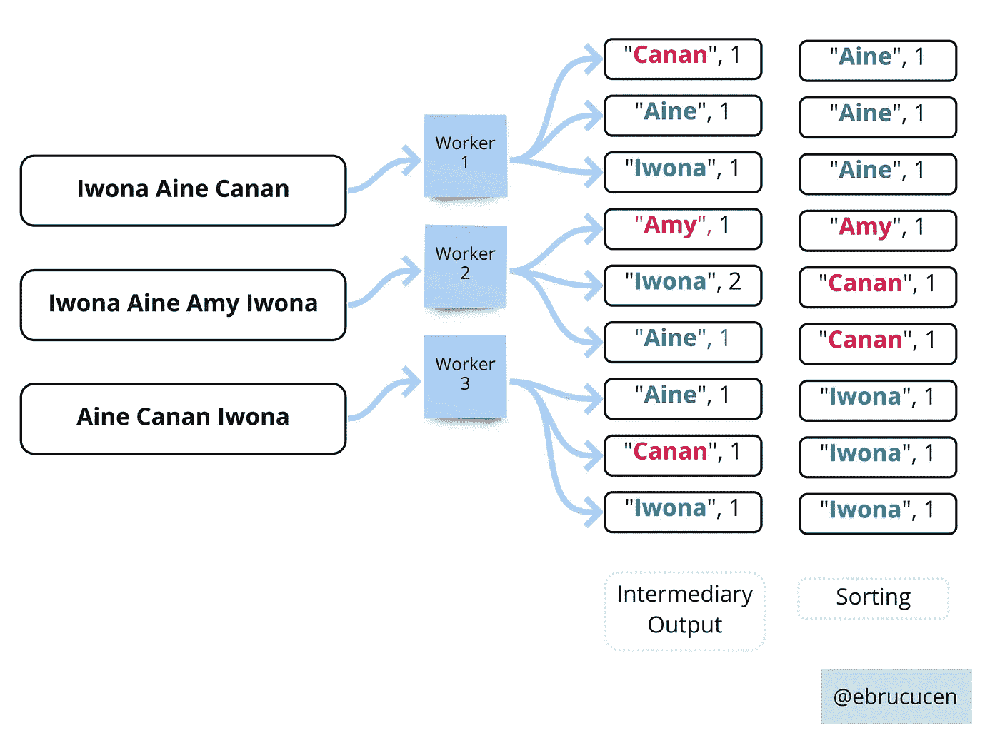
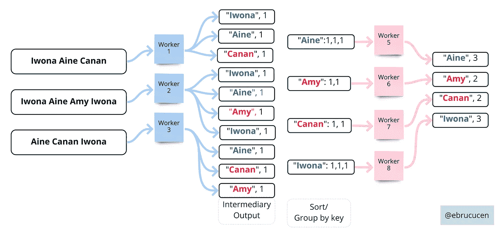

# 如何用例子处理大数据:MapReduce

> 原文：<https://towardsdatascience.com/series-on-distributed-computing-1-mapreduce-fcc3cc2dfb5?source=collection_archive---------34----------------------->

## [理解大数据](https://towardsdatascience.com/tagged/making-sense-of-big-data)

## 简单解释如何运行并行工作负载来处理大数据

我决定写一个关于分布式计算的系列，一个关于我们在哪里成功地正确处理大数据的历史回顾，以及它是如何演变的。处理大文件的挑战是，我们在分布式机器上运行的计算必须在合理的时间内完成，这带来了一些问题:我们如何进行令人尴尬的并行*计算，如何 ***分发数据*** ，以及我们如何处理故障。2004 年，谷歌共享了 MapReduce 框架，在平均运行 10 万个 MapReduce 任务 4 年后，每天处理大约 2004 的数据。*

*他们实现的是将流程与 Map 任务解耦，在 Map 任务中他们可以并行处理输入，并减少任务，在 master 中他们可以对分类和分组的数据进行聚合，master 跟踪工人的健康状况，任务的完成和在故障机器上重新执行任务允许 ***容错*** 。*

*通过一个简单的伪代码，该映射获取一个键/值输入对，并独立于原始输入计算另一个键/值对。reduce 使用键，将所有值从 map 函数中分离出来，进行排序/分组，以便对其运行聚合功能。输出通常是一个输出值。*

*地图(k1，v1) →列表(k2，v2)*

*减少(k2，列表(v2)) →列表(v2)*

**

*初始执行*

*让我们考虑一个简单的用例“单词计数”，我们试图找出每个单词出现的次数。在这个场景中，用户程序将输入文件分成 M 对。如果输入是一个语料库，则每个拆分将是一个文档，如果输入是一个文档，则每个拆分将是一行，依此类推……此外，它还会旋转多个 workers，其中一个是主节点。*

**

*主选择地图/减少任务*

*主节点负责分配工作人员来映射和减少任务，并检查健康检查(通过 ping)。如果任何工人在该时间范围内没有响应，master 会将他们标记为失败，并重新安排这些工人正在进行的任务，并且所有 map 任务作为机器上的输出数据都会丢失。*

**

*地图工作者处理的分割输入文件*

*分配给 ***map*** 函数的工人读取拆分对，并将中间的键/值对保存到其磁盘(首先向缓冲区和分区函数写入磁盘，但是为了不被分散注意力，我们跳过)。这在当时是开创性的，因为地图工作者在 ***中令人尴尬的做了这些*** ***并行*** 导致了大型商用电脑集群的高性能。*

*MapReduce 提供 ***局部优化，*** 因为它使用 GFS，master 向 GFS 请求输入文件块的位置，并在同一台机器或同一机架上调度映射任务，这允许数千台机器以本地磁盘速度读取输入，并且没有交换机机架，受读取速率的限制*

*问题是我们负责编写 map 和 reduce 函数，所以让我们看看如果我们用 Python 编写的话会做些什么。最初的文章/实现是在 C++上，我将使用 Python 来保持简单。如果您想了解更多信息，我在参考资料部分分享了许多实现方法:*

*现在，所有的中间键/值对都被保存了，分区函数将它们放到磁盘上，reduce 任务的一部分是对单词进行排序和分组。 ***Reduce*** 函数将采用唯一键和分组值列表，通过为全局输出追加每个输出来计算计数的总和。如果要求我们找出给定城市列表的最高温度，我们将对 Reduce 函数进行最大聚合。*

*如果 reduce 工作线程失败，主线程不会请求重新执行，因为输出是全局共享的。*

*我们完整的功能(在 [mrjob](https://mrjob.readthedocs.io/en/latest/) 模块的帮助下)如下所示。Mrjob 模块几乎可以运行任何本地和云 Hadoop 集群。(PS:如果你更喜欢用 go， [gossamr](http://github.com/vistarmedia/gossamr) repo 可能有用)*

*如果我们检查我们的完整示例，我们将获得每个单词的出现次数，并将其保存在一个全局可访问的位置。谷歌的论文基于 2000 台工作机、5000 个分区和 200，000 个分割，其中他们选择每个分割大约 16MB 到 64MB。*

**

*聚合的 reduce worker 导致唯一关键字的值*

*输入文件或键/值对不同于中介以及输出键/值对，我们无法预测何时处理数 Pb 的数据。*

## *后续步骤*

*它是第一个能够利用本地文件系统执行并行任务的抽象。接下来，[受 MapReduce](https://books.google.co.uk/books?id=axruBQAAQBAJ&pg=PA300&redir_esc=y#v=onepage&q&f=false) 编程模型的启发，2006 年的 Hadoop 由雅虎推出，云提供商也不吝推广 Hadoop-on-cloud 工具，即 Google 实现为 [Dataproc](https://cloud.google.com/dataproc) ，AWS 实现为 [EMR](https://aws.amazon.com/emr/features/hadoop/) (弹性 MapReduce)，Azure 实现为 [HDInsights](https://docs.microsoft.com/en-us/azure/hdinsight/) 。*

## ***号令:***

*所以，我们来反思一下 bak。问题是，对于这个简单的问题，你会如何改进谷歌找到的解决方案？如果您想处理重复执行，您将如何处理在 map 阶段结束时拆分的文件？你如何让软件开发人员更容易以更抽象的方式编写 map/reduce 函数？*

*直到下一个，保重！*

****参考文献:****

* [## MapReduce:大型集群上的简化数据处理——谷歌研究

### MapReduce 是用于处理和生成大型数据集的编程模型和相关实现。用户…

谷歌研究](https://research.google/pubs/pub62/)  [## 用 MapReduce 和 Hadoop 驯服大数据-动手！

### 使用 MapReduce 和 Hadoop 驯服大数据——亲自动手！现在有了奥莱利在线学习。奥赖利成员…

learning.oreilly.com](https://learning.oreilly.com/videos/taming-big-data/9781787125568/9781787125568-video1_2) 

迈克尔·诺尔的博客文章*