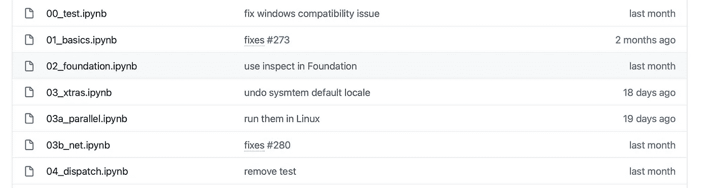
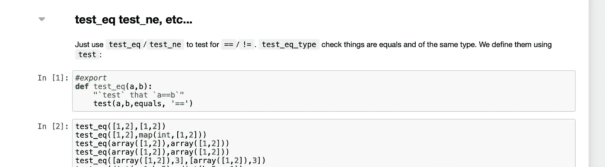

# 使用 Jupyter 笔记本进行严肃的软件开发

> 原文：<https://towardsdatascience.com/serious-software-development-using-jupyter-notebooks-95f84f4d8ef8?source=collection_archive---------24----------------------->

## 使用 nbdev 通过 Jupyter 笔记本构建 Python 包


肖恩·林在 [Unsplash](https://unsplash.com/s/photos/software-development?utm_source=unsplash&utm_medium=referral&utm_content=creditCopyText) 上的照片

## 介绍

下图来自一个名为 [fastcore](https://fastcore.fast.ai) 的库的文档页面。


它有源代码超链接，所以你可以很容易地检查实现，它有一个小的 pargraph 解释什么功能，它有测试，所以你可以验证函数的行为。

与常规的 Github 存储库相比，它只有部分文档或者没有文档，没有可供跳转的超链接，测试存在于单独的文件夹中，您已经可以看出哪种方法更好。

是的，你可以有变通办法，但没有什么比得上我将要向你展示的。

## 文化编程

早在 1983 年，Donald Knuth 就设想了一种叫做文化编程的编程风格。在这种编程风格中，你不再按照计算机强加的方式和顺序编写计算机程序，而是使程序员能够按照他们思维的逻辑和流程所要求的顺序开发程序。

> 来源:[https://en.wikipedia.org/wiki/Literate_programming](https://en.wikipedia.org/wiki/Literate_programming)

捕捉这种编程风格的最佳环境是 Jupyter 笔记本。你可以处理一些代码，拼出你的想法，当你满意时，把它们放在一起。它们非常适合迭代的、实验性的编程风格。

然而，直到最近，Jupyter 笔记本还缺乏许多构建软件的附加功能。它缺乏相关的组件，当这些组件放在一起时，无法使 Jupyter 成为一个真正有文化的编程环境。

介绍， **nbdev** 。


## nbdev

nbdev 是一个由 fastai 开发的库，只使用笔记本就可以开发 Python 包。我不打算给你一个特性的概要，因为我想让你仔细阅读并找出所有细节。[我也没有做代码遍历，因为 fastai 的网站上已经有了一个非常好的教程，所以重复相同的步骤没有意义。](https://nbdev.fast.ai/tutorial.html)

这篇文章的目标是向你介绍这个世界，一个你不知道存在的世界，让你爱上它，让你在下一个项目中使用它。

## 它是如何工作的？

让我们先来看看 nbdev 是如何工作的。因为我不做代码 walthru，我们将浏览已经使用 nbdev 构建的库的源代码，这个库被称为 [fastcore](https://fastcore.fast.ai) 。

如果你去 fastcore 的 [Github 页面，你会看到它有一个名为](https://github.com/fastai/fastcore) [**nbs**](https://github.com/fastai/fastcore/tree/master/nbs) 的文件夹，顾名思义，里面包含了一堆笔记本。



每个笔记本代表我们正在构建的包的一个[模块。例如](https://docs.python.org/3/tutorial/modules.html) [00_test.ipynb](https://github.com/fastai/fastcore/blob/master/nbs/00_test.ipynb) 将被转换成一个名为 [test.py](https://github.com/fastai/fastcore/blob/master/fastcore/test.py) 的模块。


我们软件包的用户可以如下使用它:

```
from fastcore.test import *
```

从笔记本到`.py`文件的转换是在一个名为`notebook2script()`的函数的帮助下完成的，这个函数在每个笔记本的末尾执行。


如果你打开其中一个笔记本，你会发现它看起来就像普通的 Jupyter 笔记本，除了一些东西。

您首先会注意到在某些单元格的开头有一串`#export`。



【nbdev 如何确定哪些细胞将成为模块的一部分。根据上面的代码，[单元格[1]](https://github.com/fastai/fastcore/blob/master/fastcore/test.py#L33) 将进入 [test.py](https://github.com/fastai/fastcore/blob/master/fastcore/test.py) ，但单元格[2]不会。

然而，单元格[2]将成为本模块文档的一部分。


这是我最喜欢的部分。你在笔记本上写的任何代码和解释都会自动转换成文档。你不需要在它上面花费任何额外的时间。此外，我们能够在源代码下面编写测试，并且它们也成为文档的一部分，这是一个巨大的好处。

传统 Python 测试模块的情况是，测试存在于不同的文件夹中。这使得识别哪个测试与哪个功能相关变得困难。当你修改源代码时，很难修改相关的测试，因为它们不在你的眼前。

Nbdev 为你解决了这两个问题。另外，任何阅读你的代码的人也可以看到测试是如何设计的，并获得更丰富的学习经验。

最后，请注意，在我们的 markdown 中的`backticks`中的关键字是在代码库中搜索的，如果找到，也是超链接的(参见上图中的 test_eq_type)。这真是不可思议。当开发软件时，自动化平凡的任务只是将更多的创造力放在你的手中。

## nbdev 的特点

现在让我们看看 nbdev 的特性列表，我可以给你一个每个特性的简单解释


*   **自动生成单据**

这个我已经解释过了。

*   **自动发布到 PyPI 和 conda 包的实用程序**

无论何时做`pip install bla`，bla 必须存在于 Python 包索引(PyPI)上。康达也是如此。发布到 PyPI [需要你以某种方式打包你的项目并创建一堆文件](https://packaging.python.org/tutorials/packaging-projects/)。Nbdev 通过自动化任务和提供实用程序来帮助您轻松发布，使这一过程变得非常简单。

*   **笔记本和源代码之间的双向同步**

ide 对于很多任务都很有用，例如，它们提供了更好的调试工具。使用 nbdev，您可以编辑源代码(。py 文件)，这些更改将反映在您的笔记本中。这允许你使用两种媒体的最佳功能。

*   **对隐藏/显示单元格的细粒度控制**

完整的 Jupyter 笔记本会转换为文档，但如果您愿意，可以隐藏某些单元格。就像`#export`一样，nbdev 包含一个`#hide`关键字。将它放在任何单元格的顶部，它就不会出现在生成的文档中。

*   **直接在笔记本上写测试**

我提到过您可以这样做，但是我提到过您可以像使用 pytest 一样通过 CLI 运行这些测试吗？如果你不想每次都运行长时间的，你也可以将它们分组。

*   **合并/冲突解决**

Jupyter 笔记本的一个问题是版本控制不太好用。Git 经常给出合并冲突，Github 的 visual diff 显示 Jupyter 笔记本底层 json 的变化，而不是实际的单元格变化。这很烦人。好吧，让 nbdev 帮你处理。它清理笔记本，以避免这些冲突，如果它们确实发生了，给你一个人可读的格式的错误。

*   **持续集成(CI)为您设置了** [**GitHub 动作**](https://github.com/features/actions)

Github Actions 允许您自动执行工作流程，比如当您推动新的变更、创建新的问题或提交 PR 时会发生什么。nbdev 为您设置此功能，无需任何手动干预。

*   **降价的所有功能**

现在我们使用 Markdown 进行文档记录，我们可以很容易地包含图像、格式化文本甚至数学方程。

*   **…还有更多**

在这一点上，我建议你浏览一下教程，了解更多让你兴奋的部分。

## 为什么是这个标题？

Joel Grus 有一个非常著名的演讲叫做“我不喜欢笔记本”。Joel 是一个优秀的演示者，他的演讲非常有趣，但它不鼓励人们使用笔记本进行严肃的开发。

现在，这个话题真的很老了，一些现在存在的东西，在当时是不存在的。但是，在专业人士中仍然有一个普遍的共识，Jupyter 笔记本只是用于实验，如果你想编写将被部署的严肃软件，你必须使用 ide。现在不再是这样了。

通过这篇文章，我希望能改变这种情况。希望你给这个彼岸一个尝试，希望更多的人用 Jupyter 笔记本做正经的软件开发。

~快乐学习。