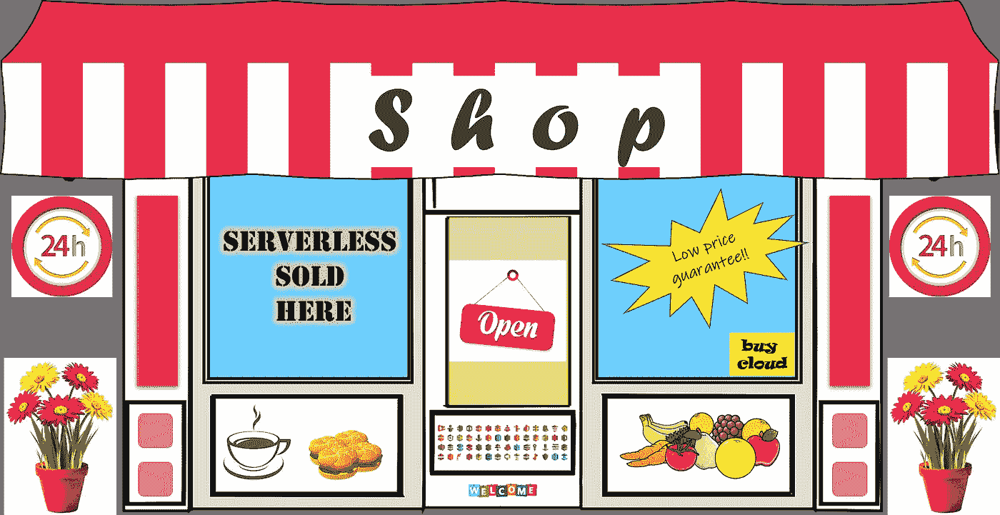
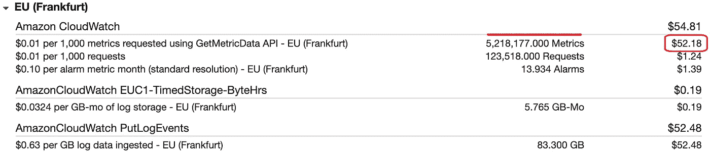

# 无服务器的采用:成本仍然是主要因素吗？

> 原文：<https://towardsdatascience.com/serverless-adoption-is-cost-still-the-main-factor-c5e910cf8b12?source=collection_archive---------41----------------------->

## 对无服务器的低成本认知正在改变吗？如果有，原因是什么？

基础图像来源: [pixabay](https://pixabay.com/illustrations/awning-store-shop-retail-business-2683099/)

*和 ***按使用付费*** 是许多组织采用无服务器的主要驱动因素。在给定的前提下，每个人使用无服务器的动机都是为了降低运营成本。几乎每个无服务器成功案例都与成本因素有关。*

# *错误的成本比较*

*我曾经比较过 EC2 实例和 Lambda 函数的成本。刚开始还挺有意思的。*

**

*来源:[https://www.prerender.cloud/](https://www.prerender.cloud/blog/2017/06/19/lambda-is-cheaper-than-ec2)*

*很快我意识到这是误导。我就是觉得不对劲。我认为我对服务器和无服务器都不公平。*

*   *我在比较裸机吗？*
*   *我考虑过那些在 EC2 上运行的应用程序的许可费吗？*
*   *第二个可用性区域中 EC2 实例的成本如何？*
*   *无服务器不仅仅是 Lambda 函数。我增加了其他服务的成本吗？*
*   *我如何解释混合情况下的成本？*

> *诸如此类的问题迫使我永远停止玩数字游戏。*

# *每个功能的成本估计*

*现在，我已经形成了*无服务器优先*的思维模式。我没有浪费时间比较苹果和橘子，而是将注意力转向根据应用程序的高级架构来估计它们的成本。虽然不准确，但这让我对我们正在构建的那些功能的成本有了深入的了解。*

*作为一名工程师，这无疑帮助我了解了无服务器成本的影响因素。重要的是，它允许我与业务利益相关者分享这些数字。在我们推进无服务器的过程中，拥有成本可见性被证明是很有价值的。*

*这种方法也有它的挑战。*

*   *对于复杂的架构，评估变得很困难*
*   *适应不可预测的交通高峰的影响被证明是困难的*
*   *将间接成本(如 CloudWatch 指标)相加是很棘手的*

*然而，它提高了团队中无服务器成本的意识，这对于开发无服务器解决方案的每个人来说都是至关重要的。即使有一些误差，这些数字也符合每个人对无服务器的低成本预期。*

> *那么*低成本*到底有多低将成为无服务器的谜团之一！*

# *平衡成本和性能*

*降低成本是一项重要的工作。通常，它是自上而下的。当它进入无服务器生态系统时，它会遇到一个被称为*优化的模糊活动。*它以两种不同的形式存在。*

*   *成本优化，以及*
*   *性能优化*

*在无服务器中，成本和性能交织在一起。问题是，当我们考虑降低无服务器成本的方法时，这两种方法会将我们引向相反的方向。*

## *成本和性能之间的冲突*

*众所周知，每个应用都有很多部分——微服务、API、存储、特性等。这取决于我们如何识别和分组它们。*

*无服务器应用程序的好处之一是，我们可以在粒度级别上可视化和优化每个部分。它允许我们在细粒度级别上执行成本和性能优化。然而，复杂性在于成本和性能并不总是相辅相成的。它们往往会造成成本失衡！*

*   *成本优化不能保证性能，并且*
*   *性能优化并不总是经济高效的*

# *性价比高*

*当我们针对性能进行优化时，无服务器的低成本观念会发生巨大变化。这里有几个案例可以证明这一点。*

*   *为 Lambda 函数设置**提供的并发**可能会很昂贵。但是，为了获得更好的性能和最终用户体验，在需要的情况下，我们同意支付额外费用*

**

*与 Lambda 计算成本相比，调配的并发成本较高。作者图片*

*   *为了保持高可用性，我们使用使用 **DynamoDB 全局表**的跨区域数据复制。这给我们的 DynamoDB 成本增加了更高的价格*

**

*与正常数据库操作相比，数据复制费用较高。作者图片*

*   *设计具有更好的监控和可观察性的安全解决方案是一项业务重点。使用 **CloudWatch 指标**会产生更高的成本*

**

*CloudWatch 指标成本可能会让许多人感到惊讶。作者图片*

*安全性、数据保护、低延迟、高可用性、弹性和可观察性是优先于成本优化的无服务器应用的几个核心方面。最终用户体验和满意度是另一个没有企业愿意为了削减成本而牺牲的领域。*

> *简而言之，设计更好的无服务器解决方案成为当务之急。*

# *朝向 DevOps*

*构建无服务器应用程序确实需要一种不同于我们过去概念化应用程序的思维方式。构建安全和高性能的解决方案与使用最佳计算模型实现最佳业务逻辑同样重要。*

*   *工程师们花几个月的时间制作出一份详细的设计规范并交给一个离岸团队进行编码的日子已经一去不复返了。*
*   *工程师编写代码，编译代码，然后把代码扔给其他团队的日子已经一去不复返了。*
*   *公司保留一个没有动力的维护团队来修复生产缺陷的日子已经一去不复返了。*
*   *T2 单一用途软件工程师只知道如何用特定编程语言编码的日子也一去不复返了。*

*欢迎来到 DevOps！*

> *与过去形成对比的是，这个时代的工程师在编写单一用途的 Lambda 函数的同时，已经发展成为多资源多方面的独石，能够做许多事情！*

# *拉近商业和技术的距离*

*DevOps 运动无疑缩小了工程和运营之间的差距。它导致更小的无所不包的团队拥有从需求到生产甚至更多的特性。*

*这些团队遵循敏捷和精益原则，以变得高效和成本有效。它有助于建立项目涉众对工程团队的信任。信任让团队有信心更快地交付功能，以满足不断变化的客户需求。*

## *新世界新需求*

*为我们的现代世界构建解决方案有许多需求。*

*   *应用程序有望抵御残酷的网络攻击。*
*   *企业面临着遵守监管和行业标准以保护个人数据的巨大压力。*
*   *客户的关注点每隔几秒钟就会发生变化。让他们参与进来并更快地为他们服务至关重要。*

*在整个企业世界中，传统的 IT 部门变得分散，有利于自治的产品团队。它允许技术和非技术同事坐在一起，构建更好的解决方案。反过来，它有助于培养尊重和加强相互理解。*

## *无服务器催化剂*

*无服务器带来的是满足这种需求的灵活性和*便利性*。更快地设计、开发、部署和改进功能。软件特性的生命周期比以往任何时候都要快。无服务器是一项让用户更容易跟上进度的技术。*

*这种业务和技术协作增加了业务价值。以客户为中心的、快节奏的、功能驱动的开发使业务蓬勃发展。*

> *多亏了无服务器，加速变得更快了。*

# *疫情效应*

*2020 年！*

*虽然它因为疫情的原因而留在了历史书上，但它也给企业家智囊团上了严酷的一课，注入了新的理念。*

*   *许多组织为了生存改变了他们的运作模式。*
*   *许多人陷入混乱，只有一线希望和有限的时间做出反应。*
*   *对其他人来说，这是一个保持活力或爆发的选择。*

*我们认为不可能的事情变成了可能。业务优先级每隔一天就会发生变化。那些迅速适应的人经受住了考验。那些将业务建立在可扩展基础设施上的企业能够根据不可预测的客户需求快速进行调整。*

## *锁定期间的业务增长*

*BBC 最近在英国进行的一项调查显示，在疫情期间，新业务的开展显著增加。这可能会让一些人感到惊讶，但从现代云技术的角度来看，这是一种可能性。*

**

*来源: [BBC](https://www.bbc.co.uk/news/business-55405289)*

*在混乱、心痛和困惑中，每个人都需要一种技术，可以用来更快地构建解决方案，并从他们的客厅进行管理。对于大多数成功的人来说，他们对云和无服务器的采用肯定起到了至关重要的作用。*

*这种商业模式和无服务器的价值差异将在 2021 年及以后继续加强。*

> *无服务器建筑的*便利*将开始挣脱其成本思维的束缚。*

# *便利计算的出现*

*AWS Lambda 是无服务器计算的核心。Lambda 自诞生以来发生了很大的变化。它仍在发展。随着更长的执行时间、更多的内存、更高的处理器、更重的工作负载等，它无疑变得更加复杂。然而，它有助于编写简单的函数和轻松构建无服务器解决方案。如果无服务器只是为了低成本，那么 Lambda 服务就不会发展到现在。*

*成为*最便宜的*并不总是许多技术采用背后的主要原因。需求随着时间而变化。这些天来，*

*   *企业正在寻找最简单的方式来运行计算工作负载*
*   *产品所有者正在寻找最快的方式来发布一个特性*
*   *工程师们正在寻找处理客户数据的最安全的方式*
*   *顾客正在寻找购买产品的最简单的方式*

*名单还在增长。当试图满足这样的需求时，团队并不总是将成本作为阻碍因素。通常，他们选择*方便*的方式来经营，以获得竞争力和成功。当谈到提供这种舒适度的技术时，无服务器显然是赢家。*

*我前面提到的英国广播公司的调查也强调了以下几点。*

*   *在疫情时代，在家经营企业是有意义的*
*   *专注于网络的公司做得很好*
*   *不是所有这些企业都是永久性的*

*传统的商业模式不断被改写。根据需要扩大和缩小规模已经成为正常的操作模式。*

*临时和权宜之计的企业是常见的这些天。许多在线业务根据交易条件和业务限制自动开始运作或进入休眠状态。现代云和无服务器技术让这一切成为可能。*

> *我们可以说这是新的*便利云模式*。使用无服务器，从一开始就可以保证这一点。*

# *结论*

*无服务器在其相对较短的存在时间内成功地赢得了许多企业。作为一项技术，几个用例已经证明了无服务器的多功能性。每天都有大量的新用例被自信而舒适地构建出来。它以成本为中心的类型正在改变。*

*然而，挑战在于如何在复杂的事物中保持简单。简单性使得每个人都能更快地*方便*构建解决方案。*

*也许是时候为无服务器设计一个新的标语了。让 ***便利计算*** 成为那个无服务器自信地朝着未来正确方向前进的人吧！*