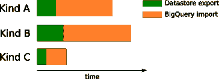
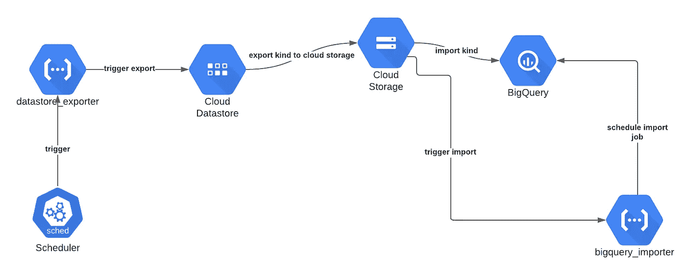

# 将数据存储导出到 BigQuery 的无服务器方法

> 原文：<https://towardsdatascience.com/serverless-approach-to-export-datastore-to-bigquery-4156fadb8509?source=collection_archive---------15----------------------->


Maksym Kaharlytskyi 在 [Unsplash](https://unsplash.com?utm_source=medium&utm_medium=referral) 上的照片

## 一种在 Google 云平台上使用无服务器方法定期将数据存储导出到 BigQuery 的简单方法

概述一下， [Google Datastore](https://cloud.google.com/datastore) 是一个完全托管的 [NoSQL](https://en.wikipedia.org/wiki/NoSQL) 服务，自 2008 年开始在 Google 云平台上提供。它可以被视为一个键值和一个文档数据库，提供了一个类似 SQL 的查询语言和绑定到许多编程语言的 SDK。

数据库被组织成实体(或记录)。每个属性可以有一个或多个命名属性，其中每个属性可以有一个或多个值。实体通过由名称空间、种类和标识符(字符串或整数)组成的键来标识。应用程序可以使用该键来获取特定的实体。值得注意的是，相同种类的实体不需要具有相同的属性，并且同名属性的值不需要具有相同类型的值。简而言之，你可以把任何你喜欢的文件存放在这个键下。

虽然 Datastore 允许各种查询，但是从数据探索和分析的角度来看，将记录放在容易查询的常规数据库中更可行，例如， [BigQuery](https://cloud.google.com/bigquery) 。

# 我们开始吧

一个可能的解决方案是将这些类型从 datastore 导出到 BigQuery。导出分两步完成:

1.  将选定的种类导出到云存储中的存储桶
2.  将导出的种类从云存储导入到 BigQuery

[BigQuery 加载作业可以选择直接从云存储中读取导出的数据存储种类](https://cloud.google.com/bigquery/docs/loading-data-cloud-datastore#:~:text=BigQuery%20supports%20loading%20data%20from,into%20BigQuery%20as%20a%20table.)，因此我们不需要任何其他转换。BigQuery 加载作业的约束是必须逐个导出这些类型。同样值得注意的是，BigQuery 中现有的导出表将被新数据替换。

这个解决方案很简单，但是有一些缺点。主要的一个问题是，该过程不允许指定要导出的记录类型的子集。换句话说，您每次都必须导出-导入所有记录。对于小型数据存储，这仍然是可行的，但是对于较大的数据库，这种解决方案不是最佳的—请注意这一点。在下一篇文章中，我将告诉你如何解决这个问题——敬请期待。

对于多种类型，一种简单的优化技术是重叠导出/导入作业，如下所示:



平行导出/导入作业的重叠(按作者)

这样，我们可以减少导出整个数据存储的总时间。请记住，您只能有 50 个并发导出作业，对于一个项目，您每分钟最多可以执行 20 个导出请求。

# 命令行方法

可以使用两个命令行工具运行导出/导入: [*gcloud*](https://cloud.google.com/sdk/gcloud) 和 [*bq*](https://cloud.google.com/bigquery/docs/bq-command-line-tool) *。*在第一个示例中，您将运行数据存储到存储桶的导出:`gcloud datastore export gs://bucket-name/Kind1 --project gcp-project --kinds Kind1`

使用第二种方法，您可以在 BigQuery 中运行作业导入，它将从 bucket:
`bq load --source_format=DATASTORE_BACKUP datastore_export.Kind1 gs://bucket-name/Kind1/default_namespace/kind_Kind1/default_namespace_kind_Kind1.export_metadata`中获取数据

# 无服务器方法

命令行方法听起来是一个很好的起点，可以探索解决方案是否有效，作为在 BigQuery 中获得即时数据的一次性导出方法。但是，如果您喜欢每天运行此任务，最好将此作业安排在其他地方。

虽然上面两个命令可以从一个[虚拟机](https://cloud.google.com/compute)上执行，但是使用 cron 等，这不是一个最佳的解决方案。首先，如果任务必须运行，例如每天运行，您将浪费资源，因为资源每天只使用几分钟。其次，您必须监控虚拟机是否在运行，系统是否是最新的，等等。又来了一个无服务器。

[无服务器](https://en.wikipedia.org/wiki/Serverless_computing)是一个流行的概念，你可以将所有的基础设施任务委托给其他地方。作为开发人员，您需要提供的只是解决问题的代码。因此，您不需要管理虚拟机、升级主机操作系统、担心网络等问题。—这都是由云提供商完成的。

在这个小故事中，我将展示如何使用无服务器组件构建导出/导入过程。这是可能的，因为最终我们将只调用[GCP](http://cloud.google.com/)API 并等待结果——工作将在后台完成。
该解决方案的架构图如下所示。



无服务器解决方案的架构图(作者)

该架构包括两个[云功能](https://cloud.google.com/functions):

*   数据存储 _ 导出器
*   bigquery_importer

*datastore_exporter* 负责调度输入类型的数据存储导出。下一个函数 *bigquery_importer* ，负责调度 bigquery 加载作业。

图中的其他组件用于协调流程。让我通过一步一步地列举来详细说明它是如何工作的。

# 函数数据存储导出器

类似 cron 的作业由 [Google Scheduler、](https://cloud.google.com/scheduler)管理，它触发*datastore _ exporter*Cloud 函数，其中列出了数据存储中所有可能的类型，并为它们中的每一个安排导出到云存储。产生的对象位于云存储桶中。

时间表本身是用

我们定义该函数将在每天 6.00 执行。调度器将通过调用 HTTP 触发器来触发云功能。它使用关联的服务帐户对请求进行身份验证。

schedule 使用的服务帐户的定义如下所示。该账户有权限调用 *datastore_exporter* 云函数。

*gcf_datastore_exporter* 函数定义为

在这里我们设置这个函数将由 HTTP 触发。截至 2020 年 1 月 15 日，云功能默认要求触发[认证](https://cloud.google.com/functions/docs/securing/managing-access-iam#allowing_unauthenticated_function_invocation)。我们保持原样。

当给定类型的导出完成时，会引发一个由 *bigquery_importer* 函数捕获的[事件](https://cloud.google.com/functions/docs/calling/storage)*Google . storage . object . finalize*。

# 函数 BigQuery 导入程序

该函数的目的是处理 bucket 事件，并安排将导出的数据存储导入到 BigQuery。

函数本身是使用[*Google _ cloud functions _ function*](https://registry.terraform.io/providers/hashicorp/google/latest/docs/resources/cloudfunctions_function)*资源定义的*

*其中我们定义了该函数将在来自数据存储输出桶的事件上被触发。我们只对事件*感兴趣**

*函数的主体非常简单。*

*该函数正在监听所有的对象完成事件，但只有当对象名为*all _ namespaces _ kind _<kind>时。创建 export_metadata* ,然后计划导入到 BigQuery。*

*负责运行 BigQuery 导入的函数非常简单。我们实际上必须定义的是一个作业，它基本上包含与命令行相同的属性:*

**完整的功能你可以在这里找到:*[*https://github.com/jkrajniak/demo-datastore-export*](https://github.com/jkrajniak/demo-datastore-export)*

*<https://github.com/jkrajniak/demo-datastore-export>  

# 许可

合适的权限集非常重要，我们应该始终遵循最小权限原则。两种云功能都有自己的[服务账号](https://cloud.google.com/iam/docs/service-accounts)。对于数据存储导出器，我们附加以下角色

```
"roles/monitoring.metricWriter",
"roles/logging.logWriter",
"roles/datastore.importExportAdmin",
"roles/datastore.viewer"
```

第二个函数需要以下权限

```
"roles/monitoring.metricWriter",
"roles/logging.logWriter",
"roles/bigquery.jobUser",
```

此外，它需要访问输出桶和输出数据集。这是通过绑定 IAM 权限来实现的

# 部署

简单说一下这两个云功能的部署。由于“基础设施”的其他部分内置在 terraform 中，我认为云功能的部署也应该由 [Terraform](https://www.terraform.io/) (TF)负责。为此，我使用了两个 TF 资源 *archive_file* 和*Google _ storage _ bucket _ object。*

[*archive_file*](https://registry.terraform.io/providers/hashicorp/archive/latest/docs/data-sources/archive_file) 资源将从源目录的内容创建一个 zip 文件。然后这个文件会被复制到云存储。这里，云存储中的对象有一个根据文件的 SHA1 计算的后缀——这就像简单的版本控制一样。对于生产运行，我将使用 Git commit hash 和 Git 标记作为对象后缀。

在 https://github.com/jkrajniak/demo-datastore-export，你会找到基础设施和两个云功能的代码。* 

*最后的几点*

1.  *我总是鼓励使用无服务器的方法。只关注方法，把所有基础设施的麻烦都留给巨人，这样会更容易、更快。*
2.  *始终将您的基础设施作为一个代码，例如使用自动气象站[云形成](https://aws.amazon.com/cloudformation/)、[地形](https://www.terraform.io/)或 [CDK](https://aws.amazon.com/cdk/) 。它比任何其他处理项目/服务配置的方法都更加可靠和可重复。每当您必须在一个新的 GCP 项目中重建基础设施时，您将立即从这种方法中受益，否则就会出现问题。此外，通过这种方式，您可以像处理应用程序的部署一样，自动化基础设施变更的部署。*
3.  *数据工程任务不应该是任何常规和标准软件开发方式的例外——编写单元测试，使用 CI/CD 进行代码和基础设施部署，并将您的代码保存在存储库中；不要依赖在任何花哨的网络界面点击的解决方案。*

*我希望你喜欢这个故事，它会对你的日常工作有所帮助。如果您有任何问题或建议，请随时通过 [Twitter](https://twitter.com/MrTheodor) 或 [Linkedin](https://www.linkedin.com/in/jkrajniak/) 联系我。*