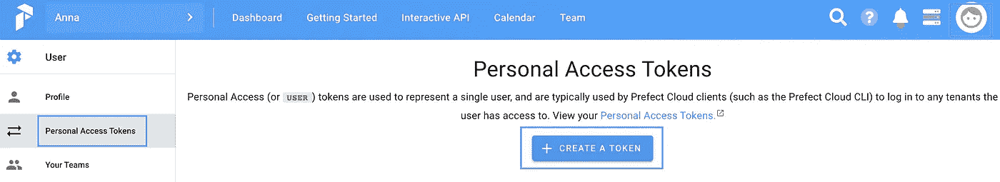
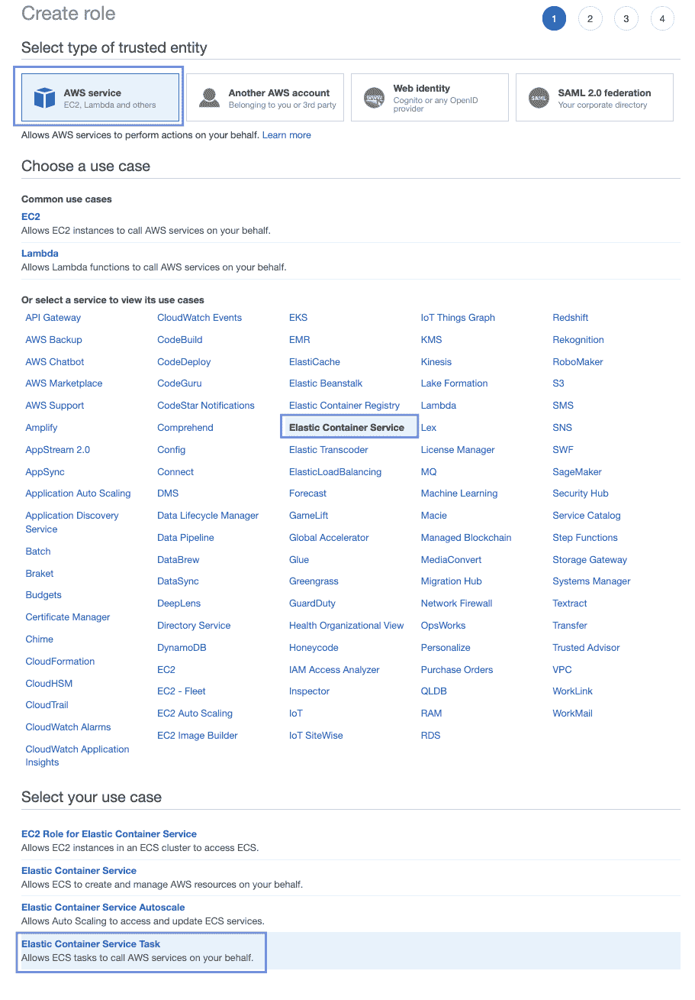
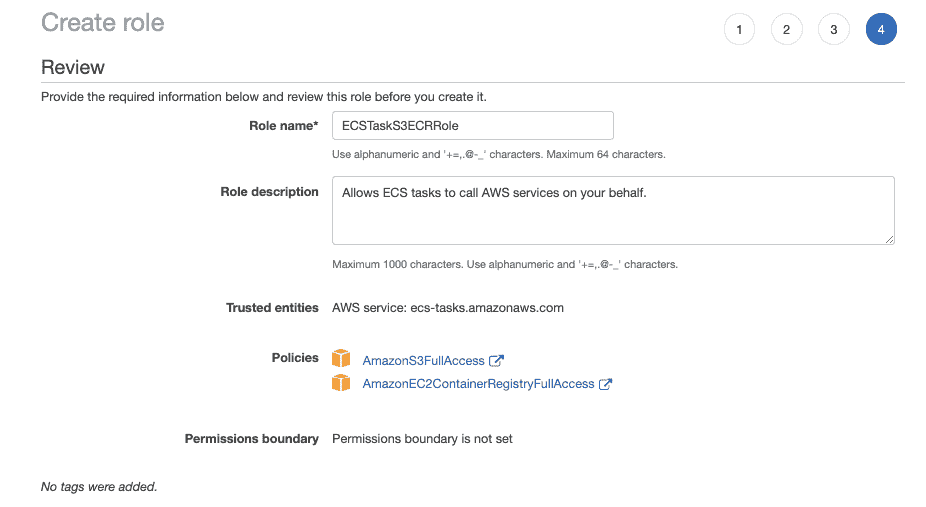
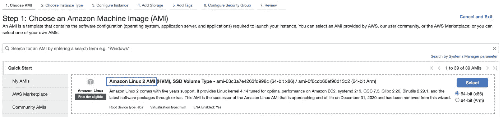
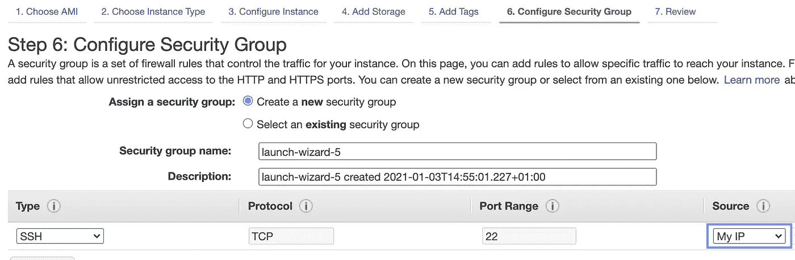
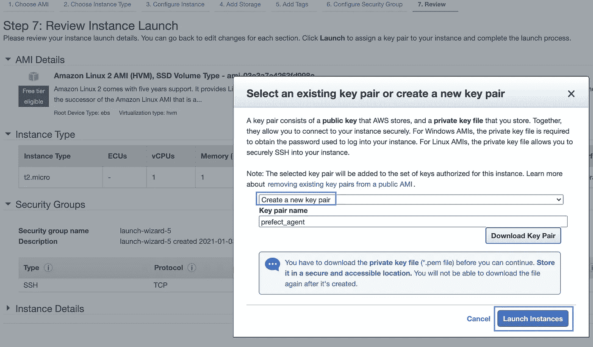
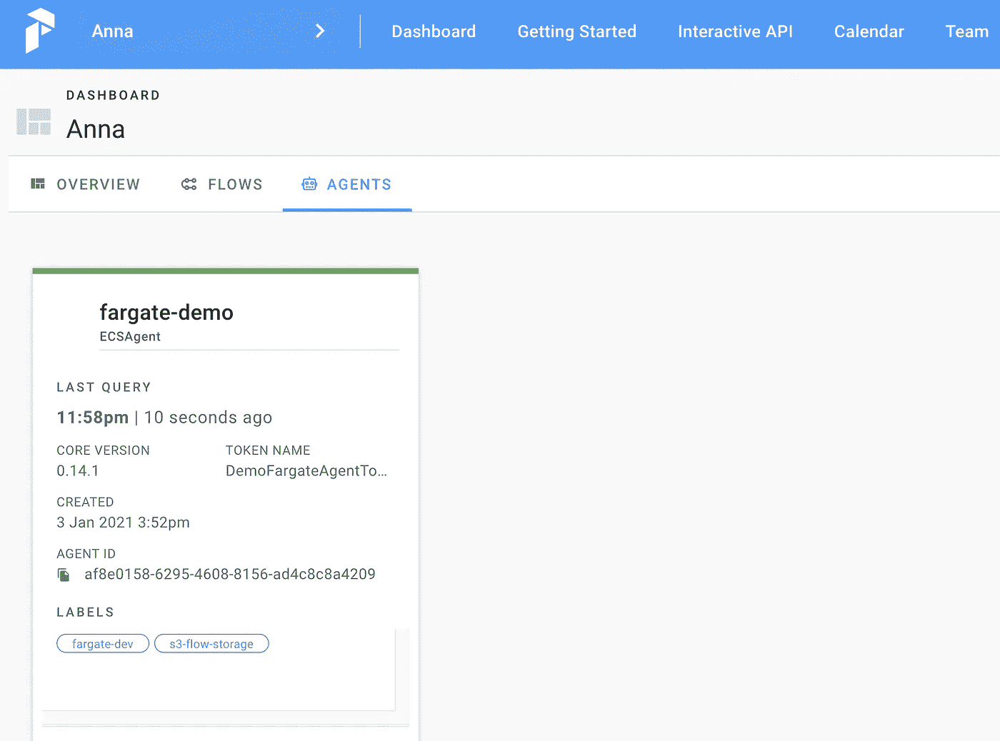
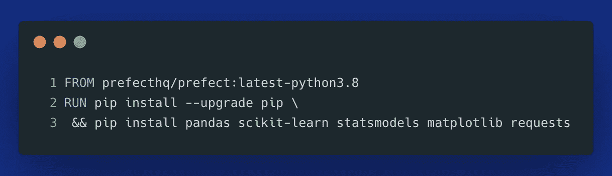
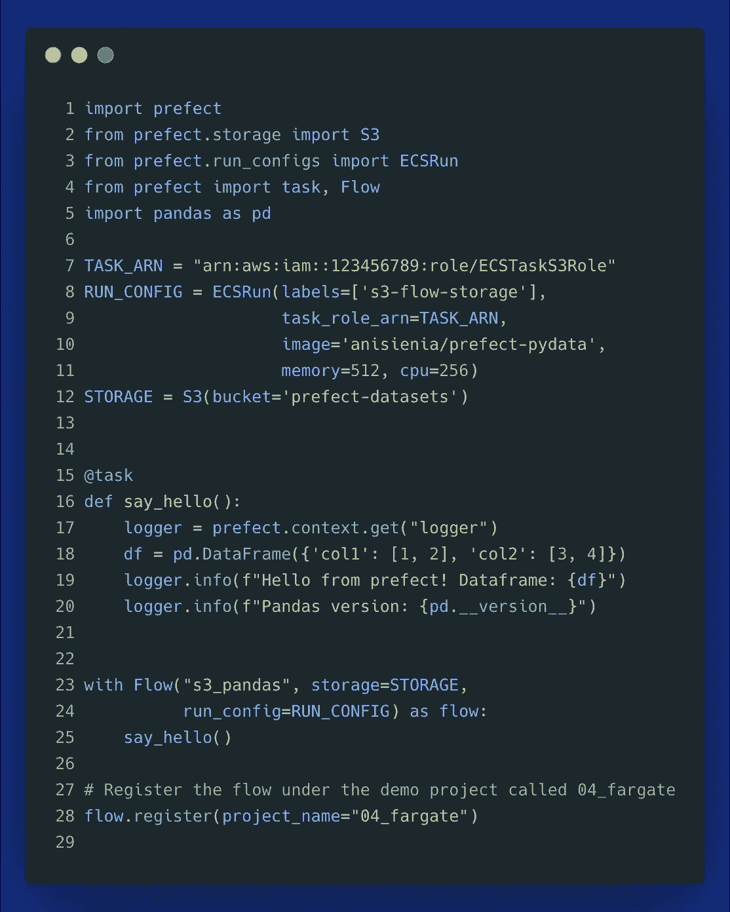
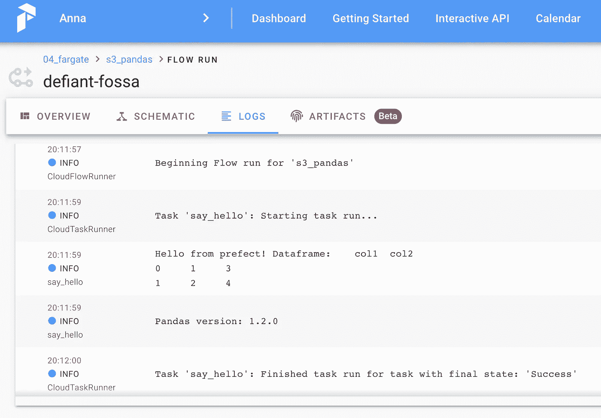

# Prefect 和 AWS ECS Fargate 简化了无服务器数据管道

> 原文：<https://towardsdatascience.com/serverless-data-pipelines-made-easy-with-prefect-and-aws-ecs-fargate-7e25bacb450c?source=collection_archive---------9----------------------->

## 编排 Python 数据管道的最简单方法


照片由[突发](https://www.pexels.com/@burst?utm_content=attributionCopyText&utm_medium=referral&utm_source=pexels)发自[像素](https://www.pexels.com/photo/architecture-buildings-business-city-374603/?utm_content=attributionCopyText&utm_medium=referral&utm_source=pexels)

E 尽管有这么多的工作流程编排解决方案和云服务来构建数据工作负载，但很难找到一个真正好用并能让你快速上手的。在 Python 中构建数据管道最流行的工具之一是 perfect——一个工作流管理平台，具有基于混合代理的执行模型。

混合执行模式需要什么？这意味着即使您使用云编排平台( *Prefect Cloud* )，您仍然拥有并管理您的代理。事实上，Prefect 不能直接访问您的代码或数据。相反，它只对注册代理和流时发送给它们的 API 的元数据进行操作。首先，这意味着该平台可以满足严格的**安全性&合规性**要求，因为整个工作流的执行都在您选择的计算资源内进行。另一方面，它提供了令人难以置信的灵活性。您的代理可以是 Kubernetes 集群、AWS 上的 ECS Fargate 集群、本地或云中的任何计算服务器，或者它们的组合。甚至你的笔记本电脑也可以注册为完美代理。

尽管混合执行模型有很多好处，但是正确配置执行层可能是一个挑战。在本文中，我们将了解如何使用一个 **AWS ECS Fargate** 代理和 **S3 存储**来设置 Prefect，这允许一个完全无服务器的NoOps 执行环境。

> **更新:**你可以在[这篇文章](/how-to-cut-your-aws-ecs-costs-with-fargate-spot-and-prefect-1a1ba5d2e2df)中找到 ECS 代理设置的更新版本。

**目录**

```
· [Getting started with Prefect Cloud](#289a)
· [Prefect Cloud setup](#a045)
 ∘ [Create your Prefect account](#c005)
 ∘ [Install Prefect](#f483)
 ∘ [Create a personal access token to authenticate with Prefect Cloud](#98c3)
· [Creating AWS resources](#7f89)
 ∘ [Creating an IAM role for our ECS tasks](#8815)
 ∘ [Creating an S3 bucket to store our flow code](#3d13)
 ∘ [Creating an EC2 instance for our agent process](#5cdb)
 ∘ [SSH to the EC2 instance to configure the ECS Prefect agent](#7af6)
 ∘ [Creating a Fargate cluster](#4a07)
· [Deploying our first serverless flow](#6b1a)
 ∘ [ECSRun configuration & Prefect Storage](#7289)
 ∘ [Registering a flow for ECS agent](#3e93)
· [Conclusion](#f807)
```

# 完美的云设置

## 创建您的高级帐户

首先，在[https://cloud.prefect.io/](https://cloud.prefect.io/)上注册一个免费的入门账户。

## 安装提督

以下命令将安装带有 AWS 子包的提督(*而不是* `[aws]` *如果您想安装外部系统*的所有提督扩展，您可以使用 `[all_extras]` *):*

```
pip install "prefect[aws]"
```

为了确保我们使用 Prefect Cloud 作为编排层，而不是开源的 Prefect Server，将上下文切换到*“Cloud”*:

```
prefect backend cloud
```

## 创建一个个人访问令牌，以便通过 Prefect Cloud 进行身份验证

注册免费账户后，您需要创建一个**个人访问令牌**来使用 Prefect Cloud 验证您的本地终端。这将允许直接从您的本地机器向 Prefect Cloud API 注册您的流(*即您的 ETL & ML 数据管道*)。从主菜单中，选择:用户→个人访问令牌→ `+ CREATE TOKEN`按钮。



完美的云用户界面——作者图片

选择一些有意义的名字。`YourAuthTokenToPrefectCloud`。然后复制令牌，并在您的终端中运行以下命令:

```
prefect auth login -t <YourAuthTokenToPrefectCloud>
```

**认证步骤**允许您的笔记本电脑与 Prefect Cloud API 通信，以注册您的代理和流。然后，API 负责调度您的工作流，您的代理不断轮询 API 以了解它是否需要触发一些流运行。一旦计划触发流，代理就会得到通知并开始执行。

下一步，我们将在 AWS 上设置一个 **ECS Fargate 集群**作为我们的执行层。除此之外，我们还需要一个**代理**，也就是**轮询工作** ( *即流程执行*)的 API。为此，我们将创建一个带有后台进程的 **EC2** 实例——您可以创建一个 ECS 服务来代替。

在进入 AWS 设置之前，让我们创建一个 **RUNNER 令牌**，我们将使用它向 Prefect Cloud 认证我们的代理。

```
prefect auth create-token -n DemoFargateAgentToken -s RUNNER
```

你可以用任何你喜欢的名字代替`DemoFargateAgentToken`。将作用域( **-s** 标志)设置为 RUNNER，并将令牌保存在安全的地方，这一点很重要。我们将在下一节用到它。

# 创建 AWS 资源

如上所述，我们需要:

*   一个 t2.micro **EC2 实例**，我们将在其中部署我们的**代理**——这个实例的全部目的是拥有一个单独的进程，它为流运行轮询完美的 API，
*   我们将把一个 **IAM 角色**分配给我们的 ECS Fargate 任务，这样我们的容器就可以**访问包含我们流代码的 S3 桶**。此外，这将允许我们缓存到 S3 的流的中间结果，
*   一个 **S3 桶**作为我们流代码的默认存储，
*   一个 **ECS Fargate 集群**，它将为我们的容器化数据管道按需旋转**计算资源**，即无服务器。这样，我们就没有空闲的计算资源，我们可以创建一个[按需 Dask 集群](https://cloudprovider.dask.org/en/latest/)来在需要时跨几个 Fargate 容器并行化我们的 Python 代码。

## 为我们的 ECS 任务创建 IAM 职责(结果:任务职责 ARN)

在这一步中，我们创建一个**任务角色**，它将赋予我们的 ECS 任务(*您可以把它看作是您的流*的容器)访问 S3 中的对象的权限。

理想情况下，您应该遵循最小特权原则。出于开发目的，您可以为 S3 和 ECR 分配完全访问权限，以便您的 ECS 容器可以与存储在 S3 的对象以及 ECR 容器映像进行通信。



为 ECS 任务创建 IAM 角色(第 1 部分)—作者图片



为 ECS 任务创建 IAM 角色(第 2 部分)—作者图片

## 创建一个 S3 桶来存储我们的流代码

请记住，您的 bucket 名称必须是全球唯一的(*就像网站的域名*)。您可以在单个 CLI 命令中或从管理控制台创建存储桶。

```
aws s3 mb s3://yourbucket
```

## 为我们的代理进程创建 EC2 实例

用 Amazon Linux 2 AMI 选择 **t2-micro** 实例类型(*对于单个进程*应该绰绰有余)。



EC2 启动向导—作者图片

然后遵循默认值，直到到达安全组部分，在这里您需要允许您的 IP 地址 SSH 访问实例。



EC2 启动向导—作者图片

之后，点击**查看并启动**，继续创建密钥对(*a*T28)。pem *文件*)以便可以用它来 SSH 到实例。



创建密钥对(。pem 文件)SSH 到实例—由作者创建的图像

## SSH 到 EC2 实例，以配置 ECS 提督代理

一旦实例处于运行状态，您就可以直接从浏览器或使用 SSH 客户机进行连接。现在，我们需要在 EC2 实例上安装 Python 3:

让我们检查一下 Python 和包的版本，以便您确切地知道我在这个 EC2 设置中使用了什么:

我们的 ECS Fargate 代理将需要几个环境变量。让我们使用`export`来设置它们:

上面的第 1 行引用了我们在上一节中创建的 RUNNER 令牌(*不要与我们用来授权我们的机器向 Prefect Cloud API* 注册流的个人访问令牌混淆)。要找到子网 id(*第 5 行*)，请转到 VPC 部分，从您的默认 VPC 中复制 id。当然，如果你愿意，你可以创建自己的 VPC。出于开发目的，默认的 VPC 就可以了。

另外，如果您没有`ecsTaskExecutionRole`，您可以按照 AWS 管理控制台中的“创建 ECS 集群”向导来创建它。

> ***注:*** `*executionRoleArn*` *与* `*task_role_arn*` *不同。而* ***执行角色*** *则赋予代理在 ECS (* ex)上执行容器的权限。从 ECR 中提取图像，将日志存储在 CloudWatch *)、* ***任务角色*** (作为章节的一部分创建:[为我们的 ECS 任务创建 IAM 角色](#8815) ) *为您的流的容器提供访问其他 AWS 资源的权限，比如保存您的完美流的元数据的 S3 桶，或者其他一些 AWS 服务，比如 SQS、SNS 或 DynamoDB。*

## 创建 Fargate 集群

现在让我们使用`aws configure`来配置 AWS CLI，这样我们就可以直接从这个 EC2 实例创建一个 ECS Fargate 集群。如果您没有 AWS 密钥对，您应该首先创建一个 IAM 用户，该用户有权创建 ECS 集群。

为了简化设置，我们使用标准 ECS 配置来创建一个集群，其默认名称为*“default”*，兼容性为“Fargate”(*，即无服务器数据平面*)。

```
aws ecs create-cluster
```

就是这样！我们的集群已经创建。剩下要做的就是启动一个 Prefect agent 进程，该进程将轮询 Prefect Cloud API 的流运行，并将工作提交给 AWS 上的无服务器 ECS 容器平台。我们可以在一个 CLI 命令中完成:

**注意:**

*   `ECSTaskS3Role`是我们之前创建的 IAM 角色(*部分:* [*为我们的 ECS 任务*](#8815) 创建一个 IAM 角色)，它将由 ECS 任务(*容器*)承担，以便拥有访问 S3 的权限，
*   我们添加了标签**“fargate-dev”**和**“S3-flow-storage”**—这些标签非常重要，因为这样我们可以“告诉”Prefect Cloud API 哪个代理应该接收特定流的流运行(*即数据管道*)。由于我们的代理分配了这些标签，任何带有匹配标签的`RunConfig`流都将由该代理编排。一旦我们部署了一个示例流，这将变得更加清晰。
*   我们在末尾添加了`> /dev/null 2>&1 &`，以确保命令在后台运行(*守护进程*)，并抑制对`stdout`和`stderr`的日志记录。如果你知道一个更好的方法来运行这个命令作为后台进程，请在评论或私信中告诉我。

如果我们转到用户界面，我们可以看到我们的 ECS 代理可用并准备好执行计划的流程运行:



ECS 代理在 UI 中是可见的——作者的图像

因为我们在 EC2 上的 **ECS 代理** **在后台进程中运行，所以您可以从 SSH 会话断开连接。如果在某个时候，您的完美代理不再健康，您总是可以再次 SSH 到 EC2 实例，终止该进程，然后再次启动代理。Prefect Cloud 的好处在于，您可以直接在 UI 中看到代理的健康状况——不需要实现任何额外的监控层来跟踪这些信息。**

# 部署我们的第一个无服务器流程

## ECSRun 配置和完美存储

在当前的完美版本( *0.14.x* )中，您需要定义一个运行配置来确定哪个代理将获取您的流代码来执行。在下面的代码中，您可以看到`ECSRun()`使用了一个标签`s3-flow-storage`来确保这个流只被带有相应标签的 ECS 代理获取。它的工作原理类似于 [Kubernetes](https://kubernetes.io/docs/concepts/overview/working-with-objects/labels/) 中的标签和选择器。

在下面的例子中，我们简单地构造了一个 Pandas dataframe 并打印了一个 Pandas 版本，向您展示您可以使用您最喜欢的 Python 包并运行任何 Python 函数，只要您用`@task`装饰器调用它。然后，我们还传递运行配置和关于放在哪里的信息，以及从哪里检索我们的流的元数据(提督 [**存储**](https://docs.prefect.io/orchestration/flow_config/storage.html#aws-s3) ) —这里，它是一个 S3 桶。

用作你的流的基础图像的`image`,可以是来自 Dockerhub 的一个提督的图像。 [**级/级:0.14.1**](https://hub.docker.com/r/prefecthq/prefect/tags?page=1&ordering=last_updated) 。我们使用我们自己的定制 Docker 映像，它只是 Prefect 的基本映像的一个副本，在其上安装了附加的 Pydata 包，以包含构建 ETL 或 ML 数据流所需的所有组件。

这是我们用于公开图片`anisienia/prefect-pydata`的 docker 文件:



显然，您可以指定**确切的包版本**，并在您的映像中包含您可能需要的任何**自定义依赖项**。此外，您可以使用 **ECR** 来代替 Dockerhub。存储公共 Dockerhub 图像是 100%免费的——如果你没有凭证，也没有定制公司的内部业务逻辑(*只是 Python 包依赖*)，你可以通过这种方式节省一些 AWS 成本。

如果您想了解更多关于如何构建 Dockerhub 容器映像的信息，这里有一个适合您的方法:

</7-steps-to-your-own-dockerhub-image-7d1d92d2a3e0>  

## 为 ECS 代理注册流

下面是我们可以使用的流程示例:



**进一步说明&附加信息:**

*   ***task _ role _ arn***是我们作为部分创建的 IAM 角色的 ARN:*[*为 ECS 任务*](#8815) 创建 IAM 角色。*
*   *在`ECSRun()`内部，我们定义了一个标签 **s3-flow-storage** ( *第 8 行*)，这样我们的 ECS 代理就可以获取这个流来执行。这种机制允许在适当的代理之间编排流程以供执行。**注意**代理和流之间的标签必须完全匹配。这意味着来自代理的所有标签必须匹配来自流的所有标签。*
*   *在`ECSRun()`内部，我们还定义了一个定制的 Docker 映像(这里是*:我们来自 Dockerhub 第 10 行*的映像)，以确保我们的流环境包含所有 Python 包以及我们需要的确切版本。*
*   *命令 **flow.register()** 需要指定项目名称。你可以在 UI 中创建一个项目或者使用命令:**提督创建项目<项目名称>** 。*

**

*上面显示的流示例中的日志—图片由作者提供*

# *结论*

*在本文中，我们研究了如何使用 Prefect 创建 ECS Fargate 代理。我们创建了一个 **ECS 集群**和一个 **EC2 实例，其中一个 Prefect ECS 代理**作为后台进程运行，持续轮询 Prefect Cloud API 以获取新的流运行。*

*然后，我们运行了一个**示例流**，它使用我们的 Docker 映像作为基础来反映定制 Python 包的依赖性。当注册我们的流时，流的元数据被发送到指定的 **S3 桶**(代码片段中的*第 12 行)。每次 Prefect Cloud API 调度并触发流运行时，ECS Fargate 代理都会检索相同流的元数据。**

> ***注意:**如果您对代理设置有任何问题，可能有人已经经历过相同的问题，并在完美社区 Slack 中分享了他们的解决方案:[https://prefect-community.slack.com/](https://prefect-community.slack.com/)。*

***感谢您的阅读！***

***参考资料&其他资源:***

*[1] [提督 0.14.0:改进流道配置](https://medium.com/the-prefect-blog/prefect-0-14-0-improved-flow-run-configuration-af6c3caccd04)*

*[2] [提督用 Fargate 部署流程——YouTube 直播](https://www.youtube.com/watch?v=yu1bD3KHmhA)*

*[3] [ECS 有效的 CPU 和内存配置](https://docs.aws.amazon.com/AmazonECS/latest/developerguide/task-cpu-memory-error.html)*