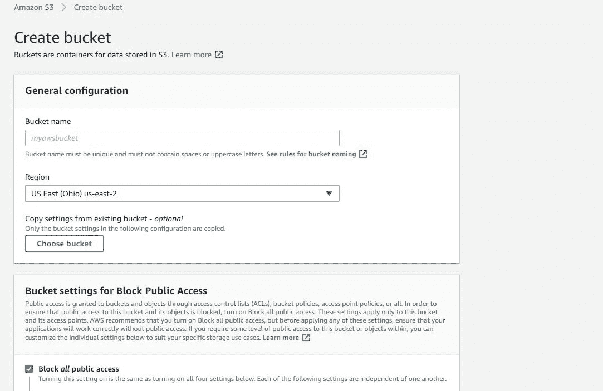
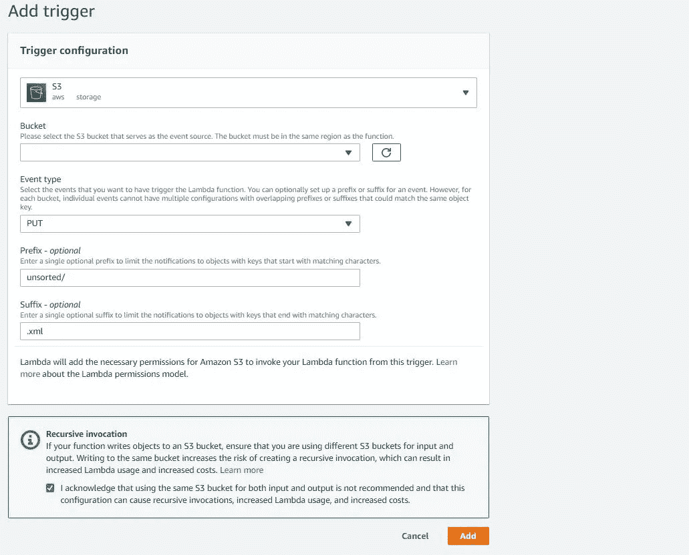
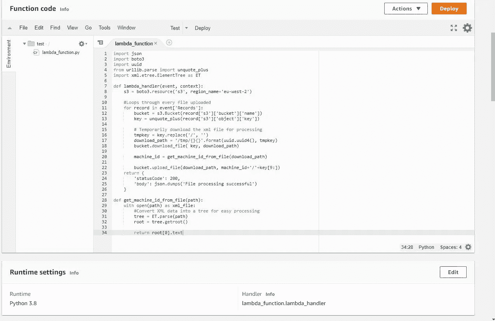
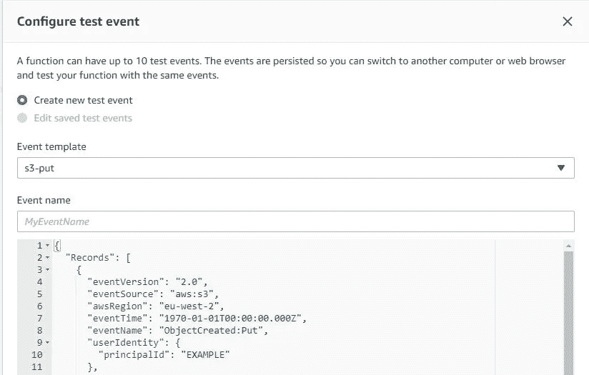

# 无服务器功能和将 AWS Lambda 与 S3 存储桶一起使用

> 原文：<https://towardsdatascience.com/serverless-functions-and-using-aws-lambda-with-s3-buckets-8c174fd066a1?source=collection_archive---------3----------------------->


在 [Unsplash](https://unsplash.com?utm_source=medium&utm_medium=referral) 上由 [C Dustin](https://unsplash.com/@dianamia?utm_source=medium&utm_medium=referral) 拍摄的照片

## 了解如何构建一个由 S3 PUT 事件触发的 Lambda 函数来对 S3 桶中的文件进行排序。

在我以前的文章中，你可能已经看到我不断地在云上的服务器实例上部署代码，构建服务来管理这些实例，在这些服务之上构建反向代理等等。毫无疑问，你们中的一些人可能希望只需编写代码，将其部署到某个地方，而不必担心设置和管理服务器实例的过度复杂性。根据您的使用情况，可能会有一个解决方案——无服务器功能。

无服务器功能允许部署代码，而无需为代码分配任何基础架构。AWS Lambda 是一个 FaaS(功能即服务)平台，允许您构建无服务器功能。AWS Lambda 支持大多数主流编程语言，如 Go、Java、Ruby、Python2 和 Python3。在本教程中，我们将使用 Python3。尽管它们被称为“无服务器”，但它们实际上运行在云服务器实例上的各种运行时环境中。

无服务器功能是无状态的，也就是说，一个功能的一次执行并不保持一个后续执行可以识别或使用的状态。换句话说，一个无服务器功能的执行不会以任何方式与另一个执行进行通信。由于无服务器功能是受时间和资源限制的，所以它们适用于短期任务。它们在内存、CPU、存储等分配方面提供的灵活性非常小。采用某个 FaaS 平台来实现无服务器的一个含义是，对于您的无服务器功能可能与之交互的大多数其他云服务，您会被该平台的供应商所束缚。

## 稍微了解一下微服务…

无服务器功能可用于构建微服务架构，其中您的软件由提供特定功能的较小的独立微服务构建而成。微服务让开发者更容易以敏捷的方式构建、测试和管理软件。微服务是软件中完全独立的部分，因此不同的微服务可以并行编码、测试和部署。定位和修复微服务架构中的错误要容易得多，因为您只需处理出现故障的微服务。

例如，网飞在 2009 年开始将其软件迁移到 AWS 云上，成为了基于微服务架构的最早采用者之一。他们目前维护着一个 API 网关，每天接收数十亿个请求，由独立的微服务组成，用于用户注册、下载电影等流程。通过切换到微服务架构，网飞能够加快其软件的开发和测试，并在遇到错误时轻松回滚。

## Lambda 与其他 AWS 服务

当与其他 AWS 服务结合使用时，AWS Lambda 上的无服务器功能或简单的 *Lambda 功能*可以做一些非常酷的事情，比如使用亚马逊 Alexa 来打开和关闭 EC2 实例，或者当有东西被推送到 CodeCommit(甚至 GitHub)库时点亮灯泡。

有 3 种方法可以将 Lambda 与其他 AWS 服务结合使用:

1.  使用其他 AWS 服务作为触发器来调用 lambda 函数*。一个 lambda 函数可以有多个触发器，使用广泛的 AWS 服务，如 S3 存储桶放置或删除事件、对 API 网关端点的调用等。
2.  从 lambda 函数内部与 AWS 服务交互，比如在 DynamoDB 数据库中添加或删除数据，或者获取 EC2 实例的状态。你可以使用 AWS 为你的 lambda 函数代码中的 [Java](https://docs.aws.amazon.com/sdk-for-java/index.html) 、 [Python](https://docs.aws.amazon.com/pythonsdk/?id=docs_gateway) **、 [Ruby](https://docs.aws.amazon.com/sdk-for-ruby/?id=docs_gateway) 等构建的各种 SDK(软件开发工具包)来做到这一点。使用这些 SDK，可以控制一长串 AWS 服务或与之通信。
3.  每当调用 Lambda 函数时，使用 AWS 服务作为其调用记录的目的地。截至目前，只有 4 种 AWS 服务可以这样使用:SNS、SQS、EventBridge 或 Lambda 本身。

**当另一个 AWS 服务调用 Lambda 函数时，Lambda 使用* ***事件*** *对象将特定信息从该 AWS 服务传递给该函数。这将包括诸如哪个 DynamoDB 数据库中的哪个项目触发了 Lambda 函数之类的信息。*

***** Boto3*** *是一个由 AWS 构建的 python 库(或 SDK)，允许你与 AWS 服务交互，如 EC2、ECS、S3、DynamoDB 等。在本教程中，我们将使用 Boto3 管理 AWS S3 桶内的文件。Boto3 的完整文档可以在* [*这里*](https://boto3.amazonaws.com/v1/documentation/api/latest/index.html) *找到。*

## 将 Lambda 与 AWS S3 桶一起使用

> **本教程的先决条件:**AWS 自由层帐户。

*一个* ***S3 桶*** *只是 AWS 云中的一个存储空间，用于存储任何类型的数据(如视频、代码、AWS 模板等)。).S3 存储桶中的每个目录和文件都可以使用一个键来唯一标识，这个键就是它相对于根目录(也就是存储桶本身)的路径。比如“car.jpg”或者“images/car.jpg”。*

除了作为开发基于微服务的软件的强大资源之外， ***Lambda 函数还是高效的 DevOps 工具。*** 让我们来看一个例子，上面提到的前两种使用 Lambda 函数和 S3 桶来解决一个简单的 DevOps 问题:)

假设您正从三个不同的煤气表接收 XML 数据，并将其直接放入 AWS S3 桶中。您希望根据数据来自哪个燃气表，将 XML 文件分类到三个独立的文件夹中。了解数据源的唯一方法是查看 XML 文件内部，如下所示:

```
<data>    
   <data-source>gas_meter3</data-source>    
   <data-content>bla bla bla</data-content>
</data>
```

您将如何自动化这一过程？这就是 AWS lambda 可以派上用场的地方。让我们看看如何做到这一点。

***1 -创建一个 S3 桶***



让我们从构建一个空的 S3 桶开始。你所要做的就是从你的 AWS 控制台进入 S3 页面，点击“创建桶”按钮。确保选中“阻止所有公共访问”复选框，然后单击“创建存储桶”。

现在，添加一个名为“unsorted”的目录，所有 XML 文件最初都将存储在这个目录中。创建一个名为“testdata.xml”的. xml 文件，其内容如下:

```
<data>    
   <data-source>gas_meter3</data-source>    
   <data-content>bla bla bla</data-content>
</data>
```

***2 -创建 Lambda 函数***

在 AWS 控制台的服务选项卡中，单击“Lambda”。在 Lambda 页面的左侧窗格中，选择“函数”，然后选择“创建函数”。


选择“从头开始创作”,并给函数取一个合适的名字。因为我将使用 Python3，所以我选择“Python3.8”作为运行时语言。Python2 和 Python3 还有其他版本。选择一种运行时语言，然后单击“创建函数”按钮。从“函数”页面上的 Lambda 函数列表中，选择您刚刚创建的函数，您将被带到该函数的页面。

Lambda 会自动创建一个 IAM 角色供您与 Lambda 函数一起使用。IAM 角色可以在函数页面的“权限”选项卡下找到。您需要确保该函数的 IAM 角色有权访问和/或管理您从函数内部连接到的 AWS 服务。

*确保将“S3”权限添加到 IAM 角色的权限列表中，可通过 IAM 控制台访问。*

***3 -为我们的 Lambda 函数添加一个触发器***

我们希望 Lambda 函数在每次 XML 文件上传到“未排序”文件夹时被调用。为此，我们将使用一个 S3 存储桶 PUT 事件作为函数的触发器。

在 Lambda 函数页面的“设计器”部分，点击“添加触发器”按钮。



选择“S3”触发器和您刚刚创建的桶。选择“上传”事件类型。将前缀和后缀设置为“未排序/”和”。xml”。最后，点击“添加”。

***4 -给我们的 Lambda 函数添加代码***

有三种方法可以向 Lambda 函数添加代码:

1.  通过控制台上的代码编辑器。
2.  上传一个包含所有代码和依赖项的. zip 文件。
3.  通过从 S3 桶上传代码。

在本教程中，我们将使用第一种方法。在您的函数页面上，转到“函数代码”部分找到代码编辑器。



将以下代码复制并粘贴到代码编辑器中:

```
import json
import boto3
import uuid
from urllib.parse import unquote_plus
import xml.etree.ElementTree as ETdef lambda_handler(event, context):
    s3 = boto3.resource('s3', region_name='')#Replace with your region name #Loops through every file uploaded
    for record in event['Records']:
        bucket_name = record['s3']['bucket']['name']
        bucket = s3.Bucket(bucket_name)
        key = unquote_plus(record['s3']['object']['key']) # Temporarily download the xml file for processing
        tmpkey = key.replace('/', '')
        download_path = '/tmp/{}{}'.format(uuid.uuid4(), tmpkey)
        bucket.download_file( key, download_path) machine_id = get_machine_id_from_file(download_path) bucket.upload_file(download_path, machine_id+'/'+key[9:])

        s3.Object(bucket_name,key).delete()def get_machine_id_from_file(path):
    tree = ET.parse(path)
    root = tree.getroot() return root[0].text
```

不要忘记替换地区名称。

*确保处理程序值为“<文件名>。λ_ handler”。处理程序值指定哪个函数包含 Lambda 执行的主代码。*

*每当 Lambda 运行您的函数时，它会将一个上下文对象* *和一个事件对象* *传递给它。这个对象可以用来获取关于函数本身及其调用的信息，例如函数名、内存限制、日志组 id 等。上下文对象对于日志记录、监控和数据分析非常有用。*

*如前所述，Lambda 使用事件对象从调用 Lamda 函数的 AWS 服务向 Lamda 函数提供特定信息。最初以 JSON 格式出现的信息在传递给函数之前被转换成一个对象。在 Python 的例子中，这个对象通常是一个字典。在上面的代码中，您可以看到事件对象被用来获取 S3 存储桶的名称和触发我们函数的 S3 存储桶中的对象的键。*

上面的代码很容易理解。它执行以下操作:

1.  从*事件*对象获取信息。
2.  下载导致 Lambda 函数被调用的 XML 文件。
3.  处理 XML 文件，从 XML 文件的第一行找到 *machine_id* 。
4.  将文件上传回 S3 桶，但放在一个名为 *machine_id* 的值文件夹中。
5.  删除原始文件。

现在，按下“部署”按钮，我们的功能应该准备运行。

***5 -测试我们的 Lambda 函数***

*AWS 使得通过 Lambda 控制台测试 Lambda 函数变得非常容易。无论您的 Lambda 函数使用什么触发器，您都可以使用 Lambda 控制台上的* ***测试*** *功能来模拟您的 Lambda 函数的调用。这一切都需要定义什么* ***事件*** *对象将被传递到函数中。为了帮助你做到这一点，Lambda 提供了特定于每种类型触发器的 JSON 模板。例如，S3 看跌事件的模板如下:*

```
{
  "Records": [
    {
      "eventVersion": "2.0",
      "eventSource": "aws:s3",
      "awsRegion": "us-west-2",
      "eventTime": "1970-01-01T00:00:00.000Z",
      "eventName": "ObjectCreated:Put",
      "userIdentity": {
        "principalId": "EXAMPLE"
      },
      "requestParameters": {
        "sourceIPAddress": "126.0.0.1"
      },
      "responseElements": {
        "x-amz-request-id": "EXAMPLE123456789",
        "x-amz-id-2": "EXAMPLE123/5678abcdefghijklambdaisawesome/mnopqrstuvwxyzABCDEFGH"
      },
      "s3": {
        "s3SchemaVersion": "1.0",
        "configurationId": "testConfigRule",
        "bucket": {
          "name": "example-bucket",
          "ownerIdentity": {
            "principalId": "EXAMPLE"
          },
          "arn": "arn:aws:s3:::example-bucket"
        },
        "object": {
          "key": "test/key",
          "size": 1024,
          "eTag": "0123456789abcdef0123456789abcdef",
          "sequencer": "0A1B2C3D4E5F678901"
        }
      }
    }
  ]
}
```

为了测试您刚刚创建的 Lambda 函数，您需要为您的函数配置一个*测试事件*。为此，单击 Lambda 代码编辑器正上方的“选择测试事件”下拉菜单，然后单击“配置测试事件”。



从弹出菜单中，确保“创建新的测试事件”单选按钮被选中，并选择“亚马逊 S3 Put”事件模板。应该为您提供类似于上面代码片段中的 JSON 数据。我们只关心 Lambda 函数中使用的数据，即桶名和对象键。编辑这两个值，使其适合于您之前创建的 S3 存储桶和 XML 文件。最后，为测试事件命名，并单击“Create”。

现在你已经有了 Lambda 函数的测试事件，你所要做的就是点击代码编辑器顶部的“test”按钮。控制台将告诉您功能代码是否被正确执行。要检查是否一切正常，请转到您的 S3 存储桶，查看 XML 文件是否已经移动到新创建的“gas-meter3/”目录中。

*你可能已经注意到了，通过控制台进行测试的一个缺点是 Lambda 函数实际上会与其他 AWS 服务进行通信。这可能会无意中改变您的 AWS 资源，甚至丢失有价值的工作。这个问题的解决方案是在你的机器上构建并运行你的 lambda 函数。局部测试 Lambda 函数并不简单。您需要使用像 SAM CLI 和 Localstack 这样的工具来完成这项工作。*

***6 -全部搞定！***

现在，如果 XML 数据是本教程中指定的格式，Lambda 函数应该将上传到 S3 存储桶的“未排序”文件夹中的任何 XML 文件排序到单独的文件夹中。

我希望这篇文章能让你体会到使用 AWS Lambda 可以实现什么，以及对无服务器功能的一些总体认识。 ***现在是你用 AWS Lambda 发挥创造力的时候了。***

*感谢您的阅读！*