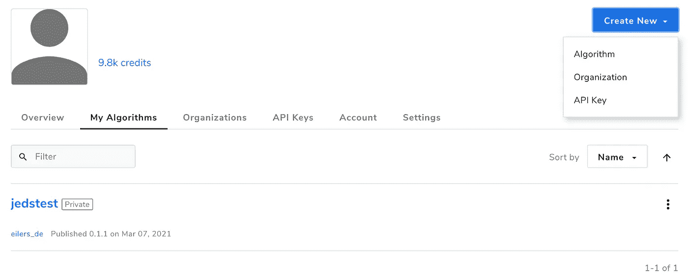
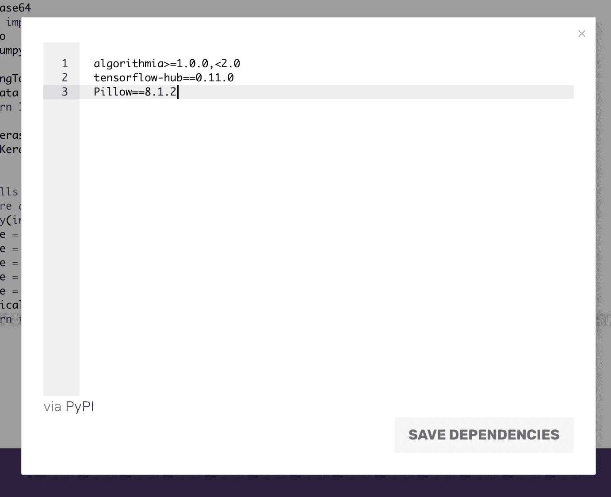

# 无服务器 GPU 驱动的机器学习模型托管

> 原文：<https://towardsdatascience.com/serverless-gpu-powered-hosting-of-machine-learning-models-9f2b2be98294?source=collection_archive---------11----------------------->

## Algorithmia 的一个工作示例

卡斯帕·卡米尔·鲁宾在 [Unsplash](https://unsplash.com?utm_source=medium&utm_medium=referral) 上的照片

# 动机

随着近年来 MLOps 的兴起，运行机器学习模型进行推理任务变得容易多了。根据使用情况，适当优化的深度学习模型甚至可以直接在移动设备上运行。在客户端-服务器/微服务架构中，具有高精度要求的较大模型通常集中托管，并由下游服务通过定义明确的接口进行查询。TensorFlow Serving 等工具现在也使这些用例在适当配置的服务器基础设施上成为可管理的问题。

然而，从软件工程的角度来看，我们知道自我管理的基础设施会变得多么复杂。毫不奇怪，云提供商的无服务器解决方案在应用程序开发领域越来越受欢迎。没有基础设施管理和随用随付是主要优势，这就是为什么我现在几乎只使用这种解决方案。

## 2021 年的无服务器 GPU

然而，当我发现自己处于将一个相当复杂的用于在线预测的深度学习模型集成到这样一个微服务的无服务器架构中时，我有些惊讶。在我的用例中，要求是以不规则的时间间隔(几秒到几小时)用 base64 编码的图像处理单个请求，并使用自我训练的深度学习模型返回正确的类。在我看来，一个没有深度复杂性的标准任务。被 Cloud Run，Cloud Functions，AWS Lambda 等宠坏了。，我天真地认为应该有一个“GPU 启用”复选框，然后我们就开始了…

不完全是。事实上，找到一个真正的无服务器解决方案并不容易。正如已经描述过的[这里的](/searching-the-clouds-for-serverless-gpu-597b34c59d55)，传统的无服务器解决方案更适合 CPU 工作负载。在我的例子中，仅使用 CPU 进行推理是不可能的，因为这种方式无法满足服务的延迟需求。

## Google AI 平台预测和 AWS SageMaker？

与此同时，拥有人工智能平台预测的谷歌和拥有 SageMaker 的 AWS 提供了包括深度学习模型推理加速器在内的解决方案。只是简单总结一下为什么这些服务不符合我的要求(目前)。

从 AWS SageMaker 开始，最小实例计数要求为 1 或更高([https://docs . AWS . Amazon . com/sage maker/latest/DG/endpoint-auto-scaling-prerequisites . html](https://docs.aws.amazon.com/sagemaker/latest/dg/endpoint-auto-scaling-prerequisites.html))。对于许多持续负载的用例来说，这应该不是问题。然而，对于我来说，这将是一种资源浪费，并且不是 100%符合我所寻求的量入为出原则。

Google AI 平台预测目前只允许使用 TensorFlow SavedModel 格式的 GPU。例如，PyTorch 模型只能在没有 GPU 支持的定制容器(目前是预 GA)中使用。此外，谷歌确实允许自动缩放到 0，但如果一个请求触发了你的服务，你将被收取最少 10 分钟的计算时间，即使这个请求只花了几分之一秒(【https://cloud.google.com/ai-platform/prediction/pricing】T2)

## algorithm ia——真正的无服务器替代方案？

除了主要的供应商， [Algorithmia](https://algorithmia.com/) 正在吹捧自己填补了真正无服务器 GPU 模型托管市场的空白。Algorithmia 提供了具有模型版本控制、无服务器基础设施和透明的现收现付选项的 MLOps 管道。与谷歌人工智能平台预测相比，你放弃了选择计算资源的灵活性(你必须相信 Algorithmia，他们为你的服务分配了足够的 CPU、RAM 和 GPU 资源)，但作为回报，你只需支付算法的实际计算时间，并获得真正的无服务器体验。

例如，您还可以通过使用常见的 python 代码实现单个函数来完全定制预处理和后处理步骤。一个已部署的算法可以作为一个带有预测端点的 REST-API 来使用，并且可以用一个 API 密钥来保护。实际执行时间是从算法的起始点开始计算，直到它返回。

目前，服务的 CPU 版本收费为 0.0001 美元/秒，GPU 服务收费为 0.0003 美元/秒。付款以 Algorithmia 信用计算，而 10，000 信用相当于 1 美元。每个月你可以免费获得 5000 积分。听起来至少对我的要求来说是完美的匹配。所以我们来看看。

# 用 Algorithmia 实现一个工作示例

注册后，您可以切换到您的主页部分，它为您提供了当前算法的清晰概述。您可以通过点击“新建”按钮并选择“算法”来添加一个新的。

Algorithmia 主屏幕

给你的算法起一个好听的名字，选择你是想在 GitHub 还是 Algorithmia 上托管代码，指定一个预定义的环境(比如 Python 3.8 + TensorFlow GPU 2.3)，你就可以开始了。创建第一个算法后，您可以将新的存储库克隆到您的本地计算机上，或者直接使用 Web IDE。让我们继续使用 Web IDE 进行测试。

Algorithmia Web IDE

这看起来很眼熟。左边是您的项目结构，中间的主要区域显示您的代码。我已经为这篇文章准备了一个简单的例子，你可以从下面复制。

这里实际发生了什么…在一些必要的导入之后，我们首先定义一个函数，它基本上接受一个 base64 字符串作为输入，并返回一个图像对象。接下来，我们从 TensorFlow Hub 加载一个用于图像分类的预训练模型。在我们的例子中，它是一个 Mobilenet V2，被训练来分类 1000 个不同的类。你也可以将自己的模型免费上传到 Algorithmia 数据商店，或者使用 Dropbox 或 S3。由于模型输出是代表图像类别的单个整数，我们必须加载对应于这些整数的相应标签。现在，我们可以实现强制应用功能。

每当客户端向我们的服务发送 POST 请求时，都会调用该函数，并且将主体作为输入提供给该函数。确保在应用函数之外加载模型，以避免每次请求服务时重新加载。在我们的例子中，我们期望一个代表图像的 base64 字符串。由于我们的模型只需要 224×224 像素的图像，我们必须相应地缩放输入，将其转换为预期的 numpy 数组结构，并将所有像素值转换为 0 到 1 之间的范围。最后，我们检查我们是否真的有可用的 GPU，并返回一个带有 GPU 数量和输入图像的预测类别的格式化字符串。

要构建项目，您必须以熟悉的 requirements.txt 格式指定必要的依赖项。因此，单击依赖项并相应地调整条目。

Algorithmia 需求编辑器

现在我们可以开始建造了。单击右上角的绿色构建按钮，等待该过程完成。尤其是第一次做这一步，可能需要一段时间。根据我的经验，构建应该在大约 3-5 分钟后准备好。构建过程完成后，您会在 Web IDE 底部的控制台中看到一个输出，表明您的算法现已联机。您可以通过直接将输入粘贴到控制台来测试该算法。我们在这里跳过这一步，直接部署模型。因此，点击右上角的“发布”按钮，指定一个发布说明和一个你喜欢的示例输入，最后将可调用性指定为“私有”，点击“发布版本 x.x.x”。

要从外部请求您的服务，您现在需要一个 API 密钥。在您的 Algorithmia 主页部分，再次单击“新建”,这次选择“API 密钥”。给你的密钥起个名字，现在选择“完全访问”。例如，以后你可以指定只允许调用特定算法的键。

现在我们准备好出发了。例如，我们编写了一个简单的 python 脚本，它加载一个图像，将其转换为 base64 字符串，并向我们新创建的服务发出请求。为了检查模型的结果，我们使用下面的狮子图片。

罗伯特·蒂曼在 Unsplash[上的照片](https://unsplash.com?utm_source=medium&utm_medium=referral)

代码使用了 Algorithmia 包，但是您也可以使用简单的 POST 请求。有关请求服务的可能选项列表，请单击 Algorithmia 主页部分中的算法，向下滚动到“安装和使用”并选择您的首选选项。

输出应该是这样的:`Num GPUs: 1 and prediction class: lion`

瞧，你有一个可用的 GPU，它实际上是一只狮子！

# 结论

在写这篇文章的时候，Algorithmia 是唯一一个真正的无服务器平台，可以为 GPU 支持的模型提供服务，你只需要为实际的计算时间付费。因此，Algorithmia 非常适合请求数量相当少(没有恒定负载)的用例。在我的实验中，我注意到在没有请求的特定时间之后，算法必须为下一次调用完全重新加载(冷启动)。这导致了长时间运行的第一个请求。随后的查询又相当快了。这不是 Algorithmia 的无服务器解决方案的特定行为，但仍然应该作为一种限制来提及。对于真实的在线预测用例，这并不理想。如果你需要即时的答案，请记住这一点。在这些情况下，你可能应该考虑 Google AI 平台预测，其中至少有一个节点始终处于准备状态。另一种选择是通过从另一个服务发送定期查询来保持您的服务“温暖”,但是请记住，这增加了成本。否则，Algorithmia 是一个超级易用的无服务器机器学习平台，所以如果你的用例符合，我肯定建议你尝试一下。