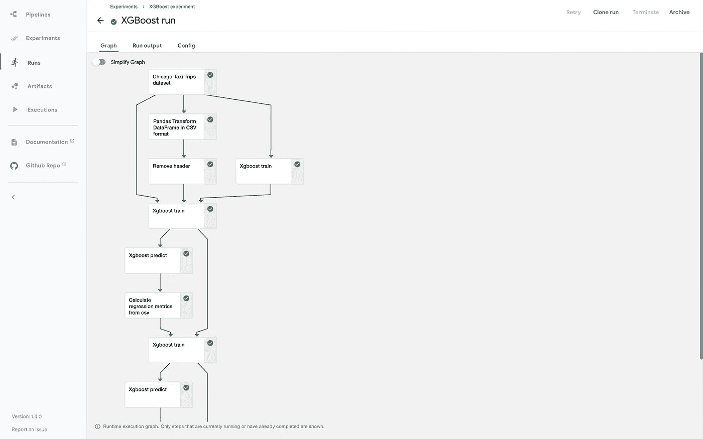
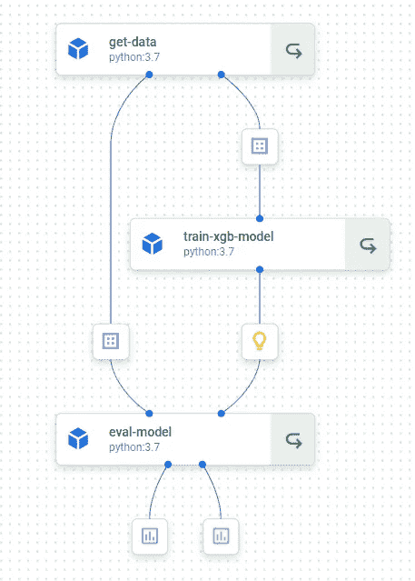
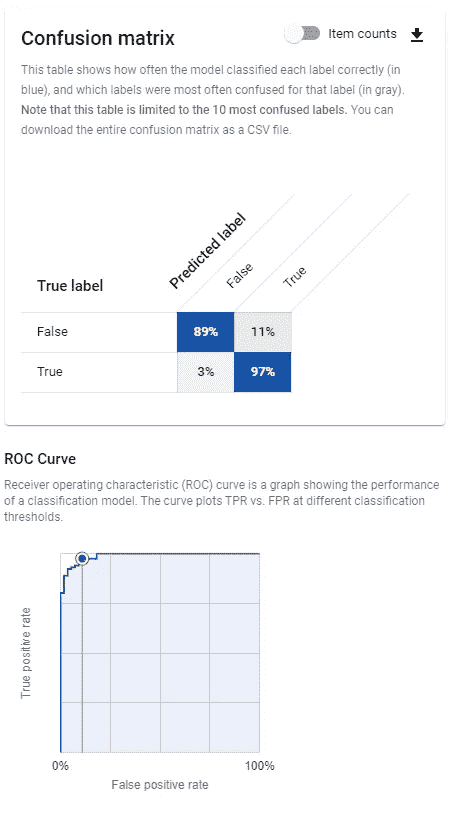

# 基于顶点人工智能的无服务器机器学习管道:介绍

> 原文：<https://towardsdatascience.com/serverless-machine-learning-pipelines-with-vertex-ai-an-introduction-30af8b53188e?source=collection_archive---------2----------------------->

## 谷歌终于做到了，现在梦想成真了:我们现在能够从以前的人工智能平台运行无服务器的 Kubeflow 管道

照片由[米切尔罗](https://unsplash.com/@mitchel3uo?utm_source=medium&utm_medium=referral)在 [Unsplash](https://unsplash.com?utm_source=medium&utm_medium=referral)

对于在小公司(或小团队)工作的数据科学家和 ML 工程师来说，有一个大问题:人力资源和时间的极度缺乏。正因为如此，我们能够使用甚至测试的技术范围非常有限。

在 MLOps 方面，范围是一个问题。GCP 上没有任何托管的 MLOps 管道解决方案，采用实验管道的唯一方法是部署一个成熟的 Kubeflow 实例。我们可以依靠人工智能平台管道，进行半管理部署，但 GKE 集群保姆仍然存在问题，这需要时间(而且很无聊)。

[Vertex AI](https://cloud.google.com/vertex-ai) 从天而降，用一种管理有序且价格合理的替代方案来解决我们的 MLOps 问题。Vertex AI 附带了所有的 AI 平台经典资源，加上一个 ML 元数据存储，一个完全管理的功能存储和一个完全管理的 Kubeflow Pipelines runner。

在这篇文章中，我们将讨论 ML 管道，Kubeflow 管道，如何创建它们来满足您的自定义 ML 需求，以及如何在 Vertex AI 管道中运行它们并分析它们的结果，并附有一个小的示例代码。

如果你只是为了示例代码而来，那么[这里](https://github.com/piEsposito/vertex-ai-tutorials)就是了。

# 快速回顾一下 MLOps

如[顶点 AI docs](https://cloud.google.com/vertex-ai/docs/pipelines/introduction) 状态:

> 机器学习操作( *MLOps* )是将 DevOps 策略应用于机器学习(ML)系统的实践。DevOps 策略让您高效地构建和发布代码变更，并监控系统以确保您满足可靠性目标。
> 
> MLOps 扩展了这一实践，以帮助您减少从数据接收到在生产中部署模型所花费的时间，从而让您能够监控和了解您的 ML 系统。

总之，MLOps 是让您“组织”您的数据科学和 ML 领域以创建可靠系统的实践，以满足您公司的需求。

因此，要应用良好的 MLOps 实践，您需要可靠、易用的工具，以便您可以管理、监控和执行所有数据作业，从接收到建模再到监控。

# 管道、库伯流和顶点

要应用 MLOps，最重要的步骤之一是实验，因此我们需要一个强大的实验工具。我们希望能够跟踪我们的实验，比较它们，重现它们，并保存所有使用的结果和数据。

[Kubeflow 管道](https://github.com/kubeflow/pipelines)来解决这个问题。简而言之，KFP 是一个致力于在 Kubernetes 上运行 ML 工作流(作为模型训练的实验)的工具包，它以一种非常聪明的方式完成它:

与其他方法一样，Kubeflow 让我们将工作流定义为一系列 Python 函数，这些函数相互传递结果和工件。

对于每个 Python 函数，我们可以定义依赖关系(对于所使用的库), Kubeflow 将创建一个容器，以隔离的方式运行每个函数，并将任何想要的对象传递给工作流的下一步。我们可以设置所需的资源(如内存或 GPU)，它将为我们的工作流步骤提供这些资源。感觉像魔术一样。

一旦您运行了您的管道，您将能够在一个漂亮的 UI 中看到它，就像这样:

来源:作者打印，运行示例开放源代码

唯一的问题是 Kubeflow 管道必须部署在 Kubernetes 集群上。如果你在一家使用敏感数据的小公司工作，你将面临权限、VPC 以及部署和使用它的许多问题，这使得它有点难以被采用

Vertex AI 通过一个托管管道运行器解决了这个问题:你可以定义一个管道，它将执行它，负责提供所有资源，存储所有你想要的工件，并通过每个想要的步骤传递它们。

我们现在将看到如何使用 sklearn breast_cancer_dataset 定义 Kubeflow 管道并在 Vertex AI 中运行它。

# 定义管道:带有玩具数据集的定制示例

我们现在用 3 个简单的步骤定义一个管道，在 KFP 称为…

1.  接收数据并分离训练和测试分割。
2.  使用步骤 1 中分离的列车，训练出模型。
3.  使用步骤 2 中的模型和步骤 1 中的测试分割，评估我们的 ROC 曲线和混淆矩阵模型。

首先，让我们安装 Kubeflow Pipelines SDK:

`pip3 install kfp --upgrade`

你可以在这篇文章的 Github repo 中看到完整的 Jupyter 笔记本。我们将在这里仔细检查每个代码块，使其更容易理解。首先，一些进口:

我们从`kfp.v2`导入，因为它是新的 Kubeflow Pipelines SDK 版本，与 Vertex AI 兼容。我们引入了代表“特定领域语言”的`dsl`，因为它是管道定义 SDK 的主要模块。

我们从`kfp.v2.dsl`导入工件、数据集、输入、模型、输出、度量和分类度量，因为它们是我们在组件之间传递对象的方式。当我们定义一个组件时，我们在参数类型上声明 can state，暗示组件的输入和输出。

这样，它创建了一个具有“path”(用于在组件之间存储和重用对象)和“metadata”(用于存储对象元数据)属性的对象，还创建了一些特定于类型的方法，如 ClassificationMetrics 方法，用于在 UI 上绘制漂亮的 ROC 曲线。

让我们看看它在第一个例子中是如何工作的，这个例子是`get_data`操作符:

注意，我们没有返回任何值，但是我们将组件的参数定义为`dataset_train: Output[Data]`。这意味着，在函数上，我们可以访问类数据集的输出对象(将在函数的使用中创建),带有路径和元数据属性。

这样，您可以将数据集保存在特定的路径上，并在需要时在下一个操作符上访问它。调用对象组件后，可以访问它的`outputs`属性。例如，如果你想访问`dataset_train`对象，你可以在定义完整管道时使用:`ds_train = get_data().outputs["dataset_train"]`来完成。

我们还使用了`@component`装饰器，在这里我们可以定义创建能够运行我们功能的容器所需的包。

对于 train 步骤，我们将使用我们的一个输出对象，并访问之前创建的一个对象。让我们看看这是怎么做到的:

我们所要做的就是定义`dataset: Input[Dataset]`，如果我们在调用组件时传递`get_data().outputs["dataset_train"]`，它将访问`dataset_train`对象，并通过使用它的`path`属性下载它。

注意，我们还为我们的模型定义了一些元数据:`train_score`表示模型在训练时间中的得分，它的`framework`。

这个逻辑在我们的最后一个组件上继续:对训练数据集的模型评估:

我们在这里新做的是传递输出指标和分类指标对象。这将让我们在顶点 AI UI 上为 ROC 曲线和混淆矩阵保存模型分类指标和一些漂亮的交互图。

完成所有工作后，我们只需创建管道并将其编译成一个 json 文件:

请注意，我们可以访问前面步骤的输出。我们把它编译成一个 json 文件，然后可以提交它在 Vertex AI 上运行。确保你在你的 GCP 项目上激活了顶点人工智能，并且你在 GCP 上被正确认证。

# 检查用户界面

恭喜你。点击 jupyter 上的链接，您将被引导至管道运行。您会看到类似这样的内容:

来源:作者。从我的 GCP 控制台打印。

您还可以检查度量图:

来源:作者，来自我的控制台的美丽打印

很漂亮，对吧？

# 结论

就是这样。有了 Vertex AI，你将拥有更轻松更美好的生活，拥有所有与 MLOps 相关的事物。在顶点管道中还可以做更多的事情，比如使用 TFx 或其他顶点人工智能工具作为特征库。每一个试图举办盛宴的人都知道我在说什么。

如果你确实喜欢这篇文章，在 Github 上开始[回购，在 LinkedIn 上 ping 我，或者做任何你想做的事情。如果你有任何反馈，对帖子的修正，或者只是想谈谈，请联系我们。](https://github.com/piEsposito/vertex-ai-tutorials)

我是数据科学家@ Acordo Certo，也是机器学习领域的谷歌开发者专家。我是 MLOps 的拥护者，对 Vertex AI 一见钟情。

以下是一些其他链接:

<https://github.com/piEsposito/vertex-ai-tutorials>  <https://github.com/piEsposito>  <https://www.linkedin.com/in/piesposito/> 