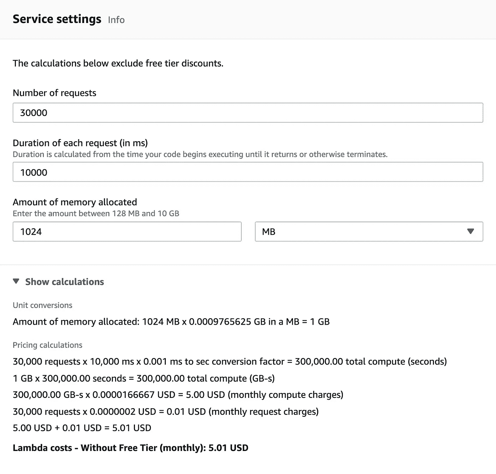

# AWS 上的无服务器 ML

> 原文：<https://towardsdatascience.com/serverless-ml-is-this-the-cheapest-way-to-host-machine-learning-models-on-aws-83ba3dee8be4?source=collection_archive---------23----------------------->

## 这是托管机器学习模型最便宜的方式吗？

*影像经* [下*跋元素*下](https://elements.envato.com/man-and-woman-hanging-modern-painting-on-wall-in-a-PPDMCDM)下*许可给菲尔·惠兰*

我最近在[上制作了一个视频，使用 vast.ai 廉价地构建机器学习模型](https://www.youtube.com/watch?v=cPsQBJ7Y9n0)。这对于像我这样想要在没有预算的情况下构建模型的人来说很有用。使用 [vast.ai](https://vast.ai/) (我不隶属于他们)，我能够构建合理大小的模型，例如基于[*resnet 152*](https://pytorch.org/hub/pytorch_vision_resnet/)(152 层 CNN)的图像分类模型，只需几美元。我的工作流程是跳到一个 vast.ai GPU 上，比如 RTX 3090，每小时支付 80 美分，做一些训练，做分析，然后跳回到我的笔记本电脑上，进一步制定我的攻击计划。如此反复几次，我就可以走了。

但是去哪里？

理想情况下，您希望将您的模型托管在 GPU 上，以便进行快速推理。但是对于很多型号*正常的*快速推理可以在合理的 CPU 上实现。即便如此，一个模型可能会占用几千兆字节的内存，你需要把它放在云中的某个地方。你可以获得每小时几美分的低成本云托管服务。但是这些时间累积起来，如果您想要托管多个模型，如果您的工作流看起来像我的工作流，您的模型推理成本可能会大大超过您的模型构建成本。

我没有明显的初始收入流来自我的模型来支付他们的托管，但我想建立一些模型，并托管他们。如果我友好的邻居弗雷德太忙而没有时间去看，那么我就不想支付闲置模特的托管费用。这就是“无服务器”的用武之地。

# 无服务器

无服务器是良好的不稳定流量模式。“无服务器”不是*无服务器*。你还在用服务器。你只是以黑盒上下文切换的方式与他人分享它们。您和服务器之间的不透明关系意味着很难针对您的特定用例优化底层服务器。该服务器的不同用户之间的上下文切换意味着，在您不知道的情况下，资源被不断地载入和载出。这些低效率是有代价的，但是你为少得多的使用支付的每使用额外费用意味着每个人都是赢家。

随着利用率的提高，这些经济性对消费者来说显然变得不那么有吸引力了，但是您的云提供商将尝试尽可能地通过缓存和相同的服务器重用来缩小差距。

# EC2 vs SageMaker vs Lambda

当我开始寻找在 AWS 上托管机器学习模型的选项时，我发现几乎所有的路都通向亚马逊 SageMaker，但我发现长期托管成本仍然超出了我的预算。从那时起，我开始研究 AWS Lambda 是否能做到这一点。

为了比较成本，最好看看等效的 EC2 实例。AWS Lambda 为您提供 6 个 vCPUs 和高达 10Gb 的 RAM。我能看到的最接近的 EC2 实例是一个 [c5.2xlarge](https://aws.amazon.com/ec2/pricing/on-demand/) ，有 8 个 vCPUs 和 16 GiB RAM。这台机器在 EC2 上是每小时 0.34 美元，在 SageMaker 上是 0.476 美元。我对 SageMaker 还不够熟悉，无法辨别其中的区别，而且我的主机需求也很简单，所以还是 0.34 美元吧。每月 244 美元，每年将近 3000 美元。这将会增加业余爱好者的预算，从而激发我寻找其他选择的欲望。

# 无服务器成本

[https://aws.amazon.com/lambda/pricing/](https://aws.amazon.com/lambda/pricing/)为我们提供了一个计算器，用于确定托管我们模型的成本，即内存(RAM)乘以时间。

我的测试表明，对于我的模型，每个请求需要 720Mb 到 860Mb 的 RAM，这取决于请求包含的图像量。我用 1024Mb 给 20%的开销。

并非所有的请求都花费相同的时间。如果没有人使用这个模型，它就不在 RAM 中。如果它不在 RAM 中，就需要加载 Python 代码，目前大约需要 10 秒钟。

10 秒的冷启动请求时间似乎很长，但如果价格合适，这是可以承受的，也是一个公平的权衡。如果模型变得更受欢迎(这是一个好问题),那么这个启动时间可能会更少。

非冷启动请求电流需要大约 1.5 秒，这也不是很大。但是电脑在表演魔术，你想要什么？！还有一些优化我没试过，比如用 [pillow-simd](https://aws.amazon.com/blogs/compute/creating-faster-aws-lambda-functions-with-avx2/) 。

冷启动和非冷启动请求之间的成本差异的大小意味着总成本在很大程度上取决于请求模式。为了简单起见，让我们假设我每天收到 1000 个请求，它们都是*冷启动。现在，碰巧的是，这正好在 AWS 的免费等级之内，它将花费我高达 0 美元。但是我们希望这种方法是可持续和可扩展的，因此我们将在计算中忽略自由层。*

如你所见，即使我每天有 1000 次点击，我一个月也只花 5 美元。如果达到每天 1，000，000 个请求，那么我们会看到更少的冷启动，持续时间会更接近 1，500 毫秒。这将把它放在每月 756 美元，虽然我可能会在此之前看其他优化。我还会有更多关于内存使用的统计数据来压缩我添加的 20%的 RAM 缓冲区。但总的来说，我会比没有服务器的人活得长，如果我能在回答风投关于我新的热门模型的电话之间找到一些时间，我会把它转移到持久的机器上，进行一些进一步的优化，加入一两个 GPU，然后…你明白了。

# 寒冷开始升温

为了让 10 秒的 Lambda 函数启动时间变得更容易忍受，我做了两件关键的事情。

第一个是对加载模型的 Lambda 函数的一次性请求，但是*没有使用*模型。这是我的“醒了！”当你访问模型所在的网页时，我调用它。人类是相当慢的(无意冒犯)，当他们弄清楚网页是关于什么的时候，选择一张图片上传或者输入一些文本，你已经进入了 10 秒钟。在发送实际的模型请求时，函数应该已经准备好了。这可能会使请求的数量翻倍，但只会增加我 15%的成本(10 秒+1.5 秒)，因为我是根据请求的持续时间付费的。不能保证 AWS 在后台会对这些请求做什么，但是缓存你的函数符合他们的利益，在实践中，这看起来做得足够好了。

第二个“优化”是简单地添加一个可视化的进度条，开始很快，然后越来越慢，直到请求完成，然后跳到结束。这足以分散我们的注意力，确保我们至少有 10 秒钟的时间，直到人们开始怀疑互联网的力量。对于耗时较长的车型，我不太清楚。等待音乐？

Progressbar 正在运行

# 对等

这种无服务器路线的最大优势显然是成本。这不是 [GPT-3](https://en.wikipedia.org/wiki/GPT-3) ，但我服务于一个相当大的 152 层 CNN 模型，这是一个有能力的架构。它仍然可以很好地执行推理，而不需要 GPU。现在，除了血汗资本，我什么也没花。

# 下降趋势

最大的缺点是架构和部署的复杂性。在[上找到这篇关于用 AWS Lambda](https://aws.amazon.com/blogs/compute/pay-as-you-go-machine-learning-inference-with-aws-lambda/) 进行机器学习推理的帖子后，我开始走上了 AWS API Gateway + AWS Lambda + AWS EFS 的道路。

> AWS Lambda 是一种无服务器计算服务，按使用付费。然而，像 XGBoost 这样的 ML 框架太大了，不适合 250 MB 的应用程序工件大小限制，或者 512 MB /tmp 空间限制。虽然你可以将包存储在亚马逊 S3 并下载到 Lambda(最大 3 GB)，但这可能会增加成本。
> 
> 为了解决这个问题，Lambda 函数现在可以挂载一个 Amazon 弹性文件系统(EFS)。这是一个可扩展的弹性 NFS 文件系统，在多个可用性区域(AZ)内和之间存储数据，以实现高可用性和耐用性。

此设置要求您将代码部署到 AWS Lambda 和 AWS EFS 卷。因此，您必须确保在两个地方都部署了兼容的代码。

如果您正在使用 [joblib](https://joblib.readthedocs.io/) 来持久化模型，就像我和上面的帖子所建议的那样，那么在 EFS 卷上特定于版本的 lib/目录中安装了 Python 依赖项之后，您将希望从同一个 EFS 卷中执行该操作。模型再水合时的任何不匹配都将导致停机。

到目前为止，我还没有解决这方面的 CI/CD 复杂性，因为我已经感觉到它正在走一条过于复杂的道路。我想退一步，写这篇博客，思考什么是更好的解决方案。

也许码头工人能帮上忙。这是我接下来要研究的东西。

# 结论

做 CI/CD 的困难和 Lambda + EFS + API Gateway 的复杂性(API Gateway 非常复杂)使得这很难推荐给其他人。虽然，当我看着我预计的 3 月份 AWS 账单时，它只有 6.72 加元，但很难就其价值进行争论。这包括用于前端的 CloudFront + S3、VPC、Route53 和我用于电子邮件的 se。当然，没有流量是有帮助的。

贾斯汀·平克尼在[上发表了一篇文章，在 GCP](https://www.justinpinkney.com/making-toonify/) 上主持卡通。乍一看，这似乎是一个更简单的选择，至少在基础设施方面是如此。冷启动请求延迟似乎更长，但他的模型更大。

我可能会跟进更多关于基础设施如何连接在一起以及我如何使用 Terraform Cloud 和 CircleCI 部署这些基础设施的细节，但如果您对某些特定的东西感兴趣或者想告诉我更好的方法，请告诉我。

如果你对踢轮胎感兴趣，你可以找到我在 https://dogedreams.ai/[举办的最新模型](https://dogedreams.ai/)

祝你愉快！