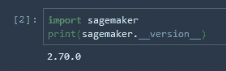
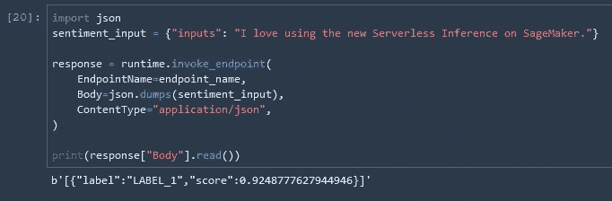

# 亚马逊 SageMaker 上基于拥抱脸的变形金刚模型的无服务器 NLP 推理

> 原文：<https://towardsdatascience.com/serverless-nlp-inference-on-amazon-sagemaker-with-transformer-models-from-hugging-face-4843609a7451?source=collection_archive---------12----------------------->

## 无服务器部署您的 NLP 模型。没有基础设施管理。现收现付！

Krzysztof Kowalik 在 [Unsplash](https://unsplash.com?utm_source=medium&utm_medium=referral) 上的照片

# 这是怎么回事？

At re:Invent 2021 AWS 推出[亚马逊 SageMaker 无服务器推理](https://docs.aws.amazon.com/sagemaker/latest/dg/serverless-endpoints.html)，让我们可以轻松部署机器学习模型进行推理，而无需配置或管理底层基础设施。这是我与客户打交道时最常要求的特性之一，在自然语言处理(NLP)领域尤其如此。在这篇博文中，我将展示如何使用 Amazon SageMaker 无服务器推理来部署 NLP 模型。

您可以在这个 [Github repo](https://github.com/marshmellow77/nlp-serverless) 中找到这篇博文的附带代码示例。

# 为什么这很重要？

在 NLP 中，许多工作负载都有间歇性或不可预测的流量。例如，想想你选择的智能家居设备:它大部分时间都处于闲置状态，直到你要求它执行一项任务。如果我们以传统方式部署底层 NLP 模型，我们将不得不管理底层基础设施。更糟糕的是，我们将不得不为这一基础设施买单——即使它 99.9%的时间都处于闲置状态。

Amazon SageMaker 无服务器推理通过根据推理请求的数量自动扩展计算能力来帮助解决这些类型的用例，而无需您预先预测流量需求或管理扩展策略。此外，您只需为运行推理代码的计算时间(以毫秒计费)和处理的数据量付费，这使它成为具有间歇性流量的工作负载的一个经济高效的选项。

# 行动（或活动、袭击）计划

我们将在 SageMaker 上训练一个拥抱脸模型，然后使用新的 SageMaker 无服务器推理功能部署它。注意这个功能目前在*预览版*中，也就是说不支持某些地区和某些功能。更多信息请访问本[网站](https://docs.aws.amazon.com/sagemaker/latest/dg/serverless-endpoints.html)。然而，这并不意味着你必须注册一个测试程序或类似的程序。只要您部署在受支持的地区，就可以使用现成的新功能。

我用 SageMaker Studio 运行这个笔记本。从实例大小来说，ml.t3.medium (2 个 vCPU + 4 个 GiB)足够运行笔记本了。确保您安装了最新的 SageMaker 软件包(截至 2021 年 12 月 9 日，该软件包为 2.70.0 版):

作者图片

# 模特培训

这篇博文不会深入探讨模型训练，有很多其他的博文会涉及到它。我们将使用一个取自这本[笔记本](https://github.com/huggingface/notebooks/blob/master/sagemaker/01_getting_started_pytorch/sagemaker-notebook.ipynb)的非常标准的例子:训练一个二元情感分类器。该模型将接收带有正面或负面情绪的文本，并尝试对它们进行相应的分类。

# 模型部署

一旦模型被训练，这就是乐趣所在。预览版中这个特性的一个限制是我们还不能使用 Python SDK 来部署模型。这意味着这个漂亮的小方法目前还不可用:

相反，我们可以使用 Boto3 库来建立我们自己的部署过程。这比仅仅使用 deploy()方法要复杂一点，但也不会复杂太多。它要求我们自己设置端点配置。这是我们指定要使用新的无服务器配置的地方:

设置好端点配置后，我们可以创建端点:

这将需要几分钟时间，一旦终端部署完毕，我们就可以对其进行测试:

作者图片

# 结论

这又快又简单。我们已经使用 SageMaker 中的 Huggingface 集成训练了一个 NLP 模型。一旦模型被训练好，我们就把它部署到一个无服务器的推理端点，现在可以直接使用模型，而不必管理基础设施或在模型未被使用时付费。

这篇博文向您简要介绍了如何建立无服务器 NLP 推理，但是当然还有更多问题需要研究:延迟是什么样子的？延迟如何依赖于模型的大小或我们提供的输入？如何优化这种设置？冷启动问题怎么办？我很高兴在接下来的几周里更多地使用这个新功能，并分享我的学习成果！