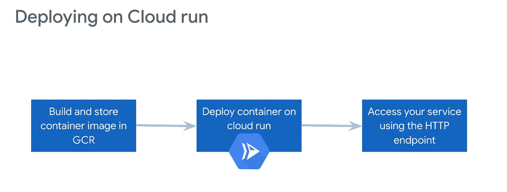
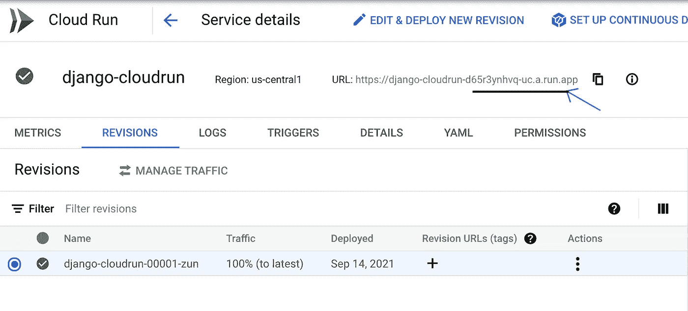
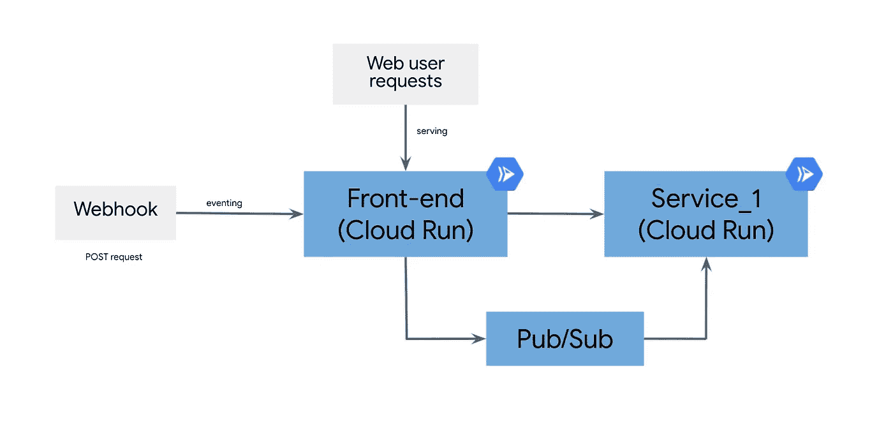
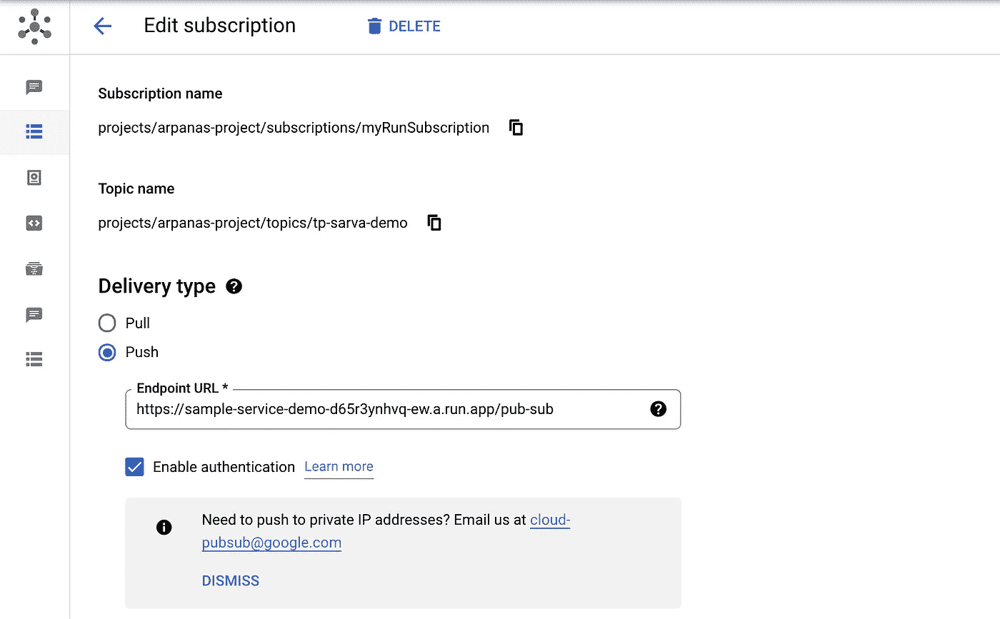
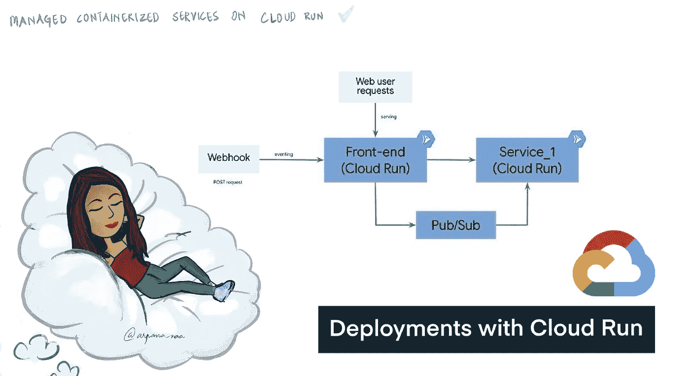

# GCP 上的无服务器云运行

> 原文：<https://towardsdatascience.com/serverless-on-gcp-with-cloud-run-b3dab7a60e63?source=collection_archive---------22----------------------->

## 构建在 Knative 之上的平台，是服务和事件架构的理想选择

无服务器已经讨论了很长时间了，而且还会继续下去。将基础设施管理从开发人员手中转移出去，意味着他们将时间和精力投入到构建和改进产品上，并更快地交付给市场。

[图片由[Nathana rebou as](https://unsplash.com/@nathanareboucas?utm_source=unsplash&utm_medium=referral&utm_content=creditCopyText)在 [Unsplash](https://unsplash.com/collections/18533954/researcher?utm_source=unsplash&utm_medium=referral&utm_content=creditCopyText) 上拍摄]

> Cloud Run 允许您在完全托管的无服务器平台上运行容器化的应用程序。在这篇博客中，我将带您浏览以下内容—
> T5 a .背景
> b .部署您的应用程序的步骤
> c .展示服务和事件的示例应用程序概述

那我们开始吧！

# **a .背景**

Cloud Run 建立在 Knative 之上，kna tive 是一个无服务器框架，旨在提供所需的构建模块，使无服务器应用在 Kubernetes 上成为现实**而不一定是一个成熟的解决方案。如果你用过 k8s，甚至是 k8s 的托管版，你就知道这需要一些(阅读大量！)是时候掌握窍门了。正如您将在本博客中讨论的示例应用程序中看到的，云运行为您简化了这种管理。**

有兴趣更全面地了解何时应该使用 cloud run？前往本博客。
Ps:如果你是学生或打算在某个地方托管作品集的人，我真的会推荐试试 Cloud Run。👩🏻‍💻

# b.3 简单(神奇？)步骤

[作者图片]

1.  **构建—打包您的应用程序** 我在这里使用的示例应用程序是 Github 上的[。您可以为初学者克隆 repo，并试验源代码。
    现在假设您已经准备好了您的应用程序代码，请注意其中有一个`Dockerfile`。我们将使用这个文件创建一个容器映像，并将它存储在](https://github.com/winter-code/cloud-run-tutorial/)[容器注册表](https://cloud.google.com/container-registry/?utm_source=google&utm_medium=cpc&utm_campaign=japac-IN-all-en-dr-bkws-all-pkws-trial-e-dr-1009882&utm_content=text-ad-none-none-DEV_c-CRE_468709901001-ADGP_Hybrid%20%7C%20BKWS%20-%20EXA%20%7C%20Txt%20~%20Containers%20~%20Container%20Registry_container%20registry-general%20-%20Products-KWID_43700049545546359-aud-970366092687%3Akwd-197849459819&userloc_9061993-network_g&utm_term=KW_google%20container%20registry&gclid=CjwKCAiA1aiMBhAUEiwACw25MQPg7NHPn--lq0BWMELwlgKRn-JOjZYpt8bqYbxiiJ3B3o7ulho4kxoClo4QAvD_BwE&gclsrc=aw.ds)中。当需要自动缩放时，我们的云运行服务将使用该映像。在幕后有很多工作要做，但是对你来说，这一步只意味着`cd`到你的源代码文件夹，在那里你有你的`Dockerfile`，运行这个命令——
    `gcloud builds submit --tag gcr.io/project-id/image-name .` ，你将被提示回答是否允许你的服务的 HTTP 端点的公共调用。请做出相应的回答，当然这也是您稍后可以通过云运行控制台编辑的内容。*推荐:在这里* *可以了解这个命令及其参数* [*。该文档还提供了一种全面的方式来理解在“构建”步骤中发生了什么。*](https://cloud.google.com/build/docs/running-builds/start-build-command-line-api#running_builds)
2.  **部署** 要部署您的应用程序，只需运行— `gcloud run deploy` 这一步需要一些时间，当您的服务从映像中部署完成且版本开始提供流量服务时，您将能够看到进度。如果部署成功，最终结果将显示部署的修订版提供的流量百分比，以及可以用来访问服务的 HTTP url。不成功的部署将返回一个错误，并带有指向日志的 url。这些日志可用于调试部署中的问题。
    如果您希望从一个已经存在的容器映像进行部署，使用这个命令— `gcloud run deploy <service-name> --image <image-url>`
3.  **访问服务
    成功部署后，您可以使用最后一个命令输出的服务 url 或在控制台上找到它来访问您的服务。** `curl <service_url> -H “Authorization: Bearer $(gcloud auth print-identity-token)"` 这个身份令牌包含用户信息，在不允许公开调用服务时是必需的。

每个云运行服务都有一个 HTTP 端点，甚至可以通过控制台本身映射到一个域。[作者图片]

# c.概述—服务和活动

对于大多数人来说，无服务器意味着功能即服务。有时问题是，当我们可以使用“云功能”时，这是 GCP 联邦航空局直接为事件架构提供的，那么为什么要运行云呢？

对我来说，这是—

*   抽象为容器，可以跨平台移动，几乎不需要修改代码
*   能够使用任何语言/运行时二进制文件
*   可以选择尝试 k8s 部署提供的高级功能，如流量分流、金丝雀部署等，而不必增加像 [Istio](https://cloud.google.com/learn/what-is-istio) 这样的服务网格。

您可以直接从 UI 或 gcloud 命令行(如果您喜欢终端)完成这些任务。

我所说的在云上“服务”是指您的服务在您公开的特定`PORT`处监听请求。另一方面，“事件化”意味着只有当一个动作发生时(事件)，云运行服务才会被触发。我们将使用发布/订阅作为“活动”和“服务”之间的连接媒介。发布/订阅是我们将**定义“当 X 动作发生时，触发 Y 服务”的地方**。

现在来看看我们的示例应用程序，如果您有兴趣亲自体验云运行，您可以派生出[这个回购](https://github.com/winter-code/cloud-run-tutorial/)并按照自述文件中的步骤继续。在 [GCP 文档](https://cloud.google.com/run/docs/tutorials/pubsub#integrating-pubsub)中明确定义了允许发布/订阅能够触发内部服务所需的身份验证、IAM 角色和权限。请看看这些。

概述—架构图

## 服务—处理 web 流量

在我们的示例应用程序中，服务是通过“GET”请求完成的，该请求调用与您部署的服务相关联的端点。当您到达端点时，会创建一个服务实例并提供网页。如果在某个时间段(超时时间段)内向该端点发出另一个请求，则同一个实例继续为新请求提供服务。基本上，云运行部署可以处理多达 80 个并发请求。如果您的服务在 60 秒内没有收到任何请求，实例就会被终止。

## 事件—处理异步请求

在许多组织中，一个常见的用例是 web-hook 根据某个用户的动作触发服务。我在我们的示例中创建了一个简单的 web-hook(我们都知道，web-hook 基本上是 POST 请求！)并且还部署了一个服务(姑且称之为`service_1`)。

这个网络挂钩将由我们手动触发，就像用户在网站上做一些动作一样。该事件将向发布/订阅`topic`发送一条消息。该消息由该`topic`的`subscription`接收，其端点在`push`模式中被定义为`service_1`部署的 url。

该图显示了如何在发布/订阅中为每个订阅设置端点—在我们的示例中，它是我们之前部署的 service _ 1[作者提供的图片—来自 GCP 控制台的屏幕截图]

我们在这篇博客中部署的示例应用程序需要 pub/sub 集成，因此您需要启用这些 API，并需要遵循集成 pub/sub 的步骤，但是如果您正在寻找一些准备好部署的无状态应用程序，您可以从这个 [GitHub 存储库](https://github.com/as-a-service)中选择并部署任何服务，并使用它的 url 作为要触发的端点。

> 步骤—构建、部署、访问端点！

[作者图片]

希望您了解了一些关于云运行的可能性。如果您对该部署过程有任何疑问，请随时发表评论，或者如果您在应用程序代码方面遇到任何问题，请在 repo 中创建一个问题。