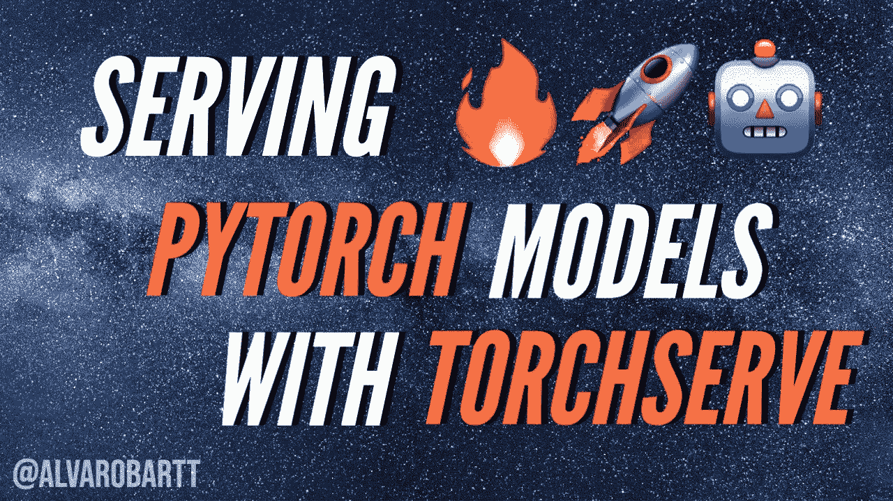
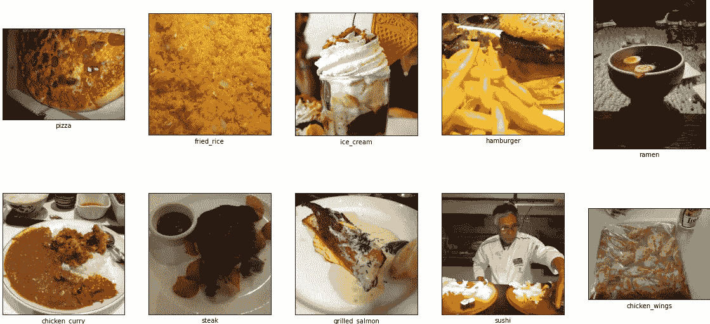

# 为 PyTorch 模型提供 TorchServe

> 原文：<https://towardsdatascience.com/serving-pytorch-models-with-torchserve-6b8e8cbdb632?source=collection_archive---------8----------------------->

## 这是关于如何使用 TorchServe 在生产中创建和部署您自己的 PyTorch 模型的详细指南



来源:[https://pix abay . com/photos/银河系-星空-夜空-星空-2695569/](https://pixabay.com/photos/milky-way-starry-sky-night-sky-star-2695569/)

**TorchServe 是 PyTorch** 开发的 ML 模型服务框架。

# 📖介绍

目前，随着 **MLOps** 的发展，有许多不同的解决方案为生产中的 ML 模型提供服务，这是当今在 ML 模型的整个生命周期中使用 ML 模型的标准程序。也许最受欢迎的是 TensorFlow 开发的 [TensorFlow Serving](https://www.tensorflow.org/tfx/guide/serving) ，以便在生产环境中服务他们的模型，因此 [TorchServe](https://pytorch.org/serve/) 是在它之后创建的，以便让 PyTorch 用户也可以轻松地服务他们的模型。

在这篇文章中，介绍了使用 [ResNet](https://arxiv.org/abs/1512.03385) 作为主干来训练和部署迁移学习 CNN 模型的过程，该模型对从一个名为 [Food101](https://www.tensorflow.org/datasets/catalog/food101) 的众所周知的食品数据集中检索到的图像进行分类。

为了服务于经过培训的迁移学习模型，我们将使用 TorchServe，并解释使用此框架服务模型之前和之后的所有细节和注意事项。

为了更好地理解本文中介绍的所有过程，作为个人建议，您应该在查看资源库中可用资源的同时阅读本文，并尝试使用相同或不同的 PyTorch 模型再现它，因为“熟能生巧”。

[](https://github.com/alvarobartt/serving-pytorch-models) [## alvarobartt/serving-py torch-型号

### TorchServe 是 PyTorch 开发的 ML 模型服务框架。沿着这个知识库，程序以训练…

github.com](https://github.com/alvarobartt/serving-pytorch-models) 

**警告** : TorchServe 是实验性的，可能会有变化。

# 🔨要求

首先，你需要确保你已经安装了 **Java JDK 11** ，因为这是 *torchserve* 在部署模型时所需要的，因为它使用 Java 来公开 API。

```
sudo apt install --no-install-recommends -y openjdk-11-jre-headless
```

然后您可以继续安装培训和服务模型所需的 **PyTorch** Python 包。

```
pip install torch==1.7.0 torchvision==0.8.1 -f [https://download.pytorch.org/whl/torch_stable.html](https://download.pytorch.org/whl/torch_stable.html)pip install torchserve==0.2.0 torch-model-archiver==0.2.0
```

或者您也可以从资源库中的 *requirements.txt* 文件安装它们，如下所示:

```
pip install -r requirements.txt
```

如果您有任何关于 PyTorch 安装的问题，请访问 [PyTorch —本地入门](https://pytorch.org/get-started/locally/)。

# 📂资料组

将要用于训练图像分类模型的数据集是 [**Food101**](https://www.tensorflow.org/datasets/catalog/food101) ，但不是它的完整版本，只是 10 个类的切片，这或多或少是数据集的 10%。

原始的 Food101 数据集由 101 个食物类别组成，包含 101，000 张图片。对于每个类别，提供 250 幅人工审阅的测试图像以及 750 幅训练图像。有意地，训练图像没有被清理，因此仍然包含一定量的噪声。这主要表现在强烈的颜色和有时错误的标签上。所有图像的最大边长都调整为 512 像素。



来源:来自 TensorFlow 的 Food101 数据集的 10%切片的每个类别的 10 个随机图像

# 🤖系统模型化

我们将使用 [**ResNet**](https://arxiv.org/abs/1512.03385) 作为其主干，并在 [**ImageNet**](http://www.image-net.org/) 上训练一组预训练的权重，来进行迁移学习方法，因为这是图像分类问题的最新技术。

在这种情况下，由于我们想要提供 PyTorch 模型，我们将使用 [PyTorch 的 ResNet](https://pytorch.org/hub/pytorch_vision_resnet/) 实现，更具体地说，是 **ResNet18** ，其中 18 代表它包含的层数。

由于我们将从预训练的 PyTorch 模型中使用迁移学习，我们将加载 ResNet18 模型，并使用以下代码冻结其权重:

加载后，我们需要更新 *fc* 层，它代表完全连接，是模型的最后一层，在这一层之上，将计算权重以优化数据集的网络。在这种具体情况下，我们包括以下连续层:

然后，我们将使用包含 750 幅图像的训练数据集来训练该模型，该训练数据集已被分成 80%-20%分别用于训练和验证。并在包含 2500 幅图像的测试数据集上进行测试。

**注**:关于模型训练过程的更多细节，请随时查看资源库中的[*notebooks/transfer-learning . ipynb*](https://github.com/alvarobartt/serving-pytorch-models/tree/master/notebooks/transfer-learning.ipynb)。

训练完模型后，你只需要将 state_dict 转储到一个**中。pth** 文件，包含预训练的权重集，代码如下:

一旦从预训练的模型中生成了 *state_dict* ，您需要确保它可以被正确加载。但是，在检查之前，您需要将模型的架构定义为 Python 类，以便将预先训练的权重集加载到该架构中，这意味着模型和权重之间的键应该匹配。

由于我们使用了来自预训练模型的迁移学习，并且我们刚刚修改了最后一个全连接层(fc)，因此我们需要修改原始的 ResNet18 类。您可以在[*torch vision/models/segmentation*](https://github.com/pytorch/vision/blob/master/torchvision/models/resnet.py#L268-L277)*找到该模型的原始类，并在[*torch vision/models*](https://github.com/pytorch/vision/tree/master/torchvision/models)找到 PyTorch 预训练模型的剩余类。*

*ResNet18 模型的代码如下所示:*

*这转化为我们的定制模型的架构，它应该是这样的:*

*如你所见，我们正在创建一个名为***image classifier***的新类，它继承了该文件中定义的基类 ***ResNet*** 。然后，我们需要用我们的架构初始化该类，在这种情况下，该架构与 ResNet18 的架构相同，包括 ***基本块*** ，指定 ResNet18 层***【2，2，2】***，然后我们修改类的数量，在我们的案例中，如我们之前提到的，该数量为 10。*

*最后，为了使 state_dict 与 model 类匹配，我们需要覆盖 ***self.fc*** 层，这是网络的最后一层。由于我们在训练模型时使用了该顺序层，最终权重已针对该层上的数据集进行了优化，因此只要覆盖它，我们就可以通过修改获得模型的架构。*

*然后，为了检查模型是否可以加载到***image classifier***类中，您应该只需要使用下面这段代码定义该类并加载权重:*

*其预期输出应为“ *<所有键匹配成功>”*。*

*你可以在 [PyTorch 图像分类模型](https://pytorch.org/docs/stable/torchvision/models.html#classification)找到更多的图像分类预训练 PyTorch 模型。*

***注**:该模型已经在使用 CUDA 11 的 **NVIDIA GeForce GTX 1070 8GB GPU 上进行了训练。如果你想得到你的 GPU 规格，只需在你的控制台上使用 ***nvidia-smi*** 命令，但要确保你已经正确安装了 nvidia 驱动程序。为了检查 PyTorch 是否正在使用 GPU，您可以使用下面这段代码，它会告诉您是否有一个(或多个)可用的 GPU，如果有，它是该设备的名称，取决于它的 ID(如果有多个 GPU)。***

# *🚀部署*

*为了部署该模型，在安装了上一节中描述的所有需求之后，您需要重复以下步骤。*

## *1.生成标记文件*

*首先，您需要生成 MAR 文件，这是用***torch-model-archive***r 生成的模型的“准备好服务”归档文件，以此类推，为此，您需要使用以下命令:*

```
*torch-model-archiver --model-name foodnet_resnet18 \
                     --version 1.0 \
                     --model-file model/model.py \
                     --serialized-file model/foodnet_resnet18.pth \
                     --handler model/handler.py \
                     --extra-files model/index_to_name.json*
```

*因此*火炬模型归档器*使用的标志代表:*

*   *— ***型号名称*** :生成的 MAR“准备就绪”文件的名称。*
*   ****—版本*** :它是可选的，尽管包含模型的版本以便对它们进行适当的跟踪是一个好的做法。*
*   ****—模型文件*** :定义模型架构的文件。*
*   ****—序列化文件*** :已训练模型权重的转储 *state_dict* 。*
*   ****— handler*** :定义数据预处理、推理和后处理的 Python 文件。*

*****注意**:你可以定义自定义的处理程序，但是你不需要这样做，因为 TorchServe 已经为每个可能的问题定义了一些默认的处理程序，并且可以通过一个简单的字符串访问。当前可能的
默认处理程序有:*图像 _ 分类器*、*图像 _ 分割器*、*对象 _ 检测器*、*文本 _ 分类器*。你可以在 [TorchServe 默认处理程序](https://pytorch.org/serve/default_handlers.html)找到更多信息。***

***生成后，您需要将 MAR 文件放入 [*部署/模型存储*](https://github.com/alvarobartt/serving-pytorch-models/tree/master/deployment/model-store) 目录，如下所示:***

```
***mv foodnet_resnet18.mar deployment/model-store/***
```

***更多关于**火炬模型归档器**的信息可从[火炬服务器](https://github.com/pytorch/serve/blob/master/model-archiver/README.md)的火炬模型归档器获得。***

## *****2。部署火炬服务器*****

***一旦您创建了 MAR“随时可用”模型，您只需为其提供服务。作为 MAR 文件的预训练 PyTorch 模型的服务过程从 TorchServe REST APIs 的部署开始。***

***这些 API 是推理 API、管理 API 和度量 API，默认情况下分别部署在端口 8080、8081 和 8082 中的*本地主机*上。***

***在部署 TorchServe 时，您还可以指定存储 MAR 文件的目录，以便在启动时在 API 中部署它们。***

***使用存储在[*deployment/model-store/*](https://github.com/alvarobartt/serving-pytorch-models/tree/master/deployment/model-store)下的当前 MAR 模型部署 TorchServe 的命令如下:***

```
***torchserve --start \
           --ncs \
           --ts-config deployment/config.properties \
           --model-store deployment/model-store \
           --models foodnet=foodnet_resnet18.mar***
```

***所以*火炬服务*使用的旗帜代表:***

*   *****— start** :表示要启动 TorchServe 服务(部署 API)。***
*   *****— ncs** :表示您想要禁用快照功能(可选)。***
*   *****— ts-config** :包含配置文件，也是可选的。***
*   *****— model-store** :存储 MAR 文件的目录。***
*   *****— models** :是将在启动时服务的模型的名称，包括将作为该具体模型的 API 端点的别名和该模型的文件名，格式为*endpoint = model _ name . mar*。***

*****注意**:另一个过程可以是首先部署 TorchServe(不指定模型)，然后使用管理 API 注册一个(或多个)模型，并缩放工作线程的数量(如果需要)。***

```
***torchserve --start \
           --ncs \
           --ts-config deployment/config.properties \
           --model-store deployment/model-storecurl -X POST "http://localhost:8081/models?initial_workers=1&synchronous=true&url=foodnet_resnet18.mar"curl -X PUT "http://localhost:8081/models/foodnet?min_worker=3"***
```

***有关**火炬服务**的 CLI 的更多信息，请访问 [*火炬服务 CLI*](https://pytorch.org/serve/server.html#command-line-interface) 。***

## *****3。检查其状态*****

***为了检查部署的 TorchServe API 的可用性，您可以只向默认部署在 8080 端口的推理 API 发送一个 HTTP GET 请求，但是您应该检查 *config.properties* 文件，该文件指定了包含端口的“*推理 _ 地址”*。***

```
***curl http://localhost:8080/ping***
```

***如果一切按预期进行，它应该输出以下响应:***

*****注意**:如果健康检查请求的状态是“*不健康*，您应该从运行 TorchServe 部署的控制台或者从在部署 TorchServe 时自动创建的 *logs/* 目录中检查日志。***

## *****4。停止火炬 Serve*****

***完成后，您不再需要 TorchServe，您可以使用以下命令优雅地关闭它:***

```
***torchserve --stop***
```

***那么下次您部署 TorchServe 时，如果要作为服务器的模型已经注册/加载，它将比第一次花费更少的时间，因为 TorchServe 将它们缓存在 */tmp* 目录下，所以如果名称和版本都没有改变，它就不需要再次加载它们。另一方面，如果你注册了一个新的模型，TorchServe 将不得不加载它，这可能需要更多的时间，这取决于你的机器规格。***

# ***🐋码头工人***

***为了在一个 **Ubuntu Docker** 映像中重现 TorchServe 部署，您应该只使用下面的一组命令:***

```
***docker build -t ubuntu-torchserve:latest deployment/docker run --rm --name torchserve_docker \
           -p8080:8080 -p8081:8081 -p8082:8082 \
           ubuntu-torchserve:latest \
           torchserve --model-store /home/model-server/model-store/ --models foodnet=foodnet_resnet18.mar***
```

***有关 docker 部署的更多信息，您应该查看 TorchServe 在[*py torch/serve/Docker*](https://github.com/pytorch/serve/tree/master/docker)上的解释和注释，因为它还解释了如何使用他们的 Docker 映像(而不是清晰的 Ubuntu 映像)以及一些关于使用 TorchServe 的模型的生产部署的提示。***

# ***🧙‍♂️用法***

***一旦您完成了上面的所有步骤，您就可以向部署的模型发送一个示例请求，以便查看它的性能并做出推断。在这种情况下，由于我们面临的问题是一个图像分类问题，我们将使用下面提供的示例图像，然后将它作为 HTTP 请求正文中的文件发送，如下所示:***

```
***wget [https://raw.githubusercontent.com/alvarobartt/pytorch-model-serving/master/images/sample.jpg](https://raw.githubusercontent.com/alvarobartt/pytorch-model-serving/master/images/sample.jpg)curl -X POST http://localhost:8080/predictions/foodnet -T sample.jpg***
```

***它应该会输出类似如下的内容:***

*****记住**:原始推理的输出是带有每个类的标识符的字典，而不是类名，在这种情况下，我们在创建 MAR 时将 *index_to_name.json* 作为一个额外文件，TorchServe 会自动分配带有类名的标识符，这样预测就更加清晰。***

***上面的命令翻译成 Python 代码后看起来像:***

*****注意**:要执行上面的示例代码，您将需要比需求部分中指定的更多的需求，所以只需运行下面的命令来安装它们:***

```
***pip install opencv-python pillow requests --upgrade***
```

# ***📕结论***

***总而言之，TorchServe 是 PyTorch 开发的一个强大的框架，以一种简单但一致的方式服务于他们的模型。因此，当希望在生产环境中为基于 PyTorch 的 ML 模型提供服务时，建议使用 TorchServe，因为它与 PyTorch 完全集成。***

***因此，在 MLOps 生命周期中，当将模型投入生产时，您不需要创建完整的 API 来公开端点以使用您的模型，因为这已经通过 TorchServe 自动完成了。***

***除了推理 API。这可能是最常见的一个，您还将能够访问 Metrics API 和 Management API，这两个 API 允许您定期收集系统级指标和自定义指标，并分别管理您的服务器以及您所公开的模型和分配给每个模型的服务器资源。***

***这使得 TorchServe 成为一个真正一致的模型服务框架，因此从保存训练好的模型到服务它的周期可以在一些简单的步骤中完成，使得 PyTorch 的 MLOps 比以往任何时候都更容易。***

# ***💻信用***

***数据集切片的功劳归于[丹尼尔·伯克](https://github.com/mrdbourke)，因为他通过 Twitter DM 很好地向
我提供了信息。关于如何使用 TorchServe 为 PyTorch 迁移学习模型提供服务的提示的学分归 [Prashant Sail](https://github.com/prashantsail) 所有，正如他在[本评论](https://github.com/pytorch/serve/issues/620#issuecomment-674971664)中正确解释的那样。***

# ***📑联系信息***

***你可以通过[https://twitter.com/alvarobartt](https://twitter.com/alvarobartt)的 **Twitter** 或者[https://github.com/alvarobartt.](https://github.com/alvarobartt.)的 **GitHub** 联系我，或者直接去[https://allmylinks.com/alvarobartt](https://allmylinks.com/alvarobartt)你可以找到我所有的链接。***

***[](https://github.com/alvarobartt) [## alvarobartt -概述

### 🧙‍♂️ ML 工程师@前沿

github.com](https://github.com/alvarobartt) 

🌟我非常感谢所有的关注者和善意的评论！🌟***