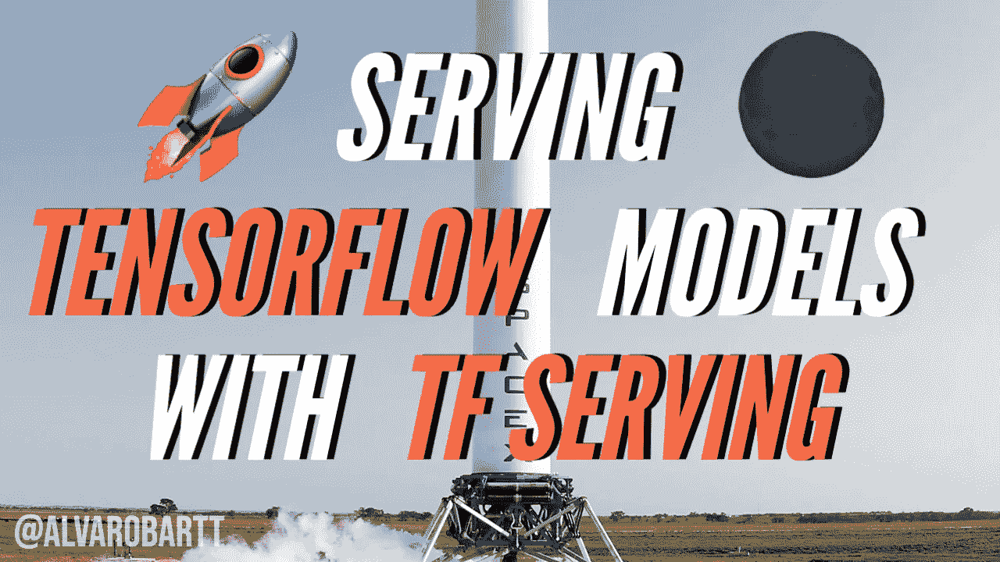

# 使用张量流服务的服务张量流模型📙

> 原文：<https://towardsdatascience.com/serving-tensorflow-models-with-tensorflow-serving-9f1058ac7140?source=collection_archive---------14----------------------->

## [实践教程](https://towardsdatascience.com/tagged/hands-on-tutorials)

## 这是关于如何创建 TensorFlow 模型，然后使用 TensorFlow 服务部署它们的详细指南



来源:[https://www . stock free images . com/109904469/Photo-of-Space-rocket . html](https://www.stockfreeimages.com/109904469/Photo-of-Space-Rocket.html)

**TensorFlow Serving 是一个灵活、高性能的机器学习模型服务系统，专为生产环境而设计。TensorFlow 服务可以轻松部署新的算法和实验，同时保持相同的服务器架构和 API。TensorFlow 服务提供了与 TensorFlow 模型的现成集成，但可以轻松扩展为服务于其他类型的模型和数据。**

# 📖介绍

目前，随着 **MLOps** 的发展，有许多不同的解决方案为生产中的 ML 模型提供服务，这是当今在 ML 模型的整个生命周期中使用 ML 模型的标准程序。也许最流行的是 TensorFlow 开发的 [TensorFlow Serving](https://www.tensorflow.org/tfx/guide/serving) ，以便在生产环境中服务他们的模型。

这篇文章是关于如何在生产环境中训练、保存、服务和使用 TensorFlow ML 模型的指南。通过链接到本帖的 GitHub 库，我们将准备和训练一个定制的 CNN 模型，用于对[辛普森一家的人物数据集](https://www.kaggle.com/alexattia/the-simpsons-characters-dataset)进行图像分类，稍后将使用 [TensorFlow 服务](https://www.tensorflow.org/tfx/guide/serving)进行部署。

为了更好地理解这篇文章中介绍的所有过程，作为个人建议，您应该在检查资源库中可用资源的同时阅读这篇文章，并尝试使用相同或不同的 TensorFlow 模型再现它，因为“熟能生巧”。

<https://github.com/alvarobartt/serving-tensorflow-models>  

# 🔨要求

首先，你需要确保你已经安装了所有的需求，但是在继续之前，你需要知道 TF-Serving 只适用于 Ubuntu，这意味着，为了使用它，你要么需要一个 Ubuntu VM，要么只需要在你的操作系统中安装 Docker，以便运行部署 TF-Serving 的 Docker 容器。

**警告！** **⚠️** 如果你没有 Ubuntu，但仍然想通过 Docker 部署 TF-Serving，你不需要安装 APT-GET，因为你将无法安装，你只需要运行 Dockerfile(转到章节 [Docker](https://github.com/alvarobartt/serving-tensorflow-models#whale2-docker) )。

所以，从你的 Ubuntu VM 你需要安装`tensorflow-model-server`，但是在能够安装它之前你需要添加 TF-Serving 发行版 URI 作为一个包源，如下所示:

```
echo "deb [arch=amd64] http://storage.googleapis.com/tensorflow-serving-apt stable tensorflow-model-server tensorflow-model-server-universal" | sudo tee /etc/apt/sources.list.d/tensorflow-serving.list && \
curl https://storage.googleapis.com/tensorflow-serving-apt/tensorflow-serving.release.pub.gpg | sudo apt-key add -
```

然后您将能够使用 APT-GET 安装`tensorflow-model-server`,如下所示:

```
apt-get update && apt-get install tensorflow-model-server
```

最后，对于客户端，您需要安装 Python 包`tensorflow-serving-api`，这对使用 gRPC API 很有用；还有，`tensorflow`。注意，两个包的版本应该匹配。

```
pip install tensorflow-serving-api==2.4.1
pip install tensorflow==2.4.1
```

如果您对 TensorFlow 安装有任何问题，请访问[安装| TensorFlow](https://www.tensorflow.org/install?hl=es-419) 。

# 📂资料组

将用于训练图像分类模型的数据集是“ [**《辛普森一家》人物数据**](https://www.kaggle.com/alexattia/the-simpsons-characters-dataset) ”，这是一个大的 Kaggle 数据集，包含一些主要辛普森人物的 RGB 图像，包括荷马、玛吉、巴特、丽莎、玛吉、巴尼等等。

原始数据集包含 42 个 Simpsons 角色类，每个类的样本数量不平衡，总共有 20，935 个训练图像和 990 个 JPG 格式的测试图像，图像大小不同，但由于它们都很小，我们将在训练模型时将其大小调整为 64x64px。

无论如何，我们将创建原始数据集的自定义切片，仅保留训练集，并使用随机 80/20 训练测试分割，删除少于 50 幅图像的类。依此类推，我们将有 32 个类，13，210 个训练图像，3，286 个验证图像和 4，142 个测试图像。


来源:辛普森一家人物数据集中 10 个最常见类别的随机图像

# 🤖系统模型化

一旦研究了数据，我们将继续定义 ML 模型，在这种情况下，这将是一个 CNN(卷积神经网络),因为我们面临着图像分类问题。

所创建的模型架构由初始的`Conv2D`层(也表示网络的`input_shape`)组成，它是一个 2D 卷积层，产生 16 个滤波器作为 3×3 卷积的窗口的输出，之后是一个`MaxPooling2D`，以便对前一个卷积层产生的张量进行下采样。通常，您会在两次连续卷积后找到该层，但为了简单起见，我们将在每次卷积后对数据进行下采样，因为这是一个简单的 CNN，数据集相对较小(少于 20k 张图像)。

然后，我们将包括`Conv2D`和`MaxPooling2D`层的另一种组合，因为增加卷积滤波器的数量意味着我们将向 CNN 提供更多的数据，因为它正在从输入图像张量中捕捉更多的像素值组合。

在应用卷积运算后，我们将包括一个`Flatten`层，以便将图像张量转换为 1D 张量，该张量准备通过 CNN 的数据，以便包括其后的几个完全连接的层。

最后，我们将包括一些`Dense`完全连接的层，以分配网络的最终权重，以及一些`Dropout`层，以避免在训练阶段过度拟合。您还需要考虑到最新的`Dense`层包含的单元与要预测的标签总数一样多，在这种情况下，这是训练集中可用的 Simpsons 角色的数量。

经过训练的模型已被命名为 **SimpsonsNet** (稍后将使用该名称作为模型的标识符)，其架构如下所示:

最后，一旦完成训练，我们将需要以`SavedModel`格式转储模型，这是 TensorFlow 模型的通用序列化格式。这种格式提供了一种语言中立的格式来保存 ML 模型，这种格式是可恢复的和密封的。它使更高级别的系统和工具能够生产、消费和转换张量流模型。

最终模型的目录应该大致如下所示:

```
assets/
assets.extra/
variables/
    variables.data-?????-of-?????
    variables.index
saved_model.pb
```

有关`SavedModel`格式的更多信息，请访问 [TensorFlow SavedModel](https://github.com/tensorflow/tensorflow/blob/master/tensorflow/python/saved_model/README.md) 。

最后，作为个人建议，您应该检查/关注以下课程:

*   🔥 [**劳伦斯·莫罗尼**](https://github.com/lmoroney)Coursera 的 TensorFlow 专业证书(之前是专业证书)，用于在你玩一些常见的深度学习场景(如 CNN、时间序列和 NLP)时学习 TensorFlow 的基础知识。所以可以在[**Coursera | tensor flow in Practice**](https://www.coursera.org/professional-certificates/tensorflow-in-practice)查看，在 [**dlaicourse**](https://github.com/lmoroney/dlaicourse) 查看 GitHub 中的课程资源。
*   ⭐ [**丹尼尔·伯克**](https://github.com/mrdbourke) 的 TensorFlow 零到精通课程，他目前正在开发，它将完全免费，包括许多资源。所以可以在 GitHub 的[**tensor flow-deep-learning**](https://github.com/mrdbourke/tensorflow-deep-learning)随意查看。

# 🚀部署

一旦使用`SavedModel`格式保存了模型，如果安装成功的话，让 TF-Serving 工作就非常简单了。与 [TorchServe](https://pytorch.org/serve/) 不同，在 TF-Serving 中提供 ML 模型更简单，因为您只需要安装`tensorflow-model-server`和指定格式的 ML 模型。

```
tensorflow_model_server --port=8500 --rest_api_port=8501 \
                        --model_name=simpsonsnet \
                        --model_base_path=/home/saved_models/simpsonsnet
```

现在，尽管该命令很清楚，不言自明，但还是给出了对所用标志的更详细的解释:

*   **—端口**:这是 gRPC API 监听的端口，默认值为 8500；但是通常的做法是仍然定义这个标志的值，以便总是知道所部署的 TF 服务服务器的配置。
*   **— rest_api_port** :这是 REST API 端口，默认设置为零，意味着除非你手动设置端口，否则 REST API 不会被部署/暴露。没有默认值，只是需要与 gRPC 端口不同，所以我们将它设置为 8501(下一个端口)。
*   **— model_name** :这是要服务的 ML 模型的名称，它将在端点中公开。
*   **— model_base_path** :这是将要服务的 ML 模型所在的基本路径。注意，his 是绝对路径，不要使用相对路径。

有关 TF-Serving CLI 的更多信息，请访问[Train and serve a tensor flow model with tensor flow Serving](https://www.tensorflow.org/tfx/tutorials/serving/rest_simple#start_running_tensorflow_serving)，您也可以查看`tensorflow_model_server --help`。

一旦 TF-Serving 被成功部署，您就可以向[HTTP://localhost:8501/v1/models/Simpsons net](http://localhost:8501/v1/models/simpsonsnet)上的模型状态REST API 发送一个示例 HTTP GET 请求；它返回所服务的 ML 模型的基本信息。

```
curl [http://localhost:8501/v1/models/simpsonsnet](http://localhost:8501/v1/models/simpsonsnet)
```

如果一切顺利，应该会输出类似下面的 JSON 响应:

**注意:**如[本期](https://github.com/tensorflow/serving/issues/356)所述，没有一种方法可以正常关闭服务器。

要关闭服务器，您有两种选择:

*   获取`tensorflow_model_server`的 PID 并终止该进程:

```
ps aux | grep -i "tensorflow_model_server"
kill -9 PID
```

*   获取正在运行的 Docker 容器 ID 并停止/终止它:

```
docker ps # Retrieve the CONTAINER_ID
docker kill CONTAINER_ID
```

这些都不是关闭服务器的推荐方式，因为你应该有一个合适的方式来关闭它，但是，目前这些都是可能的。如果你有更多关于这个问题的信息或者更干净的方法，请告诉我！

# 🐋码头工人

为了在 Ubuntu Docker 映像中重现 TF-Serving 部署，您可以使用以下命令集:

```
docker build -t ubuntu-tfserving:latest deployment/docker run --rm --name tfserving_docker -p8500:8500 -p8501:8501 -d ubuntu-tfserving:latest
```

**注意**:确保使用`docker run`中的`-d`标志，这样容器在后台运行，不会阻塞你的终端。

有关 Docker 部署的更多信息，您应该查看 TensorFlow 在 Docker 的 [TF-Serving 中提供的解释和注释，因为它还解释了如何使用 Docker 映像(而不是清晰的 Ubuntu 映像)以及一些关于使用 TF-Serving 的模型的生产部署的提示。](https://www.tensorflow.org/tfx/serving/docker?hl=en)

# 🧙‍♂️用法

在这一节中，我们将看到如何通过 Python 与部署的 API(REST 和 gRPC)进行交互，以便发送样本请求来对来自 Simpsons 角色的图像进行分类。


*来源:*[*Reddit—r/the Simpsons*](https://www.reddit.com/r/TheSimpsons/comments/ffhufz/lenny_white_carl_black/)

## 使用请求 Python 模块的 REST API 请求

关于对已部署的 TF 服务预测 API 的 REST 请求，您需要安装如下要求:

```
pip install tensorflow==2.4.1
pip install requests==2.25.1
```

然后使用以下脚本，该脚本将发送一个 Simpsons 图像样本，并使用部署的模型对其进行分类:

## 使用`tensorflow-serving-api`的 gRPC API 请求

现在，关于 gRPC 对已部署的 TF 服务预测 API 的请求，您需要安装如下要求:

```
pip install tensorflow==2.4.1
pip install tensorflow-serving-api==2.4.1
pip install grpcio==1.35.0
```

然后使用以下脚本，该脚本将发送一个 Simpsons 图像样本，并使用部署的模型对其进行分类:

# 📕结论

总之，由于 TensorFlow ML 模型被转储的 Keras `SavedModel`格式，用 TensorFlow 服务模型非常容易。TF-Serving 由 TensorFlow 积极维护，这意味着建议将其用于他们提供的 LTS(长期支持)。

ML 模型的一致性和部署的便利性使得 TF-Serving 成为在生产环境中服务 TensorFlow 模型的一个值得考虑的工具。由于模型部署是 MLOps 生命周期中的关键部分，如果您使用主要的深度学习框架(TensorFlow 和 PyTorch ),当前的 ML 服务解决方案是必不可少的，因为它们的服务解决方案 TensorFlow Serving 和 TorchServe 分别使 ML 模型服务变得简单和可扩展。

因此，当您在生产环境中为您的 ML 模型服务时，您非常重视这一点！⚡

# 💻信用

《辛普森一家人物数据集》归功于[的亚历山大·阿提亚](https://github.com/alexattia)创建了它，以及[的 Kaggle](https://www.kaggle.com/) 社区使之成为可能，因为他们在原始数据集中包含了许多图像(从 20 个人物到 42 个，但我们只用了 32 个)。

# 📑联系信息

你可以通过[**Twitter**](https://twitter.com/alvarobartt)**或者 [**GitHub**](https://github.com/alvarobartt) 联系我。或者直接去 [**AllMyLinks**](https://allmylinks.com/alvarobartt) 那里可以找到我所有的链接。**

**🌟另外，你可以在 GitHub 上关注我，支持我，让我继续开发开源内容！🌟**

**<https://github.com/alvarobartt> **