# 尺度等变 CNN

> 原文：<https://towardsdatascience.com/sesn-cec766026179?source=collection_archive---------20----------------------->

## 如何设计规模均衡的网络

注意:因为不可能有内嵌的公式，我们用一种杂乱的方式制作了这些公式。然而，我们注意到在一些设备上渲染失败。如果“a ⁻、 *a* ⁻、 *a* ⁰、 *a* 、*a**的指数不是从-2 到 2，那么我们推荐查看我们的* [*草案*](https://spetrescu.github.io/sesn-reproducibility-project/unlisted/draft.pdf) *，乳胶制作。*

卷积神经网络(CNN)已经被证明是计算机视觉任务中的主导力量，并且具有广泛的应用，例如在图像和视频识别、图像分类、图像分割等方面。CNN 旨在通过使用多个构建块(如卷积层、汇集层和全连接层)通过反向传播自动和自适应地学习要素的空间层次。CNN 的一个有趣的性质是，通过设计，CNN 是翻译等变的，即输入特征的翻译导致输出的等效翻译。作为这意味着什么的直观例子，如果 CNN 已经被训练来检测图像中猫的存在，由于其平移等方差属性，它将能够识别猫，而不管猫出现在图像中的什么位置。这是通过卷积层中神经元感受野的权重共享来实现的。因此，在下图中，如果猫的图像被移动，CNN 仍然能够检测到猫。

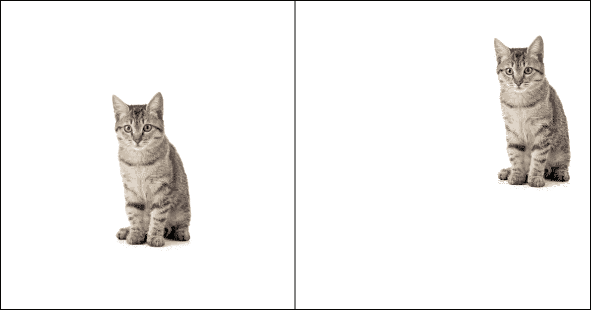

细胞神经网络的翻译等变性质的例子；识别猫的能力，不管图像如何移动。【我*作者法师(安东尼奥·格拉万提的猫——*Shutterstock.com)

*现在，当同样的物体以不同的比例出现在图像中会发生什么？比如猫会以不同的尺度出现会怎么样？普通的 CNN 还能认出这些猫吗？不幸的是，尽管细胞神经网络具有非常强大和有趣的特性，但它们并没有被设计成对输入的旋转和尺度变化都是等变的。这就成了一个问题，对吗？因为在现实生活应用中，这种类型的输入转换一直在发生，例如，想象一下由自动车辆处理的图像，所以无论行人可能出现的比例如何，都需要检测行人。*

*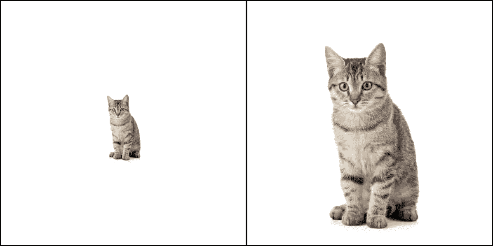*

*缩放对象的示例；CNN 并不是天生被设计成在不同的尺度上识别相同的物体。【我*作者法师(安东尼奥·格拉万提的猫——*Shutterstock.com)*

**那么……如何解决这个问题呢？2019 年，Ivan Sosnovik、michaszmaja 和 Arnold Smeulders 提出了一个非常有趣的解决方案。他们的团队发表了一篇名为“尺度等变可控网络”的论文，解决了这个问题。他们不仅解决了这个问题，还设法提供了一个计算成本相当高的“普通”CNN 解决方案，获得了 MNIST 和 STL-10 数据集的最新结果。因此，由于我们发现这篇论文非常有趣&激动人心，在接下来的章节中，我们分析了他们的贡献，提供了他们方法背后的一些直觉，最后但同样重要的是，展示了我们复制他们结果的尝试。**

# ****什么是尺度等方差？****

**如前所述，CNN 在计算机视觉任务中表现出色的一个最重要的原因是卷积层是平移等变的。这意味着，如果我们将输入图像移动( *x* '， *y* ')个像素，该层的输出也会移动。**

**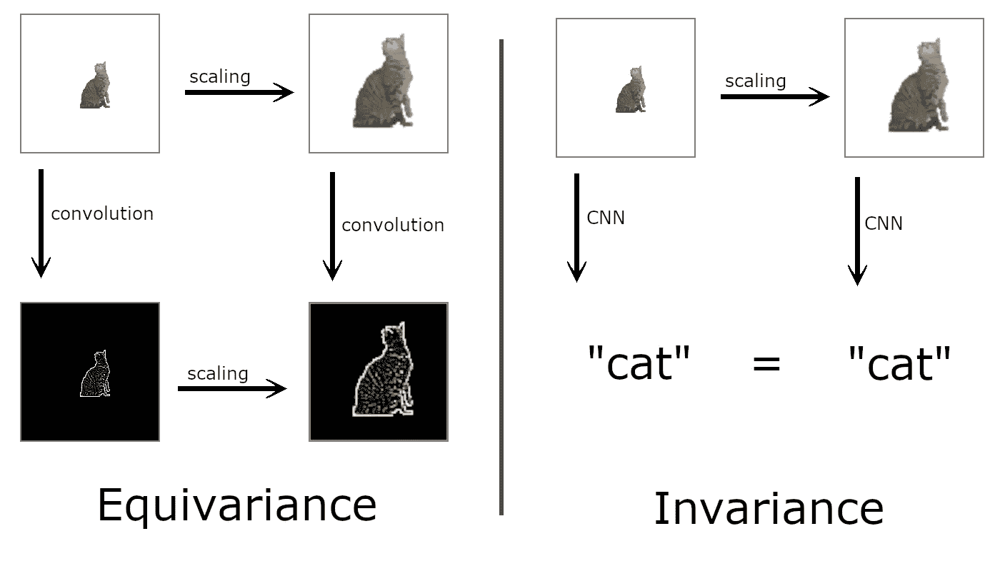**

**图 CNNs 翻译等方差属性的例子；识别猫的能力，不管图像如何移动。[图片由作者提供，灵感来自[来源](https://www.researchgate.net/publication/312023127_Rotation_equivariant_vector_field_networks)，猫来自 [STL-10](https://ai.stanford.edu/~acoates/stl10/) ]**

**等方差的一个特例是不变性。不变性意味着无论我们如何变换输入，输出都保持不变。CNN 中从等方差到不变性的转变发生在池层。例如，如果一个 3x3 池块中的最大值在中心，输入移位 1 不会改变该块的输出。然而，一个重要的注意事项必须作出，池只是准不变的，等方差是有限的边缘效应在细胞神经网络。现在，让我们想象一下缩放图像也是如此。如果输入图像被放大/缩小，输出也应该被放大/缩小。如前所述，我们知道，默认情况下，卷积层没有这个属性。为了解决这个问题，必须定义等尺度变化层。等尺度变化层将能够以与常规卷积层响应输入偏移相同的方式响应尺度差异。规模等方差来源于一个数学概念:组等方差。粗略地说，组等变变换意味着如果层的输入由 *g* 变换，则输出也由 *g* 变换。而 *g* 可以是任意同态，例如:平移、[旋转](https://arxiv.org/pdf/1602.07576.pdf)、[缩放](https://openreview.net/pdf?id=HJgpugrKPS)，或者这些的组合。通过设计*G*-等变层，我们可以以一种有意义的方式进一步增加重量分担。**

# **我们应该如何处理这个问题？**

## ****数学细节****

**读一次论文，我们看到 GitHub 库是公开的，我们很高兴我们可以窃取(我的意思是，重用)代码，并有一个免费的午餐…好吧，在这样做之前，让我们了解在数学和算法层面上发生了什么。
论文作者为 1 维信号定义了一切，随后是臭名昭著的“推广到更高维情况是直截了当的”。我们认为直观的解释不一定是一维的，但我们承诺保持低维数。**

**首先，让我们理解什么是方向可调滤波器:方向可调滤波器是一种内核，内核的尺度可以通过一个参数很容易地改变。论文给出的数学定义是:**

**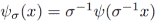**

**内部的 *σ* ⁻是缩放滤波器，而外部的 *σ* ⁻是归一化滤波器。这样，我们可以通过参数 *σ* 来重新调整任意的 *ψ* ( *x* )滤波器。下图提供了一些直观的图像:**

**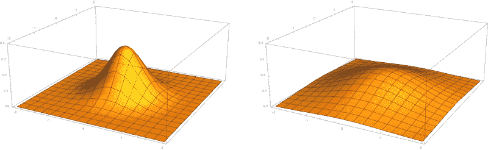**

**同样的 *ψ* (x，y)高斯 2D 滤波器，左边的*= 0.5，右边的*= 1。【我*法师作者】*****

**我们要了解的第二件事是规模翻译组。该组由 *H* 表示，并被定义为缩放操作后跟随平移操作。它由两个子组组成，即 *S* 和 *T* 。**

**缩放组由 *S* 表示。群组运算是缩放，其表示为乘以 *s* ，元素 *s* 的逆是 *s* ⁻ =1/s。单位元素是 s * 1/s = 1
然而， *s* 被定义为离散的缩放群组(在哈尔积分中在数学上更易于管理)，由元素[*a*⁻、 *a* ⁻、1 在那种情况下，*一* ⁿ的逆就是*一* ⁻ⁿ.**

**平移组由 *T* 表示。分组操作明显是翻译，表现为添加 *t* 。 *t* 的元素的逆是- *t* 。单位元素是 *t* +(- *t* )=0。平移组保持连续，而不是被离散化为 1 个像素的倍数，因为 *T* 上的连续卷积在数学上被很好地定义(并且可以随后缩放)。**

**为了执行分组操作(即缩放或加法)，我们必须通过分组操作将分组元素应用于输入函数的变量(即分别乘以或加到 *x* )。这两组的一个很好的性质是它们的半直积很容易定义。直积是笛卡儿积的群论等价物；半直积只是直积的推广。这个操作可以想象成两个向量的外积。形式上的定义是 *H* ={( *s* ， *t* ) ∣ *s* ∈ *S* ， *t* ∈ *T* }，意思是变换 *h* 是缩放 *s* 后跟平移 *t* 。分组操作是( *s* ₂， *t* ₂)⋅( *s* ₁，*t*₁)=(*s*₂*s*₁，*s*₂*t*₁+*t*。变换方程( *s* ₂， *t* ₂)⁻ ⋅( *s* ₁，*t*₁)=(*s*₂⁻*s*₁，*s*₂⁻(*t*₁-*t*833))我们可以求出逆元素，即(*s*833)单位元素是(1，0)。**

**通过定义群 *H* ，我们将寻找尺度等变卷积的问题转化为寻找群等变卷积的问题。我们把这个问题从一个具体问题转化为一个一般问题，希望能找到解决的办法。幸运的是，我们按照论文的[引文](https://sv.20file.org/up1/1415_0.pdf)找到了群等变卷积的定义:**

**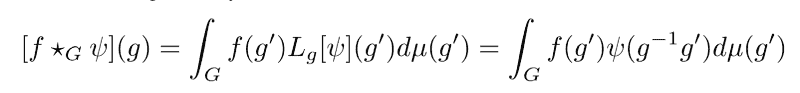**

**数学细节高得惊人，因为多维微积分和群论是了解正在发生的事情的最低要求。因此，我们不建议查找它们，但是，如果你选择这样做，我们发现[这个](https://en.wikipedia.org/wiki/Haar_measure)、[这个](https://math.stackexchange.com/questions/494225/what-is-haar-measure)和[这个](https://projecteuclid.org/ebook/Download?urlid=10.1214%2Fcbms%2F1462061031&isFullBook=False)是一个很好的额外来源。
在组等变卷积*f*(*g’*)中，表示我们的输入信号，其对应于图像，或后面层的尺度等变输入。
*lᵍ*[*ψ]*(*g '*)，(或*ψ*(*g*⁻*g '*)变换后)为滤波器， *μ* ( *g* ')表示哈尔测度。经过一系列的数学变换，我们得出:**

**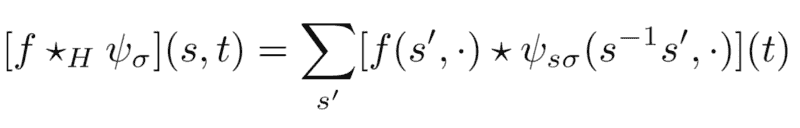**

**我们还没有谈到的一件事是渠道。常规卷积层对输入通道求和，每个输入-输出通道对有不同的滤波器。然后，让我们的公式做完全相同的事情。在下面的等式中， *C* ᵢₙ和 *C* ₒᵤₜ分别是输入和输出通道的数量。**

****

## ****算法****

**前面提到的等式不能直接用代码实现。首先，在滤波器 *ψ* 中，*S*-群是无限的；这需要进一步限制。设 *N* ₛ(后来也表示为 *S* )为这个极限，那么组 *S* 就变成了【a，a⁻₁，…，a^ *N* ₛ].其次，因为输入图像是在ℤ而不是在ℝ上定义的，所以组 *T* 必须被离散化。**

**按照作者的选择，不是将内核中的每个像素定义为一个权重，而是将每个滤波器组成为一个完整基的线性组合。当以这种方式构造函数时，基的维数通常是无限的(例如泰勒级数或傅立叶级数)。因此，我们将算法限制为具有 *Nb* 维度基础。这样，我们可以将网络的权重设置为线性组合的系数。数学上来说:ψ=∑ᵢ wᵢ ψᵢ，其中 wᵢ是一个重量，ψᵢ是一个基本向量。在这个技巧之后，我们可以实现神奇的等变卷积。**

***注 1* :根据该论文，具有 2D 高斯包络的 2D 埃尔米特多项式的基足够好
*注 2:* 这样，特别是在较大的滤波器尺寸下，加强了权重共享。例如，具有 4 阶 hermite 多项式的 7×7 卷积核只需要 10 个参数，而不是常规的 49 个。虽然我们无法从逻辑上推理这种重量共享是否有意义，但我们的直觉告诉我们，它有意义；这种额外的重量分担可能是与等比例变化层一起增加精度的另一个来源。**

**现在，讨论实现，对于每个滤波器，我们有一个长度为 *Nb* (线性组合的系数)的权重向量，以及形状为[ *Nb* ， *S* ， *V* ， *V* ]的预缩放滤波器基，其中 *Nb* 是基数， *S* 是缩放数， *V***

**当我们有每一个 *C* ₒᵤₜ — *C* ᵢₙ对时，如果权重张量的形状为[ *C* ₒᵤₜ、 *C* ᵢₙ、 *Nb* ]，乘以形状的预先计算的基[ *Nb* 、 *S* 、 *V* 、 *V* ，这可以有效地实现。对于乘法，我们在 *Nb* 维度上求和。例如，通过使用以下函数:**

```
**torch.einsum(‘ijk, klmn -> ijlmn’), weights, bases)**
```

**对于该操作的输出，我们将具有形状为
*c*ₒᵤₜ、 *C* ᵢₙ、 *S* 、 *V* 、 *V* 的滤波器，记为κ。下图显示了这一点:**

**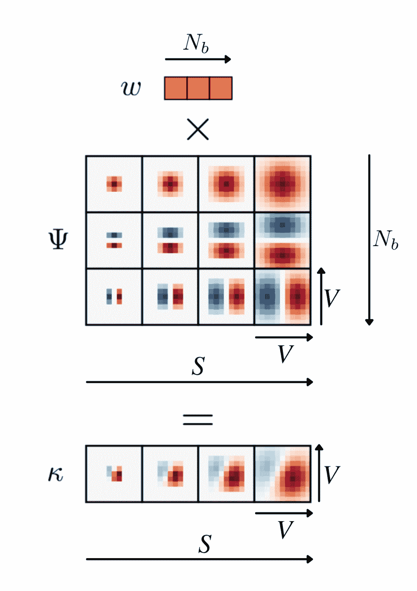**

**单个 *C* ₒᵤₜ→ *C* ᵢₙ通道的滤波器基础的可视化。[图片改编自[论文](https://openreview.net/pdf?id=HJgpugrKPS)**

**使用尺度平移不变卷积的方程，我们可以定义两种情况。我们试图遵循作者的注释:当层的输入具有 1 的尺度维度(也称为“图像”)并且过滤器具有多个尺度维度时，我们称为 *T* → *H* ，并且当层的输入和过滤器都具有多个尺度维度时，我们称为 *H* → *H* 。**

**在 *T* → *H* 的情况下，提到了“S 个简并子上的求和”。我们觉得这条线有点太模糊，因此，我们提供了另一种解释:对于尺度维度中的每个 *s* ，我们在κ[:，:， *s* ，:，:]和输入图像之间执行常规卷积。卷积的结果存储为图像阵列，从而产生从组 *T* 到 *H* 的操作。为了利用已经优化的 PyTorch 库，可以用以下形式实现 *T* → *H***

```
**convTH(f, w, ψ) = squeeze(conv2d(f, expand(w × ψ)))**
```

**在这种情况下，输入κ滤波器从[ *C* ₒᵤₜ、 *C* ᵢₙ、 *S* 、 *V* 、 *V* ]$的形状扩展为[ *C* ₒᵤₜ *S* 、 *C* ᵢₙ、 *V* 、 *V* 。此后，将扩展的滤波器基与输入图像(具有[ *C* ᵢₙ， *U* ， *U* ]的形状，其中 *U* 是图像的大小)进行卷积。这个卷积的输出产生了一个形状为[ *C* ₒᵤₜ *S* ， *U* ， *U* ]的张量，它压缩了维度[ *C* ₒᵤₜ， *S* ， *U* ， *U* ]。虽然我们已经从头实现了这一层，但是我们还没有使用它；由于时间限制，我们被迫选择另一种方法，以满足项目的最后期限。**

***注 1* :对于展开κ的形状，文中定义了尺寸
[ *C* ₒᵤₜ， *C* ᵢₙ *S* ， *V* ， *V* 而不是 *C* ₒᵤₜ *S* ， *C 我们认为作者在这里犯了一个相当痛苦的错别字。
*注 2* :输入图像的大小为[ *U* ， *U* ]，因为用于基准测试的数据集使用的是正方形图像。没有任何东西限制它具有[ *U* ₁， *U* ₂]的形状，但是我们决定遵循作者的符号。
*注 3* :应用卷积时，输出并不总是具有[ *U* ， *U* ]的大小，它以正常方式通过填充、内核大小和步幅进行修改。***

**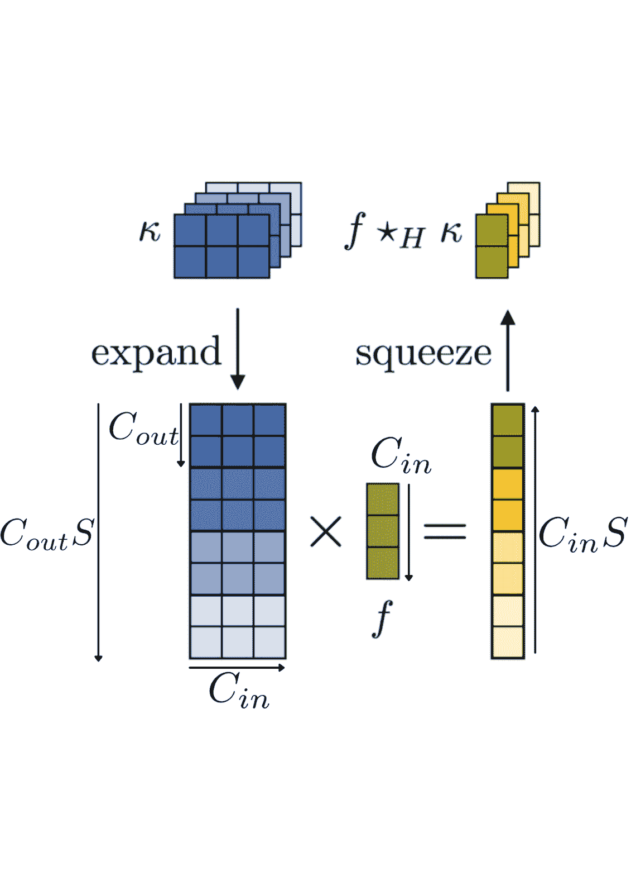**

**卷积的可视化 *T* → *H* 。为了简单起见，隐藏了空间组件。[图片改编自[论文](https://openreview.net/pdf?id=HJgpugrKPS)**

***H* → *H* 的情况可以想象成在 *x* 、 *y* 、 *s* 方向做卷积，其中方向 *s* 指的是尺度间相互作用。然而，由于这将进一步扩展数学表述，我们愿意认为我们已经为 *T* → *H* 提供了足够的直觉，以便人们能够自己理解 *H* → *H* 。**

# **数据预处理和扩充**

**关于手传实验，我们必须处理和扩充两个数据集的数据，即 [MNIST](http://yann.lecun.com/exdb/mnist/) 和 STL-10。对于每一个，正如本文中提到的，我们都遵循了特定的步骤。**

## ****MNIST****

**我们使用 0.3-1 之间的均匀采样因子重新缩放了 [MNIST](http://yann.lecun.com/exdb/mnist/) 图像，并用零填充图像以保持初始图像的分辨率。**

**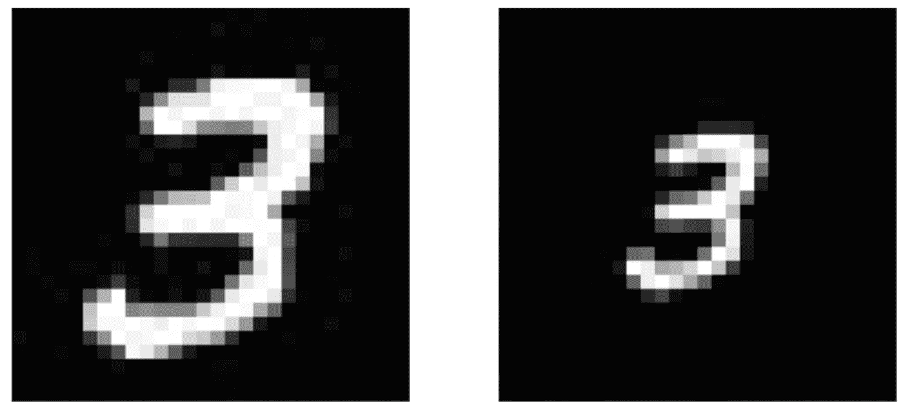**

**重新缩放 MNIST 图像的示例。【我*法师作者】***

**此外，我们生成了该数据集的 6 个实现。培训 10.000，测评 2.000，测试 48.000。**

## ****STL-10****

**类似地，对于 [STL-10](https://ai.stanford.edu/~acoates/stl10/) 数据集，我们按照论文的说明为实验准备数据。我们将图像归一化，减去每个通道的平均值，除以每个通道的标准偏差，通过应用 12 像素零填充和随机裁剪回 96x96px 尺寸来增强。此外，我们使用了水平随机翻转(50%的概率)和 32 像素的 1 孔剪切。**

**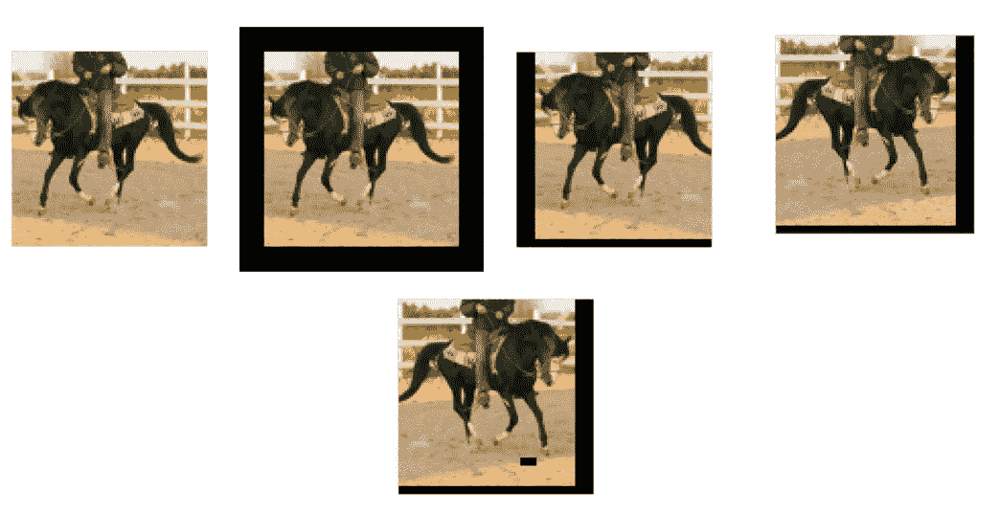**

**STL-10 图象的数据处理。【我*法师作者】***

**运行[代码](https://github.com/vioSpark/reproduction-project-DL2021)，我们能够为 MNIST 数据集复制实验。虽然 STL-10 的代码是可用的，但我们无法复制结果，因为我们没有足够的计算资源来进行实验。在复制了修改后的 MNIST 数据集(在上一节中介绍)后，我们能够重现结果。这些有点类似，差别不大。**

**对于 MNIST 数据集，我们在以下模型上运行了实验:
mnist _ ses _ scalar _ 28
mnist _ ses _ scalar _ 56
mnist _ ses _ vector _ 28
mnist _ ses _ vector _ 56
mnist _ ses _ scalar _ 28p
mnist _ ses _ scalar _ 56p
mnist _ ses _ vector _ 28p
mnist _ ses _ vector _ 56p**

**复制修改后的 MNIST 数据集后，我们能够重现结果。对于上一节底部提到的每个模型，进行了两个实验:一个实验的比例因子设置为 1，另一个实验的比例因子设置为 0.5。因此，对于每个模型，我们获得了 12 个结果(每个实现 6 个)。结果存储在“results.yml”中，并使用我们编写的 python 脚本进行进一步处理。我们复制了与作者相似的结果。结果显示在下表中。**

**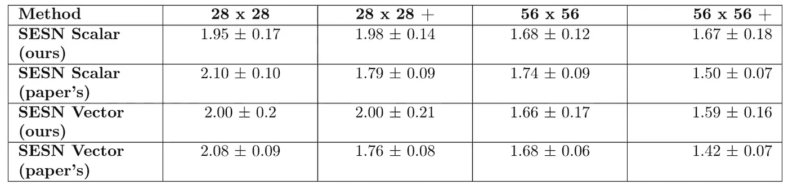**

**MNIST 数据集的重复结果。“+”表示缩放数据扩充。**

**作者定义的 STL10 模型有 11M 个参数。我们试图以更小的批量运行这些模型(以适应我们 12GB 的 GPU 限制)，但是为了重现有意义的结果，模型训练得太慢了。后来，这些没有包括在内。**

# **结论**

**通过阅读本文，我们希望你现在能更好地理解什么是等尺度方差，以及为什么设计等尺度方差 CNN 是有价值的。虽然乍一看，这篇论文看起来真的“数学化”，但我们可以说，在花了无数时间在维基百科的文章上试图扩展我们在群论方面的知识后，我们有点理解作者的意图了。我们认为*G*–等变卷积(如 scale–等变)是细胞神经网络的一个有前途的方向，因为它们的适用性是不可否认的。总之，对于这个项目，我们重现了数据扩充步骤，重新运行了 MNIST 实验，并产生了准等效的结果。我们试图运行 STL–10 实验，但是计算资源的缺乏战胜了我们。我们试图实现这些层本身，尽管我们无法测试它，我们相信我们已经成功地实现了 T→H 层，但是剩下的时间不够了。**

## **感谢**

**这个博客是在代尔夫特大学 CS4240 深度学习课程的背景下创建的，作为一个小组项目。
我们要感谢讷计斯·托曼和托马什·莫蒂卡的建议和有益的见解。**

**有用链接:
链接到[原创论文](https://arxiv.org/abs/1910.11093)
链接到这个[项目的网站](https://spetrescu.github.io/sesn-reproducibility-project/)
链接到[我们的 *GitHub* 资源库](https://github.com/vioSpark/reproduction-project-DL2021)**

***作者:* **马克·卢卡奇** [*吉图布*](https://github.com/vioSpark) **斯蒂芬·彼得雷斯库** [*吉图布*](https://github.com/spetrescu)**

*****如果你喜欢这篇文章，别忘了分享！*****