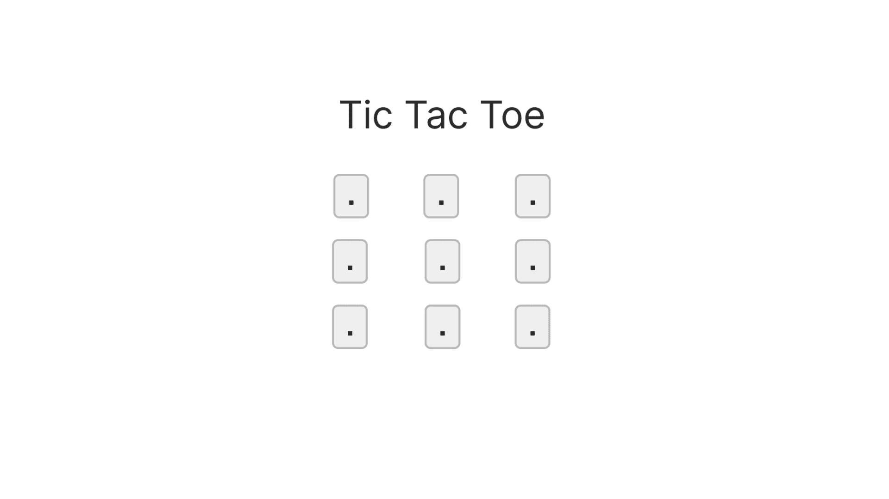
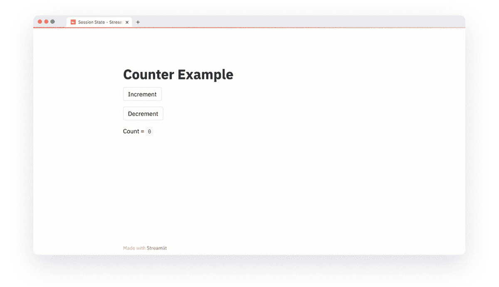
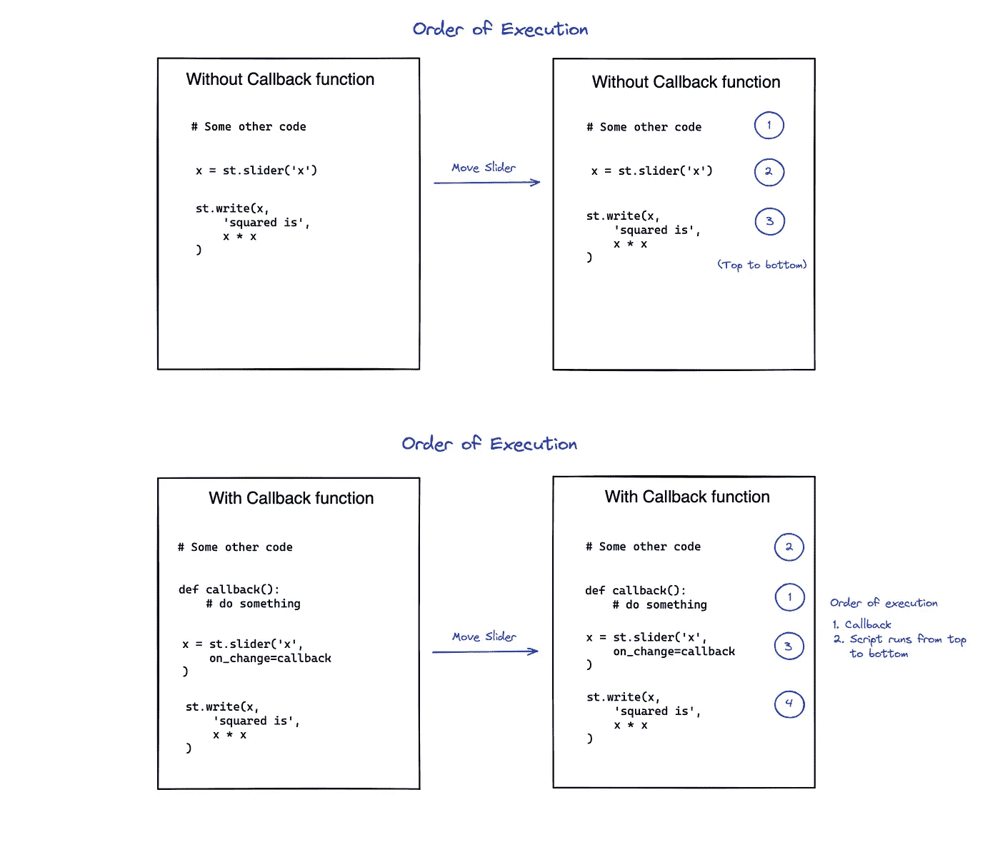
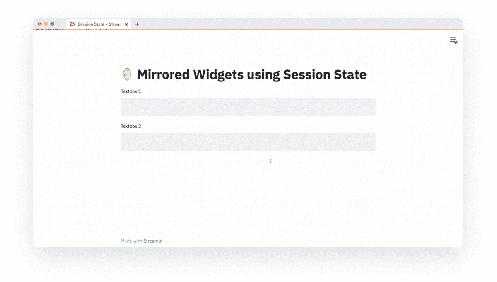

# Streamlit 的会话状态

> 原文：<https://towardsdatascience.com/session-state-for-streamlit-dc9ea1685ea?source=collection_archive---------20----------------------->

## 现在，您可以在应用程序交互和重新运行之间存储信息



(图片由作者提供)

在 2019 年推出 Streamlit 后不久，社区就开始寻求为他们的应用程序添加状态的方法。针对[会话状态](https://gist.github.com/tvst/036da038ab3e999a64497f42de966a92)的黑客攻击自 2019 年 10 月就已经出现，但我们希望建立一个优雅的解决方案，你可以用几行代码直观地将其编入应用程序。今天我们很高兴发布它！

现在，您可以使用会话状态来跨重新运行存储变量，在输入小部件上创建事件，并使用回调函数来处理事件。这一强大的功能有助于创建能够:

*   执行数据/图像注释
*   支持分页
*   添加依赖于其他小部件的小部件
*   构建简单的有状态游戏，如战舰，井字游戏等。
*   更多——所有这一切都是通过编写 Python 脚本的应用程序来实现的！

💡如果你想直接进入，请查看我们的[演示](https://share.streamlit.io/streamlit/release-demos/0.84/0.84/streamlit_app.py?page=headliner)来看看上面的一些应用程序的运行情况，或者前往[文档](https://docs.streamlit.io/en/stable/add_state_app.html)获取更多关于开始的详细信息。

# 向您的应用程序添加状态

在 Streamlit 中，与小部件交互会触发一次重新运行，代码中定义的变量会在每次重新运行后重新初始化。但是有了会话状态，当你不希望你的变量被重新初始化的时候，有可能在那些实例的重新运行中保持值。

例如，这里有一个简单的计数器，它在多次按下增量按钮时保持一个计数值。每次按下按钮都会触发一次重新运行，但在重新运行过程中，计数值会保留并递增(或递减):



(图片由作者提供)

💡为了继续构建这个例子，请跟随我们的[主题指南:向您的应用程序添加状态](https://docs.streamlit.io/en/stable/add_state_app.html)🤓

上面展示了一个基本的例子，说明了值是如何在重新运行时保持不变的，但是让我们继续看一些更复杂的东西！

# 回调函数和会话状态 API

作为此次发布的一部分，我们将在 Streamlit 中启动回调。回调可以使用`on_change`参数作为参数传递给像`st.button`或`st.slider`这样的小部件。

💡好奇什么是回调？维基百科说得好:“*回调，也称为“call-after”函数，是作为参数传递给其他代码的任何可执行代码；其他代码应该在给定的时间回调(执行)参数。如果你想了解更多，这里有一个链接。*

使用会话状态，与小部件更改相关联的事件或与按钮按压相关联的单击事件可以由回调函数来处理。记住以下执行顺序很重要:



(图片由作者提供)

**执行顺序:**如果一个回调函数与一个窗口小部件相关联，那么窗口小部件中的一个变化触发以下顺序:首先执行回调函数，然后应用程序从上到下执行。

这里有一个例子:



(图片由作者提供)

在上面，我们展示了回调和会话状态的使用。我们还展示了一个高级概念，其中会话状态可以使用`key`参数与小部件状态相关联。

要了解更多信息，请查看会话状态文档中的[高级概念部分](https://docs.streamlit.io/en/stable/add_state_app.html#advanced-concepts)，要详细查看 API，请访问[状态 API 文档](https://docs.streamlit.io/en/stable/session_state_api.html)。

# 包扎

这就是对会话状态的介绍，但我们希望这不是对话的结束！我们很高兴看到您将如何使用这些新功能，并且 state 将为社区解锁所有新功能。

要开始使用，请升级到最新版本，以便在您的应用中使用`st.session_state`和`callbacks`:

```
pip install --upgrade streamlit
```

如果你对这些有任何疑问(或者对 Streamlit 有任何疑问)，请在下面的评论中或者在论坛上告诉我们。一定要来论坛或推特分享你做的所有酷的东西！🎈

# 资源

*   [会话状态主题指南](https://docs.streamlit.io/en/stable/add_state_app.html)
*   [会话状态 API 引用](https://docs.streamlit.io/en/stable/session_state_api.html)
*   [会话状态演示 App](https://share.streamlit.io/streamlit/release-demos/0.84/0.84/streamlit_app.py?page=headliner)
*   [Github](https://github.com/streamlit/streamlit)
*   [论坛](https://discuss.streamlit.io/)

*原载于 2021 年 7 月 1 日*[*https://blog . streamlit . io*](https://blog.streamlit.io/session-state-for-streamlit/)*。*