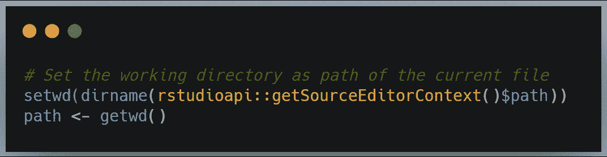
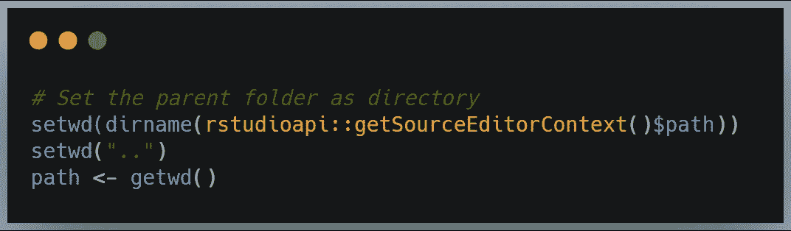
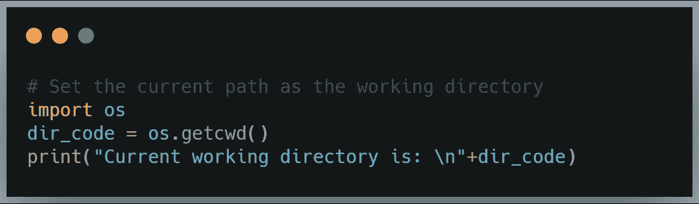
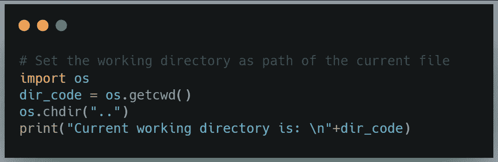
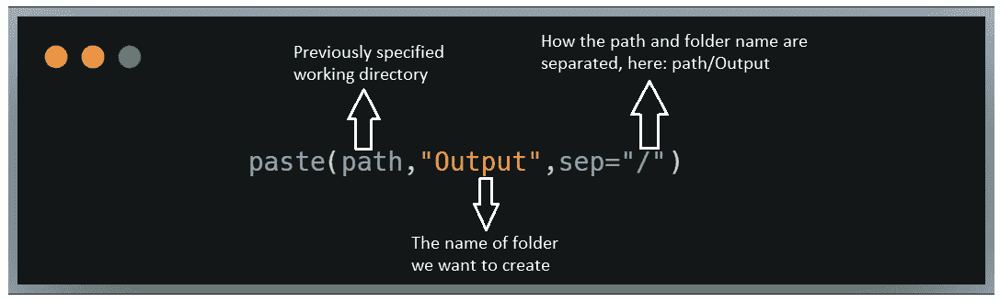
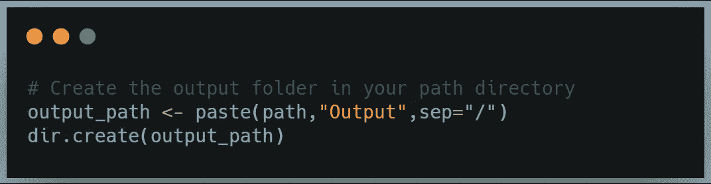
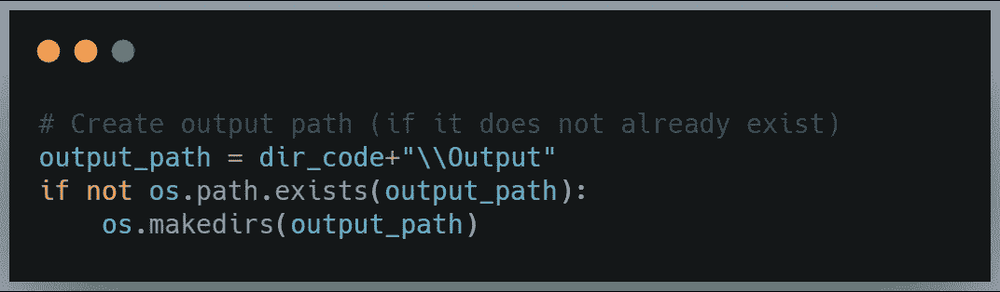

# 如何启动 R/Python 代码让同事心存感激

> 原文：<https://towardsdatascience.com/set-path-automatically-r-python-4dbc4963321e?source=collection_archive---------25----------------------->

## 设置路径和创建输出文件夹的自动化方式

作者图片

在学术界，我的代码曾经是我的。我们讨论了实验和数据分析的方法。试图理解其背后的结果和现象花了我们很长时间。但是我不需要分享我的代码。当我进入金融市场时，事情发生了变化。

编写无论保存在哪里都可以运行的代码变得至关重要。共享驱动器或文件夹名称的映射可能会有所不同，但代码应该仍然可以正常运行。它节省时间和挫折。幸运的是，很少几行代码可以做到这一点！

在本文中，我们将浏览代码的两个方便的部分(对于 R 和 Python*):

1.  如何自动设置工作目录？无论您或您的同事将文件保存在哪里，它都能运行代码。
2.  如何直接从代码中创建输出文件夹？您不必在代码之外搜索文件夹。

*我使用 RStudio 和 Jupyter 笔记本。

我们走吧！

# **1。设置您的工作目录并运行代码，无论您将它保存在哪里**

代码要求在开头设置路径。但是您很忙，有许多打开的项目，并且不记得在哪里保存了代码。因此，让您的代码为您检查路径，并将其用作工作目录。下面几行代码将帮助你做到这一点。

## **R 代码**

r 总是指计算机上的一个目录。为了读取当前工作目录，我们使用两个主要函数:

*   **setwd** (dir) =设置工作目录。您可以使用特定的路径，例如 C:/Users/Aga/R。这意味着当您想要更改文件夹时，需要手动更新路径。自动化会更容易。可以用下面的代码来实现:*setwd(dirname(rstudioapi::getSourceEditorContext()$ path))*。请注意，您必须先保存 R 代码。
*   **getwd** () =获取工作目录。这个函数读取当前目录。它没有参数，所以使用之前在 setwd()函数中指定的路径。

看看它在代码中的样子:

r:将当前路径设置为工作目录

如果要将父文件夹设置为路径，可以使用 *setwd(* " . " *):*

r:将父文件夹路径设置为工作目录

## **Python 代码**

Python 允许读取文件的目录，并将其设置为工作目录。我们需要 *os* 库来做这件事，所以我们在下面的第一行中导入它。

在第二行中，我们使用了 **os.getcwd()** 函数，意思是“获取当前工作目录”。这个函数没有参数，它只是检查当前路径。我们将这个目录分配给变量 *dir_code* 。因此，我们可以在第三行打印路径，以检查我们是否在我们希望的地方。

Python:将当前路径设置为工作目录

如果我们想将父文件夹设置为工作目录，我们可以使用 *os.chdir(* )。*)、*这相当于*的 setwd* (“.”)在 r。

Python:将父文件夹路径设置为工作目录

无论您如何映射您的驱动器，代码都已准备好运行！如此简单，如此省时，对你的同事如此有帮助。

# **2。**创建一个新文件夹来保存结果，并轻松地保持您的输出有序

直接从代码创建新文件夹比手动检查文件夹更容易。下面，你可以看到它是如何工作的。

## **R 代码**

首先，我们必须为输出文件夹指定一个新路径。我们可以通过使用*paste()*函数来实现。这是一个有用的函数，它将我们想要连接的术语和分隔符作为参数:

然后，我们可以使用 *dir.create()* 函数创建输出路径:

r:在您的路径目录中创建输出文件夹

这些都在这里了！我们继续学习 Python。

## **Python 代码**

与 R 不同，Python 不需要任何特定的函数来连接先前指定的路径和新的文件夹名。如第一行所示，加号很好地完成了这项工作。

然后，我们使用 *os.path.exists()检查我们的新文件夹是否已经存在。如果不是*，使用 *os.makedirs()* 创建它。您可以查看下面的代码:

Python:创建输出路径(如果尚不存在)

现在，我们已经准备好开始编码并分享它，没有任何路径问题！

# 感谢阅读！

我们讨论了用 R 和 Python 启动代码的简单但有用的方法。我希望你在日常工作中找到一些有趣的东西。

我很想在下面的评论区看到你最喜欢的简单函数！如果你喜欢直接联系我，请随时通过 akujawska@yahoo.com 的 LinkedIn 联系我。不久后见！

您可能还喜欢:

 [## 数据科学访谈中的统计时刻

### 数据科学家的基本数学从零开始解释

towardsdatascience.com](/statistical-moments-in-data-science-interviews-bfecd207843d)  [## 数据科学访谈中的矩阵

### 数据科学家的基本数学从零开始解释

towardsdatascience.com](/math-refresher-for-data-scientist-part-1-matrices-88620a92d046)