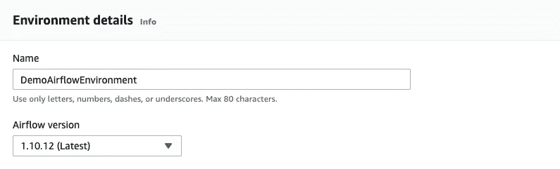
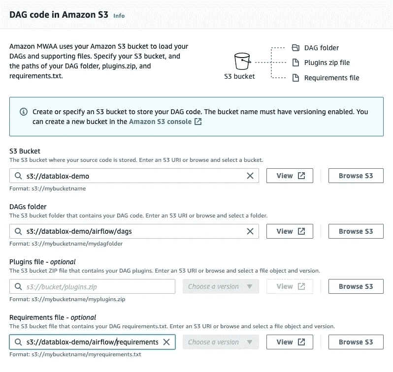
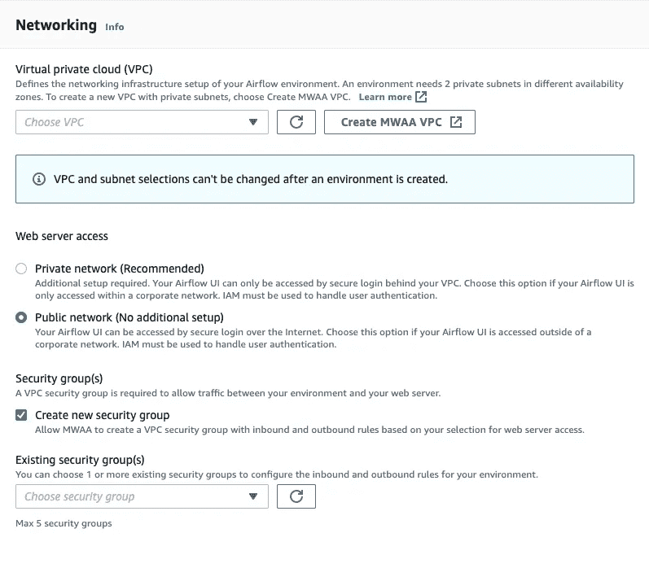
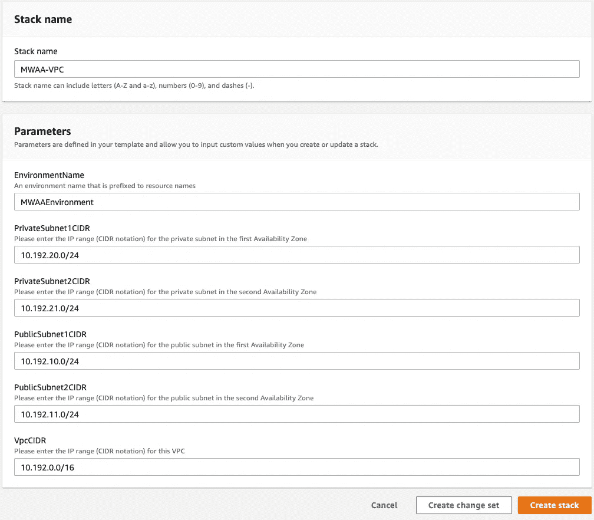
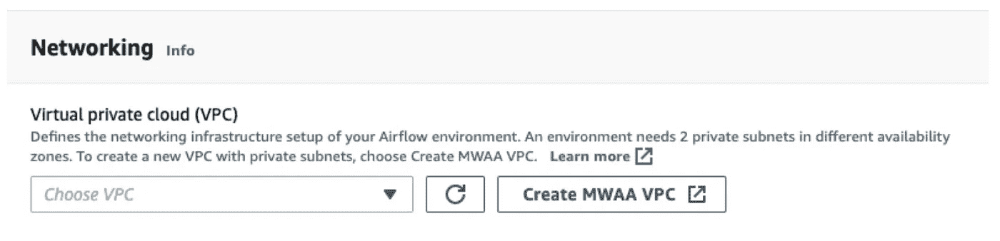
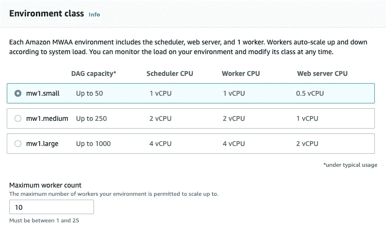
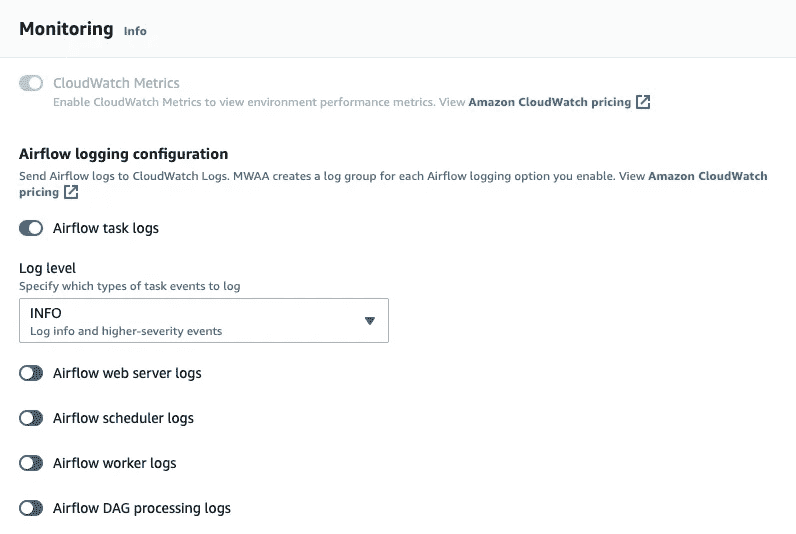
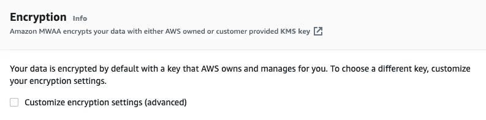
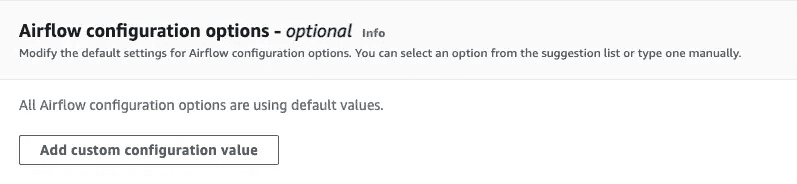
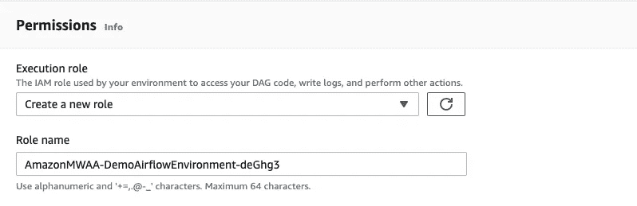

# 在几分钟内设置好 AWS 上的气流环境

> 原文：<https://towardsdatascience.com/set-up-an-airflow-environment-on-aws-in-minutes-f934cf10ec54?source=collection_archive---------10----------------------->

## Amazon Managed Apache Airflow 入门

[Apache Airflow](https://airflow.apache.org/) 是一个强大的平台，用于调度和监控数据管道、机器学习工作流和 DevOps 部署。在这篇文章中，我们将介绍如何在 AWS 上建立一个气流环境，并开始在云端调度工作流。


由 [Ashkan Forouzani](https://unsplash.com/@ashkfor121?utm_source=medium&utm_medium=referral) 在 [Unsplash](https://unsplash.com?utm_source=medium&utm_medium=referral) 上拍摄

这是**调度机器学习工作流系列的第一部分。** Airflow 允许您安排数据提取，并提供工程管道、模型培训、模型部署等功能。本教程中的内容适用于任何想要学习如何在亚马逊气流环境中**创建、调度和监控**他们的**生产工作流程**的人——不仅仅是机器学习工程师。

1.  在 AWS 上设置一个气流环境(这篇文章)
2.  *更多即将推出……*

# 动机

无论你是有志于从事工程或数据科学职业，编程处理数据和构建系统以在下游消费数据(例如机器学习模型)的技能组合可能对你的成功至关重要。这些技能如此抢手是有原因的。

## 为什么是气流？

Airflow 是编排 ETL 作业、机器学习管道和 DevOps 部署最常用的工具之一。

当我第一次开始机器学习时，我对工作流的(不)管理让我今天畏缩不前。在我自己的环境中，我在一台大型本地计算机上使用 cron 安排了作业。当我的作业失败时，没有警报，也没有 UI 来监控进度—我必须每天手动检查日志！当我在度假的时候，我的同事就经历了这种残酷的过程。

气流使您的工作流程更加透明。您可以在 UI 中跟踪作业进度，并在出现故障时轻松配置警报。团队可以轻松共享一个气流环境，因此您不需要总是随叫随到。

## 亚马逊为什么要管理气流？

直到最近，创造和维持一个气流环境还是相当复杂的，即使对于有经验的工程师来说也是如此。Airflow 平台包括一个前端 web 服务器、一个调度服务、执行器和一个后端数据库——所有这些都必须进行配置。最重要的是，气流必须与其他服务连接，如亚马逊 [EMR](/getting-started-with-pyspark-on-amazon-emr-c85154b6b921) 和 S3，以便在你的管道中利用它们。

当我第一次开始使用 Airflow 时，我天真地试图支持我自己的实现(这是一场灾难)。我很快意识到，控制气流才是出路。

在亚马逊推出 Apache Airflow 托管工作流之前，该领域还有其他一些选择。然而，有了 Amazon，您可以将工作流管理解决方案与 AWS 上的其他资源无缝集成。此外，AWS 不会很快消失，所以你不必担心你的管道管理系统的稳定性取决于另一家公司是否继续运营。如果你有兴趣学习如何建立一个气流环境来帮助你找到工作，对我来说，AWS 是开始的地方。使用 AWS 的公司比任何其他云提供商都多。

亚马逊帮助你保持你的气流版本最新。次要版本更新和修补程序会自动处理，并允许您计划主要更新。

# 我们开始吧

*警告:创造一个可控的气流环境需要资金。如果您只是为了自己的教育而这样做，我建议您设置环境，加载并运行您的 Dag，然后删除您的资源。查看更多关于定价* [*此处*](https://aws.amazon.com/managed-workflows-for-apache-airflow/pricing/) *。*

## 步伐

*   AWS 帐户设置。
*   创建一个测试 DAG 并将其上传到 S3。
*   编写一个 requirements.txt 文件，在您的环境中包含开源包。
*   在 AWS 控制台中创建一个气流环境。
*   访问气流用户界面。

## AWS 帐户设置

首先，如果你还没有 AWS 账户，你需要一个。完成本教程中的第一步和第四步，使用 IAM 管理员用户和 S3 桶设置您的帐户。

## 创建测试 DAG

让我们创建一个简单的气流 DAG，在我们即将创建的环境中进行测试。

```
# test_dag.py# This code borrows heavily from [https://airflow.apache.org/docs/apache-airflow/stable/tutorial.html](https://airflow.apache.org/docs/apache-airflow/stable/tutorial.html)from datetime import timedelta
import loggingfrom airflow import DAG
from airflow.operators.python_operator import PythonOperator
from airflow.utils.dates import days_agodefault_args = {
    'owner': 'airflow',
    'depends_on_past': False,
    'email': ['[brent@brentlemieux.com](mailto:brent@brentlemieux.com)'],
    'email_on_failure': True,
    'email_on_retry': False,
    'retries': 1,
    'retry_delay': timedelta(minutes=5),
}dag = DAG(
    'simple_demo',
    default_args=default_args,
    description='A simple DAG with a few Python tasks.',
    schedule_interval=timedelta(days=1),
    start_date=days_ago(2),
    tags=['example'],
)### PYTHON FUNCTIONS
def log_context(**kwargs):
    for key, value in kwargs.items():
        logging.info(f"Context key {key} = {value}")def compute_product(a=None, b=None):
    logging.info(f"Inputs: a={a}, b={b}")
    if a == None or b == None:
        return None
    return a * b### OPERATORS
t1 = PythonOperator(
    task_id="task1",
    python_callable=log_context,
    dag=dag
)t2 = PythonOperator(
    task_id="task2",
    python_callable=compute_product,
    op_kwargs={'a': 3, 'b': 5},
    dag=dag
)t1 >> t2
```

我们需要上传这个 DAG 到我们的 S3 桶。这在 AWS 控制台中很容易做到——只需在控制台中搜索 S3，导航到您想要上传的文件夹，然后单击`Upload`。或者，您可以[使用 AWS CLI](https://docs.aws.amazon.com/cli/latest/userguide/cli-services-s3-commands.html) 上传您的 DAG。

让我们在我们的 bucket 中创建这个路径，并将我们的测试 DAG 上传到这里:`s3://<your-bucket>/airflow/dags/<your-dag.py>`。

## 为气流环境配置开源包

接下来，我们将创建一个`requirements.txt`文件，其中我们将指定我们希望安装在我们的环境中的开源包。

```
# requirements.txt example
apache-airflow[amazon]==1.10.12
boto3==1.17.44
```

将您的需求文件上传到您的 S3 存储桶，位置如下:`s3://<your-bucket>/airflow/requirements.txt`。

## 创造气流环境

现在我们准备好创建我们的环境了！

1.  导航到 AWS 控制台中的`Managed Apache Airflow`，点击`Create environment`。

2.命名您的环境并选择您的 Airflow 版本(我建议您选择最新版本)。



3.添加您的 S3 桶、DAGs 路径和 requirements.txt 路径，然后单击`Next`。



4.将网络服务器访问设置为`Public network`并检查`Create new security group`。接下来，点击`Create MWAA VPC`。



5.在 CloudFormation 模板中，保留默认值并单击`Create stack`。



6.您需要等待几分钟来创建您的 VPC，然后选择您的新 VPC。



7.选择您的环境类别。我建议选择`mw1.small`，如果需要的话，从那里开始扩展。



8.配置您的监控、加密和气流配置选项—如果您不知道该选择什么，请暂时保留默认值。



9.除非您知道您需要什么权限，否则选择选项`Create a new role`，AWS 将为您创建一个具有必要权限的角色。



10.点击`Next`，检查您的选择，然后点击`Create environment`！启动您的环境需要 20–30 分钟。

## 访问气流用户界面

一旦您的环境准备就绪，只需点击`Open Airflow UI`即可开始运行！

# 下一个

现在您已经知道如何设置气流集群，尝试在[创建更多气流 Dag](https://airflow.apache.org/docs/apache-airflow/stable/tutorial.html)并在您的环境中测试它们。在不久的将来，我将创建更多的气流教程，涵盖的主题有[在亚马逊 EMR](/production-data-processing-with-apache-spark-96a58dfd3fe7) 中运行 Spark 作业。

# 取得联系

感谢您的阅读！请让我知道你是否喜欢这篇文章，或者你是否有任何批评。如果你觉得这个指南有用，一定要关注我，这样你就不会错过我以后的文章。

如果你在一个数据项目上需要帮助或者想打声招呼，**在** [**LinkedIn**](https://www.linkedin.com/in/brent-lemieux/?source=post_page---------------------------) 上联系我。干杯！