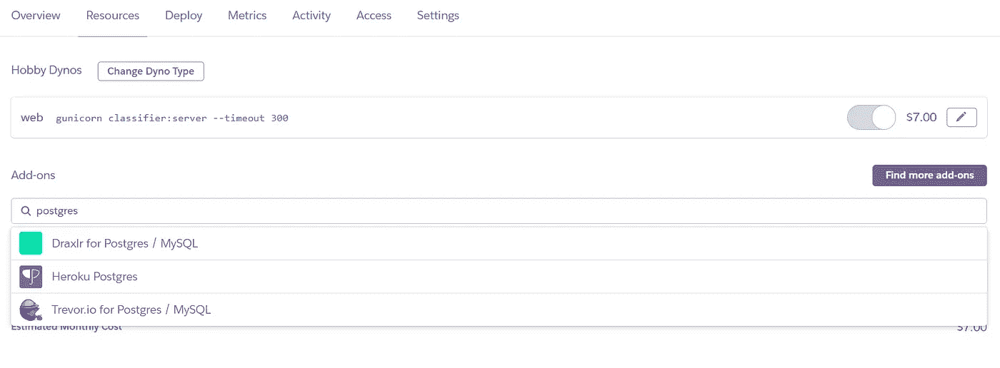
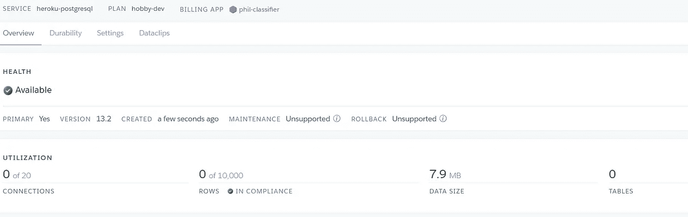
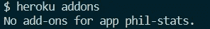
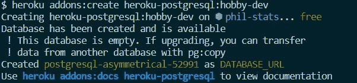

# 用 Python 为您的应用程序设置 Heroku PostgreSQL

> 原文：<https://towardsdatascience.com/set-up-heroku-postgresql-for-your-app-in-python-7dad9ceb0f92?source=collection_archive---------7----------------------->

## [实践教程](https://towardsdatascience.com/tagged/hands-on-tutorials)


托拜厄斯·菲舍尔在 [Unsplash](https://unsplash.com?utm_source=medium&utm_medium=referral) 拍摄的照片

所以我的问题是。我有大量的数据，我需要这些数据能够动态地在我的仪表盘上运行应用程序。听起来熟悉吗？更具体地说，我运行[哲学数据项目](http://philosophydata.com/)，这是一个实现数据驱动工具的网站，帮助人们探索哲学史。所以我有大约 330，000 句哲学句子，并且我一直在增加，我需要所有这些都可以动态地供人们通过我网站上的应用程序轻松搜索。

我不能把一个巨大的电子表格扔进 Heroku 这将打破段塞的大小，而且会慢得令人难以置信。幸运的是，Heroku 非常乐于助人，他们将为您提供一个免费的 Heroku Postgres 服务器来存放您的数据并使其可以访问。

很好，但事实证明，实际设置并不那么简单，虽然肯定有一些人在网上有很好的教程，但没有一个人真正从头到尾指导我们。这就是我要做的。

主要有三个步骤:
1。设置 Heroku Postgres 并将其连接到您的应用程序。
2。向服务器添加数据。
3。在应用程序中调用数据并运行查询。

让我们一次看一个。首先，你只需要一个现有的 Heroku 应用程序。

# **1。设置 HEROKU POSTGRES**

有两种方法可以做到这一点。首先是通过 Heroku 网站界面。登录并转到您的应用程序。然后，在 resources 选项卡下，从 addons 菜单中搜索 Postgres。点击标题为“Heroku Postgres”的选项



看起来我的朋友特雷弗实际上是个英雄？有意思……

系统会提示您选择一个层；选择最符合您需求的(有一个免费的，但它限制您为 10，000 行)。

很好，现在点击插件，你将被带到你的 Postgres 仪表板。



哇，这么顺从

太好了，你可以走了！请注意，所有关于您的密码和网址的信息都在“设置”标签下。Heroku 会自动填充您的相关配置变量，但是如果您将来需要它，您可以在那里找到它。

如果您喜欢使用命令行，您可以遵循以下步骤。首先，打开一个终端，导航到你的应用程序。然后使用命令`heroku addons`检查你当前安装了什么插件。



现在您可以使用`heroku addons:create heroku-postgresql:hobby-dev`添加 Postgres 数据库。当然，如果你想要一个不同的计划，用那个代替`hobby-dev`。



好了，你可以走了。请注意，无论采用哪种方式，您现在都将在 Heroku 环境中拥有一个新的`DATABASE_URL`配置变量；这个变量存储了——您猜对了——数据库 url。

# 2.向您的服务器添加数据

好的，现在你有一台服务器了。但是你没有任何数据。所以你需要添加它。大概有一百万种方法可以做到这一点，但是这里有一个简单的方法，你可以只用 Python 从 Jupyter 笔记本上运行。

首先，将您的数据设置为您想要的熊猫数据框架。

现在，使用下面的代码。

```
#import the relevant sql library from sqlalchemy import create_engine# link to your databaseengine = create_engine(<YOUR DATABASE URL>, echo = False)# attach the data frame (df) to the database with a name of the 
# table; the name can be whatever you likedf.to_sql(‘phil_nlp’, con = engine, if_exists='append')# run a quick test 
print(engine.execute(“SELECT * FROM phil_nlp”).fetchone())
```

这段代码基于它的 url 连接到你的数据库，然后全部上传。

这段代码可以填充一个空数据库，或者向现有数据库追加新值。要改变它插入值的方式，请更改`if_exists`参数。

# 3.使用应用程序中的数据

酷，现在你已经有了一个数据库，你已经为你所有珍贵的小数据建立了一个美丽的家。然而，如果您没有正确地查询它们，您的数据婴儿肯定会因疏忽而死亡。

但是你如何从你的应用程序中查询它们呢？它们都在那边的数据库里，这不可能吧？

一点也不，我的朋友，事实上这很容易。我使用 Dash 在 Python 中构建了我的应用程序，但同样的原则应该适用于任何其他 Python 应用程序。

要连接到数据库，你需要`psycopg2`库。像这样建立连接:

```
import psycopg2DATABASE_URL = os.environ.get(‘DATABASE_URL’)con = psycopg2.connect(DATABASE_URL)cur = con.cursor()
```

这段代码从环境变量中读取数据库 url，并使用它来建立到服务器的连接。

注意，如果不通过 Heroku local 在本地机器上运行 app，app 就不起作用；url 保存在您的 Heroku 环境中，除非您自己指定，否则通常无法在您的本地环境中使用。

很好，那么让我们把它们放在一起——这是一个应用程序的例子，它让用户在数据库中搜索给定单词的每一次出现。

现在你知道了！希望这是有帮助的。如果您有任何问题，请随时通过 [LinkedIn](https://www.linkedin.com/in/kcalizadeh/) 或[电子邮件](mailto: kcalizadeh@gmail.com)与我联系，并查看[搜索应用程序 repo](https://github.com/kcalizadeh/PDP_search_app) 中的[PhilosophyData.com](http://philosophydata.com/)的实例。谢谢！