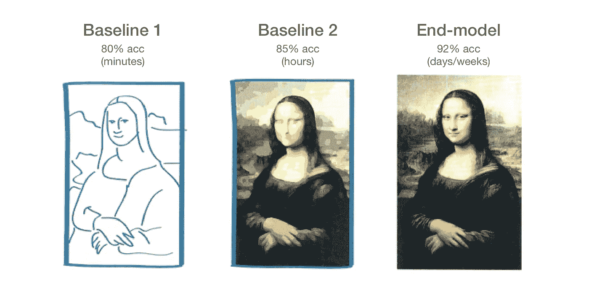

# 使用 PyTorch 在几分钟内设置强大的深度学习基线

> 原文：<https://towardsdatascience.com/setting-a-strong-deep-learning-baseline-in-minutes-with-pytorch-c0dfe41f7d7?source=collection_archive---------16----------------------->

## 从基线到定制模型不断迭代，以更快地交付产品或更快地发布您的研究。


借助闪存，在几分钟内构建 PyTorch 基准

无论你是数据科学家、研究工程师、人工智能研究员还是机器学习工程师，**基线是不可协商的**。在建立良好的基础之前，不要构建一个花哨的 GAN 或尝试一个复杂的想法。

在本教程中，我们将使用 [Flash](https://github.com/PyTorchLightning/lightning-flash) 在几分钟内构建**两个** [PyTorch](https://ai.facebook.com/tools/pytorch/) 基线。之后，我们将使用 [Lightning](https://github.com/PyTorchLightning/pytorch-lightning) 迭代该基线，以获得针对您的特定环境定制的实现，并从您的模型中获取更多性能。

# 基线与最终模型



为了快速获得价值，分阶段从基线迭代到最终模型。

大多数时候，我们希望通过深度学习尽快找到最佳解决方案。但这可能需要几个月的研究和书面实施。在这个过程中，您可以使用一些技巧，从一个强大的基线开始，迭代地获得最佳模型。

请记住，基线的目标是将您的想法呈现在用户面前，或者获得您正在处理的数据集的基准。一旦你建立了基线，你就可以继续进行你需要做的所有复杂的深度学习工程，知道你是从一个强大的基础开始的。

# 基线 1:蚂蚁对蜜蜂

为了说明关键的想法，假设你在一家家庭保险公司工作，你开发了一个摄像头，业主安装它来跟踪他们房子里的虫子类型。你的保险是基于摄像机捕捉到的蚂蚁和蜜蜂的数量。作为该系统的一部分，您决定构建一个分类器来确定什么是蚂蚁或蜜蜂。

首先，让我们安装[闪光灯](https://github.com/PyTorchLightning/lightning-flash)。

```
pip install lightning-flash
```

现在我们需要做的是找到一个强大的预训练模型，并对你的数据进行微调。这里，我们使用在 Imagenet 上预先训练的模型，并使用“冻结 _ 解冻”方案调整权重。

在短短几行中，你已经设法为你的工作建立了一个基线。运行它，你会发现它有 80%的预测准确率。如果这对您来说足够好，您可以在同一天内部署该模型。

# 基线 2:爱好者基线

另一个简单的方法是改变你基线的主干，使用来自[脸书人工智能(Swav)](https://ai.facebook.com/blog/high-performance-self-supervised-image-classification-with-contrastive-clustering/) 的最新自我监督模型。有了 Flash，这很简单:

把主干从‘resnet 34’改成‘swav-imagenet’就行了。

```
ImageClassifier(backbone='swav-imagenet')
```

现在，如果你幸运的话，你的模型可以获得另外 5%的准确性。同一天内，你重复了两次你的工作！

# 最终模型

但是现在有趣的部分和实际的工作开始了。

在这里，你将刷掉所有那些布满灰尘的数学书籍，找到一份深度学习论文的列表，并开始尝试深度学习方面的最新和最棒的东西。

假设您有一些其他数据想要集成到您的模型中，并且您想要使用一种奇特的调度技术，该技术使用一种奇特的 GAN 正则项来做一些超级独特的事情，这些事情只能为您提供特定的数据集。

由于 Flash 是 Lightning 的伴侣，您可以简单地将您的基线重写到 LightningModule 中，并做您想要的所有花哨的技巧。

请注意，您能够从基线实现到超级定制实现，而无需引入大量样板文件。从快速的高水平基线到超级漂亮的定制实现，您还可以保持完全的控制和定制。

# 奖金，部署！

另外，所有照明模块都可以通过[火炬脚本](https://pytorch-lightning.readthedocs.io/en/stable/production_inference.html#exporting-to-torchscript)或 [onnx](https://pytorch-lightning.readthedocs.io/en/stable/production_inference.html#exporting-to-onnx) 轻松导出。您可以使用这些来[部署高性能型号](https://pytorch-lightning.readthedocs.io/en/stable/production_inference.html#inference-in-production)。

# 摘要

本文向您展示了如何迭代地构建深度学习模型，以尽可能快地交付价值。使用 Lightning 框架系列，您能够:

*   在几分钟内交付基线 v1
*   再过几分钟迭代到基线 v2
*   在几小时/几天内迭代到最终模型(定制实现)。

快速构建和发布/发布！

访问 [Flash GitHub repo](https://github.com/PyTorchLightning/lightning-flash) 了解更多快速基线的示例！