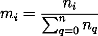
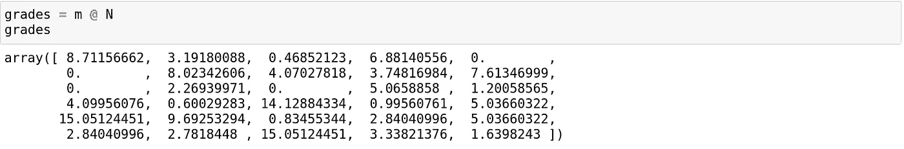
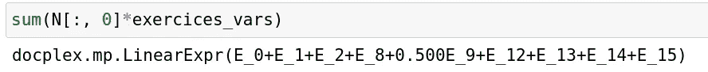
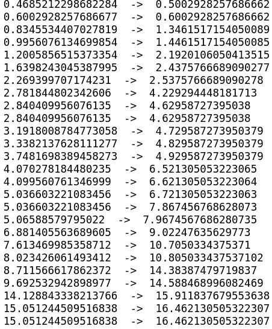
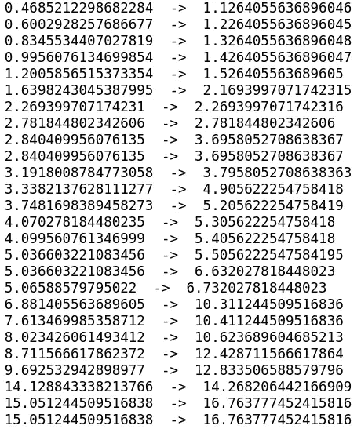

# 自动设置测试中每个问题的分数

> 原文：<https://towardsdatascience.com/setting-the-points-per-question-of-a-test-automatically-120186278e90?source=collection_archive---------14----------------------->

## 如何使用线性规划来选择考试的评分标准，既择优又鼓励


[斯科特·格雷厄姆](https://unsplash.com/@homajob?utm_source=medium&utm_medium=referral)在 [Unsplash](https://unsplash.com?utm_source=medium&utm_medium=referral) 上拍照

作为一名年轻的教师，我最近不得不进行我的第一次考试，所以我必须给我的第一份论文打分，但在打分之前，我必须确定每个问题的分数。

我发现自己在反复尝试多种评分标准，试图找到一种既能激励精英管理，又能让整体成绩优秀的标准。

但后来我注意到，评级尺度是一个加权和，因此找到一个评级尺度可以被视为一个优化问题；然后，我决定设计一种方法，通过使用线性编程和 ILOG 的解算器 CPLEX 来自动化这种缩放。

# 问题陈述

我要做的第一件事是在没有评分表的情况下批改试卷。为此，我创建了一个 CSV 文件，其中每个学生和每个问题都有一个介于 0 和 1 之间的浮点数，表示我判断它回答问题的程度。

之后，我用熊猫得到了每个问题和每个学生的分数，矩阵如下:

```
import pandas as pd
import numpy as np
import matplotlib.pyplot as pltdf = pd.read_csv("TME_Grades.csv")
N = df.values.T #I Transpose because initially i Had a table with     #the students in the rows and the exercices in the columns.
```

考虑我们有 *n* 个问题和 *m* 个学生，让 *N* 是 *(n，m)* 矩阵，它给我们一个学生在一个问题中的“相对分数”。

问题可能是找到一组大小为 *n* 的权重 *W* ，使得 W.N 给出学生的分数*。*

让我们从如何创建模型和变量开始。

```
from docplex.mp.model import Modelmodel = Model("Exam_Scoring")
exercices_vars = model.continuous_var_list(keys = np.arange(N.shape[0]), name= lambda k:"E_"+str(k))
```

函数“continuous_var_list”给出了一个键列表；在我们的例子中，它是 0 和问题数减 1 之间的数。

在我们创建了所需的变量之后，让我们考虑一下我们想要实现的约束，我们想要拥有的一些约束是直观的；权重集是一组实数，它们的总和是一个固定的数(比如说 20)，每个权重必须是严格正的。

在定义其他约束和目标之前，我们需要在我们的问题中定义精英管理的概念，并看看我们如何实现它。

# 精英管理和安逸

如果我想在我的评分尺度上完全精英化，我会给每个问题一个与其难度成比例的权重。

由于任何两个问题之间的差异是回答每个问题的学生数量，我可以认为，如果回答正确的学生较少，一个问题会比另一个问题更复杂。

因此，精英分级标准会给每个问题一个与以下因素成比例的权重:



其中 *nᵢ* 是没有回答问题*的学生人数*

让我们试试这个评分表，看看我的学生的成绩，如果我完全任人唯贤的话。

```
not_ans = N.shape[1] - N.sum(axis=1)
m = 20*(not_ans /not_ans.sum())
```

这会给我们以下的成绩。



我们可以看到，他们非常粗略，没有人得到 20 分，平均值约为 4.50，这是意料之中的，因为该量表是为了奖励没有人回答的问题而计算的。

我们如何改变评分标准，在保持精英管理的同时提高分数的平均值？

为此，我们必须确保新的砝码组满足两个条件:

1-学生的排名不得改变。新等级必须大于或等于精英等级。

给定一组权重，学生的分数可以很容易地计算如下:



为了确保第一个条件得到尊重，我们将使用 argsort 函数根据学生在精英管理系统中的分数对他们进行排序，并规定排名不会改变，因为对于每个学生来说，其分数必须保持高于在前一顺序中低于他的学生的分数。

```
for i in range(len(sorted_students)-1):
    gap = min(grades[i]-grades[i+1], 0.001) 
    cst = sum(N[:, sorted_students[i]]*exercices_vars) >=                                   sum(N[:,sorted_students[i+1]]*exercices_vars) + gap
    model.add_constraint(cst)
```

由于我们不能使用线性规划中的严格比较，我们使用较大的一个变量来表示我们希望两个学生之间的差距，如果他们的成绩相同，差距将等于 0，在其他情况下，它将是一个微小的浮动(这里是 0.001)。

间隙变量起着另一个重要的作用；它规定了我们所要求的“精英管理的程度”;差距等于 0 意味着一个在精英评分表中领先于另一个学生的学生现在可以和他有相同的分数。

差距为-1 意味着我们部分解除了精英约束，我们允许分数比其他学生高的学生比他低，但不超过 1 分。

从另一个角度来说，设置一个至少和初始差距一样大的差距会给我们相同的排名。

以下约束确保了另一个条件:

```
for i,grade in enumerate(grades):
    if(grade==0):
        continue
    cst = (sum(N[:,i]*exercices_vars)) >= grade
    model.add_constraint(cst) 
model.add_constraint(sum(exercices_vars) == 20)
for var in exercices_vars:
    model.add_constraint(var >= 0)
```

现在我们知道了如何限制评分标准，使他对每个人都公平，让我们看看我们可以使用什么目标来强制执行特定的评分标准。

# 功利主义和平等主义

作为一名教师，第一个直观的目标是最大化整个班级的平均水平；这可以通过将新等级的总和设置为最大化目标来实现。

```
model.maximize(sum(exercices_vars@N)/ N.shape[1])
```

在我们的示例中，标记将发生如下变化:



我们可以看到排名没有变化。总分增加，平均分为 6.10 分。

这个目标被称为功利目标，但是正如我们所看到的，分数并没有以同样的比例增加。

相反，我们可以考虑最大化最小非零分数，以促进分数的平均增长；这是通过以下方式实现的:

```
model.maximize(model.min([i for i in (exercices_vars@N) if str(i) != "0"]))
```

给了我们:



成绩的提高在学生中分布更加均匀，平均值在 5.10 左右。

可以设想其他目标，可以最大化录取人数，或者假设我们想要某个平均值，从而最小化班级平均值和这个期望平均值之间的距离的绝对值。

# 结论

如果我使用一个手工的评分量表，而不是使用这个协议，那就需要我估计一下我给出的问题的难度。

由于我不能精确地知道每个学生的每个问题的难度，有人可以利用我的估计来回答具有最佳分数/难度比的问题，从而比其他没有战略性地回答的人排名更好。

当我还是学生的时候，我认为这个策略维度是考试的一部分，因为在大多数情况下，只有通过在考试前做大量的练习，才能估计一个问题是否比另一个问题需要更多的时间。

虽然评分标准经常给出，但后来又改变了，通常是为了避免太多人得到糟糕的分数；在这种情况下，对那些足以回答复杂问题的学生和那些有足够经验回避这些问题的学生来说，都是不公平的。

有了这个框架，我们可以确保即使在改变评分标准时也能保持最初的排名，从而在提高学生成绩的同时避免糟糕的成绩。