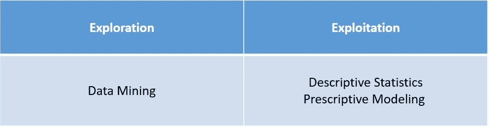
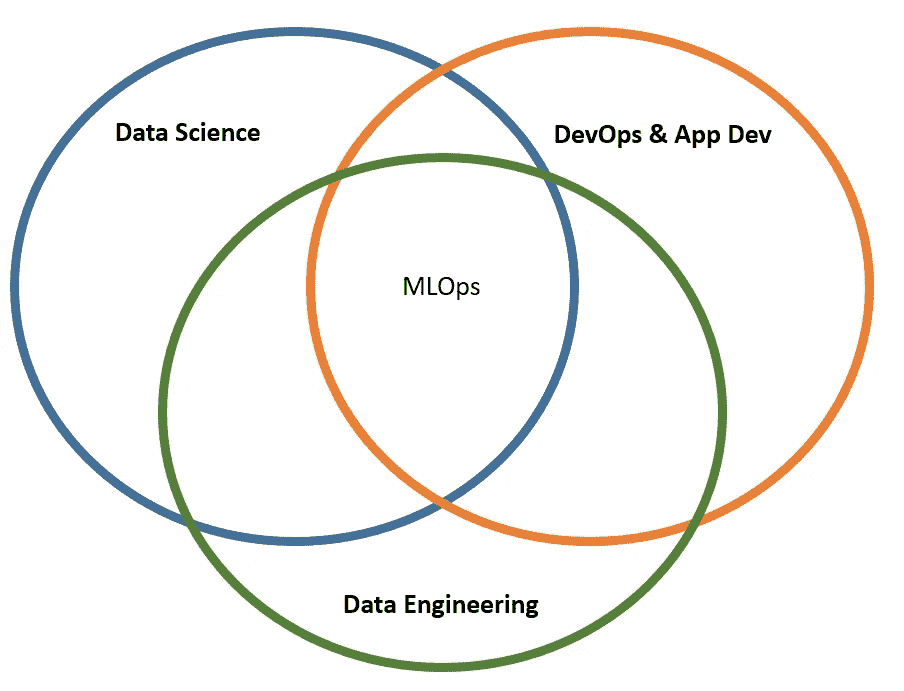
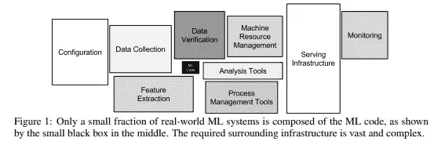

# 为成功建立数据科学组织

> 原文：<https://towardsdatascience.com/setting-up-a-data-science-org-for-success-b0203728630a?source=collection_archive---------57----------------------->

## [办公时间](https://towardsdatascience.com/tagged/office-hours)

## 如何组建一个有效的数据科学小组！

# 介绍

这是一篇关于如何建立一个有效的数据科学小组的观点文章，基于我从事编程工作> 10 年，从事数据科学工作> 5 年，以及为各个部门和公司工作。在我的文章“[数据科学家的 Web 框架，以及你为什么应该关注](https://medium.com/swlh/web-frameworks-for-data-scientists-and-why-you-should-care-34fde0916a62)”中，我指出像 VentureBeat、Redapt 和其他公司报告说 **~90%的机器学习项目没有进入生产**。换句话说，许多数据科学团体努力提供价值。这篇文章总结了(我发现的)让数据科学团队更有效的品质。在所审查的概念中，如果仅仅缺少一个元素，就会导致交付变慢(*如果有的话*)。

先简单模糊的说一下什么是数据科学，数据科学团队的职责是什么。

# 什么是数据科学？

以其最简单和最模糊的形式，数据科学是使用数学、统计学和计算机科学来分析和处理数据的实践。如果你正在读这篇文章，你可能已经知道了。如果您还不知道这一点，本文的其余部分可能会有所帮助(*但我们将假设您在很大程度上知道什么是数据科学*)。

这让我们想到了下一个(可能更有见地的)问题，数据科学团队是做什么的？

# 数据科学团队是做什么的？

这就是事情变得有趣的地方。一些公司可能会根据他们的组织结构或观点对此进行不同的处理。本文的重点是开发一个能提供最大价值的有效的数据科学团队。有了这个框架，我们来谈谈数据科学的一些组成部分。

在强化学习中，我们有这些探索和利用的想法。探索是我们尝试新事物，希望发现我们以前不知道的东西。利用是利用我们已经拥有的信息来获取未来利益的行为。(*你可以将这些概念应用于任何群体，而不仅仅是数据科学*)。

由作者创建

我们可以将数据科学团队的职责分成两个类似的领域。

*   **探索**

数据科学探索的另一个常用术语是数据挖掘。在这种情况下，我们希望获取数据，并尝试发现未知。有一些公司在这个领域蓬勃发展，但却很难利用任何获得的知识(*，我们稍后会谈到*)。一些公司发现很难理解这个想法，因为这个过程可能非常模糊(*，那是因为它有点像一种艺术形式*)。数据挖掘需要经验，但更重要的是开放的心态。有经验的数据科学家知道，像*时间*和*文本*这样的数据字段信息非常丰富，他们知道提取实体信息的方法。经验丰富的数据挖掘者擅长数据验证、数据可视化，并且知道如何发现有趣的模式。这在结构化的教科书中很难教授。事实是，你只需要做到这一点，并保持开放的态度。

## 如果您的数据科学团队不花任何时间进行数据挖掘，那么您可能会错过数据科学团队一半的潜在价值！

*   **剥削**

数据科学中最常见的开发类型包括描述性统计和说明性建模。我们可以获取一些我们在业务中已经知道的信息，比如“*一些客户群比其他客户群更有可能转化*”，我们可以通过部署一些规定的模型来进一步利用这些信息。也许我们在公司的 CRM 工具中以优先销售线索列表的形式使用预测模型来优化销售。或者，也许我们知道“*经理很难理解哪些销售代表在苦苦挣扎，为什么*”，所以我们可以以仪表板的形式部署一些描述性统计数据。仪表板可以告诉经理他们的哪些销售代表在努力，他们在哪里努力。(*我们还可以部署一些规范的建模来告知经理们他们陷入困境的一些潜在原因*)。

## 如果您的数据科学团队没有部署任何数据产品，那么您可能会错过数据科学团队一半的潜在价值！

现在，我们已经了解了数据科学家的工作类型，让我们来谈谈可交付成果。数据科学团队生产什么样的产品，或者更重要的是数据科学团队应该生产什么样的产品**？**

# 什么是数据科学产品？

*   **报道**

这通常以 BI 工具的形式出现，如 Tableau、Power BI、Apache Superset、Plotly Dash、RShiny、Microsoft Excel，甚至 Microsoft Powerpoint。

如果是一次性的报告，那么你可以将你的发现合并成一个 Powerpoint 演示文稿，然后将它们展示给利益相关者。然后，您可以将幻灯片保存到一个位置，以便风险承担者以后可以参考。

如果它是一个重复出现的报告，那么你可以使用一个 dashboarding 工具，比如 Tableau 或者 Plotly Dash。

## 您应该生成一次性报告和重复性报告。同样，如果您的数据科学团队没有花任何时间进行数据挖掘和报告发现，那么您可能会错过数据科学团队潜在价值的很大一部分！

*   **新系统**

根据您正在构建的系统，解决方案可能会完全不同。可能是比较 2 张图片的 REST API。或者可能是一个完整的 web 应用程序，它列出了需要审查潜在欺诈的客户。一般来说，您的解决方案应该是可靠的，并且具有适当的可伸缩性。如果您的应用程序需要与其他 IT 系统配合使用，那么您需要您的 IT 部门对您的解决方案感到满意。

此外，你的新系统可能是[软件 2.0](https://medium.com/@karpathy/software-2-0-a64152b37c35) 或软件 1.0。(*软件 2.0 是包含机器学习的软件解决方案，其中软件 1.0 不包含机器学习*)。例如，您可以实现一个模型来帮助优化引入客户的路由。或者，这可能是一个更简单的解决方案，根据一天中的时间优化客户路线。

无论是哪种情况，以下是一些常见的系统\产品:

1.  REST API——也许您的公司有一个 web 产品，当客户正在使用 web 应用程序时，您希望应用程序调用您的 REST API 并向用户返回一个结果。一般来说，如果需要的话，您会想要可伸缩的东西。一些常见的商业解决方案包括 AWS Lambda、Azure Functions App 和 Algorithmia。一些开源解决方案包括 Kubernetes、Flask、plumber 等。预期的流量将决定 REST API 的可伸缩性。
2.  模型批量评分—假设您有一个系统来确定欺诈审查客户的优先级。也许那个系统每天都在更新，你用 ML 模型对客户进行优先排序进行审核。在这种情况下，模型需要适合您的 ETL 管道。一些常见的云解决方案包括 Databricks、Azure ML Studio Pipelines 和 Azure Batch。一些开源解决方案包括 Apache Airflow 和 Luigi。
3.  Web 应用程序—除了实际的欺诈模型之外，您可能还托管欺诈应用程序。你可以使用 Heroku 或 Azure Web Apps 这样的系统来托管这个应用。您也可以使用 Linux 服务器在本地托管它。预期的流量将决定您的 web 应用程序的可伸缩性。

## 同样，如果您的数据科学团队没有部署任何产品，那么您可能会错过数据科学团队的大量潜在价值！

接下来，我们需要问自己，需要什么样的工具来实现这些最终产品？

# 数据科学团队需要什么工具？

首先，我们需要灵活。你不想限制你的数据科学家的能力，否则，他们有什么意义。

*   **数据科学开发**

我写了一篇关于这个主题的更详细的文章，题为“2020 年值得关注的[数据科学平台”。不管怎样，这里有一个快速总结:](/notable-data-science-platforms-of-2020-11a6322d8a60)

1.  你能做的最好的事情就是**获得一个云环境**。这将为您的团队提供分析数据和构建模型所需的工具和规模。这将是你的最佳选择。它应该比其他选项更强大，而且很可能更便宜。如果你已经在云中，这应该是一个扣篮。**如果您是本地的**、**，那么您可以使用混合基础设施**在云和本地之间传递数据。
2.  **如果你是本地的，而混合动力是不可能的**，**你可以拿起电话，试着打电话给*数据科学平台(DSP)* 供应商**。一些供应商将在本地部署一些东西，或者他们可以将它部署在他们管理的云环境中(*在这种情况下，您仍然需要弄清楚如何连接到您的数据*)。DSP 的缺点是它们往往更贵。

不言而喻，您的团队也应该实践良好的代码版本控制、文档版本控制和数据版本控制。像 [GitHub](https://github.com/) 这样的系统非常适合代码版本控制。Box 和 SharePoint 是很好的文档版本控制解决方案。存在用于数据版本控制的商业和开源解决方案。

一旦你有了一个开发环境，你的数据科学家可以分析数据和建立模型，我们还没有完成！为了给我们公司创造价值，我们还有很多要考虑的！

*   **汇报**

一次性报告维护成本低。像 Excel 和 Powerpoint 这样的工具是轻而易举的。

另一方面，重复出现的报告更复杂。以下是一些需要考虑的概念:

1.  ***自动化*** —如果有人每周都手动运行相同的报告，那么你就错过了一个窍门。分析师应该把时间花在数据挖掘或构建模型上，而不是运行手动步骤。你可能会说“*嗯，我们想发送一封电子邮件，其中包含对最新报告*的评论”。这很好，您仍然可以这样做，但这应该需要一个小时，而不是您的数据科学家的 30%的时间。
2.  ***复杂的 ETL 管道*** —你应该能够运行复杂的 ETL 管道。您应该能够快速地将来自不同来源的数据联系起来，并将这些数据存储在一个能够支持仪表板的表中。如果你还没有在你的仪表板基础设施中启用这个，忘记它，放弃吧，**因为你已经错过了你仪表板价值的一大块**。
3.  ***数据库存储*** —仪表板数据处理应推送到数据库。这将使您的仪表板运行更快，并提供实时体验。缓慢的仪表板对任何人都没有用。用户应该能够与您的仪表板快速交互，这意味着要有一个合适的数据库来支持您的仪表板。
4.  ***不受限制的数据可视化*** —你应该只受限于你的想象力，而不是你的工具。这使得基于代码的仪表板工具，如 Plotly Dash 和 RShiny 非常受欢迎。
5.  ***版本控制*** —如果您的仪表板发生变化，您应该能够跟踪您的变化。这使得基于代码的仪表板工具，如 Plotly Dash 和 RShiny 非常受欢迎。

对于一个数据库，采取你的选择。对于 ETL 和自动化，有开源的选择，比如 [Apache Airflow](https://airflow.apache.org/) 、 [Apache Spark](https://spark.apache.org/) 、 [Luigi](https://github.com/spotify/luigi) 等。，并且有大量的商业产品。如果你在云中，你可以使用云服务，比如 Azure Data Factory 和 AWS Batch。如果您在本地，您可以使用单个服务器启动，然后您可以根据需要纵向扩展。最终，你可能需要一个通用的集群，你可以自己构建，也可以打电话给像 Cloudera 这样的公司。

*   **ML & App 操作化**

这与重复出现的报告非常相似，只是略有不同。

1.  ***数据库*** —您需要能够存储数据以支持报告和任何其他应用程序。它还有助于模型开发和建立建模、分析和部署所需的数据管道。
2.  ***ETL*** —您需要一个健壮的 ETL 工具，它可以编排复杂的数据管道，为您的应用程序提供动力，并为潜在的分析准备数据。
3.  ***模型 ETL 集成*** —您选择的 ETL 工具应该能够集成(并运行)模型评分管道。
4.  ***REST API 托管*** —您需要能够托管模型和应用程序作为任何实时用例的 REST API。
5.  ***web 应用托管*** —你的团队可能不会托管任何 Web 应用，但你应该对托管 Web 工具的可能性持开放态度。
6.  ***版本控制和 DevOps*** —这是标准的实践，应该是显而易见的。
7.  ***模型监控*** —您应该监控您发布的模型的数据漂移、一般问题以及您的模型需要刷新的迹象。

很明显，数据科学团队需要大量工具，这就引出了一个问题，要实现这些最终产品，需要什么样的团队？

# 数据科学团队是什么样的？

数据科学组应该是 3 个子组的结合。

由作者创建

*   **数据科学**

如果没有数据科学家，一个数据科学小组会是什么样子！但是这并不是全部的要求；否则，这将是一个非常短的部分。

*   **数据工程**

你的数据科学小组应该有自己的数据工程师。你可能会说“*我的 IT 组织已经有数据工程师来填充我们的数据集市*”——我相信这是真的，但是你的团队中仍然需要数据工程师。这些人负责真正理解数据集市，并为建模和分析恰当地收集数据。如果您的团队中没有指定的数据工程师，您的团队中可能有人充当数据工程师。这些人对数据库了如指掌。每当有人需要数据集市的帮助时，这些人就像数据大师一样被对待，并被问题淹没。在某些情况下，也许团队中的每个人都是数据仓库专家，在这种情况下，您是身兼数职的分析师。短期来看，人们身兼数职并不是一件坏事，但从长期来看，这会导致重要的事情缺乏适当的关注。你的团队应该有指定的数据工程师。此外，他们应该能够访问他们自己的团队数据库，在那里他们可以存储用于分析、模型、应用程序和报告的数据。因此，您的数据工程师不仅专注于开发，他们还专注于生产应用程序！

*   **DevOps &应用开发者**

这些人负责单元测试，考虑 CI/CD，确保你运行的任何东西都是可靠的。他们还负责与其他 IT 团队合作，并管理任何投入生产的解决方案。如果您的解决方案有问题，谁将随叫随到来修复它？你的数据科学家？你在这方面的第一道防线应该是你的应用开发者。

*   **MLOps**

MLOps 实际上是所有 3 个子组共享的一个区域。MLOps 本质上是 DevOps，但侧重于 ML。所以你可以说 MLOps 属于 DevOps，但是由于 ML 给 DevOps 增加了新的复杂性，MLOps 变成了一个共享的规程。数据科学应该拥有一些单元测试，他们还应该拥有模型监控。来自数据科学家和数据工程师的所有生产代码都应该在 DevOps 下测试，但这仍然需要共同努力。一些团队雇用“机器学习工程师”，他们是数据科学家，更专注于团队内的 MLOps 工作。

[机器学习系统中隐藏的技术债务](https://papers.nips.cc/paper/2015/hash/86df7dcfd896fcaf2674f757a2463eba-Abstract.html)

上图来自一份著名的谷歌白皮书，名为“[机器学习系统中隐藏的技术债务](https://papers.nips.cc/paper/2015/hash/86df7dcfd896fcaf2674f757a2463eba-Abstract.html)”。该图传达了数据科学不仅仅是构建模型。黑色的小方块代表 ML 代码，其余的是从 ML 代码中获益所需的基础设施。支持数据科学需要资源、多元化的团队和企业的承诺。

在谷歌的另一篇题为“[机器学习:技术债务的高息信用卡](https://static.googleusercontent.com/media/research.google.com/en//pubs/archive/43146.pdf)的论文中，他们指出:

> 学术界可能会感到惊讶的是，在许多机器学习系统中，只有极小一部分代码实际上在进行“机器学习”。当我们认识到一个成熟的系统可能最终(最多)是 5%的机器学习代码和(至少)95%的粘合代码时，重新实现而不是重用一个笨拙的 API 看起来是一个更好的策略。

我认为主要的一点是，ML 代码相对于整个系统来说，一般只是代码的一小部分。我认为这是一个惊人的观察。你应该让这个想法真正深入你的大脑。考虑到这一点，开始变得清晰的是，你需要的不仅仅是数据科学家来做数据科学。

这将我们带到下一个要点——我们已经讨论了很多关于数据科学团队、工具和产品的内容；但是，公司文化呢？实现这些最终产品需要什么样的公司文化？毫无疑问，公司文化在数据科学团队的成功中扮演着重要角色。

# 数据科学团队要取得成功，需要哪些社会\业务要求？

*   与整个组织协作，特别是 MLOps\DevOps 团队需要与 IT 部门保持紧密联系。

你需要组织中其他人的合作。高层有责任认识到数据科学是公司的工作，并要求整个公司在需要时与数据科学团队合作。此外，MLOps\DevOps 团队需要与 IT 部门保持紧密联系。这将帮助您更快地将产品推向市场，因为您已经建立了关系！

*   **敏捷软件开发和项目跟踪**

你的团队应该使用像吉拉这样的产品来跟踪你正在做的项目和工作。ML 产品有很多复杂性，因此敏捷框架对于 ML 项目变得越来越重要。

*   **具有适当团队 KPI 和期望的创新文化**

这是什么意思？这意味着公司需要投资尝试在内部做事情**！**偶尔拿起电话给供应商打电话是没问题的，但公司需要投入内部数据科学。公司用什么样的工具？公司总是努力走在前沿吗？一些公司渴望尝试新事物，而另一些公司则喜欢稳扎稳打。

## 一个数据科学组织将在一个创新的公司中茁壮成长，而在一个过于谨慎的公司中则会饿死。

公司需要对失败持开放态度。

失败应该是意料之中的，从中吸取教训，并用来改进。这就引出了我们的下一点——KPI 和期望值。

**这一点非常重要**，它将我带回到探索与开发的问题上。如果你没有任何信息可以利用，你需要愿意探索。在这种情况下，你的团队应该看看你每年完成/开始多少实验(或项目)。一旦你真正交付了产品，你就可以开始收集信息并利用你的知识。在这一点上，你可以过渡到衡量你已经完成了多少成功的产品(*，即有多少仍在使用并交付价值*)。换句话说，在利用任何知识之前，你需要投资探索。

一些团队试图在第一天就衡量投资回报率。只要你有合适的镜头，这是没问题的。如果每个人都明白你正处于探索阶段，那就没关系。如果没有这个镜头，每个人都期待你利用你还没有收集的信息，这是一个灾难的配方。

> 正如你所看到的，在实践中，你的模型的实际实现需要的不仅仅是训练一个模型！您将经常需要运行实验来收集更多的数据，并考虑如何将您的模型整合到您正在开发的整个系统中。— Fast.ai / [FastBook](https://github.com/fastai/fastbook/blob/master/02_production.ipynb)

你需要尝试和学习，然后你可以微调。为了获得全面的成功，你必须接受一些失败。试图一开始就把每件事都做对是不可能的，从长远来看，你是在为自己的失败做准备。(*这是许多公司使用敏捷软件开发而不是瀑布*的众多原因之一)。

当你的下一个季度评估摆在你面前时，很难这样想，但你需要让人们接受一些失败，这样你才能从长远来看获得一些真正的奖励。你需要强调你学到了什么，以及你下一步要做什么。如果一次失败意味着公司的每个团队和领导都将对你的团队失去信心，那么你在开始之前就已经失败了。你需要在交付任何东西之前纠正这种想法。

(*另外，请注意，只关注下一个即时奖励与贪婪算法非常相似。一个贪婪的算法寻找下一个最高的收益，不把游戏作为一个整体来考虑。正如许多数据科学家会告诉你的，下一个最高的增益很少会优化游戏的整体。*)

*   **数据道德意识**

最后但同样重要的是，小组建立某种数据伦理框架(或指导方针)是很重要的。其中很大一部分属于 MLOps 和针对特定基础的测试，但思考数据伦理也是整个团队(和整个公司)的责任。 [Fast Book](https://github.com/fastai/fastbook) 来自 [Fast.ai](https://www.fast.ai/) 有一个很好的问题列表，你可以在每次 sprint 回顾时问你的团队。在[速成书第三章:伦理“分析你正在做的一个项目”一节下找。前两个问题是最好的——“我们应该这么做吗？”以及“数据中有什么偏见？”。如果你问自己，这与成功的数据科学团队有什么关系？答案是——它会让你免于制造一个让客户不快、让你的公司(和你自己)陷入丑闻的怪物。此外，不言而喻，我们都有责任创造改善社会的产品，而不是扰乱和损害社会。这将转化为积极的客户体验和代表质量的品牌。](https://github.com/fastai/fastbook/blob/master/03_ethics.ipynb)

# 摘要

那么一个有效的数据科学小组需要什么呢？

**必备工具:**

*   团队数据库。
*   具有自动化、调度和调用模型评分管道能力的 ETL 工具。
*   用于 REST APIs 和批量评分的模型部署工具(即与您的 ETL 工具集成)。
*   灵活的报告工具。
*   代码、文档和数据的版本控制。
*   项目管理的敏捷软件。
*   灵活的数据科学开发环境。

**关键团队成员:**

*   数据科学
*   数据工程
*   开发运维及应用开发

**基本组织需求:**

*   与组织的其他部门保持良好的关系，尤其是在您的 DevOps 团队和您的各种其他 IT 团队之间。
*   敏捷的工作环境。
*   具有适当 KPI 和期望的创新文化。
*   数据伦理意识。

# 结束了

就是这样！非常感谢你的阅读，希望你发现这很有见地！

# 巨大的行业资源

这里有一些很棒的资源和视频。Spark + AI Summit 和 TWIML AI Podcast 是观看来自脸书、LinkedIn、Comcast、Capital One 等大公司的真实 MLOps 和真实 ML 实践的惊人资源。

*   [Spark + AI 峰会视频存档](https://databricks.com/sparkaisummit/north-america/sessions)
*   [TWIML AI 播客](https://twimlai.com/)
*   [deep learning . AI——专家小组:用人工智能优化 BizOps](https://www.youtube.com/watch?v=U2nXlwCwuO4&t=23s)

再次感谢阅读！