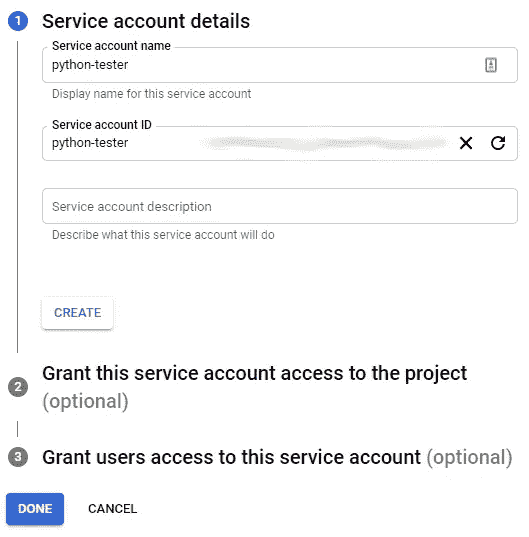
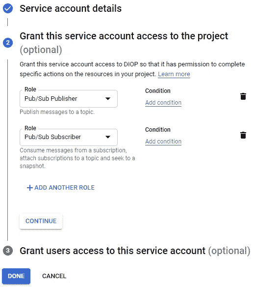
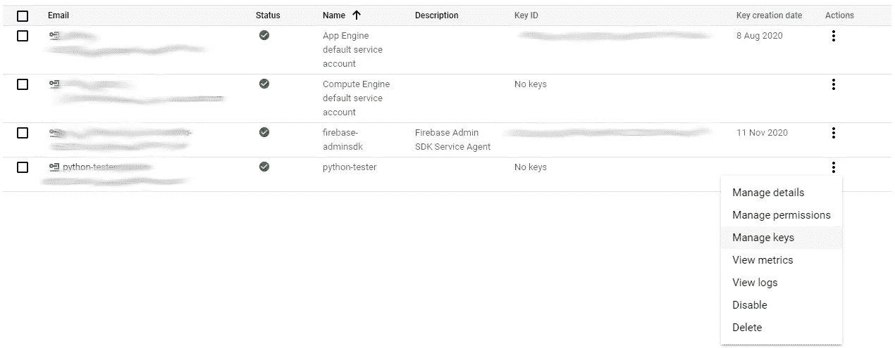
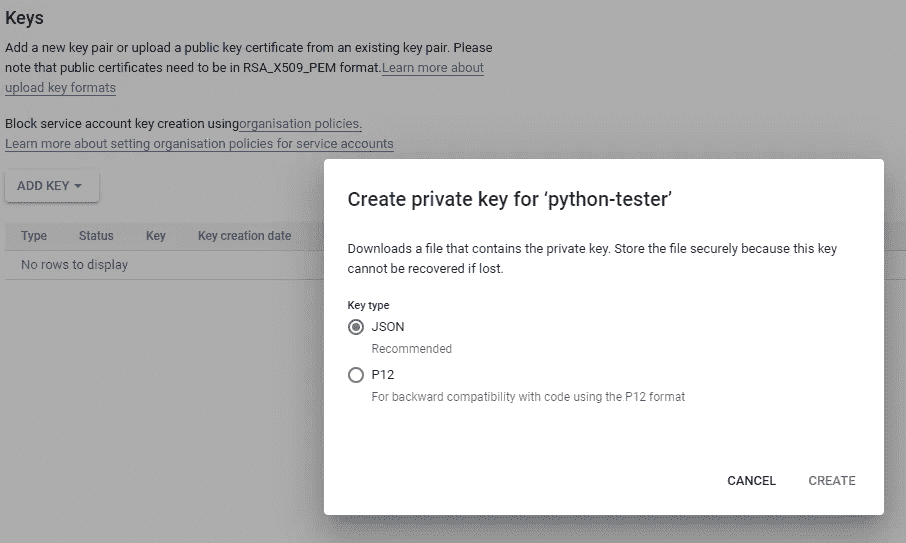
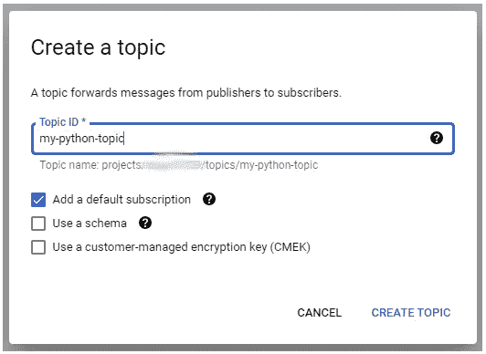
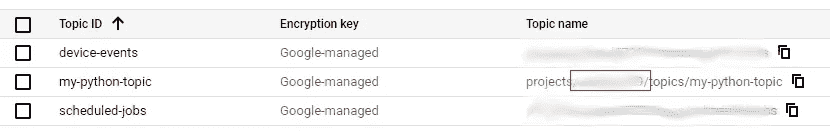
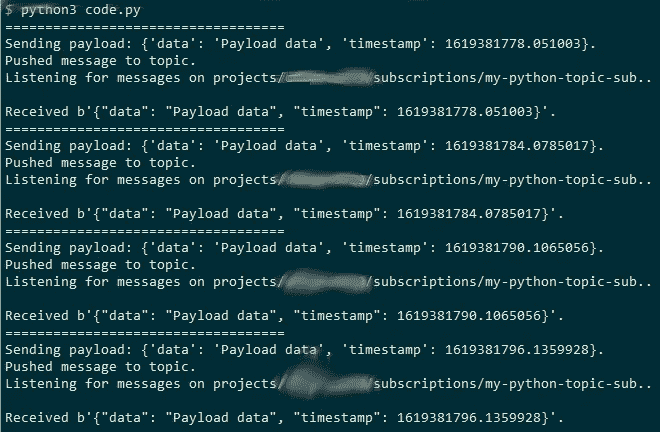

# 使用 Python 设置 GCP 发布/订阅集成

> 原文：<https://towardsdatascience.com/setting-up-a-gcp-pub-sub-integration-with-python-6bf3fab111f8?source=collection_archive---------38----------------------->

## 使用谷歌云平台解锁 Python 应用程序数据流的指南


戴维·克洛德在 [Unsplash](https://unsplash.com/s/photos/python?utm_source=unsplash&utm_medium=referral&utm_content=creditCopyText) 上的照片

[Python](https://en.wikipedia.org/wiki/Python_%28programming_language%29) 是当今各种数据处理的流行语言。用例范围从 web 应用和机器学习应用一直到像 [RaspberryPi](https://en.wikipedia.org/wiki/Raspberry_Pi) 这样的设备上的硬件控制。当涉及到这些事件系统和实时数据处理时，利用发布/订阅平台可以为您的解决方案增加模块化和可扩展性— [您可以在此处了解更多信息](/dont-miss-out-on-pub-sub-5dbfa15cf3d0)。

在这里阅读我为什么在我的爱好项目中使用谷歌云平台工具[。](/dont-miss-out-on-pub-sub-5dbfa15cf3d0)

# 目标

在本文中，我将介绍如何设置一个 Python 应用程序来发布和使用来自 Google 的 Pub/Sub 的数据。

**所需时间:** 15 分钟。

# 先决条件

要跟进，您应该具备以下条件:

1.  [对 Python 工作原理的基本理解](https://wiki.python.org/moin/BeginnersGuide)
2.  [你机器上安装的 Python 3.x】](https://www.python.org/downloads/)
3.  一个谷歌云平台[账户](https://cloud.google.com/apigee/docs/hybrid/v1.1/precog-gcpaccount)和一个[项目](https://cloud.google.com/resource-manager/docs/creating-managing-projects)

# 来做点编码吧！

## GCP-服务帐户设置

首先，让我们在 GCP 完成所有的配置。从 Python 应用程序访问发布/订阅服务需要 GCP 服务帐户和私钥。

您的服务帐户的完整列表可在此处[访问](https://console.cloud.google.com/iam-admin/serviceaccounts)，并可使用[此链接](https://console.cloud.google.com/iam-admin/serviceaccounts/create)添加新的服务帐户。给你的账户一个名字和 id——两者可以相同，但是 id 必须是唯一的——我把我的命名为`python-tester`。



作者图表

点击**创建**并添加`Pub/Sub Publisher`和`Pub/Sub Subscriber`角色，以确保该帐户可以从您的发布/订阅主题消费数据和向其发布数据。



作者图表

从这里你可以点击**完成**。

接下来，我们需要生成一个私钥，Python 应用程序将在与 GCP 通信时使用这个私钥。找到您刚刚创建的服务帐户，并选择**管理密钥**选项。



作者图表

使用**添加密钥**按钮添加新的 **JSON** 密钥。



作者图表

点击**创建**会将私钥文件下载到您的默认下载目录。如果您打开该文件，您应该会看到类似这样的内容:

```
{
 *“type”*: “service_account”,
 *“project_id”*: “…”,
 *“private_key_id”*: “…”,
 *“private_key”*: “ — — -BEGIN PRIVATE KEY — — -…”,
 *“client_email”*: “python-tester@…”,
 *“client_id”*: “…”,
 *“auth_uri”*: “https://accounts.google.com/o/oauth2/auth",
 *“token_uri”*: “https://oauth2.googleapis.com/token",
 *“auth_provider_x509_cert_url”*: “…”,
 *“client_x509_cert_url”*: “…”
}
```

确保跟踪这个文件，因为我们的 Python 应用程序将需要它。

## GCP —发布/订阅主题设置

在我们可以从发布/订阅推送/拉取数据之前，我们需要创建一个主题。你可以在这里看到你所有的活跃话题。创建一个新主题，给它一个名称，并选中默认订阅选项——我将我的主题命名为`my-python-topic`。



作者图表

确保选中**添加默认订阅选项**，然后单击**创建主题** —您应该会看到新主题出现在您的主题列表中。你的默认订阅将有一个带有`-sub`后缀的主题名称，在我的例子中，它被命名为`my-python-topic-sub`。

## python——编写生产者和消费者

在编写代码之前，你必须安装[Python 3 . x](https://www.python.org/downloads/)以及`google-api-python-client`和`google-cloud-pubsub` GCP 库。您可以使用以下命令在 pip/pip3 中安装它们:

```
pip3 install --upgrade google-api-python-client
pip3 install --upgrade google-cloud-pubsub
```

在机器上的某个地方为 Python 代码创建一个文件夹。

```
mkdir pub-sub-test
cd pub-sub-test
```

将您在 **GCP —服务账户设置**部分生成的私钥移到这个新文件夹中。如果您丢失了您的密钥，您可以使用相同的说明生成一个新的。

在这个目录中创建您的主要可执行 Python 文件——我调用我的`code.py`,并添加以下内容:

GCP 库期望一个名为`GOOGLE_APPLICATION_CREDENTIALS`的环境变量指向私钥。我们在第 2 行**上设置该值:**

```
os.environ["GOOGLE_APPLICATION_CREDENTIALS"]="YYYY.json"
```

确保将`YYYY.json`替换为您的私钥文件的路径/名称。

**第**行**上的 PUB_SUB_PROJECT** 应该更新为您的 GCP 项目的 id，您可以在 Pub/Sub [列表页面](https://console.cloud.google.com/cloudpubsub/topic/list)上找到该 id。它将是**项目**和**主题之间的值—** 项目/**YYY**/主题/my-python-topic。



作者图表

您的项目现在应该如下所示:

```
├── pub-sub-test
│ ├── code.py
│ ├── YYYY.json
```

我尽了最大努力让代码尽可能不言自明，但本质上:

**process_payload:** 一个回调函数，处理从发布/订阅消费的事件，任何你想应用到有效负载的逻辑都应该在这里添加。

**push_payload:** 获取一个有效负载(JSON)并将其推送到提供的发布/子主题/项目 id 组合。

**consume_payload:** 检查所提供的订阅/项目组合中的新事件，如果数据存在，将调用回调函数进行处理。超时周期作为一个中断。

剩下的代码继续推送和消耗数据，直到程序终止。您可以用`python3 code.py`运行代码，应该会在终端中看到类似这样的内容:



作者图表

现在你有了它，一个基本的实现，但是这应该足够让你开始使用 Python 来利用 GCP 的 Pub/Sub。

# 结论

Google 的 Pub/Sub 平台非常适合处理大量的数据和分离你的架构的各个组件。在本文中，我向您介绍了如何在 Python 应用程序中利用 Pub/Sub。我希望你能从这篇文章中学到一些东西。

**祝好运，编码快乐！**

*原载于 2021 年 4 月 25 日 http://www.theappliedarchitect.com*<http://www.theappliedarchitect.com/setting-up-gcp-pub-sub-integration-with-python/>**。**