# 建立文本摘要项目

> 原文：<https://towardsdatascience.com/setting-up-a-text-summarisation-project-daae41a1aaa3?source=collection_archive---------8----------------------->

## 拥抱变形金刚深入文本摘要的实用指南

图片由 [Ralf Roletschek](https://commons.wikimedia.org/wiki/File:13-11-02-olb-by-RalfR-03.jpg) 拍摄；根据[知识共享署名 3.0](https://creativecommons.org/licenses/by/3.0) 获得许可

# 自然语言生成新时代的到来

当 [OpenAI](https://openai.com/) 在 2020 年 7 月发布了专门研究文本生成的第三代机器学习(ML)模型时，我知道有些事情不同了。这个模型触动了前人没有触及的神经。突然，我听到朋友和同事谈论它，他们可能对技术感兴趣，但通常不太关心 AI/ML 领域的最新进展。甚至《卫报》也就此写了一篇文章。或者准确的说是*模特*写的文章，卫报编辑出版。不可否认，GPT 3 号改变了游戏规则。

一旦模型发布，人们立即开始为它想出潜在的应用。几周之内，大量令人印象深刻的演示被制作出来，这些演示可以在令人敬畏的 GPT-3 网站上找到。一个引起我注意的特殊应用是 ***文本摘要*** ，即计算机阅读给定文本并总结其内容的能力。它结合了自然语言处理(NLP)领域中的两个领域，阅读理解和文本生成，并且是计算机最困难的任务之一。这就是为什么我对 GPT-3 文本摘要演示印象如此深刻。

你可以在 [*拥抱脸空间*网站](https://huggingface.co/spaces)上试试。我目前最喜欢的是一个[应用程序](https://huggingface.co/spaces/Alifarsi/news_summarizer)，它只需要输入文章的 URL 就可以生成新闻文章的摘要。

# 这个教程是关于什么的？

我工作的许多组织(慈善机构、公司、非政府组织)有大量的文本需要阅读和总结——财务报告或新闻文章、科研论文、专利申请、法律合同等。自然，这些组织对使用 NLP 技术自动完成这些任务感兴趣。因此，为了展示可能性的艺术，我经常使用文本总结演示，它们几乎总能给人留下深刻印象。

***但是现在呢？***

这些组织面临的挑战是，他们想要评估基于许多许多文档摘要的文本摘要模型——而不是一次一个。他们不想雇佣一个实习生，他唯一的工作就是打开应用程序，粘贴一个文档，点击“总结”按钮，等待输出，评估总结是否好，然后对数千个文档重新做一遍。

这就把我们带到了这个博客系列的目标:**在这个教程中，我为组织提出了一个实用的指南，这样他们就可以评估他们领域的文本摘要模型的质量。**

# 这个教程是(不是)给谁看的？

我是带着四周前的过去的自己写下这篇教程的，也就是说，当我开始这段旅程的时候，我希望我有这篇教程。从这个意义上说，本教程的目标读者是熟悉 AI/ML 并且以前使用过 Transformer 模型的人，但是他们才刚刚开始他们的文本总结之旅，并且想要更深入地了解它。因为它是由“初学者”为初学者写的，所以我想强调的是，本教程是*实用指南，而不是*实用指南。请像乔治·博克斯所说的那样对待它:**

**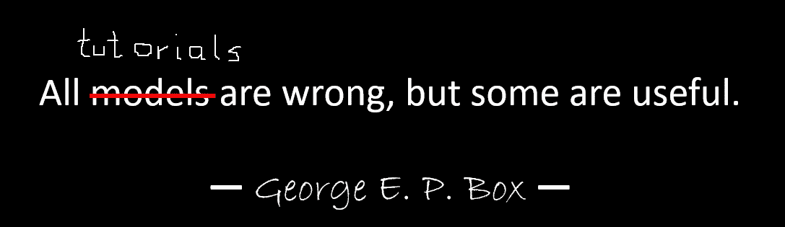**

**作者图片**

**就本教程需要多少技术知识而言:它确实涉及一些 Python 中的编码，但大多数时候我们只是使用代码来调用 API，所以也不需要深入的编码知识。熟悉机器学习的某些概念将是有用的，例如,*训练*和*部署*一个模型意味着什么,*训练、验证和测试数据集*的概念，等等。之前接触过[变形金刚库](https://huggingface.co/transformers/)可能会有用，因为我们将在本教程中广泛使用这个库。尽管如此，如果我没有忘记的话，我会试着为这些概念的进一步阅读加入有用的链接；)**

**因为这个教程是一个初学者写的，所以我不指望 NLP 专家和高级深度学习从业者能从这个教程中得到多少。至少从技术角度来看不是这样——不过，你可能仍然喜欢阅读，所以请不要离开！但是你必须对我的简化保持耐心——我试图让本教程中的所有内容尽可能简单，而不是更简单。**

# **本教程的结构**

**这个系列将分为五个部分，我们将经历一个文本摘要项目的不同阶段。在第一部分中，我们将首先介绍文本摘要任务的度量标准，即允许我们评估摘要是“好”还是“坏”的性能衡量标准。我们还将介绍我们想要总结的数据集，并使用非 ML“模型”创建基线，即我们将使用简单的启发式方法从给定文本中生成摘要。创建这个基线在任何人工智能项目中都是至关重要的一步，因为它将使我们能够量化我们通过使用人工智能取得的进展，也就是说，它允许我们回答这样一个问题:“投资人工智能技术真的值得吗？”**

**在下一部分(第 2 部分)中，我们将使用一个已经预先训练好的模型来生成摘要。这是一种现代的称为迁移学习的方法。你可以在这篇文章中读到更多。这是另一个有用的步骤，因为我们基本上采用现成的模型，并在我们的数据集上进行测试。这允许我们创建另一个基线，这将有助于了解当我们在数据集上实际训练模型时会发生什么。这种方法被称为零镜头总结，因为该模型对我们的数据集没有任何影响。**

**之后，是时候使用一个预先训练好的模型，并在我们自己的数据集上训练它了(第 3 部分)。这也叫微调。它将使模型能够从我们数据的模式和特质中学习，并慢慢适应它。一旦我们训练了模型，我们将使用它来创建摘要(第 4 部分)。**

**所以，总结一下(看我做了什么？):**

*   **第 1 部分:使用非 ML“模型”建立基线**
*   **第 2 部分:使用零镜头模型生成摘要**
*   **第 3 部分:训练总结模型**
*   **第 4 部分:评估训练好的模型**

# **本教程结束时，我们将取得什么成果？**

**恐怕现在是残酷的现实检验的时候了:在本教程结束时，我们将**而不是**有一个可以在生产中使用的文本总结模型。我们甚至不会有一个**好的**总结模型(此处插入尖叫表情符号)！**

**相反，我们将有一个项目下一阶段的起点，这是实验阶段。这就是数据科学中的*科学*的用武之地，因为现在一切都是关于用不同的模型和不同的设置进行实验，以了解是否可以用可用的训练数据训练出足够好的汇总模型。**

**而且，完全透明地说，很有可能得出的结论是技术还不成熟，项目不会被实现。你必须让你的商业利益相关者为这种可能性做好准备。但那是另一篇博文的内容；)**

# **第 1 部分—创建基线**

**这是建立文本摘要项目教程的第一部分。关于本教程的更多背景和概述，请参考[简介](/setting-up-a-text-summarisation-project-introduction-526622eea4a8)。**

**在这一部分中，我们将使用一个非常简单的“模型”建立一个基线，而不实际使用机器学习(ML)。在任何 ML 项目中，这都是非常重要的一步，因为它让我们了解 ML 在项目期间增加了多少价值，以及是否值得投资。**

**教程的代码可以在这个 [Github repo](https://github.com/marshmellow77/text-summarisation-project) 中找到。**

# **数据，数据，数据…**

**每一个 ML 项目都是从数据开始的！如果可能的话，我们应该总是使用与我们想要通过文本摘要项目实现的目标相关的数据。例如，如果我们的目标是总结专利申请，我们也应该使用专利申请来训练模型。对于一个 ML 项目，一个很大的警告是训练数据通常需要用*标记*。在文本摘要的上下文中，这意味着我们需要提供要摘要的文本以及摘要(“标签”)。只有提供这两者，模型才能知道“好的”摘要是什么样的。**

**在本教程中，我们将使用公开可用的数据集，但如果我们使用自定义/私有数据集，步骤和代码完全相同。同样，如果你对你的文本摘要模型有一个目标，并且有相应的数据，请使用你的数据来充分利用它。**

**我们将使用的数据是包含 arXiv 论文摘要及其标题的 [arXiv 数据集](https://www.kaggle.com/Cornell-University/arxiv)。出于我们的目的，我们将使用摘要作为我们想要总结的文本，使用标题作为参考摘要。下载和数据预处理的所有步骤都可以在这个[笔记本](https://github.com/marshmellow77/text-summarisation-project/blob/main/0b_data_prep_arxiv.ipynb)中找到。该数据集是作为这篇[论文](https://arxiv.org/abs/1905.00075)的一部分开发的，并根据[知识共享 CC0 1.0 通用公共领域专用协议](https://creativecommons.org/publicdomain/zero/1.0/)获得许可。**

**请注意，数据分为三个数据集，即训练、验证和测试数据。如果您想使用自己的数据，请确保情况也是如此。简单提醒一下，这是我们使用不同数据集的方式:**

****

**作者图片**

**自然，此时一个常见的问题是:我们需要多少数据？你可能已经猜到了，答案是:视情况而定。这取决于该领域的专业化程度(总结专利申请与总结新闻文章有很大不同)、该模型需要有多精确才能有用、该模型的训练成本应该是多少等等。我们将在稍后实际训练模型时回到这个问题，但不足的是，一旦我们处于项目的实验阶段，我们将不得不尝试不同的数据集大小。**

# **什么是好的模型？**

**在许多 ML 项目中，度量一个模型的性能是相当简单的。这是因为模型的结果是否正确通常没有什么模糊性。数据集中的标签通常是二元的(真/假，是/否)或分类的。无论如何，在这种情况下，很容易将模型的输出与标签进行比较，并将其标记为正确或不正确。**

**当生成文本时，这变得更具挑战性。我们在数据集中提供的摘要(标签)只是总结文本的一种方式。但是总结一篇给定的文章有很多可能性。因此，即使模型与我们的标签 1:1 不匹配，输出可能仍然是有效和有用的摘要。那么，我们如何比较模型的总结和我们提供的总结呢？文本摘要中最常用来衡量模型质量的指标是 [ROUGE score](https://en.wikipedia.org/wiki/ROUGE_(metric)) 。为了理解这个指标的机制，我推荐[这篇博文](/the-ultimate-performance-metric-in-nlp-111df6c64460)。总之，胭脂分数测量模型摘要(候选摘要)和参考摘要(我们在数据集中提供的标签)之间的 [n-grams](https://en.wikipedia.org/wiki/N-gram) (连续的 *n* 项序列)的重叠。但是，当然，这不是一个完美的措施，并了解其局限性，我很喜欢[这篇文章](/to-rouge-or-not-to-rouge-6a5f3552ea45)。**

**那么，我们如何计算胭脂分数呢？有相当多的 Python 包来计算这个指标，为了确保一致性，我们应该在整个项目中使用相同的方法。因为在本教程的稍后部分，我们将非常 l̶a̶z̶y̶聪明地使用变形金刚库中的训练脚本，而不是编写我们自己的脚本，所以我们可以只查看脚本的[源代码](https://github.com/huggingface/transformers/blob/v4.6.1/examples/pytorch/summarization/run_summarization.py#L503)并复制计算胭脂分数的代码:**

**通过使用这种方法来计算分数，我们可以确保在整个项目中始终进行比较。**

**注意，这个函数将计算几个 ROUGE 分数: *rouge1* 、 *rouge2* 、 *rougeL* 和*rougeL sum*(*rougeL sum*中的“总和”是指这个度量是在整个摘要上计算的，而 *rougeL* 是作为单个句子的平均值计算的)。那么，我们应该为我们的项目使用哪个 ROUGE 分数呢？同样，我们将不得不在试验阶段尝试不同的方法。值得一提的是，[原始 ROUGE 论文](https://aclanthology.org/W04-1013.pdf)称“ROUGE-2 和 ROUGE-L 在单个文档摘要任务中表现良好”，而“ROUGE-1 和 ROUGE-L 在评估简短摘要方面表现出色”。**

# **创建基线**

**接下来，我们想通过使用一个简单的非 ML 模型来创建基线。那是什么意思？嗯，在文本摘要领域，许多研究使用一种非常简单的方法:他们提取文本的前 *n* 个句子，并将其声明为候选摘要。然后，他们将候选摘要与参考摘要进行比较，并计算 ROUGE 分数。这是一个简单而强大的方法，我们可以用几行代码实现(这部分的完整代码可以在这个[笔记本](https://github.com/marshmellow77/text-summarisation-project/blob/main/1_baseline_model.ipynb)中找到):**

**请注意，我们使用测试数据集进行评估。这是有意义的，因为一旦我们训练模型，我们也将使用相同的测试数据集进行最终评估。我们也为 *n* 尝试不同的数字，即我们只从第一句开始作为候选摘要，然后是前两句，最后是前三句。**

**这些是我们第一个“模型”的结果:**

**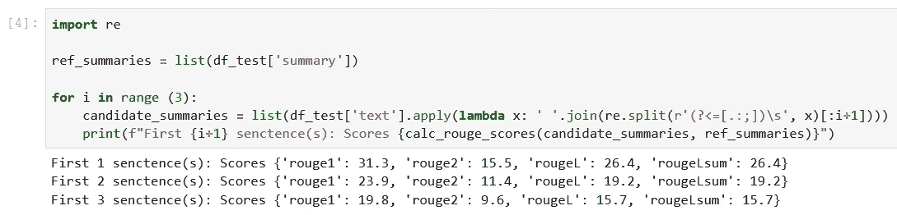**

**作者图片**

**我们可以看到，只有第一句话作为候选摘要，得分最高。这意味着使用一个以上的句子会使总结变得冗长，从而导致较低的分数。这意味着我们将使用一句话总结的分数作为基线。**

**值得注意的是，对于这样一个简单的方法，这些数字实际上相当不错，特别是对于 *rouge1* 分数。为了将这些数字放在上下文中，我们可以查看第[页](https://huggingface.co/google/pegasus-xsum)，它显示了不同数据集的最先进模型的分数。**

# **结论和下一步**

**我们已经介绍了将在整个总结项目中使用的数据集以及评估总结的指标。然后，我们用一个简单的非 ML 模型创建了以下基线:**

**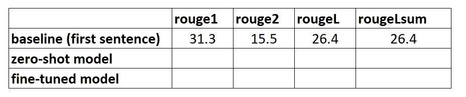**

**作者图片**

**在下一部分中，我们将使用零镜头模型，即经过专门训练用于公共新闻文章文本摘要的模型。然而，这个模型根本不会在我们的数据集上训练(因此得名“零炮”)。**

**我会把它作为家庭作业留给你们，让你们猜猜这个零射击模型与我们非常简单的基线相比会有什么表现。一方面，它将是一个更加复杂的模型(实际上是一个神经网络)，另一方面，它仅用于概括新闻文章，因此它可能会与 arXiv 数据集固有的模式相冲突。**

# **第 2 部分—零起点学习**

**这是建立文本摘要项目教程的第二部分。关于本教程的更多内容和概述，请参考[简介](/setting-up-a-text-summarisation-project-introduction-526622eea4a8)以及[第 1 部分](/setting-up-a-text-summarisation-project-part-1-45553f751e14)，在其中我们为我们的项目创建了一个基线。**

**在这篇博客文章中，我们将利用[零距离学习](https://en.wikipedia.org/wiki/Zero-shot_learning) (ZSL)的概念，这意味着我们将使用一个经过训练的模型来总结文本，但尚未看到任何 [arXiv 数据集](https://www.kaggle.com/Cornell-University/arxiv)的示例。这有点像当你这辈子一直在做的都是风景画的时候，试图去画一幅肖像。你知道如何绘画，但你可能不太熟悉肖像绘画的复杂性。**

**整个教程的代码可以在这个 [Github repo](https://github.com/marshmellow77/text-summarisation-project) 中找到。对于今天的部分，我们将特别使用[这个笔记本](https://github.com/marshmellow77/text-summarisation-project/blob/main/2_zero_shot.ipynb)。**

# **为什么零起点学习(ZSL)？**

**ZSL 在过去几年中变得流行起来，因为它允许在没有培训的情况下利用最先进的 NLP 模型。他们的表现有时相当惊人:大型科学研究工作组最近发布了他们的 T0pp(发音为“T Zero 组合+”)模型，该模型经过专门训练，用于研究零射击多任务学习。在[大工作台](https://github.com/google/BIG-bench)基准测试中，它的表现经常超过 6 倍大的型号，在其他几个 NLP 基准测试中，它的表现也超过 16 倍大的 [GPT-3](https://github.com/openai/gpt-3) 。**

**ZSL 的另一个好处是使用它只需要两行代码。通过尝试，我们可以创建第二个基线，一旦我们在数据集上对模型进行了微调，就可以用它来量化模型性能的提高。**

# **建立零起点学习管道**

**为了利用 ZSL 模型，我们可以使用拥抱脸的 [*管道* API](https://huggingface.co/docs/transformers/main_classes/pipelines) 。这个 API 使我们能够使用只有两行代码的文本摘要模型，同时它负责 NLP 模型中的主要处理步骤:**

1.  **文本被预处理成模型可以理解的格式。**
2.  **预处理后的输入被传递给模型。**
3.  **模型的预测是后处理的，所以你可以理解它们。**

**它利用了已经在[拥抱脸模型中心](https://huggingface.co/models?pipeline_tag=summarization&sort=downloads)上可用的总结模型。**

**所以，下面是如何使用它:**

**就是这样，信不信由你。这段代码将下载一个汇总模型，并在您的机器上本地创建汇总。如果您想知道它使用的是哪种模型，您可以在[源代码](https://github.com/huggingface/transformers/blob/master/src/transformers/pipelines/__init__.py)中查找或者使用以下命令:**

**当我们运行这个命令时，我们看到用于文本摘要的 defaukt 模型被称为*sshleifer/distilbart-CNN-12-6*:**

**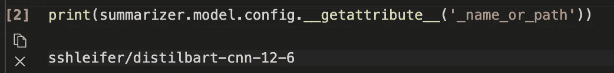**

**作者图片**

**我们可以在拥抱脸网站上找到该模型的[模型卡](https://huggingface.co/sshleifer/distilbart-cnn-12-6)，在那里我们还可以看到该模型已经在两个数据集上进行了训练:CNN 每日邮件数据集[和极端摘要(XSum)数据集](https://huggingface.co/datasets/cnn_dailymail)。值得注意的是，该模型不熟悉 arXiv 数据集，仅用于总结与其训练过的文本相似的文本(主要是新闻文章)。型号名称中的数字 12 和 6 分别指编码器层数和解码器层数。解释这些是什么超出了本教程的范围，但是你可以在 Sam Shleifer 的博客文章中读到更多关于它的内容，他创建了这个模型。**

**我们将继续使用默认模型，但我鼓励您尝试不同的预培训模型。所有适合总结的模型都可以在[这里](https://huggingface.co/models?pipeline_tag=summarization&sort=downloads)找到。要使用不同的模型，您可以在调用管道 API 时指定模型名称:**

## **侧边栏:提取与抽象总结**

**我们还没有谈到两种可能但不同的文本摘要方法:*提取*与*抽象*。摘要概括是将从文本中提取的内容连接成一个摘要的策略，而抽象概括包括用新句子解释语料库。大多数摘要模型都是基于生成小说文本的模型(它们是自然语言生成模型，例如，[【GPT-3】](https://github.com/openai/gpt-3))。这意味着总结模型也会产生新的文本，这使得它们成为抽象的总结模型。**

# **生成零镜头摘要**

**现在我们知道了如何使用它，我们想在我们的测试数据集上使用它，与我们在第 1 部分中用来创建基线的数据集完全相同。我们可以用这个循环来实现:**

**注意，我们有*最小长度*和*最大长度*参数来控制模型生成的摘要。在本例中，我们将 *min_length* 设置为 5，因为我们希望标题至少有 5 个单词长。通过查看参考摘要(即研究论文的实际标题),看起来 20 可能是 *max_length* 的合理值。但同样，这只是第一次尝试，一旦项目进入实验阶段，这两个参数可以而且应该改变，以查看模型性能是否发生变化。**

## **侧边栏:波束搜索、采样等。**

**如果您已经熟悉文本生成，您可能知道还有许多参数会影响模型生成的文本，如光束搜索、采样和温度。这些参数使您能够更好地控制正在生成的文本，例如，使文本更加流畅，减少重复等。这些技术在管道 API 中是不可用的——你可以在[源代码](https://github.com/huggingface/transformers/blob/master/src/transformers/pipelines/text2text_generation.py#L151)中看到*最小长度*和*最大长度*是唯一会被考虑的参数。然而，一旦我们训练并部署了我们自己的模型，我们就可以访问那些参数了。在本系列的第 4 部分中会有更多的介绍。**

# **模型评估**

**一旦我们生成了零镜头摘要，我们可以再次使用我们的 ROUGE 函数来比较候选摘要和参考摘要:**

**对使用 ZSL 模型生成的摘要运行此计算，我们得到以下结果:**

**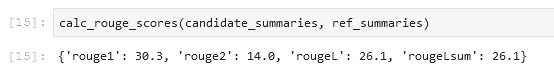**

**作者图片**

**当我们将这些与第一部分的基线进行比较时，我们看到这个 ZSL 模型实际上比我们简单的只取第一句话的试探法表现得更差。同样，这并不出人意料:尽管这个模型知道如何总结新闻文章，但它从未见过总结学术研究论文摘要的例子。**

# **结论**

**我们现在已经创建了两条基线，一条使用简单的启发式方法，另一条使用 ZSL 模型。通过比较 ROUGE 分数，我们看到简单启发式算法目前优于深度学习模型:**

**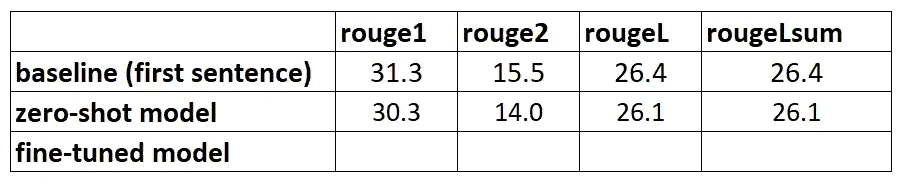**

**作者图片**

**在下一部分中，我们将采用这种完全相同的深度学习模型，并尝试提高其性能。我们将通过在 arXiv 数据集上训练它来做到这一点(这一步也被称为*微调*):我们利用了它已经知道如何概括文本的事实。然后，我们向它展示了大量 arXiv 数据集的示例。深度学习模型一旦接受训练，就非常擅长识别数据集中的模式，因此我们确实希望该模型在这项特定任务中变得更好。**

# **第 3 部分—培训总结模型**

**在这一部分中，我们将在我们的数据集上训练我们在第二部分中用于零镜头摘要的模型(*ssleifer/distilbart-CNN-12-6*)。这个想法是通过展示许多例子来教导模型研究论文摘要的摘要是什么样子的。随着时间的推移，该模型应该能够识别该数据集中的模式，这将允许它创建更好的摘要。**

**值得再次注意的是，如果您已经标记了数据，即文本和相应的摘要，您应该使用它们来训练模型。只有这样做，模型才能学习您的特定数据集的模式。**

# **SageMaker 培训工作**

**因为在我的笔记本电脑上训练一个深度学习模型需要几周时间，所以我们将利用 SageMaker 的培训工作来代替。你可以在这个[文档](https://docs.aws.amazon.com/sagemaker/latest/dg/how-it-works-training.html)中了解所有关于培训工作的信息，但是我想简要强调一下使用这些培训工作的优势，除了它们允许我们使用 GPU 计算实例这一事实之外。**

**因此，让我们假设我们有一个可以使用的 GPU 实例集群。在这种情况下，我们可能希望创建一个 Docker 映像来运行培训，这样我们就可以轻松地在其他机器上复制培训环境。然后，我们将安装所需的软件包，因为我们希望使用几个实例，所以我们还需要设置分布式培训。一旦训练结束，我们希望迅速关闭这些电脑，因为它们很昂贵。**

**当使用培训工作时，所有这些步骤都是抽象的。事实上，我们可以通过指定训练参数，然后只调用一个方法，以与上述相同的方式训练模型。SageMaker 将负责剩下的工作，包括在培训完成后终止 GPU 实例，以便不会产生任何进一步的成本。**

**此外，拥抱脸和 AWS 今年早些时候宣布了一项合作伙伴关系，这使得在 SageMaker 上训练拥抱脸模特变得更加容易。我们可以在这个 [Github repo](https://github.com/huggingface/notebooks/tree/master/sagemaker) 中找到很多这样做的例子。**

# **设置培训工作**

**事实上，我们将使用其中一个示例作为模板，因为它几乎完成了我们的目的所需的一切:[以分布式方式(即使用多个 GPU 实例)在特定数据集上训练汇总模型](https://github.com/huggingface/notebooks/blob/master/sagemaker/08_distributed_summarization_bart_t5/sagemaker-notebook.ipynb)。**

**然而，我们必须考虑的一件事是，这个例子使用了直接来自 HF dataset hub 的数据集。因为我们想提供我们自己的自定义数据，我们需要稍微修改笔记本。**

## **将数据传递给培训工作**

**考虑到我们自带数据集，我们需要利用*渠道*。你可以在这个[文档](https://docs.aws.amazon.com/sagemaker/latest/dg/your-algorithms-training-algo-running-container.html)中找到更多关于它们的信息。**

**现在，我个人觉得这个术语有点令人困惑，所以当我听到*频道*时，在我的脑海中我总是想到*映射*，因为它帮助我更好地想象发生了什么。让我试着解释一下:正如我们已经了解到的，训练作业旋转了一个 EC2 实例集群，并在其上复制了一个 Docker 映像。但是，我们的数据集位于 S3，无法通过 Docker 映像访问。相反，培训作业需要将数据从 S3“本地”复制到 Docker 映像的预定义路径中。其方法是，我们告诉培训作业数据位于 S3 的哪个位置，以及数据应该拷贝到 docker 映像的哪个位置，以便培训作业可以访问它。我们*用本地路径绘制*S3 的位置。**

**我们在训练作业的超参数部分设置本地路径:**

**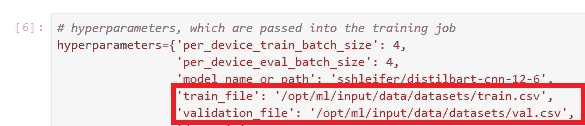**

**作者图片**

**然后，当调用启动训练的 *fit()* 方法时，我们告诉训练作业数据在 S3 的位置:**

**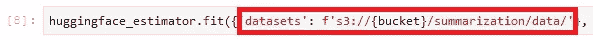**

**作者图片**

**请注意， */opt/ml/input/data* 后面的文件夹名称与通道名称(*数据集*)匹配。这使培训作业能够将数据从 S3 拷贝到本地路径。**

# **开始训练**

**一旦我们做到这一点，我们就可以开始培训工作。如前所述，这是通过调用 *fit()* 方法来完成的。培训作业将运行大约 40 分钟，您可以跟踪进度并在控制台中查看其他信息:**

**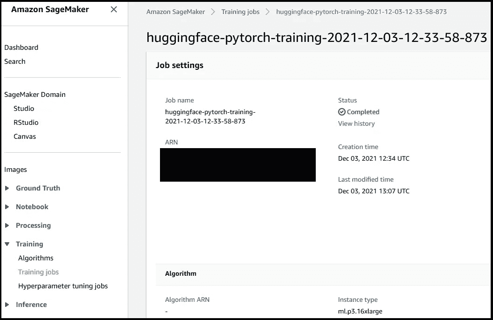**

**作者图片**

**模特训练的完整代码在[这个笔记本](https://github.com/marshmellow77/text-summarisation-project/blob/main/3_model_training.ipynb)里。一旦训练工作完成，就该评估我们新训练的模型了。**

# **第 4 部分—模型评估**

**评估我们的训练模型与我们在第 2 部分中评估 ZSL 模型时所做的非常相似:我们将调用模型并生成候选摘要，并通过计算 ROUGE 得分将它们与参考摘要进行比较。但是现在这个模型在 model.tar.gz S3 的一个名为*的文件中(要找到确切的位置，你可以在控制台中查看培训工作)。那么我们如何访问模型来生成摘要呢？***

**我们有两种选择:要么将模型部署到 SageMaker 端点，要么在本地下载，类似于第 2 部分中 ZSL 模型的情况。在本教程中，我选择[将模型部署到 SageMaker 端点](https://github.com/marshmellow77/text-summarisation-project/blob/main/4a_model_testing_deployed.ipynb)，因为这样更方便，而且通过为端点选择一个更强大的实例，我们可以显著缩短推理时间。也就是说，在 Github repo 中，您还会发现一个[笔记本](https://github.com/marshmellow77/text-summarisation-project/blob/main/4b_model_testing_local.ipynb)，它显示了如何在本地评估模型。**

# **部署模型**

**在 SageMaker 上部署一个训练有素的模型通常很容易，再次参见[这个例子](https://github.com/huggingface/notebooks/blob/master/sagemaker/08_distributed_summarization_bart_t5/sagemaker-notebook.ipynb)来自拥抱脸。一旦模型训练完毕，我们只需调用 *estimator.deploy()* ，SageMaker 会在后台为我们完成剩下的工作。因为在我们的教程中，我们会从一个笔记本切换到下一个笔记本，所以在部署之前，我们必须首先找到培训作业和关联的模型:**

**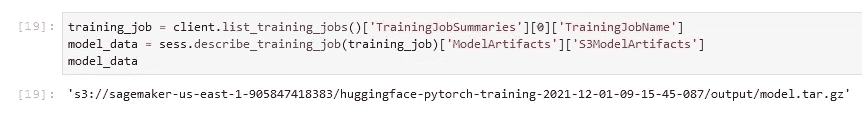**

**作者图片**

**一旦我们获得了模型位置，我们就可以将它部署到 SageMaker 端点:**

**在 SageMaker 上的部署很简单，因为它利用了 [SageMaker 拥抱面部推理工具包](https://github.com/aws/sagemaker-huggingface-inference-toolkit)，这是一个开源库，用于在 Amazon SageMaker 上提供变形金刚模型。我们通常甚至不需要提供一个推理脚本，工具包会处理好的。然而，在这种情况下，工具包再次利用管道 API，正如我们在第 2 部分中讨论的，管道 API 不允许我们使用高级的文本生成技术，比如波束搜索和采样。为了避免这个限制，我们提供了我们的[定制推理脚本](https://github.com/marshmellow77/text-summarisation-project/blob/main/inference_code/inference.py)。**

# **首次评估**

**对于我们新训练的模型的第一次评估，我们将使用与第 2 部分零炮模型相同的参数来生成候选摘要。这允许进行苹果之间的比较:**

**将由模型生成的概要与参考概要进行比较:**

**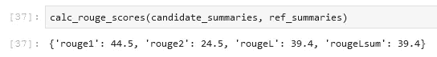**

**这是令人鼓舞的！我们在没有任何超参数调整的情况下首次尝试训练模型，显著提高了 ROUGE 分数:**

**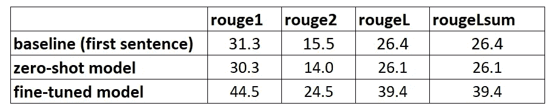**

**作者图片**

# **第二次评估**

**现在终于是时候使用一些更高级的技术了，比如波束搜索和采样来摆弄这个模型。你可以在这篇[出色的博文](https://huggingface.co/blog/how-to-generate)中找到这些参数的详细解释。因此，让我们用这些参数的一组半随机值来尝试一下:**

**当使用这些参数运行我们的模型时，我们得到以下分数:**

**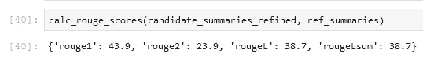**

**作者图片**

**所以这并不像我们希望的那样，胭脂的分数实际上略有下降。但是，不要因此而放弃尝试这些参数的不同值。事实上，这是我们完成设置阶段并过渡到项目实验阶段的地方。**

# **最终结论和后续步骤**

**我们已经完成了实验阶段的设置。我们已经下载并准备了我们的数据，使用简单的启发式方法创建了第一个基线，使用零触发学习创建了另一个基线，然后训练了我们自己的模型，并看到了性能的显著提高。现在是时候对我们创建的每个部分进行修改，以便创建更好的摘要了。一些你可能想尝试的想法:**

*   **适当地预处理数据，例如删除停用词、标点符号等。不要低估这一部分——在许多数据科学项目中，数据预处理是最重要的方面之一(如果不是最重要的),数据科学家通常将大部分时间花在这项任务上。**
*   **尝试不同的模型。在我们的教程中，我们使用标准模型进行总结(*ssleifer/distilbart-CNN-12-6*)，但是我们知道[有更多的模型](https://huggingface.co/models?pipeline_tag=summarization&sort=downloads)可以用于这项任务。其中一个可能更适合您的用例。**
*   **超参数调谐。在训练模型时，我们使用了一组特定的超参数(学习率、时期数等)。这些参数并不是一成不变的，恰恰相反。您希望更改这些参数，以了解它们如何影响您的模型性能。**
*   **文本生成的不同参数。我们已经用不同的参数进行了一轮总结，以利用波束搜索和采样。尝试不同的值和不同的参数。回头参考[这篇博客](https://huggingface.co/blog/how-to-generate)和其他资源，了解它们如何影响文本的生成。**

**我希望你能坚持到最后，并且觉得这篇教程很有用。**