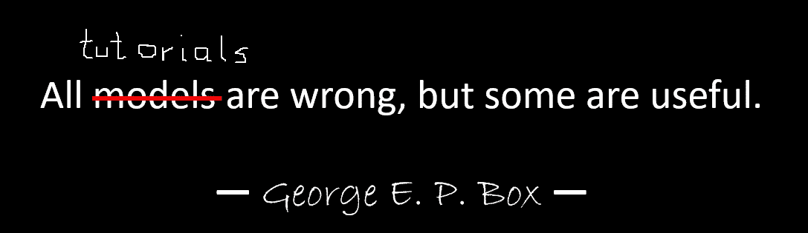

# 建立文本摘要项目(简介)

> 原文：<https://towardsdatascience.com/setting-up-a-text-summarisation-project-introduction-526622eea4a8?source=collection_archive---------15----------------------->

## 拥抱变形金刚深入文本摘要的实用指南

纳迪·博罗迪纳在 [Unsplash](https://unsplash.com?utm_source=medium&utm_medium=referral) 上拍摄的照片

**更新(2021 年 12 月 14 日)**:该教程现已作为一篇长文[发布于此](https://heiko-hotz.medium.com/daae41a1aaa3)。

# 自然语言生成新时代的到来

当 [OpenAI](https://openai.com/) 在 2020 年 7 月发布了专门研究文本生成的第三代机器学习(ML)模型时，我知道有些事情不同了。这个模型触动了前人没有触及的神经。突然，我听到朋友和同事谈论它，他们可能对技术感兴趣，但通常不太关心 AI/ML 领域的最新进展。甚至《卫报》也就此写了一篇文章。或者准确的说是*模特*写的文章，卫报编辑出版。不可否认，GPT 3 号改变了游戏规则。

一旦模型发布，人们立即开始为它想出潜在的应用。几周之内，大量令人印象深刻的演示被制作出来，这些演示可以在棒极了的 GPT-3 网站上找到。一个引起我注意的特殊应用是 ***文本摘要*** ，即计算机阅读给定文本并概括其内容的能力。它结合了自然语言处理(NLP)领域中的两个领域，阅读理解和文本生成，并且是计算机最困难的任务之一。这就是为什么我对 GPT-3 文本摘要演示印象如此深刻。

你可以在 [*拥抱脸空间*网站](https://huggingface.co/spaces)上试试。我目前最喜欢的是一个[应用程序](https://huggingface.co/spaces/Alifarsi/news_summarizer)，它只需要输入文章的 URL 就可以生成新闻文章的摘要。

# 这个教程是关于什么的？

我工作的许多组织(慈善机构、公司、非政府组织)有大量的文本需要阅读和总结——财务报告或新闻文章、科研论文、专利申请、法律合同等。自然，这些组织对使用 NLP 技术自动完成这些任务感兴趣。因此，为了展示可能性的艺术，我经常使用文本总结演示，它们几乎总能给人留下深刻印象。

***但是现在呢？***

这些组织面临的挑战是，他们想要评估基于许多许多文档摘要的文本摘要模型——而不是一次一个。他们不想雇佣一个实习生，他唯一的工作就是打开应用程序，粘贴一个文档，点击“总结”按钮，等待输出，评估总结是否好，然后对数千个文档重新做一遍。

这就把我们带到了这个博客系列的目标:**在这个教程中，我为组织提出了一个实用的指南，这样他们就可以评估他们领域的文本摘要模型的质量。**

# 这个教程是(不是)给谁看的？

我是带着四周前的过去的自己写下这篇教程的，也就是说，当我开始这段旅程的时候，我希望我有这篇教程。从这个意义上说，本教程的目标读者是熟悉 AI/ML 并且以前使用过 Transformer 模型的人，但是他们才刚刚开始他们的文本总结之旅，并且想要更深入地了解它。因为它是由“初学者”为初学者写的，所以我想强调的是，本教程是*实用指南，而不是*实用指南。请像乔治·博克斯所说的那样对待它:**

****

**作者图片**

**就本教程需要多少技术知识而言:它确实涉及一些 Python 中的编码，但大多数时候我们只是使用代码来调用 API，所以也不需要深入的编码知识。熟悉机器学习的某些概念将是有用的，例如,*训练*和*部署*一个模型意味着什么,*训练、验证和测试数据集*的概念，等等。之前接触过[变形金刚库](https://huggingface.co/transformers/)可能会有用，因为我们将在本教程中广泛使用这个库。尽管如此，如果我没有忘记的话，我会试着为这些概念的进一步阅读加入有用的链接；)**

**因为这个教程是一个初学者写的，所以我不指望 NLP 专家和高级深度学习从业者能从这个教程中得到多少。至少从技术角度来看不是这样——不过，你可能仍然喜欢阅读，所以请不要离开！但是你必须对我的简化保持耐心——我试图让本教程中的所有内容尽可能简单，而不是更简单。**

# **本教程的结构**

**这个系列将分为五个部分，我们将经历一个文本摘要项目的不同阶段。在第一部分中，我们将首先介绍文本摘要任务的度量标准，即允许我们评估摘要是“好”还是“坏”的性能衡量标准。我们还将介绍我们想要总结的数据集，并使用非 ML“模型”创建基线，即我们将使用简单的启发式方法从给定文本中生成摘要。创建这个基线在任何人工智能项目中都是至关重要的一步，因为它将使我们能够量化我们通过使用人工智能取得的进展，也就是说，它允许我们回答这样一个问题:“投资人工智能技术真的值得吗？”**

**在下一部分(第 2 部分)中，我们将使用一个已经预先训练好的模型来生成摘要。这是一种现代的称为迁移学习的方法。你可以在这篇文章中读到更多。这是另一个有用的步骤，因为我们基本上采用现成的模型，并在我们的数据集上进行测试。这允许我们创建另一个基线，这将有助于了解当我们在数据集上实际训练模型时会发生什么。这种方法被称为零镜头总结，因为该模型对我们的数据集没有任何影响。**

**之后，是时候使用一个预先训练好的模型，并在我们自己的数据集上训练它了(第 3 部分)。这也叫微调。它将使模型能够从我们数据的模式和特质中学习，并慢慢适应它。一旦我们训练了模型，我们将使用它来创建摘要(第 4 部分)。**

**所以，总结一下(看我做了什么？):**

*   **[第 1 部分:使用非 ML“模型”建立基线](/setting-up-a-text-summarisation-project-part-1-45553f751e14)**
*   **第 2 部分:使用零镜头模型生成摘要**
*   **第 3 部分:训练总结模型**
*   **第 4 部分:评估训练好的模型**

# **本教程结束时，我们将取得什么成果？**

**恐怕现在是残酷的现实检验的时候了:在本教程结束时，我们将**而不是**拥有一个可以在生产中使用的文本总结模型。我们甚至不会有一个**好的**总结模型(此处插入尖叫表情符号)！**

**相反，我们将有一个项目下一阶段的起点，这是实验阶段。这就是数据科学中的*科学*的用武之地，因为现在一切都是关于用不同的模型和不同的设置进行实验，以了解是否可以用可用的训练数据训练出足够好的汇总模型。**

**而且，完全透明地说，很有可能得出的结论是技术还不成熟，项目不会被实现。你必须让你的商业利益相关者为这种可能性做好准备。但那是另一篇博文的内容；)**