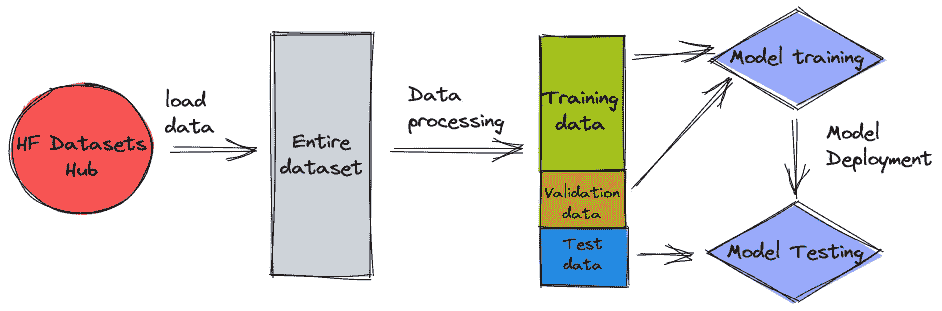
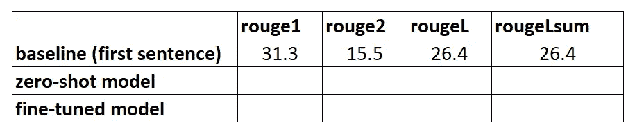

# 建立文本摘要项目(第 1 部分)

> 原文：<https://towardsdatascience.com/setting-up-a-text-summarisation-project-part-1-45553f751e14?source=collection_archive---------16----------------------->

## 如何用非 ML“模型”建立基线

Alexis Fauvet 在 [Unsplash](https://unsplash.com?utm_source=medium&utm_medium=referral) 上拍摄的照片

**更新(2021 年 12 月 14 日)**:该教程现已作为一篇长文[发布于此](https://heiko-hotz.medium.com/daae41a1aaa3)。

# 这是怎么回事？

这是建立文本摘要项目教程的第一部分。有关本教程的更多内容和概述，请参考[简介](/setting-up-a-text-summarisation-project-introduction-526622eea4a8)。

在这一部分中，我们将使用一个非常简单的“模型”建立一个基线，而不实际使用机器学习(ML)。在任何 ML 项目中，这都是非常重要的一步，因为它让我们了解 ML 在项目期间增加了多少价值，以及是否值得投资。

教程的代码可以在这个 [Github repo](https://github.com/marshmellow77/text-summarisation-project) 中找到。

# 数据，数据，数据…

每一个 ML 项目都是从数据开始的！如果可能的话，我们应该总是使用与我们想要通过文本摘要项目实现的目标相关的数据。例如，如果我们的目标是总结专利申请，我们也应该使用专利申请来训练模型。对于一个 ML 项目，一个很大的警告是训练数据通常需要用*标记*。在文本摘要的上下文中，这意味着我们需要提供要摘要的文本以及摘要(“标签”)。只有提供这两者，模型才能知道“好的”摘要是什么样的。

在本教程中，我们将使用公开可用的数据集，但如果我们使用自定义/私有数据集，步骤和代码完全相同。同样，如果你对你的文本摘要模型有一个目标，并且有相应的数据，请使用你的数据来充分利用它。

我们将使用的数据是包含 arXiv 论文摘要及其标题的 [arXiv 数据集](https://www.kaggle.com/Cornell-University/arxiv)。出于我们的目的，我们将使用摘要作为我们想要总结的文本，使用标题作为参考摘要。下载和数据预处理的所有步骤都可以在这个[笔记本](https://github.com/marshmellow77/text-summarisation-project/blob/main/0b_data_prep_arxiv.ipynb)中找到。该数据集是作为这篇[论文](https://arxiv.org/abs/1905.00075)的一部分开发的，并根据[知识共享 CC0 1.0 通用公共领域专用协议](https://creativecommons.org/publicdomain/zero/1.0/)获得许可。

请注意，数据分为三个数据集，即训练、验证和测试数据。如果您想使用自己的数据，请确保情况也是如此。简单提醒一下，这是我们使用不同数据集的方式:

作者图片

自然，此时一个常见的问题是:我们需要多少数据？你可能已经猜到了，答案是:视情况而定。这取决于该领域的专业化程度(总结专利申请与总结新闻文章有很大不同)、该模型需要有多精确才能有用、该模型的训练成本应该是多少等等。我们将在稍后实际训练模型时回到这个问题，但不足的是，一旦我们处于项目的实验阶段，我们将不得不尝试不同的数据集大小。

# 什么是好的模型？

在许多 ML 项目中，度量一个模型的性能是相当简单的。这是因为模型的结果是否正确通常没有什么模糊性。数据集中的标签通常是二元的(真/假，是/否)或分类的。无论如何，在这种情况下，很容易将模型的输出与标签进行比较，并将其标记为正确或不正确。

当生成文本时，这变得更具挑战性。我们在数据集中提供的摘要(标签)只是总结文本的一种方式。但是总结一篇给定的文章有很多可能性。因此，即使模型与我们的标签 1:1 不匹配，输出可能仍然是有效和有用的摘要。那么，我们如何比较模型的总结和我们提供的总结呢？文本摘要中最常用来衡量模型质量的指标是 [ROUGE score](https://en.wikipedia.org/wiki/ROUGE_(metric)) 。为了理解这个指标的机制，我推荐[这篇博文](/the-ultimate-performance-metric-in-nlp-111df6c64460)。总之，胭脂分数测量模型摘要(候选摘要)和参考摘要(我们在数据集中提供的标签)之间的 [n-grams](https://en.wikipedia.org/wiki/N-gram) (连续的 *n* 项序列)的重叠。但是，当然，这不是一个完美的措施，并了解其局限性，我很喜欢[这篇文章](/to-rouge-or-not-to-rouge-6a5f3552ea45)。

那么，我们如何计算胭脂分数呢？有相当多的 Python 包来计算这个指标，为了确保一致性，我们应该在整个项目中使用相同的方法。因为在本教程的稍后部分，我们将非常 l̶a̶z̶y̶聪明地使用变形金刚库中的训练脚本，而不是编写我们自己的脚本，所以我们可以只查看脚本的[源代码](https://github.com/huggingface/transformers/blob/v4.6.1/examples/pytorch/summarization/run_summarization.py#L503)并复制计算胭脂分数的代码:

通过使用这种方法来计算分数，我们可以确保在整个项目中始终进行比较。

注意，这个函数将计算几个 ROUGE 分数: *rouge1* 、 *rouge2* 、 *rougeL* 和*rougeL sum*(*rougeL sum*中的“总和”是指这个度量是在整个摘要上计算的，而 *rougeL* 是作为单个句子的平均值计算的)。那么，我们应该为我们的项目使用哪个 ROUGE 分数呢？同样，我们将不得不在试验阶段尝试不同的方法。值得一提的是，[原始 ROUGE 论文](https://aclanthology.org/W04-1013.pdf)称“ROUGE-2 和 ROUGE-L 在单个文档摘要任务中表现良好”，而“ROUGE-1 和 ROUGE-L 在评估简短摘要方面表现出色”。

# 创建基线

接下来，我们想通过使用一个简单的非 ML 模型来创建基线。那是什么意思？嗯，在文本摘要领域，许多研究使用一种非常简单的方法:他们提取文本的前 *n* 个句子，并将其声明为候选摘要。然后，他们将候选摘要与参考摘要进行比较，并计算 ROUGE 分数。这是一个简单而强大的方法，我们可以用几行代码实现(这部分的完整代码可以在这个[笔记本](https://github.com/marshmellow77/text-summarisation-project/blob/main/1_baseline_model.ipynb)中找到):

请注意，我们使用测试数据集进行评估。这是有意义的，因为一旦我们训练模型，我们也将使用相同的测试数据集进行最终评估。我们也为 *n* 尝试不同的数字，即我们只从第一句开始作为候选摘要，然后是前两句，最后是前三句。

这些是我们第一个“模型”的结果:

作者图片

我们可以看到，只有第一句话作为候选摘要，得分最高。这意味着使用一个以上的句子会使总结变得冗长，从而导致较低的分数。这意味着我们将使用一句话总结的分数作为基线。

值得注意的是，对于这样一个简单的方法，这些数字实际上相当不错，特别是对于 *rouge1* 分数。为了将这些数字放在上下文中，我们可以查看第[页](https://huggingface.co/google/pegasus-xsum)，它显示了不同数据集的最先进模型的分数。

# 结论和下一步

我们已经介绍了将在整个总结项目中使用的数据集以及评估总结的指标。然后，我们用一个简单的非 ML 模型创建了以下基线:

作者图片

在下一部分中，我们将使用零镜头模型，即经过专门训练用于公共新闻文章文本摘要的模型。然而，这个模型根本不会在我们的数据集上训练(因此得名“零炮”)。

我会把它作为家庭作业留给你们，让你们猜猜这个零射击模型与我们非常简单的基线相比会有什么表现。一方面，它将是一个更加复杂的模型(实际上是一个神经网络)，另一方面，它仅用于概括新闻文章，因此它可能会与 arXiv 数据集固有的模式相冲突。