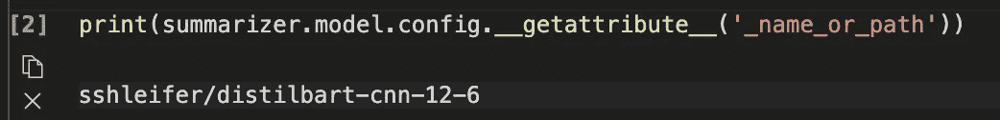
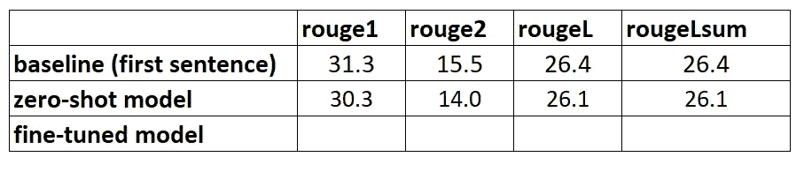

# 建立文本摘要项目(第 2 部分)

> 原文：<https://towardsdatascience.com/setting-up-a-text-summarisation-project-part-2-a2a8c49193e2?source=collection_archive---------12----------------------->

## 利用拥抱脸的管道 API 利用零射击学习进行文本摘要

戴维·dvořáček 在 [Unsplash](https://unsplash.com?utm_source=medium&utm_medium=referral) 上的照片

**更新(2021 年 12 月 14 日)**:该教程现已作为一篇长文[发布于此](https://heiko-hotz.medium.com/daae41a1aaa3)。

# 这是怎么回事？

这是建立文本摘要项目教程的第二部分。有关本教程的更多内容和概述，请参考[简介](/setting-up-a-text-summarisation-project-introduction-526622eea4a8)以及[第 1 部分](/setting-up-a-text-summarisation-project-part-1-45553f751e14)，在其中我们为我们的项目创建了一个基线。

在这篇博文中，我们将利用[零射击学习](https://en.wikipedia.org/wiki/Zero-shot_learning) (ZSL)的概念，这意味着我们将使用一个经过训练的模型来总结文本，但尚未看到任何 [arXiv 数据集的示例](https://www.kaggle.com/Cornell-University/arxiv)。这有点像当你这辈子一直在做的都是风景画的时候，试图去画一幅肖像。你知道如何绘画，但你可能不太熟悉肖像绘画的复杂性。

整个教程的代码可以在这个 [Github repo](https://github.com/marshmellow77/text-summarisation-project) 中找到。今天我们将特别使用[这个笔记本](https://github.com/marshmellow77/text-summarisation-project/blob/main/2_zero_shot.ipynb)。

# 为什么零起点学习(ZSL)？

ZSL 在过去几年中变得流行起来，因为它允许在没有培训的情况下利用最先进的 NLP 模型。他们的表现有时相当惊人:[大型科学研究工作组](https://bigscience.huggingface.co/)最近发布了他们的 T0pp(发音为“T Zero 组合+”)模型，该模型经过专门训练，用于研究零射击多任务学习。在[大工作台](https://github.com/google/BIG-bench)基准测试中，它经常超过 6 倍大的模型，在其他几个 NLP 基准测试中，它也超过 16 倍大的 [GPT-3](https://github.com/openai/gpt-3) 。

ZSL 的另一个好处是使用它只需要两行代码。通过尝试，我们可以创建第二个基线，一旦我们在数据集上对模型进行了微调，就可以用它来量化模型性能的提高。

# 建立零起点学习管道

为了利用 ZSL 模型，我们可以使用 Hugging Face 的 [*管道* API](https://huggingface.co/docs/transformers/main_classes/pipelines) 。这个 API 使我们能够使用只有两行代码的文本摘要模型，同时它负责 NLP 模型中的主要处理步骤:

1.  文本被预处理成模型可以理解的格式。
2.  预处理后的输入被传递给模型。
3.  模型的预测是后处理的，所以你可以理解它们。

它利用了[拥抱面部模型中枢](https://huggingface.co/models?pipeline_tag=summarization&sort=downloads)上已经可用的总结模型。

所以，下面是如何使用它:

就是这样，信不信由你。这段代码将下载一个汇总模型，并在您的机器上本地创建汇总。如果您想知道它使用的是哪种模型，您可以在[源代码](https://github.com/huggingface/transformers/blob/master/src/transformers/pipelines/__init__.py)中查找或者使用以下命令:

当我们运行这个命令时，我们看到用于文本摘要的 defaukt 模型被称为*sshleifer/distilbart-CNN-12–6*:

作者图片

我们可以在拥抱脸网站上找到该模型的[模型卡](https://huggingface.co/sshleifer/distilbart-cnn-12-6)，在那里我们还可以看到该模型已经在两个数据集上进行了训练: [CNN Dailymail 数据集](https://huggingface.co/datasets/cnn_dailymail)和[极端摘要(XSum)数据集](https://huggingface.co/datasets/xsum)。值得注意的是，该模型不熟悉 arXiv 数据集，仅用于总结与其训练过的文本相似的文本(主要是新闻文章)。型号名称中的数字 12 和 6 分别指编码器层数和解码器层数。解释这些是什么超出了本教程的范围，但是你可以在 Sam Shleifer 的博客文章中读到更多关于它的内容，他创建了这个模型。

我们将继续使用默认模型，但我鼓励您尝试不同的预培训模型。所有适合总结的模型都可以在[这里](https://huggingface.co/models?pipeline_tag=summarization&sort=downloads)找到。要使用不同的模型，您可以在调用管道 API 时指定模型名称:

## 侧边栏:提取与抽象总结

我们还没有谈到两种可能但不同的文本摘要方法:*提取* vs *抽象*。摘要概括是将从文本中提取的内容连接成一个摘要的策略，而抽象概括包括用新句子解释语料库。大多数摘要模型都是基于生成新文本的模型(它们是自然语言生成模型，例如， [GPT-3](https://github.com/openai/gpt-3) )。这意味着总结模型也会产生新的文本，这使得它们成为抽象的总结模型。

# 生成零镜头摘要

现在我们知道了如何使用它，我们想在我们的测试数据集上使用它，与我们在第 1 部分中用来创建基线的数据集完全相同。我们可以用这个循环来实现:

注意，我们有*最小长度*和*最大长度*参数来控制模型生成的摘要。在这个例子中，我们将*的最小长度*设置为 5，因为我们希望标题至少有 5 个单词长。通过查看参考摘要(即研究论文的实际标题),看起来 20 可能是 *max_length* 的合理值。但同样，这只是第一次尝试，一旦项目进入实验阶段，这两个参数可以而且应该改变，以查看模型性能是否发生变化。

## 侧边栏:波束搜索、采样等。

如果您已经熟悉文本生成，您可能知道还有许多参数会影响模型生成的文本，如光束搜索、采样和温度。这些参数使您能够更好地控制正在生成的文本，例如，使文本更加流畅，减少重复等。这些技术在管道 API 中是不可用的——你可以在[源代码](https://github.com/huggingface/transformers/blob/master/src/transformers/pipelines/text2text_generation.py#L151)中看到 *min_length* 和 *max_length* 是唯一要考虑的参数。然而，一旦我们训练并部署了我们自己的模型，我们就可以访问那些参数了。在本系列的第 4 部分中会有更多的介绍。

# 模型评估

一旦我们生成了零镜头摘要，我们可以再次使用我们的 ROUGE 函数来比较候选摘要和参考摘要:

对使用 ZSL 模型生成的摘要运行此计算，我们得到以下结果:

作者图片

当我们将这些与第一部分的基线进行比较时，我们看到这个 ZSL 模型实际上比我们简单的只取第一句话的试探法表现得更差。同样，这并不出人意料:尽管这个模型知道如何总结新闻文章，但它从未见过总结学术研究论文摘要的例子。

# 结论

我们现在已经创建了两条基线，一条使用简单的启发式方法，另一条使用 ZSL 模型。通过比较 ROUGE 分数，我们看到简单启发式算法目前优于深度学习模型:

作者图片

在下一部分中，我们将采用这种完全相同的深度学习模型，并尝试提高其性能。我们将通过在 arXiv 数据集上训练它来做到这一点(这一步也被称为*微调*):我们利用了它已经知道如何概括文本的事实。然后，我们向它展示了大量 arXiv 数据集的示例。深度学习模型一旦接受训练，就非常擅长识别数据集中的模式，因此我们确实希望该模型在这项特定任务中变得更好。