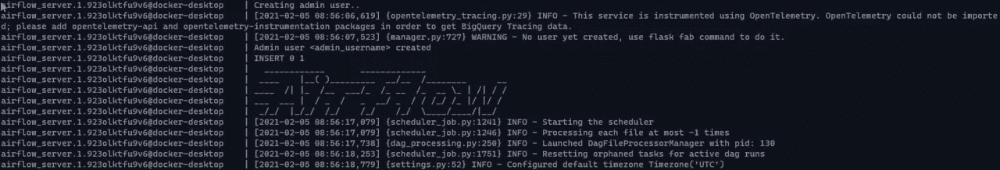

# 使用 Docker 设置 Apache Airflow 2

> 原文：<https://towardsdatascience.com/setting-up-apache-airflow-2-with-docker-e5b974b37728?source=collection_archive---------1----------------------->


Mikel Parera 在 [Unsplash](https://unsplash.com?utm_source=medium&utm_medium=referral) 上的照片

## 使用 Docker 设置著名任务编排器新版本的分步指南

# **简介**

一个 [帕切气流 2](https://airflow.apache.org/blog/airflow-two-point-oh-is-here/) 终于出来了。在宣布的新特性中(一个全新的调度器，稳定的 REST APIs 等等),已经发布了一个生产就绪的 Dockerfile。这使得开发人员可以使用现代云技术部署气流，而不是将其安装在裸机上。

在本文中，我们将了解如何使用 [VirtualBox](https://www.virtualbox.org/) 和[vagger](https://www.vagrantup.com/)创建一个本地环境，安装 Docker 并部署一个生产就绪的气流容器。开始吧！

# 局部环境

在本节中，我们将了解如何创建一个虚拟机，安装 docker 并配置一个共享文件夹，以便轻松访问客户机中的本地文件。如果您不想在实验中使用 VM，请随意跳过这一部分。

## **配置虚拟机**

假设您已经在本地机器上安装了 VirtualBox 和 vagger，这是代表我们想要构建的虚拟机的清单(*vagger file*):

流浪档案

这个清单指定了" *airflow-vm"* (主机名)必须是什么样子:

*   基于 *ubuntu/xenial64* 图片
*   4GB 内存
*   使用 IP *192.168.1.200*
*   在 */opt/airflow* 下挂载*共享*文件夹(必须在与*流浪文件*相同的路径下创建)

打开一个新的终端窗口，移动到*流浪文件*路径，简单输入:

```
vagrant up
vagrant ssh
```

## **安装对接器**

现在是时候在这个全新的虚拟机上安装 Docker 了。我们将通过键入以下命令来使用[官方 docker-install 脚本](https://github.com/docker/docker-install):

```
curl -fsSL https://get.docker.com -o get-docker.sh\
sh get-docker.sh\
```

如果一切正常，我们应该能够运行以下命令:

```
sudo docker run hello-world
```

# 码头集装箱上的气流 2

在这一节中，我们将从[官方 Docker 映像(2.0 稳定版)](https://github.com/apache/airflow/blob/v2-0-stable/Dockerfile)开始，在其上添加一个*瘦*层，以自动创建一个管理帐户并轻松配置一个[外部 Postgres 数据库](https://airflow.apache.org/docs/apache-airflow/stable/howto/initialize-database.html)，从而通过*本地执行器实现并行。*

## **进场**

从最后说起吧(是的，诺兰和特尼特改变了我的想法)。我们的目标是创建一个由 Airflow 2 (web 服务器和调度程序可以分开部署，但是对于本文来说，一体化解决方案可能更合适)和 Postgres 数据库组成的堆栈。我们将使用下面的 *docker-compose* 文件:

docker-compose.yaml

这里我们定义了两个服务: *postgres* (我们的 db)和 *server* (airflow)。

我们来分解一下！

## **方法— Postgres 数据库**


学分: [PostgreSQL 网站](https://www.postgresql.org/)

```
postgres:
  image: postgres:12-alpine
  env_file:
    - postgres.env
  volumes:
    - postgres:/data/postgres
    - ./scripts/postgres/:/docker-entrypoint-initdb.d/
```

Postgres(基于 alpine 的 v12)由外部环境文件初始化:

```
POSTGRES_USER=airflow
POSTGRES_PASSWORD=<db_pass_here>
POSTGRES_DB=airflow
PGDATA=/data/postgres
```

和一个 00_init.sql 文件(在一个目录 scripts/postgres 中),它只是创建一个表:

```
CREATE TABLE airflow__extra_conf(
  conf_name  VARCHAR (255) PRIMARY KEY,
  conf_value VARCHAR (255) NOT NULL
);
```

Postgres 数据通过创建一个映射到 */data/postgres 的卷来持久化。*

## **方法—气流服务器**


演职员表:[阿帕奇气流网站](https://airflow.apache.org/)

```
server:
  image: airflow2-docker:1.0.0 # build this first
  env_file:
    - airflow.env
    - airflow_db.env
  ports:
    - "8080:8080"
  volumes:
    - ./dags:/opt/airflow/dags
```

Airflow server 是基于官方 2.0 稳定版的自定义 docker 镜像(将在下一节介绍)。我们使用两个环境文件: *airflow.env* (气流配置)和 *airflow_db.env* (数据库配置)。

这是一个最小的 airflow.env，您可以根据自己的需要[扩展它](https://airflow.apache.org/docs/apache-airflow/stable/howto/set-config.html):

```
# -- CORE
AIRFLOW__CORE__EXECUTOR=LocalExecutor
AIRFLOW__CORE__LOAD_EXAMPLES=False# -- WEBSERVER
AIRFLOW__WEBSERVER_BASE_URL=http://192.168.1.200 # here your VM IP# -- SCHEDULER
AIRFLOW__SCHEDULER__MIN_FILE_PROCESS_INTERVAL=60# -- ADMIN
SECURITY__ADMIN_USERNAME=<admin_username>
SECURITY__ADMIN_FIRSTNAME=<admin_firstname>
SECURITY__ADMIN_LASTNAME=<admin_lastname>
SECURITY__ADMIN_EMAIL=<admin_email>
SECURITY__ADMIN_PASSWORD=<admin_password>
```

请注意，由于我们不想使用内部的 SQLight 数据库，我们已经将 *LocalExecutor* 指定为*核心执行器*。本地执行器也将允许我们 Dag 中的任务并行。

*airflow_db.env* 包含我们在上一步中设置的外部数据库信息:

```
# -- DB
DB__HOST=airflow_postgres #docker stack name + _postgres
DB__PORT=5432
DB__USERNAME=airflow
DB__PASSWORD=<db_pass_here>
DB__NAME=airflow
```

我们还将挂载一个 *dags* 文件夹，在那里我们将放置我们的 DAG 文件。

## **气流 2 Dockerfile**

让我们看看自定义气流图像是什么样子的:

```
*FROM* apache/airflow:2.0.0-python3.7*USER* root*# INSTALL TOOLS
RUN* apt-get update \
&& apt-get -y install libaio-dev \
&& apt-get install postgresql-client*RUN* mkdir extra*USER* airflow*# COPY SQL SCRIPT
COPY* scripts/airflow/check_init.sql ./extra/check_init.sql
*COPY* scripts/airflow/set_init.sql ./extra/set_init.sql*# ENTRYPOINT SCRIPT
COPY* scripts/airflow/init.sh ./init.sh*ENTRYPOINT* ["./init.sh"]
```

这基本上安装了一些依赖项(我们马上会看到为什么需要 postgresql-client)，添加了两个 sql 脚本并运行了一个提供的 SH 脚本。让我们看看他们从结尾开始都做了些什么(再次感谢诺兰):

初始化. sh

一旦数据库可用，脚本将检查管理员用户是否存在，如何检查？还记得 *airflow__extra_conf* 表吗？它用于存储一个标志，该标志决定了正确的服务器初始化。

我们来看看 *check_init.sql* :

```
SELECT count(conf_name) FROM airflow__extra_conf WHERE conf_name='IS_INITIALIZED';
```

如果没有一个 *IS_INITIALIZED* 配置，SH 脚本会创建管理员帐户，然后使用 *set_init.sql* 设置配置:

```
INSERT INTO airflow__extra_conf VALUES('IS_INITIALIZED','1');
```

通过这种方式，管理员用户只需创建一次，而无需依赖其他解决方案(比如将文件保存在卷中)。

最终的项目结构应该如下所示:

```
/-- Vagrantfile
|-- shared
   |-- dags
   |-- scripts
      |-- airflow
         -- check_init.sql
         -- set_init.sql
         -- init.sh
      |-- postgres
         -- 00_init.sql
    -- Dockerfile
    -- docker-compose.yaml
    -- airflow.env
    -- airflow_db.env
    -- postgres.env
```

# **准备部署**

假设您已经通过更改 IP、db 密码和管理员凭证更改了环境变量文件，那么您已经准备好使用 Docker 来**部署 Airflow 了。**

```
cd /opt/airflow
sudo docker stack deploy -c docker-compose.yaml airflow
```

可以使用以下方式查看 Airflow 服务器日志:

```
sudo docker service logs -f airflow_server
```

一旦您看到消息"*创建管理员用户..*”和 Airflow 徽标，您可以使用 UI 登录了。



打开您的浏览器并转到 *192.168.1.200:8080* 。输入您的管理员凭据，瞧！

# **接下来是什么？**

现在，您可以将 Dag 上传到*Dag*文件夹中，并通过 UI 运行它们。

在下一篇文章中，我们将看到如何建立一个 Docker Swarm 集群，并使用 *DockerSwarmOperator 在其中分配负载。*