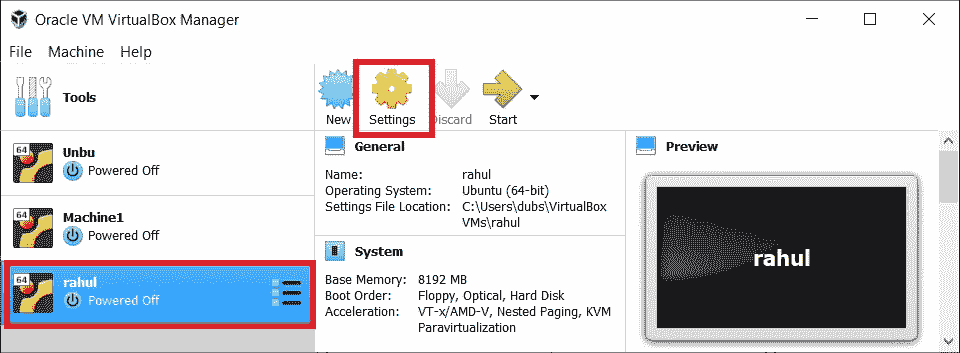
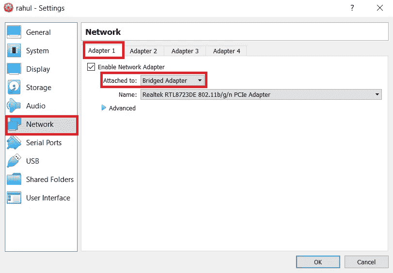
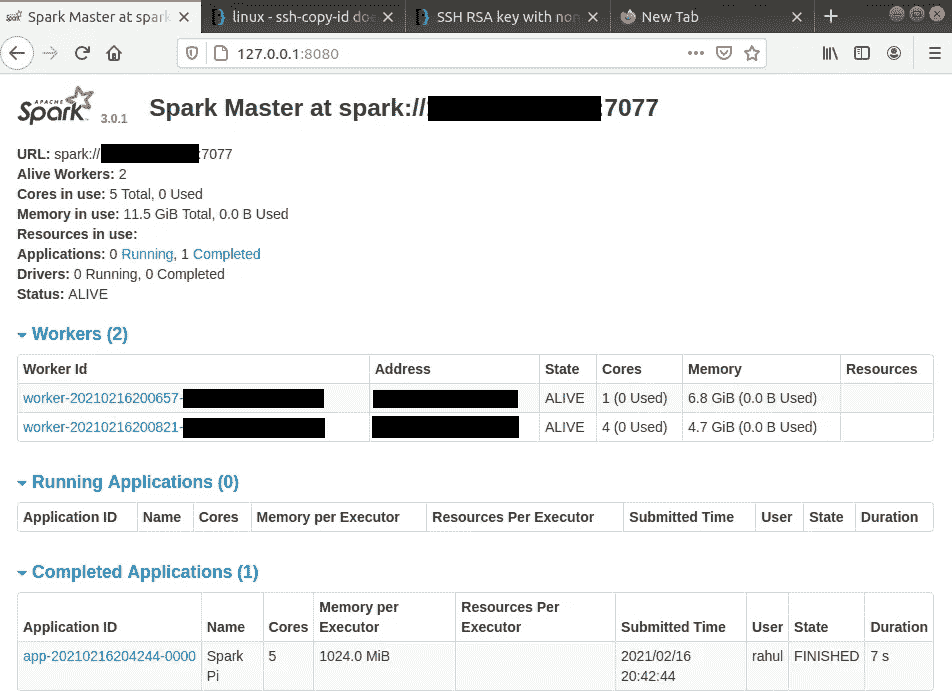

# 在独立模式下设置 Apache Spark

> 原文：<https://towardsdatascience.com/setting-up-apache-spark-in-standalone-mode-81efb78c2b52?source=collection_archive---------12----------------------->

## 一种完整的并行计算集群构建方法

在这篇文章中，我们将在独立集群模式下设置 Apache Spark。Apache Spark 是一个框架，用于解决大数据问题，如数据处理、特征工程、机器学习和处理流数据。Apache Spark 提供了一种方法，通过使用独立的、YARN 或 MESOS 集群管理器进行并行计算，用几个工作节点来分配您的工作负载。其中最简单的是独立集群管理器，它不需要对配置文件进行太多的修改就可以设置自己的处理集群。

在这篇文章中，我不会涉及概念上的细节，而是实际的细节。对于有多个节点的集群，我将使用两个节点，一台机器独立安装 Ubuntu，另一台机器安装 VM 并激活桥接适配器。如果桥接适配器未激活，请执行以下步骤。

# **为主机 IP 地址共享设置虚拟机**



**1。选择机器，然后转到设置(作者图片)**



**2。切换到网络选项卡并选择适配器 1。在此检查后，如果未选中“启用网络适配器”。从下拉框中选择“桥接适配器”。(图片由作者提供)**

要检查您的 IP 地址是否正与虚拟机共享，请打开并登录到您的虚拟机，然后在终端中键入:

```
#If "ifconfig" not installed
$ sudo apt-get install net-tools
$ ifconfig
```

您应该看到您的 IP 地址与您的主机相同。

# **设置 Apache Spark 环境**

完成基本网络配置设置后，我们需要设置 Apache Spark 环境，方法是安装二进制文件、依赖项，并将系统路径添加到 Apache Spark 目录和 python 目录，以运行 Spark 的 bin 目录中提供的 Shell 脚本来启动集群。

```
-----PYTHON SETUP-----
#Check if "python3" is installed
$ python3 --version#If "pyhon3" not installed, then type commands below
#This will install python 3.6.9
$ sudo apt-get install python3.6#Check if pip is installed, since we might need it in future
$ pip3 --version#If pip3 not installed, then type commands below
$ sudo apt install python3-pip#Also install some other dependencies
$sudo apt-get install python3-numpy python3-matplotlib python3-scipy-----JAVA SETUP----
#Check if JAVA is installed, this is required by Spark which works #underneath it.
$ java -version#If not installed, type the command below
#This will install JAVA-11
$ sudo apt install default-jdk#Once JAVA installed, add it to the environment path
$ sudo update-alternatives --config java#copy the path from above command and paste it to environment as #"JAVA_HOME=/path/to/JAVA"
$ sudo nano /etc/environment
```

我们需要使用 SSH-keygen 设置 SSH-key，以允许 Spark 通过预授权访问机器。

```
#Install ssh
$ sudo apt-get install openssh-server openssh-client#Edit the sshd_config file to allow certain permissions
$ sudo nano /etc/ssh/sshd_config
PermitRootLogin yes
PubkeyAuthentication yes
PasswordAuthentication yes#Restart sshd services to reflect the changes in file
$ services sshd restart
```

到目前为止，所有步骤都需要在所有节点上完成。我们现在需要生成公钥，并将其复制到其他节点进行无密码身份验证。

仅对要启动 Spark master 的节点执行以下步骤。

```
# Generate key with rsa algorithm
#This will create a .ssh directory at /home/usr
$ ssh-keygen -t rsa#Skip paraphrase and other information by pressing "ENTER"#Copy id_rsa.pub public key using scp to all other nodes' root #directories. This will ask you to enter password for root@worker_1_IP #and root@worker_2_IP first time.
$ scp .ssh/id_rsa.pub root@worker_1_IP:
$ scp .ssh/id_rsa.pub root@worker_2_IP:#Change to root directory by typing "cd ~".#Switch to root@worker_1_IP and root@worker_2_IP and copy id_rsa.pub #from root directory to home directory of user.
$ ssh root@worker_1_IP (and for worker_2 also)
$ cp id_rsa.pub /home/usr/.ssh/authorized_keys#Above step will ask you to overwrite key if already present.#Once done with above steps, check if password-less authorisation #works from your Master node.
$ ssh usr@worker_1_IP
$ ssh usr@worker_2_IPNOTE: I would advice you to keep the user name for the machines in VM same if security is not an issue because the Spark requires Master node user (in my case "rahul") to be given permission for login as usr@worker_1_IP and usr@worker_2_IP where usr has to be same (in my case "rahul").#Another alternative is to create users on salve machines with sudo permissions.
```

下面，我们安装 Apache Spark 并修改配置文件来设置集群。我们已经安装了所有的依赖项和网络配置，以确保 Spark 运行无误。对所有节点执行这些步骤。

```
#Download Apache Spark-3.0.1 with hadoop2.7 tar file
$ wget [https://downloads.apache.org/spark/spark-3.0.1/spark-3.0.1-bin-hadoop2.7](https://downloads.apache.org/spark/spark-3.0.1/spark-3.0.1-bin-hadoop2.7) tgz#Check if tar file is present
$ ls -la#Extract the tar file
$ tar xvf spark-*#Move the file to /opt/spark
$ sudo mv spark-3.0.1-bin-hadoop2.7 /opt/spark#/opt/spark is going to be your SPARK_HOME directory. Also add #python3 directory path as PYSPARK_PYTHON. These change are to be #done in .profile file
$ sudo nano .profile#Add following variables and path
export SPARK_HOME=/opt/spark
export PATH=$PATH:$SPARK_HOME/bin:$SPARK_HOME/sbin
export PYSPARK_PYTHON=/usr/bin/python3#save and close .profile file and recompile it
$ source .profile
```

现在我们只编辑主节点的配置文件。不要在从属节点上执行这些步骤。

```
#Copy and edit spark-env.sh.template and slave.template file
$ cp $SPARK_HOME/conf/spark-env.sh.template $SPARK_HOME/conf/spark- env.sh$cp $SPARK_HOME/conf/slaves.template $SPARK_HOME/conf/slaves#Open spark-env.sh file and add JAVA_HOME and other configurations 
#like Memory or CPU core numbers
$ sudo nano $SPARK_HOME/conf/spark-env.sh#add at the end of the file
export JAVA_HOME=/path/to/JAVA or $JAVA_HOME(from /etc/environment)
export SPARK_MASTER_HOST=master_IP#Open slaves file and add IP address of slaves. Delete "localhost" #if present
worker_1_IP
worker_2_IP#Save the file above and run command below to check if all nodes #starts
$ $SPARK_HOME/sbin/start-all.sh#Go to web browser and type
http://127.0.0.1:8080/
#This will show the number of workers, their running status, their configuration and other information.#To stop the Master and workers
$ $SPARK_HOME/sbin/stop-all.sh#To start SPARK SHELL which will run SCALA programming language
#Quit it using ":q" and enter
$ $SPARK_HOME/bin/spark-shell#To start SPARK SHELL with PYTHON programming language
# Quit it using "exit()" and enter
$ $SPARK_HOME/bin/pyspark
```

# 向群集提交应用程序

我们可以通过提交申请来检查我们的集群是否正常工作。Spark 应用程序检测保存 SparkConf 对象的 SparkContext 实例，该对象指定应用程序必须在本地进程还是集群进程中运行。我们将在以后的文章中讨论这个问题，但是现在只运行下面的代码来计算圆周率的值。

```
#IP=MASTER node IP address
#PORT=7077 for me
#You can check your master address by opening #[https://127.0.0.1:8080/](https://217.0.0.1:8080/)
$ MASTER=spark://IP:PORT $SPARK_HOME/bin/run-example org.apache.spark.examples.SparkPi#You should get a value and bunch of warnings
```

您应该会在 Spark UI 上看到类似的屏幕，如下所示。



**SparkUI:作业完成(作者图片)**

# 结论

在这篇文章中，我们学习了如何在 Apache Spark 中设置自己的集群环境，以及如何向它提交一个简单的应用程序，并使用 Spark UI 导航节点的状态。在接下来的文章中，我将解释如何配置您的应用程序在集群环境中执行，并以 rdd(弹性分布式数据集)的形式保存它们的结果。

# 参考

[1].http://spark.apache.org/docs/latest/spark-standalone.html