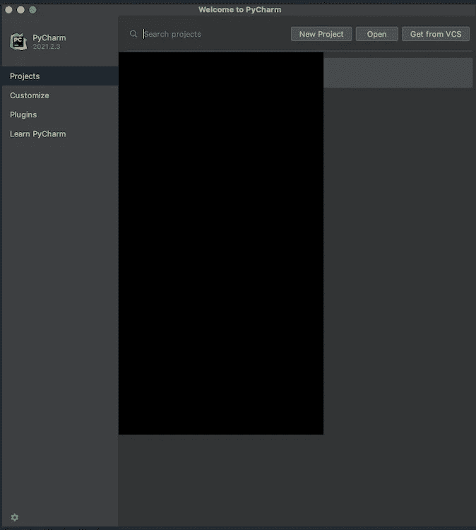
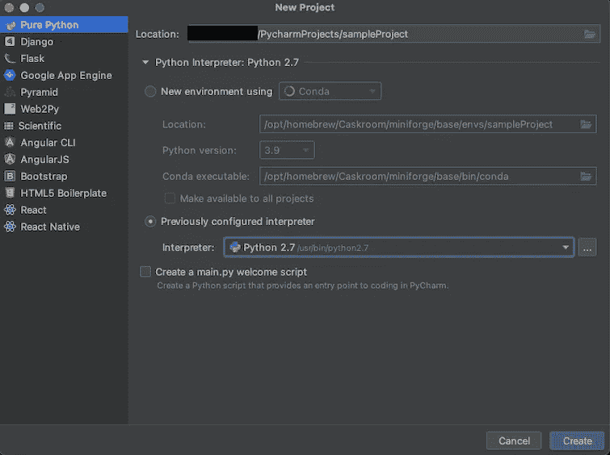
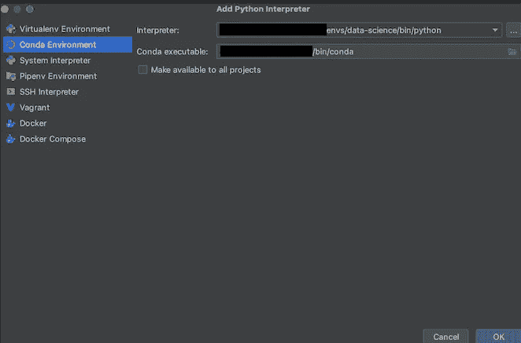

# 为机器学习设置苹果的 M1 MacBooks

> 原文：<https://towardsdatascience.com/setting-up-apples-new-m1-macbooks-for-machine-learning-f9c6d67d2c0f?source=collection_archive---------1----------------------->

## 适用于 M1 专业版、M1 Max 和普通 M1 芯片

随着定制 M1 芯片的最新迭代，M1 Pro 和 M1 Max 版本，苹果给了机器学习社区一个强大的工具。然而，在某种程度上，这种力量只有在系统设置正确的情况下才能释放出来——尽管苹果公司通常对用户友好，但这不是一项简单的任务。

杰里米·贝赞格在 [Unsplash](https://unsplash.com?utm_source=medium&utm_medium=referral) 上的照片

[在之前的一篇文章](/apples-new-m1-pro-and-m1-max-macbooks-940e104ad6e1)中，我将做事的过程与我们天生的求知欲联系起来。这篇文章是一个后续:它展示了如何为机器学习准备 M1 macbook。

机器学习的典型设置包括 a)使用虚拟环境，b)在其中安装所有包，c)使用 python，d)分析数据，以及 e)训练模型。因此，我们从建立虚拟环境开始。

我这边的一个简短说明(2022 年 3 月):在这篇文章的初始版本发布后近半年，我仍然定期回到这里，要么更新说明，要么为自己复习一下——特别是在设置 TensorFlow 时……我希望它也能同样很好地为你服务。

# 设置虚拟环境

虚拟环境帮助我们保持不同(python/code)项目之间的差异。例如，任务 A 可能需要特定程序的 1.0 版本来创建奇妙的动画。现在，项目 B 也需要这个程序，但是需要从版本 2.0 起才可用的其他特性。因此，我们没有合并项目的依赖关系，而是创建单独的虚拟空间。

我们可以把它们想象成盒子，每个项目都使用自己的盒子。通过使用这种方法，我们最小化了项目之间的干扰。这反过来减少了可能出现的问题。例如，如果我们不小心将一个程序从 1.0 更新到 2.0，但一个项目仍然需要 1.0 的功能，会发生什么？另一个项目需要从 2.0 开始引入的特性？因此，通过使用虚拟空间，我们可以省去精神上的麻烦。

Anaconda 和 venv(包含在 python 中)是处理这个问题最常用的工具。在本文中，我将使用 Anaconda，或者更具体地说，conda 实用程序。我这样做是因为在 M1 macbook 上安装 TensorFlow 目前需要 conda 工具才能顺利安装。(高级用户:尝试自己编译包。)

我们将从下载一个叫做 Miniforge 的小程序开始，它是 Conda 的最小安装程序。最小化意味着它并不臃肿，只包含一些基本的特性。这对于我们的用例来说已经足够了；我们将手动安装所有需要的东西。

首先，[下载最新版本](https://github.com/conda-forge/miniforge/releases/latest/download/Miniforge3-MacOSX-arm64.sh)。下载完成后，打开一个终端窗口(使用 spotlight 搜索，键入*终端*，点击回车。)和类型:

这使得下载的文件可执行，并允许下一步:

在终端中输入上面的行之后，会要求您检查许可证。点击 *q* 跳到最后，键入 *yes* 表示同意。接下来，你会被问到你想在哪里安装 Miniforge。默认情况下，这是

*X* 是 Miniforge 的当前版本。在撰写本文时，这是 3。

保持原样，然后按回车键。如果询问您是否想要初始化它，键入 *yes* 。然后，通过同时按 CMD 和 q 关闭终端，并重新打开它。

你会像往常一样受到欢迎，但是终端窗口现在显示

> (基数) <your_username>@ <name_of_your_machine>~ %</name_of_your_machine></your_username>

“(基础)”部分意味着您已经成功创建并激活了您的第一个环境！然而，在本文的剩余部分，我们将使用另一个环境，我们通过键入:

当询问您是否要继续时，键入 *y* (表示*是*)。

完成后，它说，除其他事项外:

> #要激活此环境，请使用
> 
> #
> 
> # $ conda 激活数据-科学

我们会做到的。我们因此打字

这就把(基础)部分变成了(数据科学)，这正是我们想要的。我们现在开始安装我们需要的所有软件包。

# 将包安装到虚拟环境中

PyTorch 和 TensorFlow 是机器学习相关的最常用的框架。除此之外，Scikit-Learn 库对于许多任务都非常方便。

## 安装 PyTorch

我们从更容易安装的 PyTorch 开始。我们打字

来安装它和 NumPy 包。因为 NumPy 在大多数框架中使用，我们无论如何都要安装它。要快速检查事情是否进展顺利，输入 *python* 。这将在终端中打开一个 python 控制台。一个接一个地复制下面的行，每一行都按下回车键:

这个程序的输出将是一个用随机数填充的 5x 3 矩阵。

## 安装 TensorFlow

完成这个简单的安装后，我们现在开始安装 TensorFlow。在之前的帖子中，[我说过这是(现在仍然是)一个麻烦](/apples-new-m1-pro-and-m1-max-macbooks-940e104ad6e1)。现在您将看到为什么会这样，特别是与 PyTorch 的无缝设置相比。

首先，我们打字

如果您在此阶段遇到问题，请尝试通过以下方式手动添加 Apple 频道

第一个命令在安装 TensorFlow 之前安装我们需要的所有依赖项。如果它要求你继续，输入 *y* 或者直接按回车键。如果没有这样的提示也不用担心；一切都很好。

我们将输入的下一个命令是

此命令在设备上安装 TensorFlow。请注意，下载可能需要一些时间；大概 200 MB 大小。

最后，我们将在 M1 Mac 电脑上安装一个加速计算的软件包:

因为到达那里很麻烦，所以我通常会执行一个小脚本来检查 TensorFlow 是否正常工作。你可以在下面找到我从[文档](https://www.tensorflow.org/tutorials/quickstart/advanced?hl=en)中摘录的代码:

复制代码，在桌面上另存为 *tf_installation_test.py* 。然后，在终端仍然打开的情况下，运行

别忘了用你的用户名替换 *<你的用户名>* 。这需要几秒钟，然后输出开始。在五个时期之后，模型被训练达到大约 99%的测试准确度。

如果您想在以后安装任何额外的软件包，只需输入

> pip 安装<package_name></package_name>

在终点站。确保您之前已经激活了“数据科学”conda 环境:

如果以后你没有得到任何关于 TensorFlow/Keras 的代码完成建议，请前往[本期 GitHub](https://github.com/tensorflow/tensorflow/issues/53144#issuecomment-1030773659)。

## 安装 Scikit-学习

scikit-learn 包可以按照前面的方法安装。简单地打字

> pip 安装 scikit-学习

会成功的。

在成功设置 PyTorch、TensorFlow 和 Sklearn/Scikit-Learn 之后，我们现在可以开始用 python 编码了。

# 设置 PyCharm

说到 python 开发，PyCharm 是我的首选。因此，我将引导您通过 PyCharm“连接”我们的“数据科学”conda 环境。

如果您还没有，请访问下载页面。社区版就够了。确保您选择了”。dmg(苹果硅)”下拉菜单中。下载完成后，像安装任何其他 macOS 应用程序一样安装它。

启动 PyCharm 后，会有一个屏幕显示您的所有项目。在顶部，单击“新建项目”:

PyCharm 欢迎屏幕。图片由作者提供。

之后，将显示一个新的屏幕。默认情况下，新项目的类型是“纯 Python”，保持不变。点击“Python 解释器”旁边的小箭头，会显示更详细的设置页面:

更详细的项目设置页面。作者图片

在此页面上，勾选“先前配置的解释器”如果您在下拉列表中找不到我们的“数据科学”环境，请单击它旁边的三个点。

这将打开另一个屏幕:

您可以在该屏幕上创建新的 python 解释器。图片由作者提供。

单击左侧的“Conda Environment ”,并导航到我们保存环境的“Interpreter”路径。这是

> */Users/<your _ username>/miniforge 3/envs/data-science/bin/python*。

类似地,“Conda 可执行文件”字段的默认路径是

> */Users/<your _ username>/miniforge 3/bin/conda*。

完成后，单击“确定”。

最后，检查您是否想要创建一个 *main.py* 脚本，这对于演示是有帮助的。之后，点击“创建”。

在第一个项目打开和安装额外的包之后，PyCharm 会对您的包进行索引。完成后，点击出现在第 13 行的绿色三角形。这将运行脚本并将“Hi，PyCharm”打印到控制台上。

如果您得到一个错误，没有显示 TensorFlow/Keras 的代码建议，请前往[这个 GitHub 问题](https://github.com/tensorflow/tensorflow/issues/53144#issuecomment-1030773659)。

# 摘要

有了虚拟环境设置(a)，安装了必要的包(b)，并且能够用 python 编码，您现在可以开始分析数据和训练模型了。因为每个人都不一样，所以我让你来创造你想要的东西。