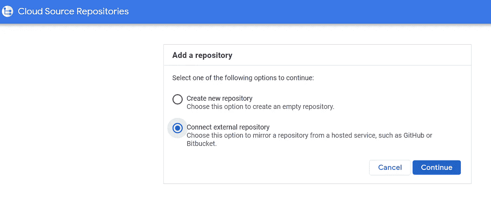
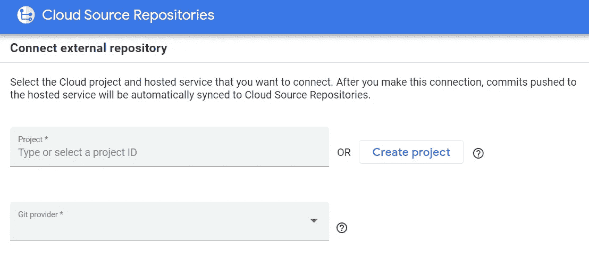
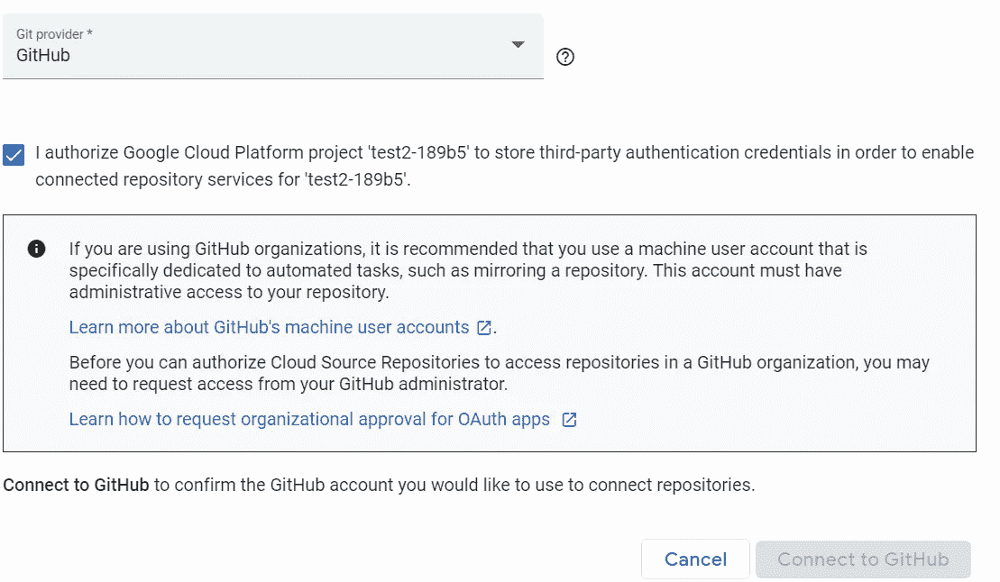
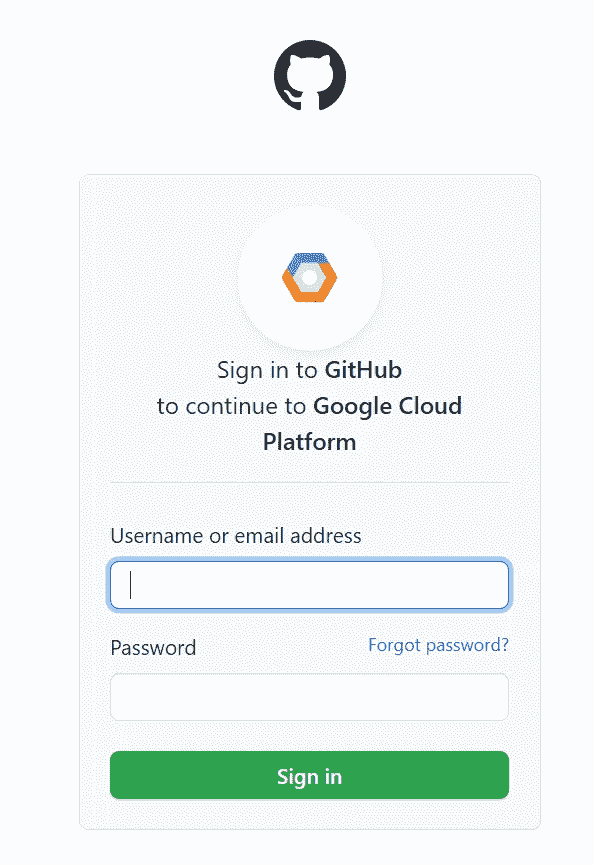
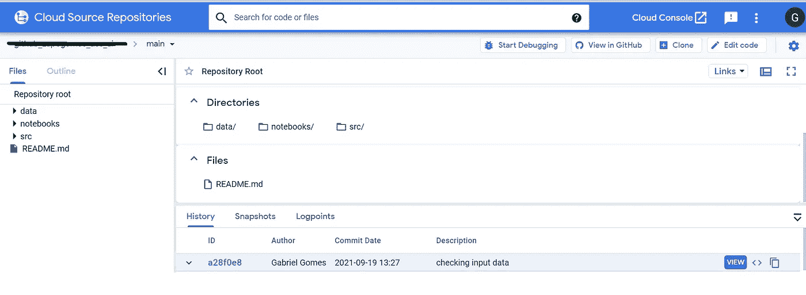
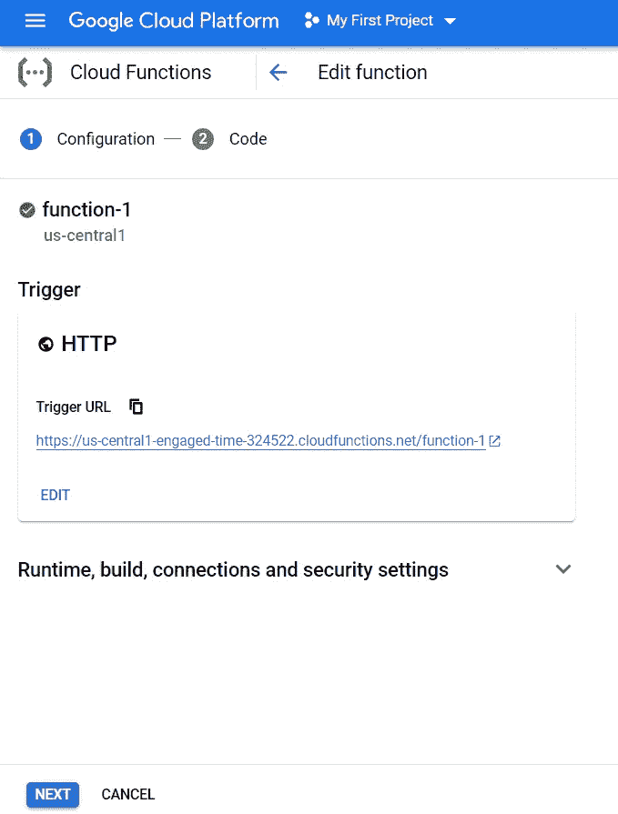
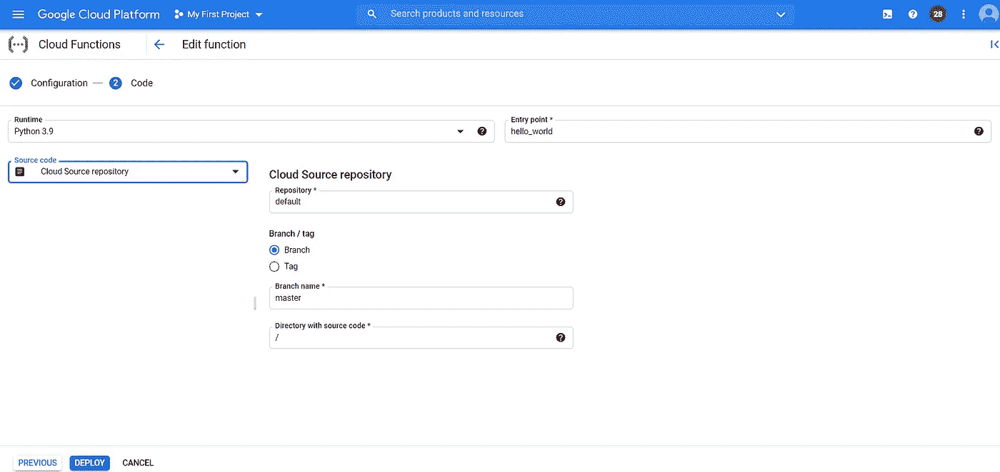

# 在云功能上设置持续集成

> 原文：<https://towardsdatascience.com/setting-up-continuous-integration-on-cloud-function-c015a214c96e?source=collection_archive---------28----------------------->

## 使用云功能时，无需再花费时间进行集成

莎拉·马赫穆达在 [Unsplash](https://unsplash.com?utm_source=medium&utm_medium=referral) 上拍摄的照片

# 介绍

集成是将您的更改应用到应用程序的过程。这可以通过很多方式实现，比如直接在应用程序中修改代码并重启，或者通过一个叫做持续集成的过程。持续集成是指将集成过程自动化。可以将您的应用程序连接到您的源存储库。通过这种方式，当您与 master/main 分支合并时，您可以将您的代码设置为集成的。当使用谷歌云功能时，非常简单，它是通过**谷歌源代码库**实现的。

# 谷歌资源仓库

Cloud Source Repositories 是 google 针对代码存储、管理和跟踪的解决方案。它类似于 git hub，但由 google 创建。在 GSR 中，可以跟踪 git hub 存储库并将其集成到功能中。让我们检查一下。首先，访问 google 控制台，在侧栏上的 CI/CD 子组中，单击 source repositories。点击**开始**，然后点击**创建库**。在它之后，这个模态应该出现:

点击**连接外部储存库**，然后在**中继续。**

选择您的项目名称和 git 提供者。对我来说，这是我的第一个项目和 Git Hub。

点击连接 GitHub。将出现一个 github 页面。输入您的 GH 凭证并授权连接。

之后，点击**授权谷歌云平台。**现在，您应该能够在 **GSR、**上看到您的回购，如下图所示:

# **谷歌云功能**

现在进入 **google cloud functions** ，打开或创建你的函数(如果你对创建一个云函数并测试它有任何疑问，请查看我的上一篇文章[**https://towardsdatascience . com/deploying-python-functions-with-Google-cloud-functions-557517865 ba7**](/deploying-python-functions-with-google-cloud-functions-557517865ba7))

打开你的函数，点击 next，把源代码改成**云库**。

*   在 repository 中键入您的存储库的名称(请使用 google，在下一版本中为我们提供一个下拉列表)。
*   选择分支或标签。如果是分支，输入部署分支的名称。一般来说，我们使用主分支机构来完成这项工作。
*   在有源代码的**目录下，**放你的目录路径。这里，有一个提示。如果保存。包含您的入口点的 py 文件位于 foder example_folder，put /example_folder 中。

之后，选择 deploy，持续集成就完成了。开心点，把时间花在有趣的事情上，而不是手工集成代码。

# 结论

手工进行集成是耗时的任务。自动集成的可能性节省了时间。在谷歌云功能中做起来很容易。只需要建立云储存库(将其连接到您的 git 提供商，如 github 和 bitbucket)。使用这些工具使我们能够提交，然后集成。它使部署过程更简单，并帮助我们在更短的时间内交付我们的功能。下一篇文章再见！

# 参考

[1]https://cloud.google.com/source-repositories

[2][https://towards data science . com/deploying-python-functions-with-Google-cloud-functions-557517865 ba 7](/deploying-python-functions-with-google-cloud-functions-557517865ba7)