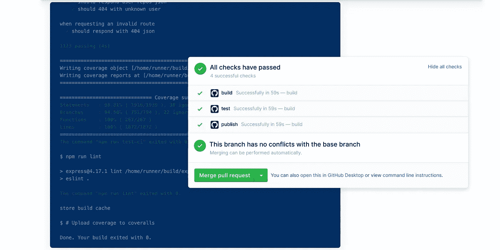
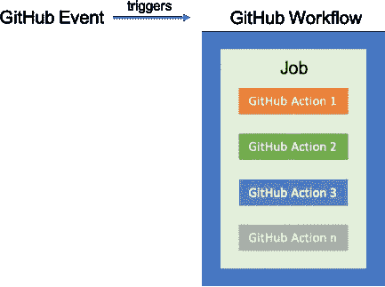
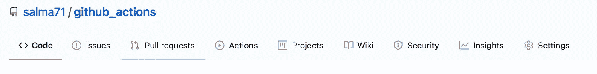
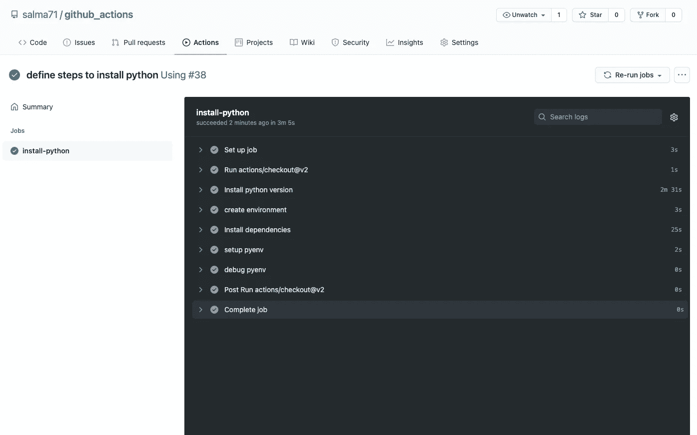
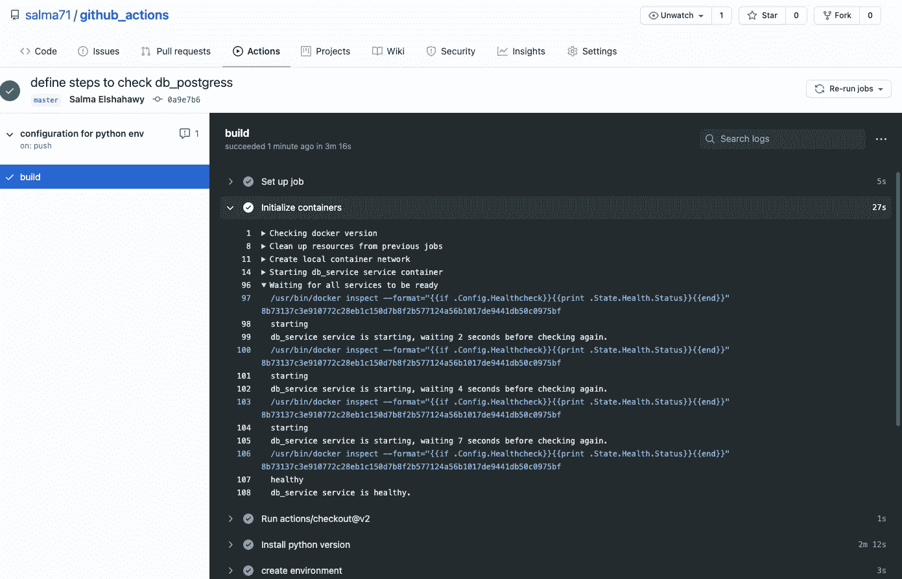
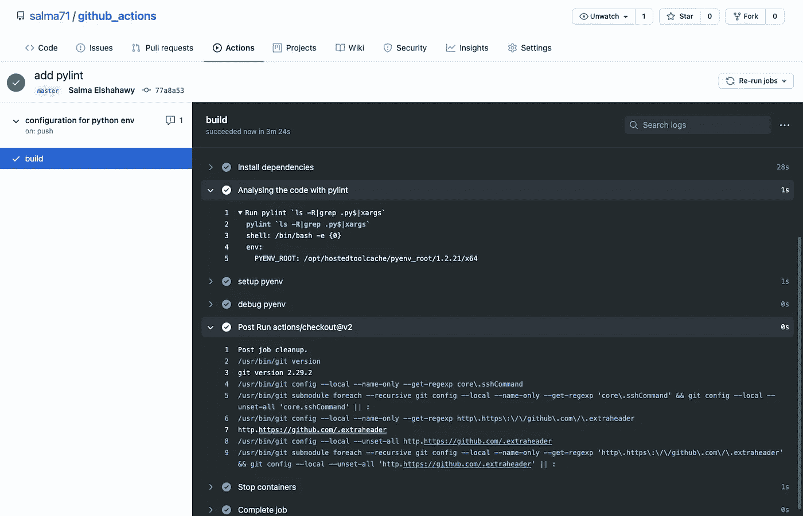
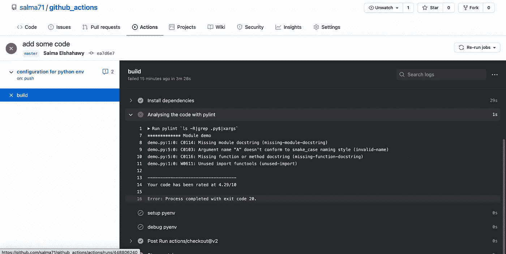
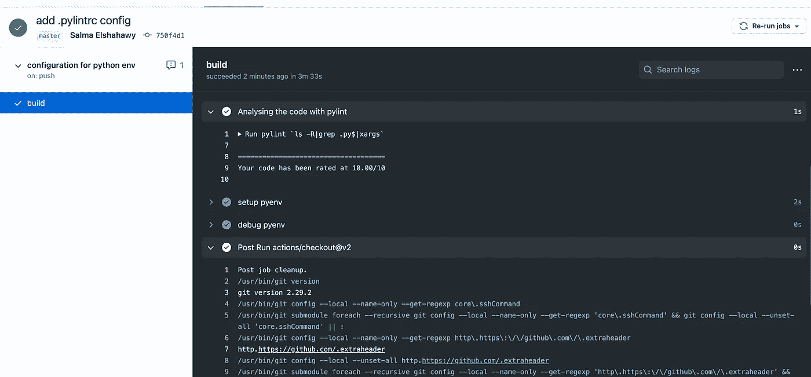

# 如何以最简单的方式配置 Github 动作？

> 原文：<https://towardsdatascience.com/setting-up-python-environment-using-github-actions-9a81936be5c9?source=collection_archive---------21----------------------->

## 本文旨在自动化 GitHub 上托管的 ML 项目，并减少通过拉请求的代码破坏。



[https://github.com/features/actions](https://github.com/features/actions)

# 介绍

在我的[上一篇文章](/how-to-set-up-python3-the-right-easy-way-11c18b0b4ac0)中，我一步一步地引导您在本地机器上使用 pyenv 正确设置 python3 环境。然而，在某些情况下，由于使用不同 python 版本甚至缺少模块的 pull 请求所导致的一些冲突，可能会出现一些问题。

本教程将演示为任何使用 Github actions 插件的项目建立标准工作流程的步骤。在项目 CI 文件夹中配置 Github 操作将保护不符合关于代码格式、语法错误和版本冲突的代码标准的代码库 pull 请求。所以，让我们开始吧！

# 先决条件:

1.  Github 账户。
2.  代码编辑器— IDE，我更喜欢 vscode
3.  YML 语法基础知识— [这里快速回顾](https://www.tutorialspoint.com/yaml/index.htm)
4.  安装在本地机器上的 python 3—[遵循这里的步骤](/how-to-set-up-python3-the-right-easy-way-11c18b0b4ac0)。

# GitHub 有哪些动作？

Github actions 是自动化和管理项目工作流完整开发生命周期的插件。在功能上类似 Circleci、Travis、Gitlab 但是，如果项目存储库是公共的，那么它是免费的。

## 什么是工作流？

Github 动作的工作流程是一系列写在 yml 文件中的步骤或指示，每次你推送到 GitHub 上的特定分支时都会运行。

## 为什么为每个项目建立工作流程很重要？

从长远来看，设置工作流可以节省时间，在推送/合并代码的过程中，您可以安心。可以定制工作流来检查 yml 文件中描述为步骤的不同测试。这些检查可能是使用编码语言的正确版本、安装依赖，甚至是检查代码格式和语法错误。通过这种方式，您可以保证不那么担心将代码合并到主分支中——至少不会出现任何问题！



[https://developer . sales force . com/blogs/2020/01/using-sales force-dx-with-github-actions . html](https://developer.salesforce.com/blogs/2020/01/using-salesforce-dx-with-github-actions.html)

您可能有多个工作流，每个工作流可能有多个作业。工作流每次都被触发，**推送到一个特定的分支**。

# 设置 yml 文件以使用特定版本的 python

在本指南中，我将使用以下内容:

1.  pyenv-action 由 Gabriel Falco 开发，用于选择正确的 python 版本。
2.  将 Postgres 配置为数据库的 Postgress docker 映像。
3.  Flak8 检查语法错误
4.  Pylint 来检查代码格式。

## 首先:初始化 GitHub 项目 repos

Github 操作可以在现有的回购协议上配置，也可以从头创建一个。为了简单起见，我会从头开始一个新的；导航到 GitHub，新建一个 repo 并命名；我将它命名为`github_actions`。然后将 repo 克隆到您的本地机器上，并在`.github/workflows/main.yml`上创建一个 GitHub 工作流操作文件——这是定义步骤的地方。

> 您可以使用 github workflows 模板，方法是转到 action tap 并触发 yml 文件。



Github repo 上的操作选项卡—作者图片

## 第二:定义项目需求；

您可以通过在终端中运行以下命令来包含 requirements.txt 文件:

```
$ pip freeze > requirements.txt
```

## 第三:定义操作作业 python 版本:

每个工作流可能有一组作业，每个作业包含几个要执行的步骤。

我用的是 Gabrial 开发的 pyenv-action 动作。该操作将执行以下操作:

*   安装 pyenv `1.2.21`。
*   导出 [PYENV_ROOT](https://github.com/pyenv/pyenv#environment-variables) 环境变量。
*   在路径中注入`$PYENV_ROOT/bin`。
*   在路径中注入 [pyenv 垫片](https://github.com/pyenv/pyenv#understanding-shims)。
*   预安装指定的 python 版本。
*   设置默认 python 版本(通过`pyenv local`)。— [pyenv-action](https://github.com/gabrielfalcao/pyenv-action)

打开`main.yml`文件，开始配置 pyenv 并选择正确的 python 版本。以下代码片段使用 pyenv-action 版本 7 安装 pyenv，然后在选择版本 3.8.6 后升级 pip 并将其设置为默认版本。接下来，使用默认版本创建一个虚拟环境，并安装项目依赖项。



成功构建—作者的图像


获得成功构建的健康绿色检查—图片由作者提供

它有一个成功的构建，并且会出现一个与提交 id 相关联的绿色健康检查，如上所示。

## 四:配置 Postgres 服务

与上一步相同；但是，我们将使用 Postgres docker 映像在服务部分定义 Postgres 数据库连接。一些运行状况检查被配置为等待 Postgres 启动。最后，端口 5432 从服务容器映射到主机。



db_service 服务容器已经成功构建😏。

## 五—可选:配置 pylint

利用 pylint 可以检查每个推送到主分支的代码片段是否有错误，并强制执行编码标准。

> **Pylint 是一个检查 Python 代码中错误的工具**，试图执行一个编码标准并寻找代码气味。它还可以查找特定的类型错误，它可以推荐关于如何重构特定块的建议，并且可以提供关于代码复杂性的细节。— [皮林特 2 . 6 . 1-开发 1](http://pylint.pycqa.org/en/latest/#:~:text=Pylint%20is%20a%20tool%20that,details%20about%20the%20code's%20complexity.)

我们可以在安装完需求后安装 pylint，并运行`pylint`作为下一步

```
- name: Install dependencies run: pip install -r requirements.txt --upgrade pip pip install pylint- name: Analysing the code with pylint run: | pylint `ls -R|grep .py$|xargs`
```



最终的 main.yml 文件可能如下所示:

# 测试:将代码推送到 Github repo

现在是时候添加一些代码，并尝试将其推送到 GitHub 库了。我首先创建了一个演示文件，并开发了一种从不同元素和大小的输入数组中生成随机采样的方法。所有子集的可能性应该相等。

下一步是使用 pull 请求或直接 push to master 提交和推送 Github 存储库变更。一旦对遥控器进行了更改，在将更改合并到 master 之前，将针对这些更改运行不同的测试。



不成功的构建—作者的图像

如上图所示，根据 pylint 包，由于不适当的格式化，产生了一个错误；有些错误是因为我没有遵循 snake_case 命名约定。如您所见，推送代码的比率为 4.29/10。

> 如果您想忽略 **pylint 对 docstring** 的检查，您可以创建一个名为`.pylint`的新文件，并在其中添加以下代码片段来忽略 docstring 模块。
> 
> **【MASTER】
> disable =
> c 0114，# missing-module-docstring**

现在，在创建 pylint 文件之后，提交并推送 Github 存储库更改，构建应该会成功，并且在 repo 附近会出现一个健康的绿色复选标记😎。



成功构建—作者的图像

# 结论和要点

Github action 是一个强大的插件，它使机器学习开发周期自动化。您可以向工作流添加更多的步骤和工作，包括部署到不同的平台，如 Iaas、Paas、Saas 和现场。此外，它允许您使用 docker 容器以及 Kubernetes。有很多 GitHub-actions 是由社区的市场构建的；如果你有编程背景或者遵循文档，你甚至可以创建你的 [**定制动作**](https://docs.github.com/en/free-pro-team@latest/actions/learn-github-actions/finding-and-customizing-actions) 。

帮助我配置此工作流的一些参考资料是:

1.  [Github 动作的工作流语法](https://docs.github.com/en/free-pro-team@latest/actions/reference/workflow-syntax-for-github-actions#on)
2.  [Postgresql Github 动作](https://github.com/Harmon758/postgresql-action)由 [Harmon](https://github.com/Harmon758)
3.  [Github 动作文档—环境变量](https://docs.github.com/en/free-pro-team@latest/actions/reference/environment-variables)
4.  [学习 Github 动作](https://docs.github.com/en/free-pro-team@latest/actions/learn-github-actions)
5.  [Pyenv-行动](https://github.com/gabrielfalcao/pyenv-action)由[加布里埃尔·法尔科](https://github.com/gabrielfalcao)
6.  [皮林特文件](http://pylint.pycqa.org/en/latest/#:~:text=Pylint%20is%20a%20tool%20that,details%20about%20the%20code's%20complexity.)

最后，我希望这为利用 GitHub 动作自动化机器学习项目提供了全面的指导。如果你有任何问题或建议，请发表在下面的评论区；我非常乐意帮忙。感谢阅读和快乐学习👍