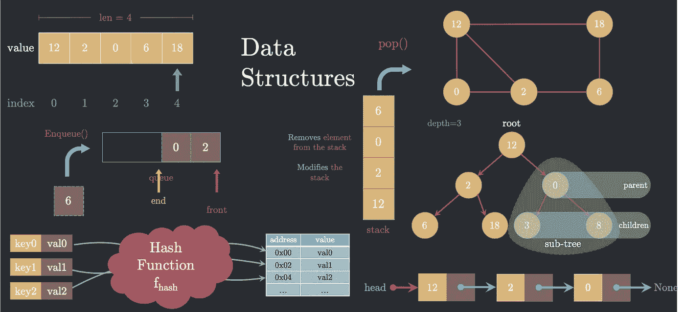

# 编码面试的七(7)个基本数据结构和相关的常见问题

> 原文：<https://towardsdatascience.com/seven-7-essential-data-structures-for-a-coding-interview-and-associated-common-questions-72ceb644290?source=collection_archive---------1----------------------->

作者图片

## 用动画可视化的重要数据结构

编码面试是各种软件工程、机器学习和数据科学工作的重要组成部分。大多数候选人擅长使用编程来解决他们的日常研究问题。但是当进行编码面试时，人们需要温习不同数据结构的基础知识，因为大多数问题都围绕着为给定的问题选择正确的数据结构。

本文将详细介绍对编码面试很重要的七种基本数据结构，它们的时间复杂性，以及常见的编码问题。

# 1.数组/列表

List 包含一系列有序的值，这些值在内存中相邻放置。列表由第一个元素的地址来标识。由于列表元素在内存中的放置顺序与它们被定义的顺序相同(在下面的例子中，由于 2 在 12 之后，所以 12 在内存中的位置紧接在 2 之后)，所以列表中的每个元素都可以通过将第一个元素的地址增加正确的索引量来访问。因此，无论元素在列表中的位置如何，访问列表中的任何元素都需要恒定的时间。

## 时间复杂度:

**Access-O(1):**访问列表中的元素需要用索引对其进行寻址。

**Search-O(n):**搜索列表中是否存在元素需要(在最坏的情况下)逐个遍历每个索引

**插入/删除— O(n)** :从列表中插入(删除)一个元素首先需要找到它，也就是 O(n)

## 常见问题:

1.  [反转链表](https://leetcode.com/problems/reverse-linked-list/)
2.  [查找链表的中间元素](https://leetcode.com/problems/middle-of-the-linked-list/)
3.  [查找链表是否循环](https://leetcode.com/problems/linked-list-cycle-ii/solution/)

# 2.链表

与列表/数组相反，链表的顺序不是由它们在内存中的物理位置定义的。链表的连续元素在内存中不是彼此相邻放置的。相反，每个链表元素包含值和指向下一个链表元素的地址(指针)。因此，链表只能一次顺序遍历每个元素。这也意味着链表的长度只有在完全遍历完一个元素之后才能知道。链表的最后一个元素以 None/Null 作为指针。链表由指向第一个元素的指针定义。

## 时间复杂度:

**Access — O(n):** 访问链表中的一个元素需要(在最坏的情况下)逐个遍历每个元素。

**Search-O(n):**搜索一个元素是否存在于一个链表中需要(在最坏的情况下)逐个遍历每个元素

**插入/删除— O(1)** :插入(删除)一个给定指针的元素到需要插入(删除)的地方只需要重新排列指针。然而，在末尾插入(删除)一个元素需要遍历整个链表，因此是 O(n)

## 常见问题:

1.  [反转链表](https://leetcode.com/problems/reverse-linked-list/)
2.  [查找链表的中间元素](https://leetcode.com/problems/middle-of-the-linked-list/)
3.  [查找链表是否循环](https://leetcode.com/problems/linked-list-cycle-ii/solution/)

# 3.哈希表

散列表可以被认为是列表的一般形式。在列表中，我们将索引映射到可以在常量时间内访问的值。哈希表试图映射一种数据类型(整数、浮点、字符串等。)转换为另一种数据类型，从而创建成对的赋值(键映射到值)，这样就可以在常量时间内访问这些对**。**

对于每个 *(key，value)* 对，通过哈希函数传递密钥，试图为要存储在内存中的值创建唯一的物理地址。大多数情况下，哈希函数可以跨键值创建唯一的物理地址。有时候，散列函数最终会为不同的键(比如 key_1、key_2)生成相同的物理地址。这被称为**碰撞。**哈希表通过创建一个键和值都很强的链表来处理冲突。然后遍历链表以匹配< *键>* ，返回 *<值>* 对。

当必须在代码算法中执行多个搜索操作时，哈希表会很有用。

## 时间复杂度:

**Search-O(1):**搜索一个关键字是否存在于一个哈希表中需要(平均来说)恒定的时间量。

**插入/删除— O(1)** :从哈希表中插入(删除)一个 *<键、值>* 对需要一个恒定的时间量，而与字典的大小无关

## 常见问题:

1.  [判断列表中的两个元素的总和是否为目标值](https://leetcode.com/explore/interview/card/microsoft/30/array-and-strings/173/)
2.  [分组字谜](https://leetcode.com/explore/interview/card/microsoft/30/array-and-strings/200/)
3.  [没有重复字符的最长子串](https://leetcode.com/problems/longest-substring-without-repeating-characters/)

# 4.长队

队列是一种顺序数据结构，当元素被插入队列时，它保持元素的顺序。它保持先入先出( **FIFO** )的顺序，这意味着元素只能以与它们被插入队列时相同的顺序*被访问。将 ***元素先插入*** ，将 ***第一个从队列中移除*** 。*

*对队列执行的两个最常见的操作是 Enqueue()和 Dequeue()。 **Enqueue()** 将一个元素添加到队列中，而 **Dequeue()** 从队列中移除一个元素。在给定阶段，由出列移除的元素取决于队列的初始状态和 Enqueue()操作的顺序。*

*为了理解队列是如何工作的，让我们考虑队列中的两个位置(水平放置，以便更好地理解)——前端 ***和末端*** 。每当添加一个元素(Enqueue())时，它都被添加到队列的末尾。另一方面，元素移除(Dequeue())是从队列的前面完成的。现实生活中的一个例子是杂货店的结账队伍。顾客进入队列，等待轮到自己。只有当他/她前面的所有客户都已被处理(从队列中删除)时，才能处理(从队列中删除)。*

## *时间复杂度(平均):*

***Access-O(n):**访问队列中的一个元素需要(在最坏的情况下)逐个使每个元素出列()。*

***Search-O(n):**搜索一个元素是否存在于队列中需要(在最坏的情况下)将每个元素出列()并与目标进行比较。*

***插入/删除-O(1)**:从队列中插入(删除)一个元素，将该元素添加到(从)队列的末端(前端)。这总是可以在恒定的时间内完成。*

## *常见问题:*

1.  *[二叉树右侧视图](https://leetcode.com/problems/binary-tree-right-side-view/)*
2.  *[任务调度器](https://leetcode.com/problems/task-scheduler/)*
3.  *[总和至少为 K 的最短子阵列](https://leetcode.com/problems/shortest-subarray-with-sum-at-least-k/)*

# *5.堆*

*堆栈也是一种顺序数据结构(类似于队列),它维护元素插入时的顺序。然而，与队列不同，堆栈保持后进先出( **LIFO** )的顺序，这意味着元素只能以插入堆栈时的 ***逆序*** 访问。最后插入 ***的元素，*** 将把***的第一个从堆栈中删除*** 。*

*对堆栈执行的两个最常见的操作是 push()和 pop()。 **Push()** (类似 Enqueue())将一个元素添加到堆栈中，而 **pop()** (就像 Dequeue())将一个元素从中移除。在给定阶段，pop()移除的元素取决于堆栈的初始状态或最后一次 push()操作*

*为了理解堆栈如何工作，让我们考虑堆栈中的两个位置( ***垂直*** 放置以便更好地理解)——头和尾。每当添加或删除一个元素时(push()或 pop())，总是在头部位置完成。堆叠的真实例子是一堆厨房盘子。最后一个被添加到盘子堆中的盘子将是第一个被使用的(虽然您可以访问最上面的盘子下面的盘子，但是人们很少这样做)*

## *时间复杂度(平均):*

***Access — O(n):** 访问堆栈中的一个元素需要(在最坏的情况下)逐个 pop()每个元素。*

***Search — O(n):** 搜索一个元素是否存在于一个栈中，需要(在最坏的情况下)pop()每个元素，并与目标进行比较。*

***Insert/Delete — O(1)** :向堆栈中插入(删除)一个元素，在堆栈顶部添加(删除)该元素。这总是可以在恒定的时间内完成。*

## *常见问题:*

1.  *[有效括号](https://leetcode.com/problems/valid-parentheses/)*
2.  *[收集雨水](https://leetcode.com/problems/trapping-rain-water/)*
3.  *[功能独占时间](https://leetcode.com/problems/exclusive-time-of-functions/)*

# *6.树(二进制)*

*树是一种数据结构，它维护其元素之间的层次关系。每个元素都有一个前任和多个继任者，分别称为 ***父*** 和 ***子*** 。在这一节，我们将考虑一个二叉树。在二叉树中，每个节点最多可以有两个子节点(左子节点，右子节点)。以下是与二叉树相关的一些基本定义*

*   ***根**树由指向其根节点的指针定义。*
*   ***父节点**——任何至少有一个子节点的节点称为父节点。*
*   ***子节点**—父节点的后继节点称为子节点。节点既可以是父节点，也可以是子节点。根永远不是子节点。*
*   ***叶节点**——没有任何子节点的节点称为叶节点。*
*   ***子树**——原始树的有效子集。*
*   ***路径**——沿着树的边缘的节点序列被称为路径。*
*   ***遍历**——以一定的顺序遍历节点，如广度优先遍历、深度优先遍历等。*

*基于条件层次结构，我们可以有多种类型的树。最常用的一种是二叉查找树。二叉查找树(BST)是一种有序或排序的二叉树，其中左侧子节点的值小于父节点的值，右侧子节点的值大于父节点的值。*

## *常见问题:*

1.  *[验证二叉查找树](https://leetcode.com/problems/validate-binary-search-tree/)*
2.  *[二叉树层次顺序遍历](https://leetcode.com/problems/binary-tree-level-order-traversal/)*
3.  *[二叉树的最低共同祖先](https://leetcode.com/problems/lowest-common-ancestor-of-a-binary-tree/)*

# *7.图表*

*图由节点或顶点和连接一对节点的边组成。从形式上讲，一个图 **G** 是一对集合 **(V，E)** ，其中 **V** 是所有顶点的集合， **E** 是所有边的集合。如果所有顶点都通过一条边与一个节点或顶点相连，则称该节点或顶点为邻居。与树相反，图可以是循环的，这意味着从一个节点开始，沿着边，可以在同一个节点结束。*

## *常见问题:*

1.  *[克隆图形](https://leetcode.com/problems/clone-graph/)*
2.  *[图是二分的吗？](https://leetcode.com/problems/is-graph-bipartite/)*
3.  *[外星人字典](https://leetcode.com/problems/alien-dictionary/)*

# *重要资源:*

*   *【LeetCode.com *
*   *[BigOCheatSheet](https://www.bigocheatsheet.com)*

*您可能还会发现下面的文章很有用*

* [## 如何准备行为/软技能面试？

### 用备忘单准备数据科学行为面试的有组织指南。

towardsdatascience.com](/how-to-prepare-for-a-behavioral-soft-skills-interview-cheat-sheet-9347aaeaef82)* 

***如果这篇文章对你有帮助，或者你想了解更多关于机器学习和数据科学的知识，请关注我**[**Aqeel an war**](https://medium.com/u/a7cc4f201fb5?source=post_page-----72ceb644290--------------------------------)**，或者联系我**[***LinkedIn***](https://www.linkedin.com/in/aqeelanwarmalik/)***。****