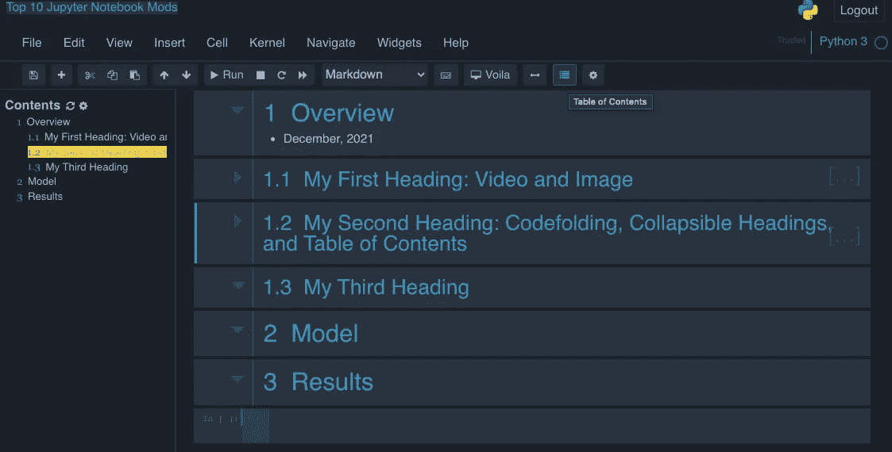

# 七种 Jupyter 笔记本电脑设置，提高可读性

> 原文：<https://towardsdatascience.com/seven-jupyter-notebook-setups-to-improve-readability-a9b681b05dec?source=collection_archive---------11----------------------->

## 一个实现你可能会用到的七个 Jupyter 笔记本增强/修改的教程


# Jupyter 笔记本

使用单独执行的编码块或单元——尽管它们可能有顺序依赖性——对于数据模型开发非常有用。Jupyter 笔记本界面简单易学。一旦你精通了基础知识，请允许我分享七个增加这些笔记本可读性的设置修改或增强。

**增加可读性的七种 Jupyter 笔记本设置:**

1.  黑暗主题
2.  执行时间
3.  便条簿
4.  拆分单元
5.  代码折叠
6.  可折叠标题
7.  目录(2)

# 安装 Nbextensions

Nbextensions 选项适用于设置 2–7(除了黑暗主题之外的所有选项)。

这七个设置中的大多数都包括来自*jupyter _ contrib _ nb extensions*的选项。请参见[安装步骤](https://jupyter-contrib-nbextensions.readthedocs.io/en/latest/install.html)中的*阅读文档*。例如，使用画中画:

```
pip install jupyter_contrib_nbextensions
```

或者

```
pip install https://github.com/ipython-contrib/jupyter_contrib_nbextensions/tarball/master
```

安装完成后，当您启动 Jupyter 笔记本电脑时，您会在顶部看到 *Nbextensions* 选项。


Juptyer 笔记本推出 Nbextensions(图片由作者提供)

点击 *Nbextensions，*你会看到下面的许多选项。


Nbextensions 选项(图片由作者提供)

当您单击某个选项时，该选项的描述将出现在列表下方(在 Jupyter 笔记本中向下滚动)。虽然下面对*拆分单元格笔记本*的描述很简短，但一些扩展有更详细的描述。


# 1.黑暗主题

安全第一。深色主题通常是我对软件默认设置的第一个修改。深色主题通过限制默认情况下更常见的明亮白光来减少眼睛疲劳。如果我忘记设置一个黑暗的主题，用不了多久我就会注意到生产力的下降，并考虑调整默认值。

要安装 Jupyter 主题:

```
pip install jupyterthemes
```

要查看可用的主题选项，请键入 jt -l:

```
jt -l
```

输出:

```
Available Themes: 
 chesterish
 grade3
 gruvboxd
 gruvboxl
 monokai
 oceans16
 onedork
 solarizedd
 solarizedl
```

事实上，并非所有的主题都是黑暗主题。这些主题的例子可以在 dunovank 的 [GitHub](https://github.com/dunovank/jupyter-themes/tree/master/screens) 上找到。如果你想定制你自己的主题，也可以在 GitHub 主页上找到。

我更喜欢切斯特风格的主题。为了在更改主题后在 Jupyter 环境中看到工具栏、名称和内核，您需要分别在命令中添加-T -N 和-kl。

```
jt -t chesterish -T -N -kl
```

重启 Jupyter 内核，重新打开你的笔记本，瞧！您现在拥有了与本文中的屏幕截图相同的主题。

但是，图和其他图像可能不会像在白色背景上那样显示。对于 seaborn 地块，以下命令可以解决这个问题。

```
import seaborn as sns
sns.set_theme(style=”whitegrid”)
```

# 2.执行时间

执行时间选项允许您查看每个单元需要多长时间来完成。任何使用需要几分钟以上时间来执行的模型的人都可以体会到这种时间记录的便利性，但是这在开发新模型时比较单元的不同选项时也很有帮助。

启用 *Nbextensions* 中的 *ExecuteTime* 选项，可以看到执行代码块*下面共享的执行时间。*在这种情况下，细胞在 203ms 内执行。


# 3.便条簿

Scratchpad 选项允许您测试代码，而无需临时创建然后删除单元块。

启用 *Nbextensions 中的*草稿栏*选项。*

便签簿按钮出现在笔记本的右下角。


便签簿按钮出现在笔记本的右下角(图片由作者提供)

点击草稿栏按钮打开草稿栏。暂存区是一个空的单元块，可以利用已经在笔记本内核上运行的内容。但是便笺式存储器可以在不修改任何笔记本单元的情况下被修改和运行。

我发现这是一个查找帮助细节、打印变量或尝试新事物而不改变现有笔记本单元格的方便地方。


打开草稿栏查找帮助文件(作者图片)

# 4.拆分单元

拆分单元格选项有助于改善笔记本的外观和可读性。

启用 *Nbextensions 中的*分割单元格笔记本*选项。*

按← →按钮调整单元格的半宽，然后在单元格的上方或下方移动到上一个或下一个单元格，再次按下按钮将之前水平分隔的单元格移动到新的垂直分隔。

这对于在可视化旁边显示数据框尤其有用。这样，就不需要向下滚动来查看数据框或可视化效果。


使用切换分割按钮移动数据框并垂直分割绘图(按作者分类的图像)

# 5.代码折叠

Codefolding 选项启用了用于隐藏缩进代码的扩展箭头，增强了笔记本的可读性和外观。

启用 *Nbextensions 中的*代码折叠*选项。*

单击显示隐藏缩进代码选项的箭头。


折叠缩进代码前后的代码折叠(作者图片)

# 6.可折叠标题

可折叠标题选项也有助于笔记本的外观和可读性。

启用 *Nbextensions 中的*可折叠标题*选项。*

使用标题旁边生成的箭头，折叠和展开标题。


1.1(显示在 *#5 分割单元格中)*现在折叠，而 1.2 未折叠(图片由作者提供)

# 7.目录(2)

*目录(2)* 选项是快速浏览冗长笔记本的另一个好方法。

启用 *Nbextensions 中的*目录(2)* 选项。*

点击启用后出现的*目录*图标。带有超链接的表格将加载到笔记本的左上角，在工具栏图标下。向下拖动到一个舒适的位置，如下图所示。



带超链接的目录(图片由作者提供)

当不再需要快速导航或阅读该部分的概述时，可以通过再次按下其按钮从笔记本空间中移除目录。

# 摘要

这些是相对快速的 Jupyter 设置，我发现对可读性非常有用。但是还有许多更好的软件包可以和 Jupyter 一起使用。我想分享三个在某些情况下很棒的荣誉奖，虽然不是每个笔记本都需要。

荣誉奖:

*   用于降价的乳胶，如 [MacTex](https://www.tug.org/mactex/)
*   [自动编程 8](https://pypi.org/project/autopep8/) 用于 [PEP 8 样式指南](https://www.python.org/dev/peps/pep-0008/)
*   Jupyter 幻灯片使用[上升](https://rise.readthedocs.io/en/stable/)