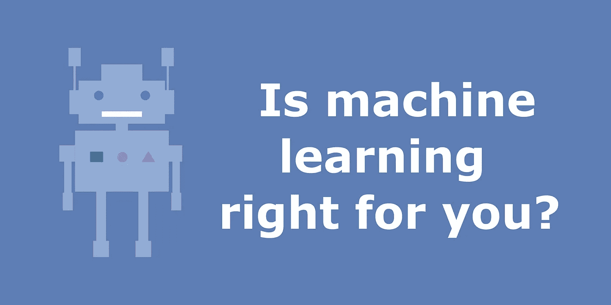

# 在你的项目中引入人工智能之前要问的七个问题

> 原文：<https://towardsdatascience.com/seven-questions-to-ask-before-introducing-ai-to-your-project-b969d591c98b?source=collection_archive---------15----------------------->

## 又名机器学习第一法则？不要用机器学习。

作者图片

随着机器学习在寻找新药和为无人驾驶汽车提供动力方面取得成功，人们的期望是它是可用的，而且非常实惠。如果它能解决那些大问题，那么它一定很容易应用于更小的问题。

我还记得我在大学期间第一次了解 CNN 时的兴奋。在年轻活跃的头脑中，所有的问题都有一个解决方案，这个解决方案就是深度神经网络。经验告诉我，如果使用不当，机器学习算法本身就会成为一个问题。

在写这篇文章的时候，我偶然发现了 LinkedIn 的这篇文章,它描述了两个机器学习团队在处理同一个问题时的区别——一个团队不惜一切代价带来一个机器学习解决方案，另一个团队花时间去理解问题。我更喜欢第二种方法。

这篇文章总结了我在决定是否继续使用机器学习解决方案时关注的领域。说了这么多，让我们开始吧！

# 问题

*这个问题适合机器学习吗？*

机器学习可以从多个角度来看，在一个简化的世界中，它是一种从训练数据中学习模式的工具，用于对看不见的测试示例进行预测。

自然，数据中的模式可能非常简单，可以通过一组规则或分析解决方案来破解。例如，预测下一次日出时间可以很容易地通过一套物理规则指导的分析解决方案来完成。在这些情况下，机器学习解决方案将是一种矫枉过正的做法。

同时，模式对于当前的模型来说可能过于复杂。这是一个机器翻译问题，要超越简单的字典映射并达到人类水平的性能，需要将关于世界的大量信息纳入模型。

最佳点问题是一个非常具体的任务，有一组固定的输出选项和明确的目标，其中有一个可以学习的明确模式——图像或文本分类、图像增强、语音到文本映射。

# 数据

*有足够的数据吗？数据质量是否合理？*

也许开发高质量解决方案的主要障碍是缺乏足够数量的高质量数据。对于许多问题来说，数据需要被挖掘——这为数据挖掘工具创造了一个市场，比如 Amazon Mechanical Turk。理想情况下，数据需要是平衡的、通用的、异构的和标记良好的。

如果数据集包含 1000 张猫的图像和 10 张狗的图像，那么简单模型很可能无法捕捉到狗的分布。在这种情况下，通常使用可以根据不平衡数据训练的模型。数据需要有一个很好的猫和狗品种的选择，以便模型学习共同的特征。被误标为猫的狗很可能会混淆模型。

# 费用

开发和维护成本能否持续？

## 开发成本

开发机器学习解决方案有几个方面成本非常高——团队、硬件、数据。

正如许多问题一样，人是成功的关键。顶级机器学习工程师拥有高水平的学位，他们的技能需求很高，这意味着他们的成本会非常高。在英国，一名 ML 工程师的平均工资是 6 万英镑。

人不是唯一的费用——机器学习模型需要在专门的硬件上进行训练。初创公司经常从科技巨头那里获得数十万的信用额度，用于硬件。然而，对于老牌企业来说，这种情况很少发生，这意味着它们需要自己支付费用。

最后，数据…如果我们无法获得免费数据，就需要挖掘这些数据。在亚马逊土耳其机械上，一个简单的点击标签的简单任务，只需花费 0.05 美元。为了得到一个有 1，000，000 张图片的标签良好的数据集，我们必须支付 50，000 美元。这是一个非常简单的点击式任务。对于更复杂的问题，成本很容易超过 10 万美元。

## 维修费用

机器学习模型需要维护，以确保驱动您决策的模型与当前数据分布保持同步。这意味着理想情况下你需要一个工程师来维护它。顶级产品通常停留在迭代反馈周期。

部署模型的硬件(例如云)也需要付费。随着业务规模的扩大，成本会直线上升。工作负载分配可能是一个挑战——没有足够的机器意味着处理请求的延迟。机器太多，成本会上升。

# 程序调试时间

*你能拿出至少半年的时间来解决一个问题吗？*

如果解决方案不是现成可用的，比如 Google/Amazon/Microsoft 提供的服务，那么开发和部署时间可能会相当长。对于长期解决方案，您需要建立数据、培训和测试渠道。

开发是一个迭代的过程。根据我的个人经验，建立一个非常简单的模型需要一个月的时间。并行执行的数据收集和清理将花费大致相同的时间。简单的培训和部署也需要大约一个月的时间。

复杂性通常是迭代增加的——随着模型的每一步，数据管道变得越来越复杂，因此需要积极地维护。根据应用的不同，在实际得到解决方案之前，可能会有几十次迭代。

# 可解释性

*了解算法如何得出解决方案对于应用程序是否至关重要？*

尽管对于许多非生命关键的应用程序来说并不那么重要，但是理解 ML 算法如何得出结论可能是有用的。例如，药物发现将极大地受益于可解释性，因为我们将获得指导成功发现的模式的提示。

在生命危急的情况下，可解释性是必不可少的——在用机器学习模型诊断疾病时，必须知道模型如何以及为什么得出结论，以确保患者没有受到虐待。理解自动驾驶汽车如何做出决策也很重要，以确保不会学到可能导致道路事故的虚假相关性。

# 伦理学

*你的模型决策会歧视最终用户吗？*

臭名昭著的推特机器人在一瞬间变成了一个种族主义者，这是一个很好的例子，但可能很少是一个模特如何走错方向的明显例子。实践中使用的许多模型都有潜在的偏差，这种偏差通常很难识别。

在某些情况下，这种偏见可能没什么大不了的——例如，一个聊天机器人在下午学会了变得更友好(也许是在带有时间戳的数据集上训练的——人们确实倾向于在午餐后变得稍微友好一些)。然而，一个对女性比男性更友好的聊天机器人会很令人担忧，但很难诊断问题。偏差通常指向训练数据中的严重问题。

# 处理时间

*应用需要实时运行吗？*

由于其复杂性，许多机器学习算法将难以达到某些应用所要求的时间性能。在准确性方面表现良好的重模型将需要大量的计算和内存。

机器学习很难实现的两个例子是高频交易和计算机图形学。在这两种情况下，速度非常重要，因此通常采用简单的试探法。

手机是另一个例子，由于资源相当稀缺，实现机器学习解决方案可能具有挑战性。这就是为什么现在许多手机都引入了[神经处理单元(NPUs)](https://en.wikipedia.org/wiki/Deep_learning_processor)——使模型能够放在移动设备上。

# 结论

本科生在最后一年不被鼓励做机器学习项目是有原因的——这简直太冒险了。大学已经经历了所有的陷阱，才知道它使项目暴露在明显的风险中。

从机器学习工程师那里听到这种说法，听起来可能像是我是一名保险代理人，劝说你不要购买他的服务。但在这种情况下，诚实是最好的策略。毕竟，这是非常容易的烧钱吨，而以下炒作，实际上并没有更糟。

对于那些有足够勇气开始一个人工智能项目的人来说，看看我最近写的关于管理人工智能项目特别有用的工具的文章。

如果你喜欢这篇文章，请与朋友分享！要阅读更多关于机器学习和图像处理的主题，请点击订阅！

## 进一步阅读

我是 [Cassie Kozyrkov](https://kozyrkov.medium.com) 关于 ML 用例的一系列文章的忠实粉丝。这些是我最喜欢的:

你的项目真的需要机器学习吗？[**寻找 AI 用例的建议**](https://medium.com/hackernoon/imagine-a-drunk-island-advice-for-finding-ai-use-cases-8d47495d4c3f)

在开始一个人工智能项目之前要考虑的一个更详细的问题清单: [**你的人工智能项目是一个没有希望的项目吗？**](https://medium.com/hackernoon/ai-reality-checklist-be34e2fdab9)

一个关于如何在开始一个人工智能项目之前进行健全性检查的更详细的指南，以及在开始一个项目之前要寻找什么的广泛的指导: [**人工智能入门？从这里开始！**](https://medium.com/hackernoon/the-decision-makers-guide-to-starting-ai-72ee0d7044df)

你可能还想看看 [**谷歌 ML 工程师指南**](https://developers.google.com/machine-learning/guides/rules-of-ml) 。

# 喜欢作者？保持联系！

我错过了什么吗？不要犹豫，直接在 [LinkedIn](https://www.linkedin.com/in/aliakseimikhailiuk/) 或 [Twitter](https://twitter.com/mikhailiuka) 上给我留言、评论或发消息吧！

 [## 每个博士生免费获得的三项软技能

### 我在攻读机械博士期间学到的关于研究、沟通和团队工作的技巧和诀窍的综合列表…

towardsdatascience.com](/three-soft-skills-every-phd-student-gets-for-free-f63f4b1d3f2d)  [## 应对机器学习面试

### 机器学习面试准备指南和资源。

towardsdatascience.com](/acing-machine-learning-interviews-aa73d6d7b07b)