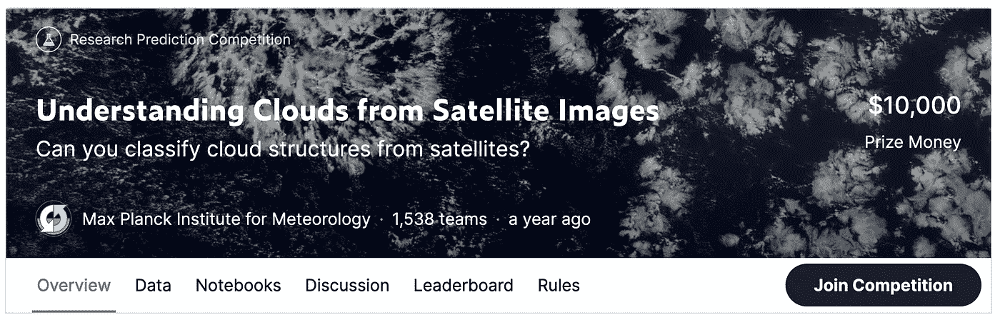
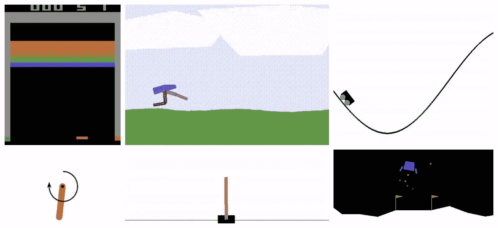
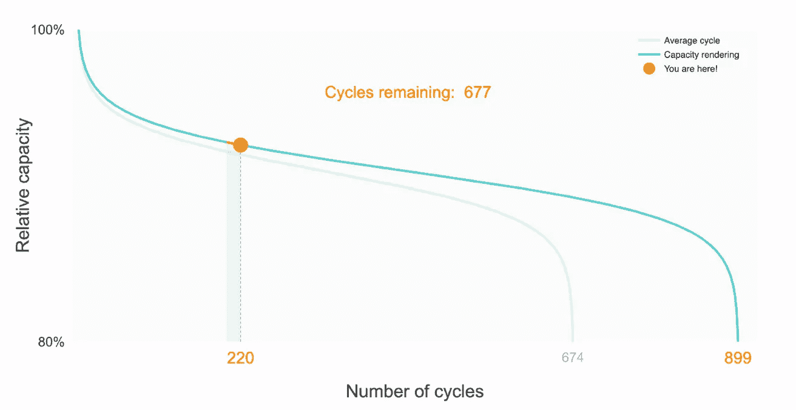
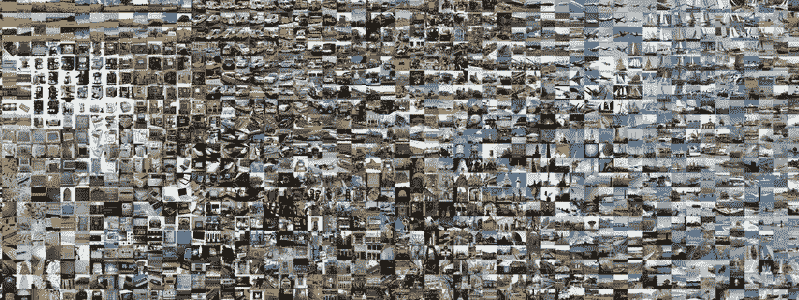

# 产生数据科学项目想法的七种策略

> 原文：<https://towardsdatascience.com/seven-steps-to-generate-data-science-project-ideas-8fb69400634d?source=collection_archive---------36----------------------->

## 用这七个策略寻找数据科学组合项目创意

佛罗伦萨——作者的形象

**个人项目是数据科学最棒的事情之一**。大多数项目需要大型团队&昂贵的软件——尝试作为一名孤独的土木工程师，只用一台笔记本电脑和互联网连接来建造一座桥梁！

数据科学社区在数据、工具和教育方面的开放性意味着您可以自己取得进步。

在公司之外完成的工作可以为你的个人作品集做出贡献——这是展示你的技术能力和创造内容供他人使用和学习的一种方式。这也是对家庭测试和专业数据科学工作的实践。

**投资组合项目伴随着一个挑战——提出一个想法**。这就是这篇文章的内容——产生数据科学项目想法的七个策略:

1.  一场纸牌游戏比赛，
2.  解决你关心的问题，
3.  从一个环境开始，做控制，
4.  重新实现一篇机器学习论文，
5.  用机器学习改进现有工作，
6.  管理一个数据集，
7.  打造一个工具。

# 开始之前

在我们开始之前，我们有两件事要讲。

首先是在公司之外做项目的挑战之一——**商业环境挑战**。

# 商业环境挑战

在公司之外做项目的挑战之一是缺乏商业背景。

**业务环境允许数据科学家做出技术决策**。了解业务需求有助于数据科学家理解要做出的技术决策。

如果业务需要一个可以解释的模型，这就缩小了数据科学家可以考虑的模型的选择范围。如果模型需要在嵌入式硬件上运行，深度学习可能不是一个好的选择。

**缺乏商业背景意味着你要做出选择**——这些选择通常是由你工作的企业决定的。这取决于你是否能填补你缺乏商业背景留下的空白——一种方法是用你自己的激励目标。

# 明确你的动机和目标

动机和目标可以用来填补个人项目中的业务背景空白。

你可以根据自己做项目的理由做出技术决策，而不是考虑雇主的需求。你需要明确两件事——你的动机和目标。

**你的动机是关于为什么——为什么你想做一个项目**。

数据科学家从事新项目的原因有很多。对于那些闯入数据科学的人来说，一个项目给了他们展示能力和技能的机会。对于成熟的数据科学家来说，项目提供了学习和持续改进的机会，或者为他们关心的问题做出贡献的机会。

常见的动机包括:

*   建立你的投资组合，
*   向雇主展示特定的能力，
*   学习一门新的语言(比如 Javascript 或者 Haskell)，
*   学习一项新技术(如计算机视觉或概率编程)，
*   学习新库(学习 Tensorflow 或 PyTorch)，
*   学习一个新工具(比如 Docker)，
*   有助于解决现实世界的问题，
*   对科学文献有所贡献，
*   通过赢得比赛赚钱。

保守你的动机——只选择一个。虽然同时朝着多个动机努力是可能的，但也有可能陷入困境。在学习一门新语言的同时试图给雇主留下深刻印象，最终可能看起来不那么令人印象深刻！

你的目标是关于什么——你想从项目中获得什么。

目标是具体的，应该是你可以触摸、展示或下载的东西，例如:

*   成功的求职申请
*   一个记录良好的 Github 库
*   一篇博文
*   可下载的数据集
*   可用的工具
*   Kaggle 比赛名次

与你的动机不同，你应该有多个优先的目标。例如，如果你的主要目标是一篇博客文章，那么努力创建一个有良好文档记录的 Github 库仍然很重要。

**别忘了享受你的项目！**并不是项目的每个时刻都是难以想象的幸福(尤其是当你必须安装 CUDA 的时候)——但是应该有你喜欢的时刻，比如看到一个模型第一次学习，你的代码质量提高，或者乐于修复一个 bug。

现在我们已经了解了您的动机和目标，我们可以看看产生数据科学项目想法的七个策略，大致按照难度增加的顺序排列。

# 1.纸牌游戏比赛

[从卫星图像中了解云](https://www.kaggle.com/c/understanding_cloud_organization)

Kaggle 是一个举办数据科学竞赛的网站——公司提出他们的商业问题，并为最佳解决方案提供现金奖励。

Kaggle 竞赛的伟大之处在于它们伴随着商业背景。

竞赛通常包括以下所有内容:

*   **数据集** —通常是表格数据、图像或文本，
*   预定义的**测试集**，
*   **目标** —要预测的列，如图像类、
*   **一种度量** —判断性能，如均方误差、
*   别人代码的笔记本(或内核)，
*   比较表现的排行榜。

所有这些都是有用的——这就是为什么 Kaggle 竞赛是一个更容易的项目。典型的 Kaggle 竞争比数据科学家在行业中获得的商业背景更多！例如，选择指标通常是由数据科学家做出的选择，而不是由业务部门做出的选择。

尽管 Kaggle 比赛有商业背景，但这并不意味着 Kaggle 比赛很容易获胜。Kaggle 竞赛通常是通过巧妙的特征工程、外部数据、数据泄漏和梯度增强决策树的大规模集成(如 XGBoost 或 LightGBM)的组合来赢得的。

**主导 Kaggle 竞赛的大规模合奏在行业中并不常见**，训练、维护和部署它们的额外工程工作不值得增加性能改进。然而，在每 0.01%都很重要的 Kaggle 竞争中，它们确实有意义。

竞争会持续一段时间，然后变得不活跃。如果你的动机是获得更高的名次，你就只能参加积极的比赛。然而，如果你的动机是学习，你也应该考虑不活跃的竞争。

**开展 Kaggle 竞赛的最佳方式是借鉴他人的成果。**从一台性能良好的公共笔记本开始，可以为您的工作打下坚实的基础。

在 Kaggle 上也有可能有创意。你可以对一个数据集采取不同的方法，甚至可以合并不同比赛的数据集。

如果你正在寻找一个比赛开始，我们建议如下:

# 2.解决你关心的问题

Kaggle 竞赛的问题在于，你无法控制竞赛在解决什么问题。如果你的任务是解决一个特定的问题，或者有你想要使用的领域专业知识，Kaggle 上可能没有与你的动机相符的合适竞争。

如果你有一个你关心的具体问题，在你开始考虑数据集之前，你需要问— **数据科学如何帮助解决这个问题？数据科学家帮助企业的最常见方式之一是通过预测——这通常意味着某种形式的监督机器学习。**

> *如果你的洞察力不能促成新的行动或改进现有的行动，它就没有多大价值*
> 
> *Russell Jurney，敏捷数据科学*

当考虑监督学习是否可以解决你的问题时，你需要回答这个问题— **改进的预测如何帮助解决我的问题？这个问题的另一种表达方式是问在预测做出后将会采取什么行动。仔细考虑如何在现实世界中使用预测是很重要的。**

一旦您理解了预测如何推动行动，您接下来的步骤是:

*   找到一个数据集，
*   选择要预测的目标，
*   选择一个衡量性能的标准，
*   研究其他人对类似问题的解决方案。

你会注意到，这些步骤与一家公司在 Kaggle 竞争中提供的内容一致——这是你需要定义的缺失的业务环境。

有很多地方可以找到数据集—一些受欢迎的地方是([你可以在这里找到一个更大的列表](https://github.com/ADGEfficiency/programming-resources/blob/master/data-science/datasets.md):

考虑数据集时，您应该问:

*   我有多少**数据**？多少行&列？
*   **功能**有用吗？
*   什么是**目标**？
*   目标是如何分布的——不平衡吗？
*   目标和特征的测量误差有多大？
*   数据取样是否有任何偏差？
*   有季节效应吗？

选择指标至关重要。在业务中，理想的度量是那些与业务目标一致的度量。如果没有这种背景，度量标准的选择应该与解决您所关心的问题相一致。

# 3.从环境入手，做控制

[开 AI 健身房](https://gym.openai.com/)

前两种策略用于监督学习项目——使用一些特征来预测目标。控制是不同的——控制是让系统按照你想要的方式运行。采用一个复杂的系统并设计一个算法来控制它是监督学习的一个进步。

一个流行的控制算法家族是强化学习(其他包括最优控制和进化算法)。

强化学习可以被视为三个任务的交集:

难怪控制比监督学习更难，在监督学习中，数据和标签都是免费的！

进行控制项目的两个常见动机——一个是通过实现控制算法来了解它，另一个是控制一个真实的系统。

# 动机——学习控制算法

如果你的动机是想了解一个特定的算法是如何工作的，那么实现它是一个很好的开始。如果你是初学者，我们建议选择一个简单的算法，而不是从复杂的开始。

不幸的是，这并不像选择旧方法那么简单——在控制方面，进步往往是通过简化实现的。比如最近的 PPO 就比 TRPO 简单。

如果你不知道从哪里开始，我们建议如下:

*   价值函数方法——普通 Q 学习，
*   政策梯度方法——用基线加强，
*   进化算法-1-λES。

一旦你选择了一个算法，你需要一个环境来控制。当你进行开发和调试时，使用经过实战检验的环境是很重要的——最好是你熟悉的环境。这种熟悉意味着您知道代理应该多快开始学习，以及良好的表现是什么样子的。也意味着你不会在环境有 bug 的时候追着尾巴调试你的代理！

用于调试和调优的良好环境经过了良好的测试，并且模拟起来很便宜——我们推荐以下内容(均来自 Open AI 的健身房):

# 动机——控制一个真实的动态系统

如果你有兴趣控制一个真实的动态系统(真实世界或模拟)，你的任务是不同的。您需要回答的一些问题是:

*   我可以模拟我的环境吗？
*   我的观察包括足够的信息来做决定吗？
*   我的奖励信号是什么？

没有这些对于学习如何控制会是一个很大的问题。对于任何控制问题，**你应该先了解特定领域的解决方案，然后再考虑通用的学习方法**。通用的学习方法是强大的，因为它们可以推广到许多不同的问题——专用的解决方案之所以有效，是因为它们适合于单一的任务。

# 4.重新实现一篇机器学习论文

这个策略来自吴恩达的演讲*关于应用深度学习的细节*。

Ng 建议阅读和复制机器学习论文，这是专门针对机器学习研究人员的——他认为这最终会导致你自己的新想法(在大约 20-50 篇论文之后！).

即使你的目标不是机器学习研究，重新实现论文也是学习机器学习的最好方法之一。

数据科学和机器学习的一大挑战是有多少不同的技术可以用来解决问题。**通过重新实现其他人的工作，你可以看到哪些技术经常被使用，以及它们是否真的有效**。

这种策略的一个重要步骤是访问原始数据集—这可能需要与论文作者进行交流(可能需要几周时间)。如果他们还能提供他们使用的任何代码，那就更好了——这对于检查原作者采取了什么步骤很有用。有时候重要的细节不会出现在报纸上！

你可能认为拥有代码库使这个项目变得容易——事实上，研究代码库通常是混乱的，并且包括许多研究人员用来尝试不同东西的代码，这些代码从未出现在论文中。

重新实现并不意味着你需要做和原始代码完全一样的事情。您可以构建不同的代码库，使用不同的数据或不同的库，例如在 Tensorflow 中完成工作，然后在 Pytorch 中重新实现。

你也可以考虑扩展这篇论文——在超参数上进行网格搜索或者尝试不同的架构。

重新实现机器学习论文的基本过程是:

*   获得对原始数据集(或类似数据集)的访问权
*   审查原始文件和代码库
*   查看您能找到的其他重新实现
*   决定绩效的目标水平

**不要害怕与纸张的性能不完全匹配。**研究人员经常可以使用免费计算，但对您来说可能不是这样！你想要展示的是良好的性能——如果你真的缩放了模型，它将与原始作品相匹配。

# 5.利用机器学习改进现有工作

[离子年龄](/predicting-battery-lifetime-with-cnns-c5e1faeecc8f)

之前的策略是利用现有的机器学习工作并重新实现它。**这一战略是关于利用现有的工作并应用新技术**——使用机器学习代替特定领域的方法，或者使用现代机器学习(如深度学习)代替经典的机器学习方法。

这不是简单的拿一篇机器学习论文，通过超参数调整来改进它——这里我们谈论的是做一些原始论文的作者从未考虑过的事情。

这种策略的步骤类似于重新实现一篇机器学习论文:

*   获得对原始数据集(或类似数据集)的访问权
*   审查原始作品(最好是学术论文和代码库)
*   审查对原始作品的潜在新颖改进
*   尝试改进

尽管作者会在论文中报告他们的解决方案的性能，但是您会希望重新实现他们的解决方案作为您的基线。这是为了能够将它与您的改进进行比较，并重现它们的结果。不要依赖于将你的结果与他们的打印结果进行比较。

这方面的一个很好的例子是所做的工作[改善电池寿命的预测](/predicting-battery-lifetime-with-cnns-c5e1faeecc8f)，其中汉尼斯·克诺布洛赫、阿德姆·弗伦克和温迪·张将深度学习应用于预测电池可以持续多少次循环的问题。他们还有一个[优秀的 Github 库](https://github.com/dsr-18/long-live-the-battery)——非常值得一试。

# 6.管理数据集

[影像网](http://www.image-net.org/)

**机器学习的进步是由数据集&基准**推动的。MNIST 和 ImageNet 与计算机视觉的进步同时出现并非巧合。这些数据集是研究人员比较算法和模型改进的基准，在 Scikit-Learn 或 TensorFlow 等框架中轻松访问它们的能力使他们的工作变得毫不费力。

贡献数据集是研究人员能做的最高尚的事情之一。这也很有挑战性，因为您需要考虑真实数据世界带来的所有混乱:

*   在哪里得到它
*   如何存储(CSV、JSON、SQLite)
*   如何分享(S3)
*   标签有多吵
*   抽样有多大偏差
*   数据集是静态的吗？如果不是，您将如何更新它

**数据集管理的一个关键问题是从哪里获得来自**的原始数据。你可能会在这里使用某种形式的网络抓取。您可能还需要一些领域知识来了解原始数据在哪里，以及它如何有助于解决问题。

另一个有趣的问题是要清理多少数据。像转换日期时间 it ISO 8601 这样的基本数据清理将受到欢迎，但填充缺失值可能会引入研究人员想要自己处理的噪声。最佳实践是包含原始数据和干净数据，这样用户就可以自己做出决定。

# 7.制造工具

> *工具形状研究方向*
> 
> *Yann LeCun*

我们所有策略中最具挑战性的是建立一个工具。为什么构建一个工具很难？改进一个工具需要来自用户的反馈——人们实际上必须使用它来让你理解它是否解决了他们的问题。

另一个挑战是需要额外的技能，例如提供 REST API、命令行工具或 Python 包——这些技能通常在传统的数据科学工作流中不是核心的。然而，这些技能在数据科学中很有价值——即使你只是用它们来改进你自己的工作流程，你也不会后悔学习它们。

构建工具的好处有很多。除了扩展您的软件工程技能，它们还允许您更好地理解您使用的框架和库。

## 为现有的开源包做贡献

**如果你想让你的工作产生影响，从头开始构建一个工具可能不是最好的选择**。更有可能的是，贡献一个开源工具对这个世界更有用。这些贡献包括添加文档、编写测试、修复错误、重构或添加新功能。

为一个现有的开源工具做贡献是一个很好的回报方式。这也是了解这些工具如何在幕后工作的绝佳方式。最后，它可以在你的简历上看起来很棒。

您还将改进自己的代码。阅读他人的代码让你有机会探索你以前没有使用过的语言的特性，并看到不同的编码风格。看看优秀的[读码](https://www.nemil.com/on-software-engineering/read-code.html)了解更多读码的好处。

那么问题就变成了——你也应该贡献什么工具？在这里，我们建议与你的一个依赖者和解。经常用熊猫？去看看他们 Github 上的问题，看看他们需要做什么。

## 从头开始构建工具

虽然为现有的开源工具做贡献是做有用工作的最好方式，**但这并不意味着你不应该从头开始编写自己的工具**。构建自己的工具对学习很有帮助，因为你可以接触到项目的每个部分。

仅仅因为你不太可能建立新的 Keras，这并不意味着你不应该建立自己的深度学习库。除了被广泛使用之外，构建工具还有许多好处。

使用别人的工具意味着你不能从一开始就设计项目——意味着你不能实现程序的接口或核心逻辑。

如果您计划从头开始构建一个项目，首先从查看类似项目的源代码开始。坚持己见——复制你喜欢的，改变你不喜欢的。

# 摘要

这就是我们产生数据科学组合项目想法的七个步骤:

1.  一场纸牌游戏比赛，
2.  解决你关心的问题，
3.  从一个环境开始，做控制，
4.  重新实现一篇机器学习论文，
5.  用机器学习改进现有工作，
6.  管理一个数据集，
7.  打造一个工具。

**享受构建你的下一个项目——感谢阅读！**

如果你喜欢这篇文章，请随时在[媒体](https://medium.com/@adgefficiency)上关注我，或者在 [LinkedIn](https://www.linkedin.com/in/adgefficiency/) 上与我联系。

如果你喜欢这篇文章，一定要看看:

 [## 应该用 Python pathlib 还是 os？

### 两个 Python 路径库之间的决斗

better 编程. pub](https://betterprogramming.pub/should-you-be-using-pathlib-6f3a0fddec7e)  [## 应该用 Python pathlib 还是 os？

### 两个 Python 路径库之间的决斗

better 编程. pub](https://betterprogramming.pub/should-you-be-using-pathlib-6f3a0fddec7e) 

*最初发表于*[*https://www.datasciencesouth.com*](https://www.datasciencesouth.com/blog/data-science-project-ideas)*。*