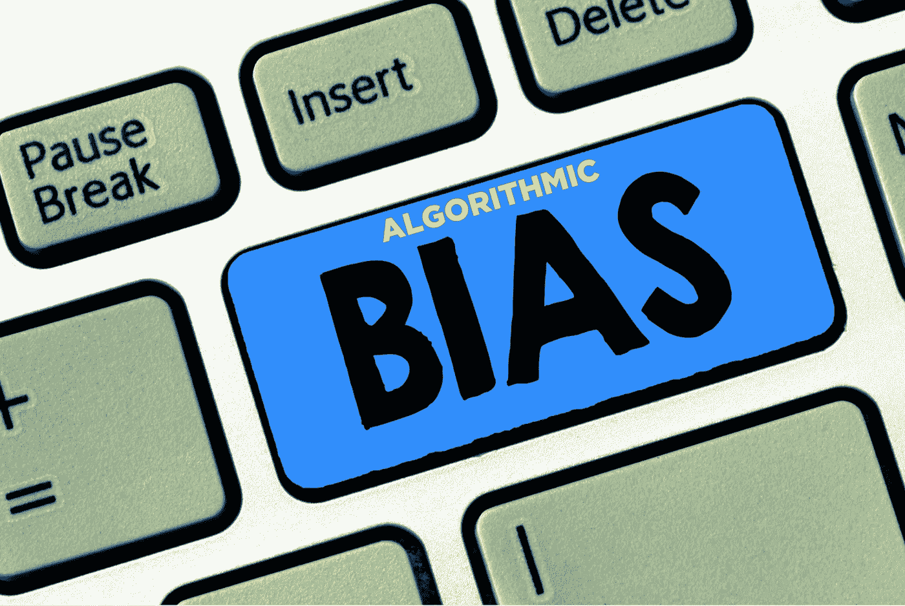
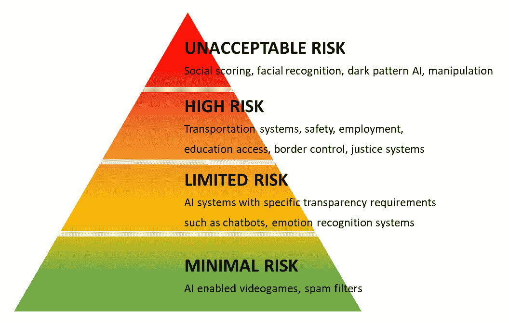
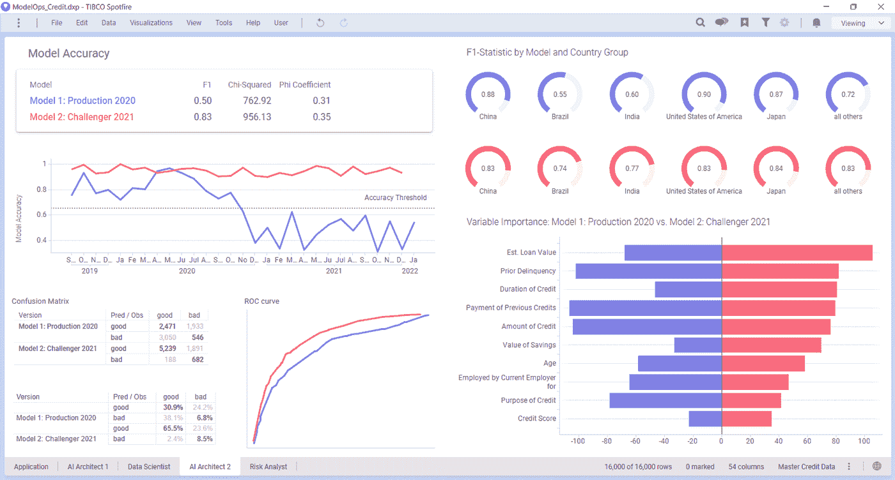
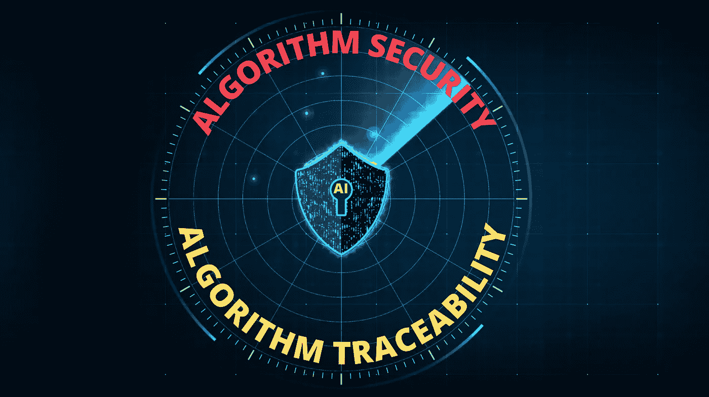
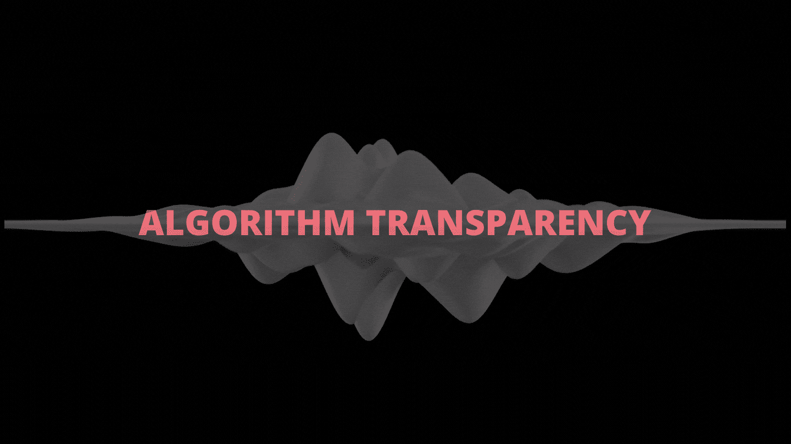
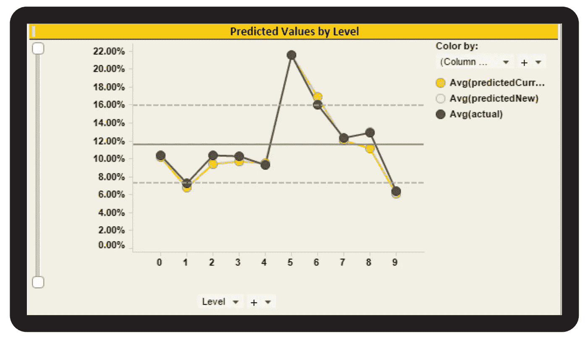
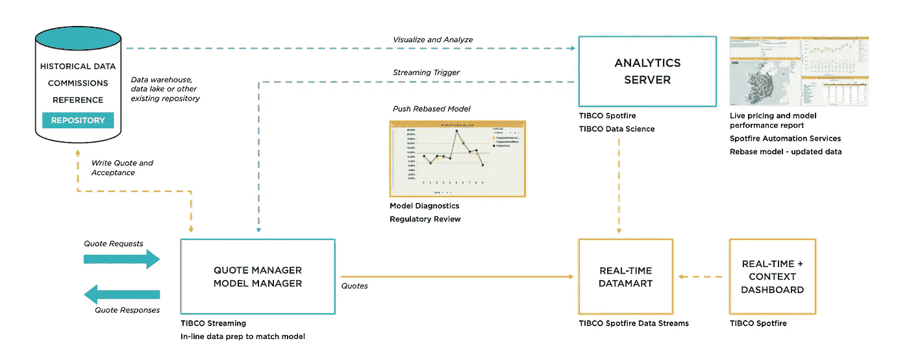

# 根据欧盟值得信赖的人工智能蓝图，帮助您减少算法偏差的七个步骤

> 原文：<https://towardsdatascience.com/seven-steps-to-help-you-reduce-bias-in-algorithms-in-light-of-the-eus-trustworthy-ai-blueprint-b348dc3cf2ae?source=collection_archive---------25----------------------->

## 偏见。每个人都有。每个公民都不想要那么多。每个算法都容易受到它的影响。以下是如何在您的数据科学项目中减少它。

*作者图片*

“BIAS 不是来自人工智能算法，而是来自人类，”Cassie Kozyrkov 在她的*迈向数据科学*文章[什么是偏见？](/what-is-ai-bias-6606a3bcb814)那么，如果我们是人工智能偏见和风险的来源，我们如何减少它？

不容易。认知科学研究表明，人类无法识别自己的偏见。由于人类创造了算法，偏见盲点将会成倍增加，除非我们创造系统来照亮、衡量风险并系统地消除它们。

欧盟指派了一个人工智能专业人员团队来定义一个框架，以帮助描述人工智能风险和偏见。欧盟人工智能法案( [EU AIA](https://www.lawfareblog.com/artificial-intelligence-act-what-european-approach-ai) )旨在为人工智能的人工代理和监督制定蓝图，包括鲁棒性、隐私、透明度、多样性、福祉和问责制的指导方针。

他们的建议是什么，对你的业务有什么好处？技术如何帮助人工智能的应用增加动力？他们推荐的七个步骤，以及如何实现它们的具体行动，是一个很好的起点。但首先，让我们回顾一下他们的“算法风险三角形”，它从最小到不可接受的范围来描述风险。

什么样的偏见是可以接受的？

正如 Lori Witzel 在 [5 关于即将到来的欧盟人工智能法规](https://medium.com/@loriaustex/5-things-you-must-know-now-about-the-coming-eu-ai-regulation-d2f8b4b2a4a9)你现在必须知道的事情中解释的那样，欧盟人工智能法案(EU AIA)根据其对社会的潜在危害定义了四个风险级别，因此必须加以解决。例如，在视频游戏和电子邮件垃圾过滤器中使用人工智能的风险与其在社交评分、面部识别和[黑暗模式人工智能](https://www.darkpatterns.org/)中的使用相比就相形见绌了。

来源: [*制定关于人工智能的统一规则(《人工智能法》)并修正某些联盟法案*](https://eur-lex.europa.eu/legal-content/EN/TXT/?uri=CELEX%3A52021PC0206&qid=1631923538517)

他们的框架有助于理解，但并没有规定对此做什么。该团队确实提出了人工智能可信度的七个关键原则，本文将其用作算法偏差缓解行动计划的指南:

**原则#1:人员代理和监督**。欧盟 AIA 团队表示，“人工智能系统应该赋予人类权力，让他们做出明智的决定，并促进他们的基本权利。与此同时，通过人在回路、人在回路和人在指挥的方法，需要适当的监督机制。”

他们没有规定怎么做。

Gartner 称之为模型操作化(Model Operationalization，简称 ModelOps)的技术为人在回路系统提供了便利。模型操作工具就像算法的操作系统。他们管理帮助算法运行最后一英里以供企业使用的流程。

ModelOps 工具提供了人类指挥工具，以确保人类能够代理和监督算法如何执行、它们的历史性能以及它们的潜在偏差。

算法分析帮助人类窥视算法的判断、决策和预测。通过分析算法元数据(关于人工智能数据的数据)，人类观察者可以实时看到算法正在做什么。

下面的仪表板比较了两种算法的操作以及它们对评估贷款风险的银行算法的预测中涉及的因素。“冠军”模型的算法元数据是紫色的，而提议的“挑战者”模型是红色的。

在左上角，我们看到挑战者模型“更准确”但是代价是什么呢？

> **对模型元数据的分析有助于将人类置于循环中，对人工智能进行代理和监督。**

右下角的横条显示了这两种算法是如何做出决定的。我们一眼就可以看出，生产算法比挑战者更重视以前的贷款拖欠和支付历史。我们还看到，挑战者模型更多地考虑贷款的规模，申请人有多少储蓄，以及信用历史。

来源:[www.tibco.com](http://www.tibco.com)

这是一个公平和平衡的风险评估吗？账户余额的衡量标准是否偏向经济上处于优势的借款人？在挑战者模型中，年龄是一个不太重要的因素；这样好吗？像这样的分析给了人类自己提问和回答这些问题的权力和监督。

**原则#2:技术稳健性和安全性**:欧盟 AIA 团队解释道，“人工智能系统需要具有弹性和安全性。它们需要安全，在出现问题时有后备计划，并且可靠和可复制。这是确保尽量减少和防止意外伤害的唯一途径。”

AI 有多种部署形式，每种部署都应该包括最新的安全性、身份验证、代码签名和可扩展功能，这些功能是任何企业级技术通常都包括的。这些包括但不限于双因素登录、安全模型和健壮的 DevOps 部署范例。

作者图片

所需的安全类型取决于部署地点。例如，部署到可穿戴设备的算法本身必须是安全的，以便该算法同样安全。有效的人工智能部署计划应用所有这些技术及其管理。

**原则#3:隐私和数据管理**。欧盟人工智能小组警告说，“人工智能系统还必须确保足够的数据治理机制，考虑数据的质量和完整性，并确保对数据的合法访问。”

敏捷数据结构提供对任何公司筒仓中的数据的安全访问，以保护数据并评估由 AI 模型采取或推荐的行动的结果。此数据结构必须符合法规中的隐私和数据保护标准，如欧盟的《一般数据保护条例》( GDPR)和加利福尼亚州的《加州消费者隐私法》( CCPA ),以及软件供应商的最佳实践软件开发 ISO 标准。

> 一个 gile 数据结构有助于确保算法提供可信的观察。

现代数据管理、数据质量和数据治理工具有助于促进这些需求，并且在考虑您的 AI 蓝图实施时必须加以整合。有关敏捷数据架构发展的更多信息，请阅读 techno-sapien.com 上的[您的下一个企业数据架构](https://techno-sapien.com/blog/dv-frontiers-2021)。

**原则#4:透明**:欧盟人工智能团队建议数据、系统和人工智能商业模式应该透明，可追溯性机制有助于实现这一点。此外，人工智能系统及其决策应该以适合相关利益相关者的方式进行解释。最后，欧盟人工智能建议人类意识到他们正在与人工智能系统进行交互，并且必须了解它的能力和局限性。

作者图片

透明度是适当的披露、文档和技术的结合。从技术上来说，数据结构和模型操作化工具通过变更日志和历史记录来跟踪和暴露数据透明度，以跟踪和回放 AI 模型的动作。这种数据和模型可追溯性，结合适当的披露和文档，有助于使所使用的数据、所做的决策以及这些决策的含义在整个组织中以及对客户和合作伙伴更加透明。

**原则#5:多样性、不歧视和公平**:必须避免不公平的偏见，因为它可能产生多种负面影响，从弱势群体的边缘化到偏见和歧视的加剧。欧盟人工智能团队建议，为了促进多样性，人工智能系统应该对所有人开放，无论是否有残疾，并让相关利益相关者参与他们的整个生命周期。

偏差缓解是一个强大的研究领域。正如诺贝尔奖得主心理学家和经济学家丹尼尔·卡内曼在 [*噪音*](https://www.amazon.com/s?k=noise+daniel+kahneman&gclid=CjwKCAjw4qCKBhAVEiwAkTYsPIc0T84-snah3il7tCwsFBK0bB41yswgdXF4E7TAPJaUdrduDlVkHxoCVBgQAvD_BwE&hvadid=481839730279&hvdev=c&hvlocphy=1023102&hvnetw=g&hvqmt=e&hvrand=6879196008862152164&hvtargid=kwd-1032016417865&hydadcr=27885_10744743&tag=googhydr-20&ref=pd_sl_1h6wzfup0o_e) 中解释的那样，减少偏见是很难的。但是解决方法就藏在人们的视线中，甚至在一些电视游戏节目中:问一个朋友。就是让别人给你鉴定！卡尼曼称这些人为“朋友”决策观察者。系统、过程和文化思维在算法偏差缓解这个话题上是至关重要的。

> 消除偏见很难。一个方便的方法是询问其他人。在 [*的喧嚣*](https://www.amazon.com/s?k=noise+daniel+kahneman&gclid=CjwKCAjw4qCKBhAVEiwAkTYsPEvfOkhbUbFXF49Y-KoBGAPVTdRx9OMvPAwQ8W3ZPbN-eJ22AngswxoCXpkQAvD_BwE&hvadid=481838920545&hvdev=c&hvlocphy=1023102&hvnetw=g&hvqmt=e&hvrand=10333692732808841652&hvtargid=kwd-1032016417865&hydadcr=27885_10744744&tag=googhydr-20&ref=pd_sl_1h6wzfup0o_e) *中，丹尼尔·卡内曼称这些人为决策观察者。*

敏捷数据结构和人工智能模型操作化工具的协作方面有助于提供围绕人工智能偏差分析、协作和缓解的团队合作，因此是实施人工智能欧盟蓝图时需要考虑的重要工具。

**原则#6:社会和环境福祉**:人工智能系统应该造福全人类，包括子孙后代。使用人工智能的公司应该考虑环境，包括其他生物，以及它们的社会和社会影响。采用欧盟人工智能的原则有助于形成一种经过深思熟虑的人工智能文化，这是追求这种福祉的重要一步。

原则 7:责任:啊哦！规定来了！也许吧。欧盟提供指导方针和原则的方法是一种建设性的替代方案，可以替代美国等国家经常采用的高压监管。欧盟人工智能团队提出了自我导向机制，以确保人工智能系统及其结果的责任和问责。

人工智能伦理的监管、监督和问责是一个庞大的课题。现代数据结构和模型操作化工具是新的人工智能文化的技术基础。他们承诺提高对算法风险和偏见的认识，并通过这样做，提高问责标准。

## **保险业的算法风险和偏差缓解**

爱尔兰汽车协会专门从事房屋、汽车和旅行保险，并为人们在家中和路上提供紧急救援，每年处理超过 140，000 起汽车故障，其中 80%是现场修复的。

AA Ireland [开发](https://www.tibco.com/customers/aa-ireland)算法来“识别欺诈和嵌入客户价值，然后在真实环境中更新这些模型。”

该仪表板显示了模型性能和对重定基准的诊断评估:对业务感兴趣的特定变量的预测。

来源:[闭环持续学习案例研究:动态在线定价](https://www.tibco.com/sites/tibco/files/resources/TCS-closed-loop-continuous-learning%20-distr.pdf)

AA Ireland 的首席分析官 Colm Carey 解释说:“保险业一直都有预测模型，但我们会建立一些东西，并在三个月内更新它。数据无中断地无缝进出模型，基本上提供了实时可预测性。与其说是预测，不如说是‘如果我提高或降低折扣，销量和盈利能力会有什么提升？’

> 这些原则帮助企业能够问:我应该做什么不同？我的算法应该如何改变？

“你可以了解市场中的全部机会和风险，并做出明智的决策。然后，你可以问:我应该做什么不同？我的定价应该如何变化？我应该如何在呼叫中心促进这一点？你可以理解这一切，再加上细分，欺诈建模，和保险商利润。我们将使用它来长期预测呼叫中心的容量和 CRM 建模、活动和投资回报，以及如何为产品定价。”

这个系统的结果恰恰创造了欧盟人工智能团队所建议的东西:人类指挥工具、实时评估和调整算法行为。

该系统通过吸收历史数据、佣金和参考数据(左上)来工作。数据和模型在 analytics / ModelOps 服务器(右上)上运行，以便根据客户的报价请求进行实时评分(左下)。

来源:[闭环持续学习案例研究:动态在线定价](https://www.tibco.com/sites/tibco/files/resources/TCS-closed-loop-continuous-learning%20-distr.pdf)

有关应用程序架构和更多可视化的详细案例研究，请在此阅读 AA Ireland [案例研究](https://www.tibco.com/sites/tibco/files/resources/TCS-closed-loop-continuous-learning%20-distr.pdf)。

**人工智能信托蓝图:帮助人工智能造福所有人**

欧盟集团的雄心是帮助 AI 造福全人类，包括后代。但是，和任何技术一样，它的使用需要仔细考虑和文化变革。欧盟蓝图和这些行动可以有所帮助。结合起来，它们为我们的算法风帆增加了风力，并确保我们与人工智能一起朝着公正和公平的方向前进。

**资源**

*   [什么是偏见？](/what-is-ai-bias-6606a3bcb814)作者 Cassie Kozyrkov 在*迈向数据科学*
*   Eve Gaumond 对欧盟 AI 法案的精彩总结:[人工智能法案:欧洲对 AI 的做法是什么？](https://www.lawfareblog.com/artificial-intelligence-act-what-european-approach-ai)
*   《欧盟人工智能法》全文: [*制定关于人工智能的统一规则(人工智能法)并修订某些欧盟法案*](https://eur-lex.europa.eu/legal-content/EN/TXT/?uri=CELEX%3A52021PC0206&qid=1631923538517)
*   关于模型操作化技术:关于[模型操作](https://techno-sapien.com/blog/category/ModelOps)的技术
*   关于数据结构技术:关于[数据结构](https://techno-sapien.com/blog/dv-frontiers-2021)的技术
*   欧盟人工智能法案的商业含义:Lori Witzel 谈[关于即将出台的欧盟人工智能法规](https://medium.com/@loriaustex/5-things-you-must-know-now-about-the-coming-eu-ai-regulation-d2f8b4b2a4a9)你现在必须知道的 5 件事
*   <http://citeseerx.ist.psu.edu/viewdoc/download?doi=10.1.1.651.9447&rep=rep1&type=pdf>**由 R. B. Zajonc 所著，论述人类的情感和决策。**
*   **[噪音](https://www.amazon.com/s?k=noise+daniel+kahneman&gclid=CjwKCAjw4qCKBhAVEiwAkTYsPIc0T84-snah3il7tCwsFBK0bB41yswgdXF4E7TAPJaUdrduDlVkHxoCVBgQAvD_BwE&hvadid=481839730279&hvdev=c&hvlocphy=1023102&hvnetw=g&hvqmt=e&hvrand=6879196008862152164&hvtargid=kwd-1032016417865&hydadcr=27885_10744743&tag=googhydr-20&ref=pd_sl_1h6wzfup0o_e)，由[丹尼尔·卡内曼](mailto:kahneman@princeton.edu)主持，关于偏见和决策观察小组。**
*   **[闭环持续学习案例研究:AA Ireland 的动态在线定价](https://www.tibco.com/sites/tibco/files/resources/TCS-closed-loop-continuous-learning%20-distr.pdf)，TIBCO Software**
*   **注意: *TIBCO 已经* [提交了专利申请](https://patents.google.com/patent/WO2021178649A1/en?q=mark+palmer+tibco&oq=mark+palmer+tibco&sort=new) *，涵盖了我们在此描述的某些方面。***