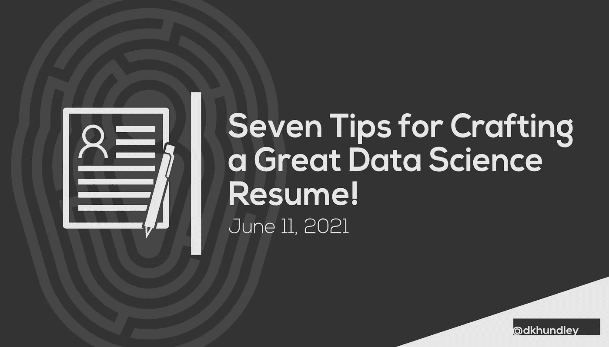
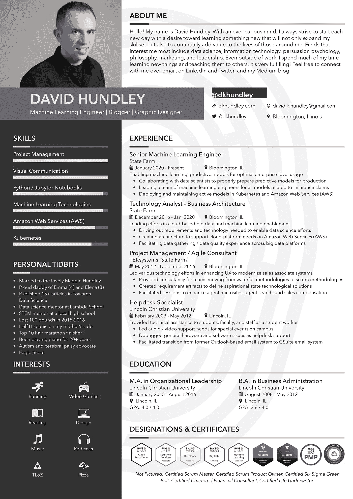

# 制作优秀数据科学简历的七个技巧

> 原文：<https://towardsdatascience.com/seven-tips-for-crafting-a-great-data-science-resume-82281296f842?source=collection_archive---------15----------------------->

## 帮助您为下一份数据科学工作制作一份优秀、简短的简历

你好，朋友们！如果您关注了数据科学行业最近的发展，您可能会注意到最近就业发生了很大变化。随着许多公司在后 COVID 时代走向完全虚拟化，许多人正在重新评估他们目前的就业，以寻求更优惠的机会。(我不太愿意用“更好”这个词，因为“更好”是相对的。)

虽然我自己不在就业市场，但我想我会为所有考虑改变数据科学就业的人写这篇文章。在我看来，大多数简历都不是很好，因为它们倾向于遵循过时的“最佳实践”技术的发展已经改变了一些事情，像 LinkedIn 这样的地方允许一个人“吐槽”他们的整个工作经历，这意味着这在简历中已经没有必要了。

此外，我认为旧的简历提示根本没有抓住这一事实:**人类是高度不理性的**。至少在生活的某些方面，我们都是非理性的。虽然在为一个职位选择理想的候选人时，我们愿意认为自己是不理智的，但不理智的因素往往会下意识地渗透进来。正因为如此，许多这样的建议被写来解释这些不合理的因素。老实说，这里至少有一个我个人认为完全荒谬的提示。你一会儿就知道是哪一个了。

在我们开始学习这些技巧之前，我更新了我自己的个人简历，用一个具体的例子来说明如何采用这些技巧。除了是一名机器学习工程师，我还兼职做一些平面设计，并用 [Affinity Designer](https://affinity.serif.com/en-us/designer/) 来制作我的简历。Affinity Designer 很棒，但就像它更臭名昭著的对手 Adobe Illustrator 一样，它是一个为更专业的图形设计用途而设计的工具。我个人认为这是值得考虑的，你可以考虑使用这个软件来创建基本的平面设计作品，非常非常方便。(例如，我所有的博客标题卡都是在 Affinity Designer 中创建的。)但如果你想让事情变得简单，我可能会推荐像 Canva 或 [EnhanCV](https://enhancv.com/) 这样的平台。

好了，让我们开始学习技巧吧！

由作者创建

# 1.把所有的东西都放在一页上。

回想一下之前关于技术如何改变人们的雇佣方式的评论，对于数据科学的候选人来说尤其如此。如果你今天申请一个职位，除了提交一份 PDF 格式的简历之外，很有可能会有一个类似表格的申请流程或从你的 LinkedIn 个人资料中抓取信息。此外，雇主很可能会通过编码练习之类的方式来评估你的技能，所以没有必要再在简历中确保你的技能和经验的每一个细节。雇主可能正在筛选一大堆这样的简历，所以你希望事情尽可能简单。你的简历没有理由超过一页。如果你像我一样安排事情，你可以在一页上得到很多信息！

# 2.让你的简历设计脱颖而出。

想想传统的普通简历。大多数传统的简历只是在白纸上写上黑色的文字。现在想象一下，如果你把所有申请人的传统简历挂在墙上，并在其中随机加入一份像我设计的简历。站在 30 英尺外，你能挑出哪份简历是我的吗？答案当然是肯定的！在 30 英尺外，你不可能阅读任何人简历上的任何文字(除非你有鹰一样的视力)，但你可以大致了解一个人的设计。这就是我们开始看到人类非理性蔓延的地方。如果你给招聘经理或招聘人员一叠简历，他们会倾向于快速浏览简单、老式的简历，即使他们代表的是非常合格的候选人。他们更倾向于停留在一份特别设计的简历上，仅仅是因为…嗯，它看起来不错。再说一次，这是不理智的，但是因为我想看到你成功，如果我不提这件事，我会对你不利。说到不理智…

# 3.考虑不包括头像。

记得我在介绍中说过，这里有一个我认为很可笑的提示吗？这正是我所说的小费。再次指出非理性因素，人们不公平地根据外表来判断人。你会注意到我确实包括了我自己的自画像，那只是因为我认为我的摄影师朋友在我的头像上做了一个绝对完美的工作。一般来说，我不会认为自己是一个“传统上有吸引力”的人，所以如果我只是用智能手机自拍，我不确定我会把它包括在内。此外，我很幸运，因为我是一个年轻的人，即使这是完全非法的，我敢肯定，有一些雇主会掩盖一个人的简历，如果他们看起来更老。再说一次，这甚至是一个问题的事实让我沮丧不已，但我无法改变招聘人的想法。我只能帮助你，朋友们，在我们这个非理性的世界里精心制作你的简历。

# 4.确保清楚人们可以去哪里了解你的工作。

正如我们前面提到的，简历实际上只是雇主评估潜在候选人时要看的一整套东西中的一部分。在类似表格的申请中，雇主可能会要求你提供 LinkedIn 个人资料的链接，但以防万一，雇主不会确保这一点在你的简历中得到反映。特别是对于数据科学从业者，我会确保包括以下内容:

*   **你的 GitHub 简介**:大多数技术型雇主都熟悉 GitHub，以及它能为应聘者提供的以代码形式展示工作的价值。我不打算在这篇文章中讨论这个问题，但是请确保你的 GitHub 简介是以这样一种方式组织的，即你的作品集清楚地反映了你希望雇主看到的东西。
*   **个人网站**:老实说，我对这个有点警惕。我个人认为，只要你有扎实的 GitHub 和 LinkedIn 个人资料，那么就不需要个人网站。然而，我建议你获得自己的域名，至少让它指向类似[链接树](https://linktr.ee/)的东西。这需要最少的努力，并允许雇主无缝导航到你想让他们看到的任何内容。
*   **其他数据科学方面的事情**:我在这里想的是像 Kaggle 竞赛或发表关于数据科学的文章*之类的事情。作为一个有面试一家财富 50 强公司的机器学习工程师候选人经验的人，我可以告诉你，我个人从来没有面试过展示这些额外东西的人，这没关系。我不一定期望看到这些，但我可以告诉你，他们肯定会锦上添花！*

# 5.如果你缺乏经验，突出一两个个人项目。

对于那些刚刚进入数据科学领域的人来说，这是一个超级重要的提示。作为一名数据科学编码训练营的导师，我目睹了从那里出来的学生如何努力想知道在简历上写下什么经历。我认为在简历上至少写上一两个以前的职位是很重要的，这只是为了显示你有工作经验，但是如果你过去的 8 份工作都是在餐馆之类的地方，我不会把它们都列出来，这样可以节省简历的空间。如果你的简历上有多余的空间，我会强调一两个个人数据科学项目。当您描述该项目时，请确保包括以下内容:

*   **项目简介**:关于项目总体目标的两三句话
*   **项目是如何成功的**:对于我的数据科学训练营学员来说，他们的项目通常会寻求对世界产生某种积极的影响，无论是直接对公司还是以更加“开源”的方式。我绝对鼓励强调项目的成功，因为这有助于雇主理解该项目在数据科学领域是值得追求的。
*   **用于支持项目的技术**:这可以是你使用的东西的简单列表，包括 Python 库、开源工具、云平台等等。例如，您可以简单地列出这样的内容:“使用的技术:Pandas、Scikit-Learn、FastAPI、AWS SageMaker”

# 6.确保你的简历符合招聘公司的目标。

这一点尤其重要，因为数据科学职位可能相当模糊。一些职位更接近于普通数据分析师，这些职位更侧重于数据收集和数据清理。其他职位可能更侧重于建立预测模型。其他人，比如我自己的机器学习工程师职位，可能会更多地寻找软件工程背景。无论是哪种情况，你都可能需要稍微修改一下你的简历，以更好地适应公司的需要。以下是我可能会针对不同类别的数据科学职位强调的一些技能和属性:

*   **数据分析师/数据工程师** : SQL、Pandas、特征工程、Spark (PySpark)、Hadoop、NoSQL 数据库
*   **数据科学家**:应用统计学、预测建模、Pandas、Scikit-Learn、PyTorch、Tensorflow、Jupyter
*   **机器学习工程师** : CI/CD(如 GitLab、Jenkins)、FastAPI / Flask、Docker、Kubernetes、AWS、Terraform

# 7.不要害怕分享一点你的个性。

大多数数据科学职位在招聘潜在申请人时都有一个多步骤的流程。这些步骤通常包括某种编码练习、一次或多次电话面试，并且通常以“面对面”面试告终。(“亲自”在引号中，因为大多数最终面试现在已经虚拟化了，尤其是在新冠肺炎之后。)如果一名候选人进入了最后一轮面试，他们通常与其他进入最后一轮的候选人一样合格。换句话说，雇主雇佣任何进入最后一轮的候选人通常都不会错。

这就是非理性再次发挥作用的地方。如果两个人条件相当，你如何确定你想雇佣谁？如果你听说过“机场规则”，这条规则基本上是这样的:如果你不得不和某人一起被困在机场很长一段时间，你更愿意和谁一起度过这段时间？这就是为什么我认为分享个性很重要，因为对于这最后一轮面试来说，这真的是让你得到这份工作的区别因素。再说一次，这并不完全合理，但这是这个世界的运行方式。我对这张照片不像对大头照那样沮丧，因为性格可以显示一个人在团队中的表现，这确实是一个重要的因素。

我们的提示到此结束！你会给这个列表添加什么？我很想听听你是如何在求职中获得成功的。祝你在追求下一个数据科学职位时一切顺利！