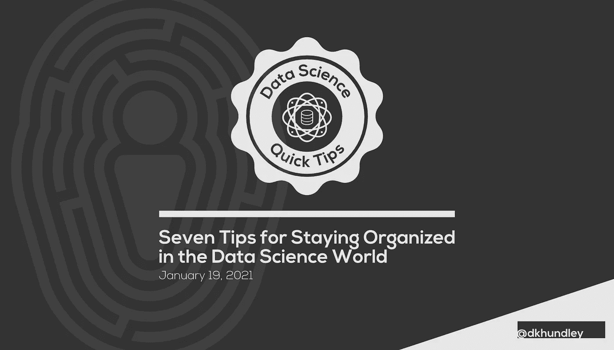

# 在数据科学世界中保持有序的七个技巧

> 原文：<https://towardsdatascience.com/seven-tips-for-staying-organized-in-the-data-science-world-f616c40b25ab?source=collection_archive---------34----------------------->

## [办公时间](https://towardsdatascience.com/tagged/office-hours)

## 通过组织日常实践，帮助您优化工作流程

在我作为机器学习工程师(MLE)的日常工作中，我玩了很多球。我支持生产中的几个模型，积极参与许多新的建模工作，作为管理员参加我们区域的定期“技能团队会议”，并担任我的 MLE 团队的 scrum master。我总是对任何请求说“是”的人，并且非常乐意帮助遇到困难的队友。

可能让你吃惊的是，我并不认为自己是一个非常忙碌的人。

别误会，我一直都很忙。(如果我的经理正在读这封信，我并不是在为工作而难过！😂)我只是从来没有忙到“撕头发”的地步。如果你不知道我的背景，我在数据科学世界里有点反常。在成为机器学习工程师之前，我从事纯粹的商业工作。我的硕士学位是组织领导，我拥有几个领导/管理头衔。

也就是说，我已经能够延续我在以前的生活中采用的思维模式，帮助我在目前的 MLE 角色中取得成功。说真的，如果不把这些都记在心里，我就无法保持目前的工作平衡。知道数据科学家和 mle 经常保持繁重的工作量，我希望你发现这一套技巧很有价值！

# 1.把你的饭桶收拾好。

为组织创建系统是我喜欢在生活的方方面面做的事情，我发现这对于组织我的代码非常有益。我所有的回复都是以同样的方式概述的，所以如果我从一项工作转到另一项工作，我确切地知道在哪里可以找到某些信息。如果您想得到额外的乐趣，您甚至可以提出一个 Cookie Cutter 模板来在初始化时自动化您的 Git 存储库的结构。一般来说，我用以下目录组织我的回购:

*   **数据**:这包含了我工作所需的数据(如果不在共享位置的话)。
*   **模型**:顾名思义，这里面包含了我保存的模型文件。
*   依赖关系(Dependencies):这包含像 Python 需求文件和其他支持我在生产环境中工作所需的东西。
*   测试:这个目录存放了我用于测试目的的脚本，从单元测试到集成测试。它还包含一些测试 JSON 文件，以防我需要在生产环境中测试实时 API。
*   我在 Docker 容器中做了很多工作(我鼓励你也这样做)，所以这个目录包含了所有需要的工作文件，以支持我在 Docker 映像中需要做的任何事情。例如，这个目录将包含启用类似 Flask API 的文件。
*   **笔记本**:如果我需要在 Jupyter 笔记本上做与发现相关的工作或“概念验证”工作，我会把它们都放在同一个目录下。
*   **K8s / Terraform** :根据我是在 Kubernetes 还是 AWS 中工作，我创建了一个目录来存放适当的文件，这些文件构建了我在各个环境中需要的资源。

# 2.集成适当级别的日志/警报。

这对于生产中的事情来说更是如此，但是如果您在预测模型中建立适当的日志记录或警报，您可以使您的生活变得更加轻松。业务伙伴经常问我关于传递到特定模型的输入数据的问题。对于正在进行的模型验证，您应该这样做，但是我通过创建更适合这种情况的单独日志来更进一步。例如，如果一个模型接受 100 多个特征作为输入，那么保存一个不同的日志文件可能是有意义的，该文件只包含 10 个经常被质疑的特征。以后解析起来会容易得多！

说到警报，我想到的是您可以集成的主动措施，而不是被动措施。例如，您可能有一个仪表板或被动地告诉您模型如何执行的东西，但我喜欢集成电子邮件警报，它会告诉我某些东西是否真的出了问题。这样，我就不必总是记得检查那些被动的东西，因为重要的东西都是通过电子邮件发给我的。说到电子邮件…

# 3.采用“零收件箱”理念。

这是你以前可能听说过的东西，我发现它在我作为机器学习工程师的角色中特别有价值。简而言之，这个想法就是让你的收件箱尽可能的干净。一旦你读了一封电子邮件，你应该把它放在一个合适的文件夹里。由于每个现代电子邮件提供商都提供“搜索”功能，我把我的电子邮件分类到相当高的“桶”中我不能分享我的工作包括什么，但我会告诉你，我只定期在 5 个文件夹中归档东西。通过保持收件箱的整洁，你保证了你将会看到所有的东西，并且能够及时地处理它们。

# 4.将您的代码编写到适当的水平。

虽然有些人可能主张创建类和相关方法总是最佳实践，但我实际上不同意。我认为通过只采用你的项目所需要的元素来“调整”你的代码是更合适的。例如，如果你有一个对象或动作将被一遍又一遍地重复使用，那么无论如何都要为它创建一个类或函数。但是如果你做的事情只会被使用一次，那么我认为创建一个类/函数会引入不必要的复杂性。相信我，如果你总是试图做“正确的”事情，它会很快变得令人困惑。

# 5.总是注释你的作品。

一个伟大的程序员在仔细检查代码时总是知道代码在做什么，但在第一次阅读时并不总是很清楚。为了帮助别人以及健忘的我，我总是用代码注释来注释我的工作，以便确切地知道我的代码在做什么。它还有助于更快地提高代码的可读性。例如，您可能有 5-10 行代码在进行特定的数据转换。您可以编写一个简单的带注释的注释来通知您这一点，稍后当您想要引用某个内容时，您可以快速浏览大量代码来找到您想要的内容。

# 6.写下你需要在一周内完成的事情。

每周一，我都会花 30 分钟来分析我需要做些什么来完成给定的一周，以此开始我的一周。我用一块实体白板来做这件事，每完成一项，我就核对一下。我建议每周只做一次，不要每天做，因为每天做有点麻烦，而且你通常对一周的开始有一个很好的想法。

# 7.了解你的优先事项。

这应该是另一个显而易见的问题，但是我仍然很惊讶我经常看到这种情况发生。人们经常忙到“抓狂”的地步，因为他们没有按照适当的顺序处理事情，并且有东西偷偷靠近咬他们。通过了解你的优先事项，你将能够以适当的方式组织你的工作日(或工作周),以确保每件事都按时完成。

这篇文章到此结束！希望您发现这对于在这个有趣的数据科学世界中组织您的生活很有价值。你还有什么要补充的吗？我一直在寻求优化我的工作流程，所以我很想听听你的分享！