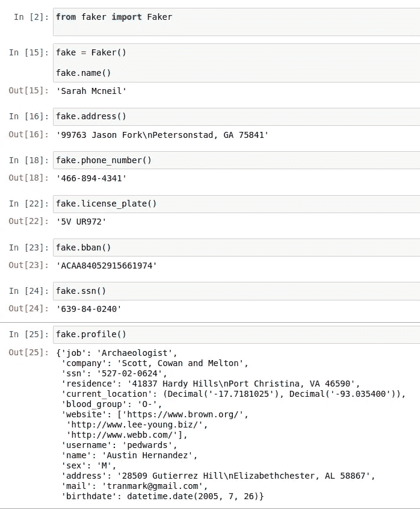
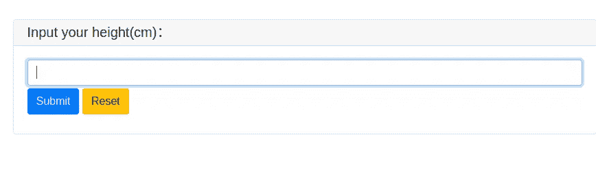
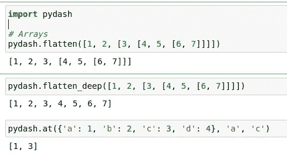
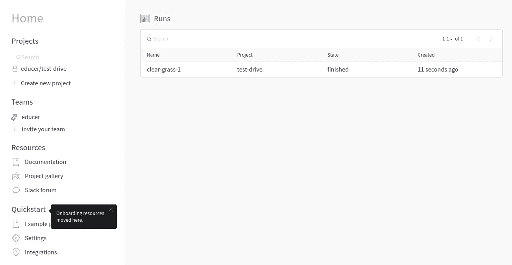
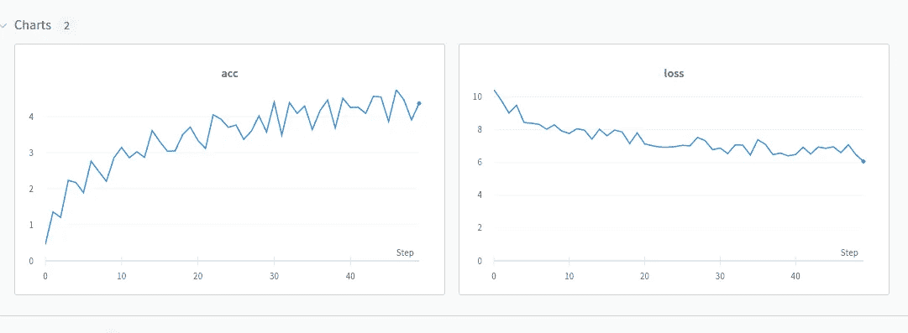
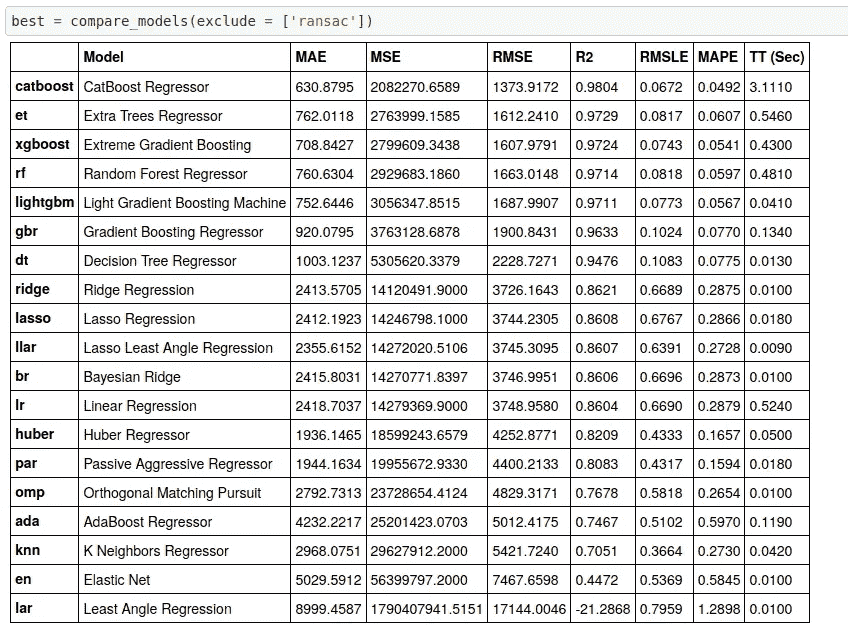

# 2021 年将探索 Python 中七个未被充分利用的数据科学包

> 原文：<https://towardsdatascience.com/seven-underutilized-data-science-packages-python-2021-81b2d85bcaef?source=collection_archive---------17----------------------->

## 有用的 python 包，在数据科学和数据清理领域不太流行。

# 介绍

Python 有大量的包。它包括从普通任务到高级任务。不知不觉中，我们经常在应用程序中使用大量的包。本文讨论了一些用于数据清理、应用程序开发和调试的未被充分利用的数据科学包。


[https://xkcd.com](https://xkcd.com)—来源

# 骗子

生产环境通常有实时数据。让它进入测试环境并不容易。我们必须将来自生产环境的数据标记到测试环境中。这通常会将数据转换成胡言乱语。

此外，在欺诈行业，我们需要找出欺诈身份。为了生成一个假的 PII(个人身份信息)，我使用了一个名为 [**Faker**](https://github.com/joke2k/faker) **的包。这是一个很酷的软件包，可以让你用地址、姓名等创建一个假的 PII。**



作者图片

以上是一些假数据的例子。假数据与甘假图像可以给一个像真的人。

**假数据—表格甘**

如果您想要生成类似的实时生产数据，那么您可能需要使用 GAN。查看下面关于表格 GAN 的文章。

[](https://medium.com/make-money-with-code/generating-synthetic-tabular-data-using-conditional-tabular-gan-on-an-imbalanced-dataset-smote-f4f921e9c716) [## 甘遇到不平衡的表格数据|会谈恋爱吗？条件表格式

### 使用 SMOTE 和条件 GAN 生成合成数据。在不平衡数据集上创建模型并比较指标。

medium.com](https://medium.com/make-money-with-code/generating-synthetic-tabular-data-using-conditional-tabular-gan-on-an-imbalanced-dataset-smote-f4f921e9c716) 

# Pywebio

我绝不是前端开发者。Flask 适用于 Python 端的表单、UI 和 Rest API。然而，如果我想要一个简单的表单，这就有点过分了。简单的东西不学前端。

这就是 Pywebio 前来救援的地方。它为次要任务创建了一个简单、干净的用户界面。所有代码都是用普通 python 写的。所以不需要学习任何新的东西！



输出—按作者分类的图像

在几秒钟内，它转换成一个前端 UI 网页。我们还可以编写一些会话，处理输入和输出。查看他们的[文档](https://pywebio.readthedocs.io/en/latest/index.html)获取详细信息。

# 气流

我最喜欢的包之一是气流。Airflow 是一种工作流管理工具，在 MLOPS 中经常被低估和较少使用。它还可以用于特定的执行间隔、重新训练模型、批处理、抓取网站、投资组合跟踪、自定义新闻提要等。

谈到工作流程，选项是无限的。它还可以连接到特定服务的云提供商。代码可以用 python 写，执行可以在 UI 看到，很棒。还可以按特定的时间间隔安排工作流。

查看我关于如何使用气流的文章。

# 洛格鲁

我讨厌但不得不使用的一件东西是一个记录器。Logger 是调试应用程序的最佳方式之一。但是，原木里面的印子太多了，我很讨厌。洛格鲁在某种程度上是来救援的。它不能解决所有的挑战，但是，添加日志语句和更多的调试是很容易的。

```
from loguru import logger

logger.debug("That's it, beautiful and simple logging!")
```

它还有助于分割文件和执行清理，所以我们不需要进入所有的历史日志。

```
logger.add("file_1.log", rotation="500 MB")    # Automatically rotate too big filelogger.add("file_2.log", rotation="12:00")     # New file is created each day at noonlogger.add("file_3.log", rotation="1 week")    # Once the file is too old, it's rotated

logger.add("file_X.log", retention="10 days")  # Cleanup after some time

logger.add("file_Y.log", compression="zip")    # Save some loved space
```

您还可以使用参数**回溯**来回溯执行。

简而言之，在生产环境中拥有这个包来调试您的应用程序或 AI 模型训练是值得的。

# 皮达什

经常在数据清洗或处理中，我们要处理大量的数据清洗。这些是一些较小的项目，需要时间。例如，如何将列表的列表扁平化？是的，你可以写一个清单理解。如果有快捷的功能来执行这些呢？

这就是 Pydash 的闪光点。它成为了我的快速转到库，包含了一系列 python 实用程序。



我的常用-作者图片

以上只是一个小例子；它包含了很多功能。我肯定会推荐查看[文档](https://pydash.readthedocs.io/en/latest/index.html)。

# 权重和偏差

WANDB 是跟踪和可视化机器学习管道所有部分的最有用的包之一。我最喜欢的部分是他们的中央仪表盘。它类似于一个记录器，可以做更多的事情。



启动运行-按作者排序的图像



执行后的图表—作者提供的图像

它易于使用，并与最流行的库(如 Tensorflow、PyTorch、fastai、huggingface 等)集成。但是，在业务领域使用它时，您会受到一些限制，并且您必须切换到付费订阅。除此之外，这是一个非常好的库。

# PyCaret

我最喜欢的 R 包之一是 caret 包。看到 [PyCaret](https://github.com/pycaret/pycaret) 包的时候很激动。当你想快速做某事时，它简化了许多编码。该软件包有大量的默认参数选项，可以运行不同度量点的各种模型。



不同的模型-作者的图像

# 最后的想法

正如文章中所讨论的，我们已经看到了应用程序开发或数据分析中使用的不同的包。这绝不是一份详尽的清单。我会继续添加更多的包。如果您使用任何其他经常未被充分利用的包，请在评论中告诉我。

*加入* ***200+人*** *上我的* [***简讯***](https://makemoneywithcode.substack.com/welcome) *获取工作代码等更新的文章和书籍。*