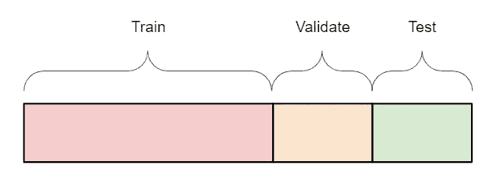

# Python 中的几种模型验证技术

> 原文：<https://towardsdatascience.com/several-model-validation-techniques-in-python-1cab3b75e7f1?source=collection_archive---------17----------------------->

## 四种流行的交叉验证技术的综合指南


karlyukav 创作的男子照片—[www.freepik.com](http://www.freepik.com)

我想写这篇文章，因为我认为很多人倾向于忽略机器学习的验证和测试阶段。类似于实验设计，花足够的时间和使用正确的技术来验证你的 ML 模型是很重要的。模型验证远远不止 train_test_split()，如果你继续读下去很快就会发现！

# 但是首先，什么是模型验证？

模型验证是一种检查模型的预测与现实有多接近的方法。同样，模型验证意味着计算您正在训练的模型的准确性(或评估的度量)。

有几种不同的方法可以用来验证您的 ML 模型，我们将在下面深入探讨:

# 1.使用 Gradio 进行模型验证

虽然这不一定是一种技术，但我认为这是一个额外的收获，因为它可以作为几乎任何您创建的 ML 模型的额外的验证步骤。

大约一个月前，我遇到了 Gradio，我一直是它的大力支持者，这是理所当然的。它非常有用，原因有很多，包括能够用您自己的输入来验证和测试您的模型。

我发现 Gradio 在验证我的模型时非常有用，原因如下:

1.  它允许我交互式地测试模型的不同输入。
2.  它允许我从领域用户和领域专家(他们可能不是编码人员)那里得到反馈
3.  它需要 3 行代码来实现，并且可以通过公共链接轻松分发。

这种类型的“验证”是我经常在以下验证技术之上做的事情…

# 2.培训/验证/测试分割

这种方法是模型验证中最常用的。这里，模型的数据集分为训练、验证和测试样本。所有这些集合定义如下:

**训练集:**模型训练的数据集。所有的学习都发生在这组数据上。

**验证集:**该数据集用于调整从数据集训练的模型。这里，这也是选择最终模型来使用测试集进行测试的时候。

**测试集:**根据测试集测试模型的概化能力。这是评估的最后阶段，因为它给出了模型是否准备好用于实际应用的信号。

该方法的目标是检查新数据的模型行为。数据集被分成不同的百分比，这主要取决于您的项目和您拥有的资源数量。

下图清楚地展示了这个例子。



作者创建的图像

以下 python 代码实现了此方法。**训练**、**验证**和**测试**集合将分别占总数据集的 60%、20%和 20%；

```
from sklearn.model_selection import train_test_splitX_train, X_test, y_train, y_test = train_test_split( X, y, test_size=0.2, random_state=1)X_train, X_val, y_train, y_val = train_test_split( X_train, y_train, test_size=0.25, random_state=1)
```

这种方法并不适用于每种情况，它有优点也有缺点。

## 优点:

*   实现起来非常简单。
*   与其他方法相比，执行速度相对较快。

## 缺点:

*   对于小数据集的模型，如果每个数据集中没有足够的数据点，这种方法会降低精度。
*   对于准确的评估指标，分割应该是随机的，否则会变得不准确。
*   它会导致模型过度适应验证集。

# 3.k**-折叠交叉验证**

K-fold 交叉验证解决了训练/测试分离的所有问题。使用 K 折叠交叉验证，数据集被分成 K 个折叠或部分，每个折叠被用作某个位置的测试集。

例如，假设有一个 4 重交叉验证集-有四重，模型将被测试四次，其中每个重用作测试集，其他重用作训练集。然后，模型的最终评价就是简单的所有 k 次测试的平均值。下图清晰地展示了这一过程。


作者创建的图像

下面是如何用 Python 实现大小为 5 的折叠:

```
from sklearn.datasets import load_iris
import pandas as pd
from sklearn.model_selection import KFold
from sklearn.linear_model import LogisticRegression
from sklearn.metrics import accuracy_scoredata = load_iris(as_frame = True)
df = data.frame
X = df.iloc[:,:-1]
y = df.iloc[:,-1]kf = KFold(n_splits=5, random_state=None)
model = LogisticRegression(solver= ‘liblinear’)acc_score = []for train_index , test_index in kf.split(X):
   X_train , X_test = X.iloc[train_index,:],X.iloc[test_index,:]
   y_train , y_test = y[train_index] , y[test_index] model.fit(X_train,y_train)
   pred_values = model.predict(X_test) acc = accuracy_score(pred_values , y_test)
   acc_score.append(acc)avg_acc_score = sum(acc_score)/kprint(‘accuracy of each fold — {}’.format(acc_score))
print(‘Avg accuracy : {}’.format(avg_acc_score))
```

这种方法有以下优点和缺点:

## 优点:

*   这种方法生成的评估指标更加真实。
*   很大程度上解决了过拟合问题。
*   这导致偏差减小。

## 缺点:

*   因为需要做更多的计算，所以需要大量的计算能力。
*   同样，所需的时间也更长。

# 4.**留一交叉验证**

留一法是 K 折叠验证的一种特殊情况，在这种情况下，训练集将所有实例减去数据集的一个数据点，而测试集将剩余的观察结果留在外面。假设我们有一个 M 个实例的数据集，训练集是 M-1，测试集是 1。

这解释了这种方法的名称。在 LOOCV，K=N，其中为数据集中的每个实例创建并评估一个模型。由于每一个瞬间都被用于该过程，这消除了对数据采样的需要。

它的 python 实现如下所示:

```
from sklearn.datasets import make_blobs
from sklearn.model_selection import LeaveOneOut
from sklearn.ensemble import RandomForestClassifier
from sklearn.metrics import accuracy_score**# create dataset**
X, y = make_blobs(n_samples=100, random_state=1)**# create loocv procedure**
cv = LeaveOneOut()**# enumerate splits**
y_true, y_pred = list(), list()
for train_ix, test_ix in cv.split(X):
 **# split data** X_train, X_test = X[train_ix, :], X[test_ix, :]
   y_train, y_test = y[train_ix], y[test_ix]
   **# fit model** model = RandomForestClassifier(random_state=1)
   model.fit(X_train, y_train)
   **# evaluate model** yhat = model.predict(X_test)
   **# store** y_true.append(y_test[0]) 
   y_pred.append(yhat[0])**# calculate accuracy**
acc = accuracy_score(y_true, y_pred)
print('Accuracy: %.3f' % acc)
```

优点:

*   通过省去一个交叉验证，可以生成高度准确和无偏的模型。
*   我们不必把数据分成随机样本。
*   它非常适合较小的数据集。

缺点:

*   这是 k-folds 交叉验证计算量最大的版本，因为模型需要拟合 M 次。
*   它不适合较大的数据集。
*   均方差会因测试数据的单一瞬间而变化，这会导致更高的可变性(高方差)

# 4.分层 K 倍交叉验证

分层 k-fold 方法是主要用于分类问题的简单 k-交叉验证的扩展。这种方法中的分裂不像 k 交叉验证那样是随机的。分层确保每个折叠都代表数据的所有层次，具体来说，它旨在确保每个测试折叠中每个类都得到同等的代表。

让我们以一个简单的分类问题为例，其中我们的机器学习模型从图像中识别出一只猫或一只狗。如果我们有一个数据集，其中 70%的图片是猫，另外 30%是狗，在分层的 k 折叠中，我们将为每个折叠保持 70/30 的比例。

当我们有较小的数据集并且我们必须保持类比率时，这种技术是理想的。有时，数据会过采样或欠采样，以符合要求的标准。

python 实现的工作方式如下。Sklearn 为我们提供了 StratifiedKFold 函数。

```
import numpy as np
from sklearn.model_selection import StratifiedKFoldX = np.array([[1, 2], [3, 4], [1, 2], [3, 4]])
y = np.array([0, 0, 1, 1])skf = StratifiedKFold(n_splits=2)
skf.get_n_splits(X, y)print(skf)for train_index, test_index in skf.split(X, y):
   print(“TRAIN:”, train_index, “TEST:”, test_index)
   X_train, X_test = X[train_index], X[test_index]
   y_train, y_test = y[train_index], y[test_index]
```

这种方法的利弊如下:

## 优点:

*   它适用于具有少量训练样本和不平衡数据的数据集。
*   阶级比例保持不变。

## 缺点:

*   这不是回归问题的理想方法。
*   它努力处理更大的数据集以获得最佳结果。

# 感谢阅读！

在本文中，我们看到了不同的模型验证技术，每种技术都服务于不同的目的，并且最适合不同的场景。在使用这些验证技术之前，请始终考虑您的计算资源、时间限制和您试图解决的问题类型。

一如既往，我祝你学习一切顺利！:)

不确定接下来要读什么？我为你挑选了另一篇文章:

</all-machine-learning-algorithms-you-should-know-in-2021-2e357dd494c7>  

**又一个！**

</a-complete-52-week-curriculum-to-become-a-data-scientist-in-2021-2b5fc77bd160>  

# 特伦斯·申

*   ***如果你喜欢这个，*** [***跟我上媒***](https://medium.com/@terenceshin) ***了解更多***
*   ***有兴趣合作吗？让我们连线上***[***LinkedIn***](https://www.linkedin.com/in/terenceshin/)
*   ***报名我的邮箱列表*** [***这里***](https://forms.gle/tprRyQxDC5UjhXpN6) ***！***