# 性、毒品和有机主题建模

> 原文：<https://towardsdatascience.com/sex-and-drugs-and-organic-topic-modeling-91a9776d32e6?source=collection_archive---------18----------------------->

## 用 GPT J 分析摇滚歌曲的歌词

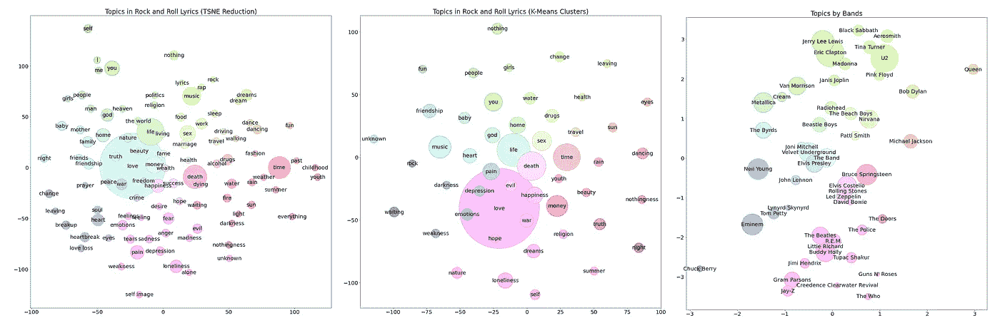

**性、毒品和有机主题建模**，作者提供的图表

**问题**:摇滚歌词中最常见的话题是哪个？

**回答**:甲壳虫乐队在他们的歌中总结道，“你所需要的只是爱。”

作为主题建模的实验，我使用最新的人工智能系统分析了 50 个摇滚乐队的 12，000 首歌曲。本文将介绍我使用的过程，并解释所有的组件，包括运行在 Google Colab 的 TPU GPT j 上的 GPT 3 的免费版本。请注意，您可以使用这些技术来查找和分析任何文本数据集中的主题。

# RockTopics 概述

这是这个实验的高级图表，我称之为 RockTopics。在简要讨论了主要组件之后，我将在下面的小节中更详细地解释处理步骤。

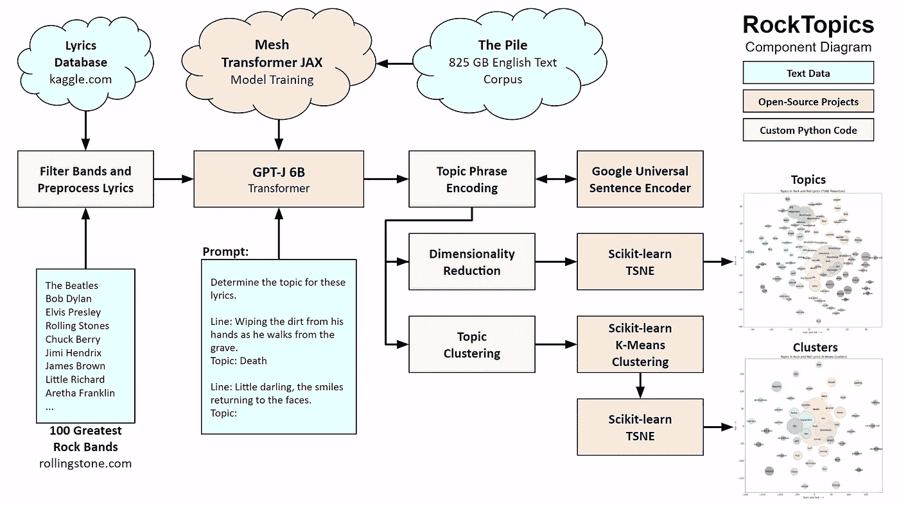

**RockTopics 组件**，作者图解

我从我在 Kaggle 上找到的 128K 歌词数据库开始，我通过找到它与滚石杂志上 100 个最伟大的摇滚乐队列表的交集来过滤歌曲的数量。这产生了来自 50 个乐队的 13K 首歌曲。

该系统的核心是开源的 GPT-J 转换器，它是使用 Pile 上的网格转换器 JAX 训练的，Pile 是一个大型英语文本语料库。我把每首歌的歌词一行一行输入 GPT J，用几个简短的提示找到每一行的主题。

我使用谷歌通用句子编码器将每个发现的主题转换成一个 512 个数字的数组。然后，我结合使用 TSNE 降维和 k-means 聚类来分析主题，并使用 matplotlib 生成图表。

根据分析，以下是最常见的话题。注意，相似的主题聚集在一起，圆圈的大小代表歌词中出现的次数。

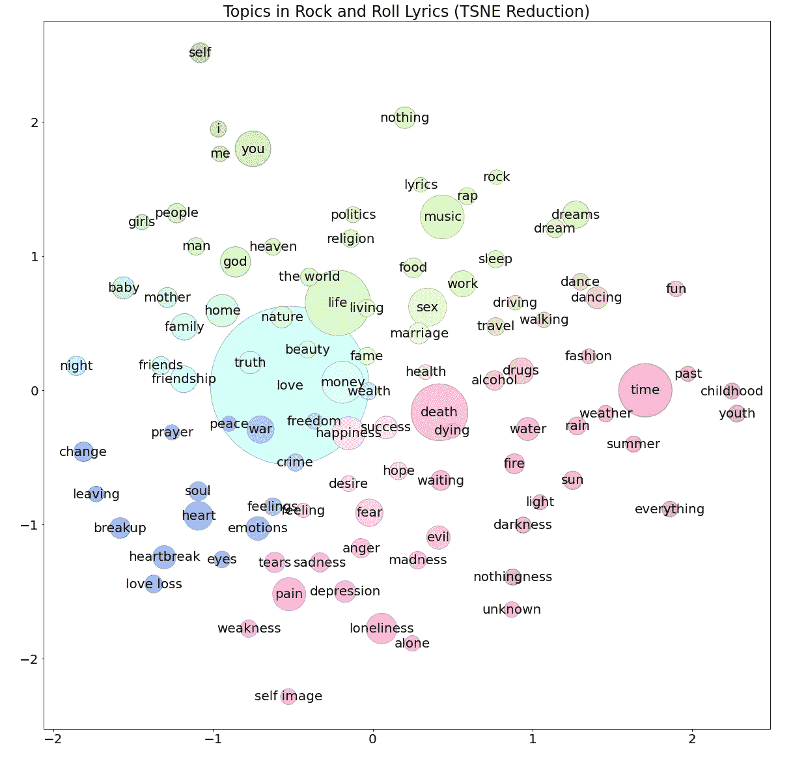

**摇滚话题**，作者图片

# 系统组件

以下部分详细描述了我使用的组件和过程。

## 歌词数据库

对于歌词，我找到了一个不错的数据集[，作者是巴西的人工智能研究员安德森·尼斯(Anderson Neisse)。该数据集包含来自 6 个流派的 2940 个乐队的 128083 首歌曲。他在](https://www.kaggle.com/neisse/scrapped-lyrics-from-6-genres)[数据库内容许可](https://opendatacommons.org/licenses/dbcl/1-0/)下发布了数据集。

正如我上面提到的，我用《滚石》杂志的 [100 位最伟大的录音艺术家](https://www.rollingstone.com/music/music-lists/100-greatest-artists-147446/)名单过滤了歌曲列表。结果列表有来自 50 个乐队的 11，959 首歌曲，包括披头士、鲍勃·迪伦、猫王、滚石、查克·贝里和吉米·亨德里克斯。总共有 185003 行歌词。

## GPT J

GPT-J 是一个人工智能模型，用于分析和生成使用[网格转换器 JAX](https://github.com/kingoflolz/mesh-transformer-jax/) 训练的文本，这是一个使用并行处理训练大型模型的可扩展系统。该模型在一个名为 Pile 的大型文本语料库上进行训练，这是一个 825 千兆字节的英语文本数据集，旨在训练大规模的语言模型[1]。

GPT-J 是由 [EleutherAI](https://www.eleuther.ai/) 创建的，这是一个致力于开源人工智能研究的草根研究人员集体。该系统模仿 OpenAI 的 GPT-3，但 GTP-J 在 Apache 2.0 开源许可下可以免费使用。

你可以在这里免费试用 GPT J，[https://6b.eleuther.ai/](https://6b.eleuther.ai/)

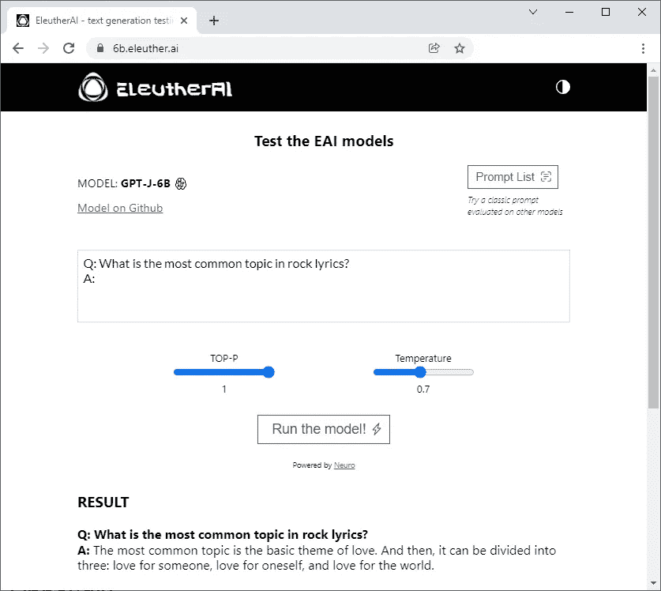

EleutherAI 的 GPT J，作者图片

如你所见，它已经知道了摇滚歌曲中的头号话题。接下来，我会告诉你如何找到歌词中每一行的主题。

## 在歌词中寻找主题

与其他大型 transformer 模型类似，GPG-J 的工作方式是传入一个提示，结果系统会生成连续的文本。我使用下面的提示从歌曲的每一行获取主题。请注意，这被称为“少量”推理，因为给出了几个例子。

```
**Determine the topic for these lyrics.****Line**: Ah, look at all the lonely people!
**Topic**: Loneliness**Line**: Wiping the dirt from his hands as he walks from the grave.
**Topic**: Death**Line**: Little darling, the smiles returning to the faces.
**Topic**: Happiness**Line**: Every breath you take.
**Topic**:
```

第一行是对查询的一般描述，后面是三个示例行和主题。该系统将使用这些信息来获取所提问题的要点，并为最后一行“你的每一次呼吸”指定主题多次运行该查询将得到主题“呼吸”、“健康”、“生命”等。

以下是警察的《你的每一次呼吸》前五行的题目。

```
**Line                     Topic**
Every breath you take    Breathing
Every move you make      Movement
Every bond you break     Leaving
Every step you take      Walking
I'll be watching you     Watching
```

这个系统似乎做得很好，为台词找到了主题。注意，不仅仅是拉关键词。它总是以名词的形式陈述主题，有时会概括该行的意思来找到主题，就像它对离开和行走所做的那样。

请注意，我发现对每个查询使用相同的示例有时会将示例主题“孤独”、“死亡”和“幸福”泄漏到结果中，从而增加它们的数量。为了最大限度地减少泄漏，我从中间结果中挑选了一个包含 300 个示例的列表，并编写了一些代码来为每个查询从大量的列表中随机选择三个示例。这似乎已经将渗漏减少(或分散)到统计上不显著的水平。

我发现，使用 OpenAI 的 GPT-3 [达芬奇-指导-贝塔](https://beta.openai.com/docs/engines/instruct-series-beta)模型，使用“零射击”查询，意味着没有提供示例，可以完全避免泄漏问题。下面是提示。

```
**Determine the topic for this line of lyrics.
Line**: Every breath you take.
**Topic**:
```

结果类似于 GPT J，没有任何泄漏，因为没有例子。这种方法是首选的，但它是有代价的。虽然使用 GPT-3 的付费版本运行这个查询只需要 0.0017 美元，但在 185，000 条线路上运行它需要 300 多美元。

## **张量处理单元**

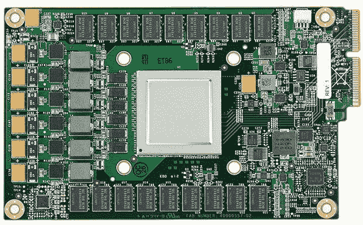

**张量处理单元**，图片来源:[谷歌博客](https://cloud.google.com/blog/products/ai-machine-learning/an-in-depth-look-at-googles-first-tensor-processing-unit-tpu)

在过去的 18 个月里，我一直在使用 Google Colab 来运行我的人工智能实验。我一直在使用两种类型的处理器，中央处理器(CPU)和图形处理器(GPU)。CPU 是自 20 世纪 60 年代以来就存在的通用计算机。GPU 是在 20 世纪 80 年代为图形密集型操作开发的，并从 2010 年开始用于人工智能和 ML。

2016 年，谷歌推出了他们的[张量处理单元](https://cloud.google.com/blog/products/ai-machine-learning/an-in-depth-look-at-googles-first-tensor-processing-unit-tpu) (TPU)，专门为训练和运行人工智能模型的实例而设计。自 2020 年以来，它们已经可以在谷歌 Colab 上使用。王禹带领一个来自哈佛的团队在 GPU 和 TPU 上测试人工智能模型的速度。他们发现，在运行大型模型时，TPU 的性能比 GPU 高出 3 到 7 倍[2]。

我用于运行 GPT-J 主题建模的 RockTopics Colab 是基于来自王贲 EleutherAI 的 TPU [Colab](https://colab.research.google.com/github/kingoflolz/mesh-transformer-jax/blob/master/colab_demo.ipynb) 。每一行花了大约 1.4 秒，运行了大约三天来获得所有 185，000 行歌词的主题。

## 通用句子编码器

在我收集了主题之后，我使用 Google 的通用句子编码器将每个主题短语转换成嵌入的 512 个浮点数的数组。这里有一些示例代码来展示它是如何工作的。

```
import tensorflow_hub as hub
embed = hub.Module("https://tfhub.dev/google/universal-sentence-encoder-large/5")
embedding = embed(["love loss"])
print(embedding)
```

结果在这里。

```
tf.Tensor( [[-2.79744454e-02 -6.52119750e-03 1.32698761e-02
4.50092048e-04 9.81796882e-04 3.18628997e-02 2.73146853e-02
-1.10505158e-02 -2.71893758e-02 -5.06720766e-02 -3.20894904e-02
...
-1.08678043e-02 7.85474479e-03 -6.44846493e-03 -3.88006195e-02]], shape=(1, 512), dtype=float32)
```

虽然这些数字对人类来说没有任何意义，但它们代表了编码器多维空间中“失恋”的概念。在接下来的部分中，我将向您展示我是如何使用统计学来理解这些主题的。

## 降维

在每个嵌入中都有大量的信息。然而，我使用的第一步是降维(DR)来图形化地显示主题嵌入。这将通过将每个主题的维度数量从 512 个减少到两个来创建二维图表，从而帮助可视化数据。

DR 的两种标准方法是主成分分析(PCA)和 T 分布随机邻居嵌入(TSNE)。每种方法都试图保留数据的要点，同时减少维数。

PCA 获取数据，将其转换为矩阵，使用一些复杂的数学运算来找出最显著的方差，然后将其转换回数据集。TSNE 的工作原理是，在将输入数据点和表示相同数据点的数据点转换成低维表示后，迭代地最小化它们之间的差异。你可以在 Luuk Derksen 的文章[中阅读更多关于 PCA 和 TSNE 方法的内容。](/visualising-high-dimensional-datasets-using-pca-and-t-sne-in-python-8ef87e7915b)

当使用主成分分析和 TSNE 从 512 个维度减少到两个维度时，前 100 个主题看起来像这样。每个圆圈的大小代表该主题在一行歌词中被发现的次数。你可以点击图片查看大图。

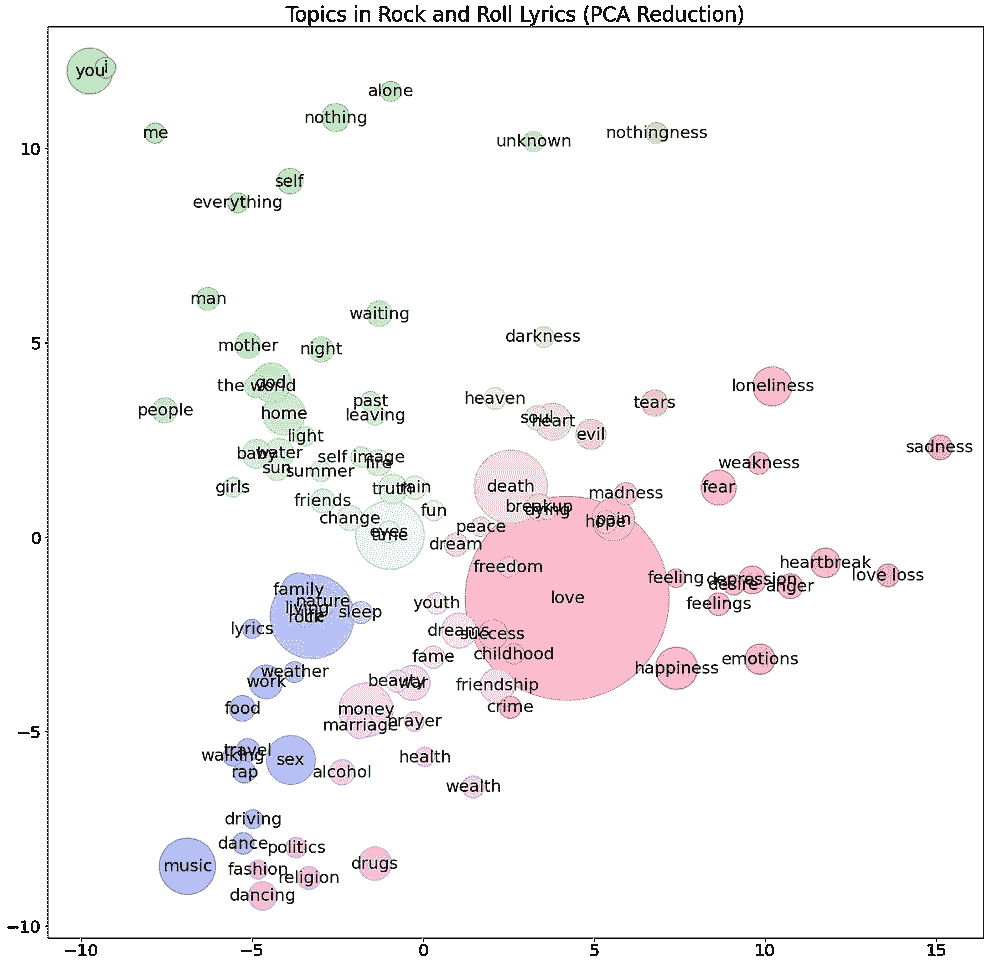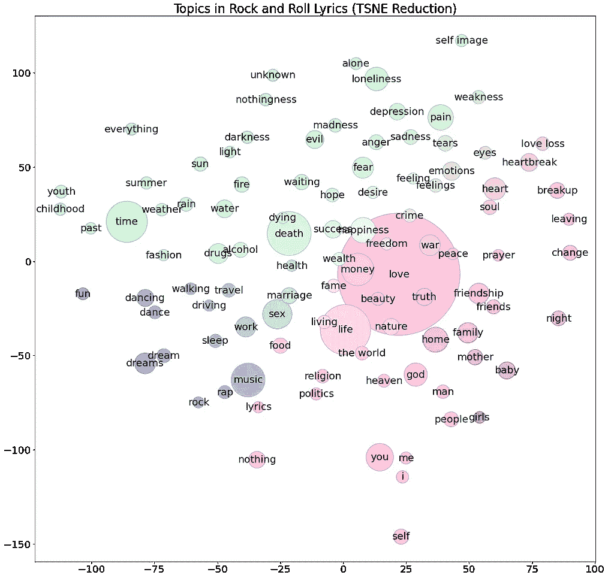

**PCA 和 TSNE 降维后的摇滚话题**，作者图片

你可以看到主成分分析减少了更紧密的集群，而 TSNE 减少了更多的主题。虽然 PCA 简化有一个更有趣的整体分组，但它使阅读主题标签变得困难，因为它们经常堆叠在另一个之上。总的来说，我觉得 TSNE 的简化更容易阅读。

## 确定图表的方向

在看图表时，你可能会问为什么主题在它们的空间位置上？虽然相对位置有意义，但整体空间方向是任意的。通用句子编码器在 512 维空间中指定短语含义的位置。尽管 DR 算法试图保持空间的一致性，但并不能保证任何特定的主题会落在任何特定的地方。

为了使图形的方向更加可预测，我任意选择主题**时间**来确定 X 轴的方向，主题**音乐**来确定 Y 轴的方向。下面是运行方向代码前后的图形。

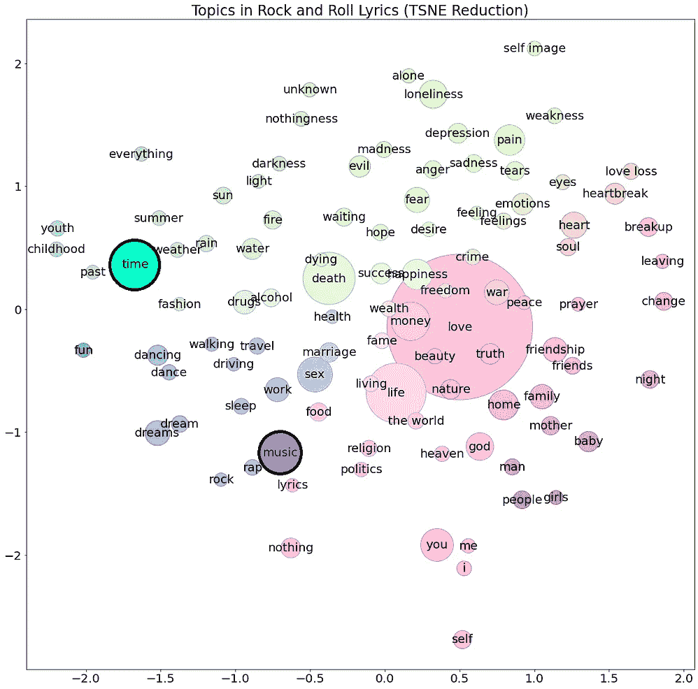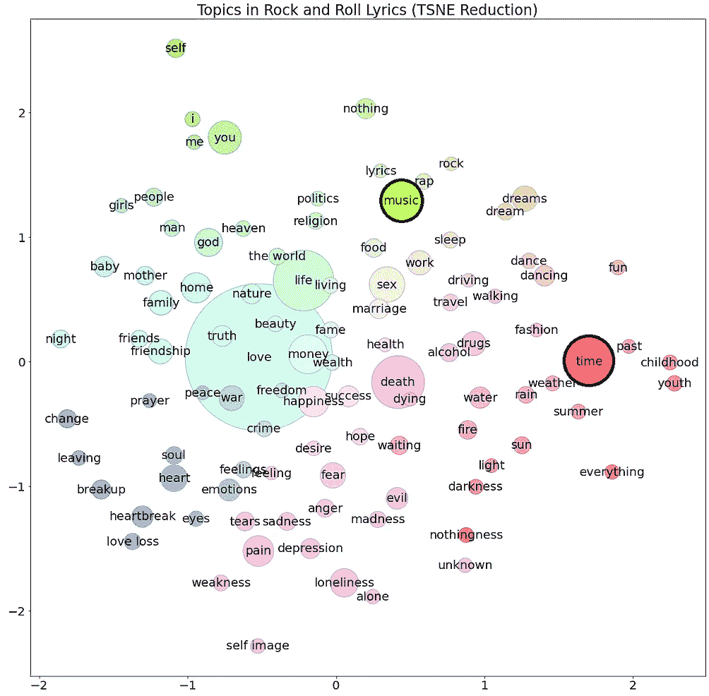

**摇滚主题定位**，作者图解

图形定向后，**时间**话题现在在三点钟位置，**音乐**话题大致在 12 点钟位置。图定向的源代码是这里的。

## k 均值聚类

你可能已经注意到有些主题是同义词。比如可以看到**梦**和**梦**，**舞**和**舞**等。，作为单独的主题。

为了组合相似的主题，我使用了一种叫做 k-means 聚类的算法。该算法旨在将 n 个样本分成 k 个聚类，其中每个样本属于具有最近均值的聚类。

下面是使用 k-means 将数据减少到 50 个聚类后主题的样子。

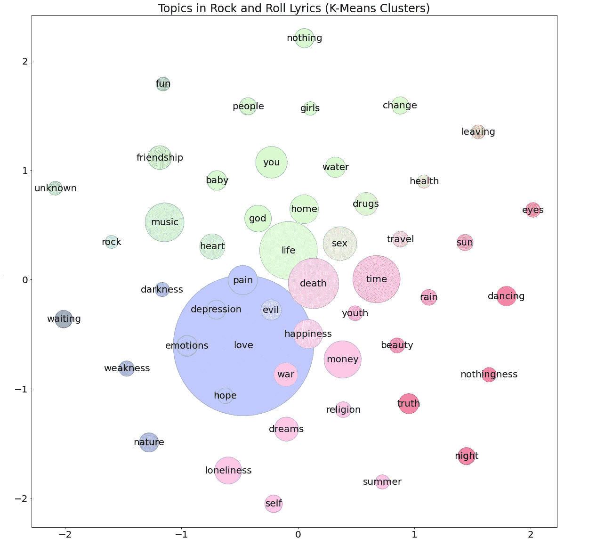

**摇滚话题群**，作者图片

你可以看到相似的主题被有效地分组在一起，像主题**梦**如何合并成**梦**和**舞**合并成**舞**等等。

这里有一张图表，显示了按歌词主题平均值排列的乐队。圆圈的大小代表他们的歌曲目录中的行数。

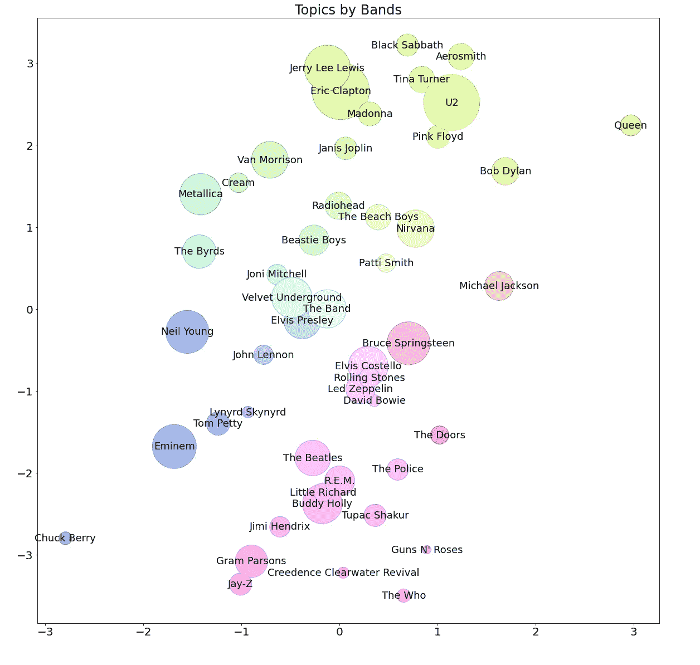

**按乐队分类的主题**，按作者分类的图片

看到你最喜欢的乐队登陆是相当有趣的。有些分组是有道理的，比如看到布鲁斯·斯普林斯汀挨着埃尔维斯·考斯特罗。但不知何故，沙滩男孩夹在电台司令和涅磐之间。我没想到会这样。

# 讨论和后续步骤

使用大型 transformer 模型进行有机主题建模似乎可以很好地处理大型数据集。在 Google Colab 上运行 GPT-J 是一种经济高效的分析方法。我可以尝试的下一件事是微调 GPT-J，在不指定例子的情况下找到主题，消除例子泄漏的问题。

另一个项目是观察这种主题建模技术与其他方法相比有多好。例如，我可以在 20 个新闻组数据集上运行它，看看它与最先进的系统双向对抗训练(BAT)[4]相比如何。虽然 BAT 方法使用一个较小的模型来执行主题建模的特定任务，但是我使用大型 transformer 模型的方法可以利用一般知识来产生更好的结果。

# 源代码和 Colabs

这个项目的所有源代码都可以在 GitHub 上找到。我在 [CC BY-SA 许可](https://creativecommons.org/licenses/by-sa/4.0/)下发布了源代码。


**归属共享**

# 感谢

我要感谢詹尼弗·林和奥利弗·斯特瑞普对这个项目的帮助。

# 参考

[1] L. Gao 等， [The Pile:一个用于语言建模的 800GB 多样化文本数据集](https://arxiv.org/pdf/2101.00027.pdf) (2020)

[2] Y. Wang 等人，[深度学习的、GPU 和 CPU 平台的基准测试](https://arxiv.org/pdf/1907.10701.pdf) (2019)

[3] D. Cer 等人，[通用语句编码器](https://arxiv.org/pdf/1803.11175.pdf) (2018)

[4] R.Wang 等，[双向对抗训练的神经主题建模](https://arxiv.org/pdf/2004.12331v1.pdf) (2020)

为了无限制地访问 Medium 上的所有文章，[成为会员](https://robgon.medium.com/membership)，每月支付 5 美元。非会员每月只能看三个锁定的故事。