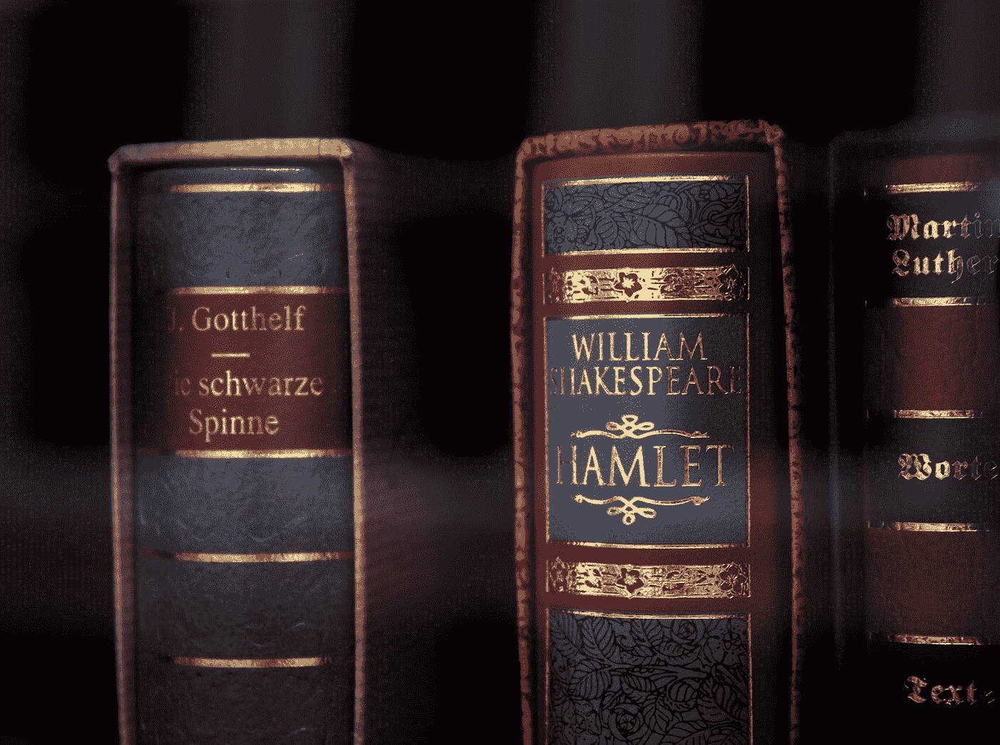

# 莎士比亚和阿姆——谁是更好的作词人？

> 原文：<https://towardsdatascience.com/shakespeare-versus-eminem-1de54e479279?source=collection_archive---------8----------------------->

## 许多人认为他是有史以来最好的作家。他以他的歌谣、诗歌、奏鸣曲以及关于生活、爱情和人类状况的作品而闻名。像*这样的人如何能与莎士比亚相提并论？*

由[马克斯·穆塞尔曼](https://unsplash.com/@maxmuselmann?utm_source=medium&utm_medium=referral)在 [Unsplash](https://unsplash.com?utm_source=medium&utm_medium=referral) 上拍摄的照片

数据科学已经渗透到现代生活中每一个可以想象的角落。苹果在你的手机中使用一个专用芯片来通知 Siri 向你建议什么。甚至杂货店的标签也能实时更新产品价格。但与此同时，生活的真正问题仍然没有答案；我们无法回答生命的意义是什么，如何获得真正的幸福，或者莎士比亚是否比阿姆更适合作词。

*(免责声明:此分析严重偏向于表明 b 兔是更好的作词人。我不会采取任何措施来解释这种偏见。事实上，我会尽我所能证明这一点。因为这是应该做的事情。"* [*如果我只能用这种力量行善，我不会，即使我能*](https://genius.com/Eminem-say-what-you-say-lyrics) *。")*

# 称重

> 抱歉，如果我说得太直白了
> 但是我像一尊雕像一样僵硬，你坐在架子上
> 我觉得我像个半身像，也许我只是超越了自己——[阿姆](https://genius.com/Eminem-heat-lyrics)

这两个人都因擅长文字游戏而出名。莎士比亚发明了我们现在使用的 1700 多个单词。他创作了 37 部戏剧和一些诗歌。他最长的作品是《哈姆雷特》，有 4042 行(说唱术语中的“酒吧”)，他的全集包含 884647 个单词。

我们在莎翁分析中的数据包含了 36 部作品和 857，648 个单词。

与普遍的看法相反，莎士比亚在他的一生中并不引人注目，他当然很受欢迎，但其他剧作家更受欢迎。他的成名要等到他死后很久。死后 100 年，在 1730 年，莎士比亚女士俱乐部开始通过当地剧院宣传他的作品，这使他成为人们关注的焦点，并赢得了他现在享有的声誉。

另一方面，自从马歇尔·马瑟斯(M&M:外行人的阿姆)一炮走红，他就成了一个传奇。迄今为止，他已经制作了 12 张录音室专辑。

阿姆有许多以他的名字命名的唱片。他经常受到称赞的《说唱之神》(Rap God)保持着一首热门歌曲中最多单词的吉尼斯纪录——1，560 个——而且，当它问世时，是以一定数量的音节最快的速度——16.3 秒 157 个音节，每秒 9.6 秒的舌头扭曲音节——他在《威严》(Maurice)上以每秒多 0.7 个音节的速度打破了这一纪录然后，在 2018 年，他凭借《哥斯拉》再次打破了他自己的记录*，但现在“[也许我只是超越了自己。](https://genius.com/Eminem-heat-lyrics)*

**哦，还有**阿姆拿了奥斯卡**。**

**他也是唯一一个在同一周内拥有冠军歌曲、专辑和电影的人！**

**我们选择的阿姆作品包含 **17 张不同的专辑**、 **204 首歌曲**和总计 **167，080 字**(还不包括他的许多单曲或混音带、自由风格、合作带，或他抢尽风头的’[特色)。](https://genius.com/Eminem-fall-lyrics)**

**斯利姆·谢迪并不回避挑战，在 Jay-Z 的**叛徒**中，他直截了当地喊出了莎士比亚。莎士比亚对阿姆做过这样的事吗？我觉得不是！**

# **节奏和诗歌**

> **我能否把你比做夏季的一天？
> 当你在永恒的诗行中与时间同长:
> 只要人们还能呼吸，眼睛还能看得见，
> 只要这诗行长存，这诗行赋予你生命。—莎士比亚**

**Christian Rudder 在他的书 Dataclysm[中指出，在 Twitter 上使用词语比在书本中发现的更有水准，即使是那些我们认为“伟大”的人。他认为，原因是 Twitter 的 140 个字符的限制迫使用户对我们使用的词语进行长时间的思考。Twitterers 用户会选择更重的词，在有限的空间里传达更多的意思。](https://medium.com/u/d085f7a4eed?source=post_page-----1de54e479279--------------------------------)**

**文本“成熟度”有许多不同的指标，比如戴尔·查尔的可读性测试。这样的测试不能捕捉到我们皇家韵律的全部光辉，但它会做到的。让我们看看，如果我们的主角和对手在拳击比赛中针锋相对，会发生什么。**

**第一回合开始。叮叮。**

# **第一轮:平均水平，在(他的)最佳状态下摇摆不定…**

**"平均值是你隐藏真相的地方."这种智慧在这里同样适用。平均水平很少提到我们英雄的绝对抒情素养和丰富词汇。**

**在某些方面，Em 和 Shaky 的作品有很大的不同；比如它们的长度。阿姆平均每首歌有 827 个单词，平均每首歌有 110 个小节，而莎翁每首歌有令人印象深刻的 23823 个单词，平均每首歌有 3949 行。**

**Em 和晃动在这一点上都不占优势。他们在社会中的地位略有不同。因此，这一轮有点平淡无奇。我们的传奇故事都没有真正的出彩，但话说回来"[你必须是钻石才能爬上拳击台](https://genius.com/Eminem-greatest-lyrics#note-15289121)"**

**阿姆作品中出现频率最高的词。**

**莎士比亚作品中出现频率最高的词。**

# **第 2 轮:标准化平均值…**

**这是战斗变得更有趣的地方。这就是我们看到谁在言语攻击中出拳过重的地方。阿姆没有被分阶段:“[只要努力，做绳索 a-dope 阿里洗牌，在他的对手周围跳舞。](https://genius.com/Eminem-my-darling-lyrics)**

**对于这一点，我们想看看谁用的词更复杂。我们已经使用了 3000 个简单单词的列表。这些词用在日常用语中，应该避免使用，因为它们主要是填充语。**

**阿姆和莎士比亚不相上下。两人的作品中平均都有 20%左右的“硬话”。老实说，这种差别并不大，但优势在于莎士比亚。**

**然而，当谈到每部作品的独特词汇时,阿姆胜过莎翁。平均而言，Em 的作品有 42%的独特词汇，而莎士比亚只有大约 15%的独特词汇。这并不奇怪——莎士比亚需要大量的填充词来填充他的长篇作品。**

****阿姆罗**的**的**的难比易词。**

****莎士比亚**笔下的难易词之比。**

**阿姆用力挥棒，莎士比亚躲闪。那家伙的“[连电池都没充过电。婊子，他什么也没插。](https://genius.com/Eminem-not-alike-lyrics)**

# ****第 3 轮:你自己更差的殿下……****

**阿姆经常说自己是更大的敌人。他已经证明了自己是一名出色的射手。“他的**说唱之神**是一个异数，即使以他自己的标准来看(见下图，右上角)。如前所述，这首歌有多达 1547 个词，其中 617 个词是独一无二的。**

**一首被严重低估的歌曲是同名专辑中的歌曲 **shadyxv** 。这首歌只有 1158 个单词，但是 T8 有多达 611 个单词(几乎和说唱之神一样多)。**

**关于我们分析中歌曲的完整分类，请参见下面的气泡图。将鼠标悬停在上面以查看正在考虑的工作。**

****阿姆的**抒情天才作品集，将鼠标悬停在泡泡上，看看是哪首歌…**

# **第四轮:**莎士比亚引领对话……****

**莎士比亚也想插话。尽管他的作品冗长乏味，但他作品中的变化却少得多。自己看看，下面:**

****莎士比亚**的无聊戏剧作品集，将鼠标悬停在泡泡上，看看是哪部戏剧…**

# **第五轮:双关语**

**两位作者都有玩弄语言的倾向。他们在适当的位置弯曲单词，语言在他们手中变得几乎是流动的。在《第十二夜》中，莎士比亚展示了他顽皮的一面:**

> **我的生活，这是我的夫人的手:这些是她的 C，
> 她的 U，(*读:‘N’*)她的 T；从而使她成为伟大的诗人——莎士比亚**

**然而，在**沼泽**上阿姆用他的三重(？)双关语:**

> **我胸前的“s ”(超人)好像是复数——阿姆**

**在我的胸前；在 chest 上加一个 s 会使它变成复数。然而，胸膜也是胸部包裹肺部的区域。所有的乐趣和游戏，而且，复数“s”(读作:S.S .)是 Slim Shady 的缩写。**

**或者，考虑这首歌超越:**

> **一二三，咔嚓咔嚓，一二三
> 咔嚓咔嚓，一二三——阿姆**

**在**上，我亲爱的**，1+2+3，1+2+3，1+2+3 = 666，恶魔的符号——这首歌里他可以说是在和谁战斗。但他在 1:23 分的时候把这些小节带入了这首歌。这里列举的太多了，值得去看看[天才网站](https://genius.com/artists/Eminem)看看你到底错过了多少。**

# **第六轮:口才的要素**

**他的脚步仍然轻盈。阿姆动作很快。莎士比亚看起来又老又累。**

**马克·福赛思(Mark Forsyth)写了他的书《口才要素》(Elements of 口才)用文字赞美莎士比亚的方式，没有人比山羊做得更好([对于那些不知道山羊是什么的人来说，它意味着有史以来最伟大的，我认为他就是其中之一。](https://www.youtube.com/watch?v=KEm_rsOlBgM&ab_channel=ShadyUniverse)”)。**

**马克给了我们很多可以研究的东西(39 章，阿姆本可以胜过莎士比亚)。在他的第一章和第二十五章中，他谈到了 ***头韵(或押韵)，即*具有相似字母或音的快速递进的单词**，这满足了听众对押韵的“需求”。**

**马克给了我们莎士比亚的《仲夏夜之梦》:**

> **于是，他用剑，用该死的剑，勇敢地剖开他滚烫的血淋淋的胸膛；**

**但我很高兴在清理我的衣柜时抚养他阿姆:**

> **花一点时间听听，在你认为这张唱片令人不快之前
> 但是把你自己放在我的位置上，试着想象一下
> 目睹你妈妈在厨房里吃处方药
> 抱怨有人总是翻钱包，丢东西**

# **第 7 轮:多音节押韵方案**

**或者考虑我们的英雄的押韵方案；莎士比亚的《暴风雨》中写道:**

> **满揣五个令尊**的谎言**；
> 他的骨头是珊瑚**制成的**；那些珍珠是他的眼睛。
> 凡是不褪色的、
> 没有一样东西，而是经历了一场海——**变**、
> 为丰富的东西和**奇怪的东西**——莎士比亚**

**莎士比亚的押韵方案是简单的 A；b；a；b；c；c(其中“；”表示一个句子的结束。将此与阿姆的**完全清醒**诗句相比:**

> **但是他们看不到我能看到的，我的肚子里有一个空缺
> 它让我玩捉迷藏，就像杰森一样我太饿了
> 她是裸体的，看，没有隐私但是我能看到她想要我
> 那么有耐心，看，我试着去做但是哎呀，为什么她嘲笑我？
> (等。)—阿姆**

**这里的押韵方案是 ABCDABCDABCDABCD 接下来的 14 小节等等！**

**很明显，莎士比亚可能已经开始了，Em 肯定是来完成它的。**

# **第 8 轮:最快的诗句**

**这里有五段经文值得思考。他们都快得不可思议。**

1.  **哥斯拉——音乐将在 30 秒内被
    339 个音节谋杀(**每秒 11.3 个音节**)**
2.  **女王陛下(妮琪·米娜)
    12 秒 123 个音节**每秒 10.2 个音节****
3.  **被冒犯——复兴
    13 秒 130 个音节，(**每秒 10.2 个音节**)**
4.  **说唱之神——马歇尔·马瑟斯 LP2
    仅用 16.3 秒就唱出 157 个音节(**每秒 9.6 个音节**)**

**现在，试着跟着这些诗句一起说唱，你会发现你所看到的是一个天才在工作。《T4》**《哥斯拉》**顺带一提，这是阿姆连续第三次打破他自己的最快韵文记录。**

# **第九轮:T.K.O**

**好吧，TKO 是 JT 的歌，我的错。)**

**莎士比亚几乎站不住脚。最后一个**钉在棺材里**，阿姆罗用音乐的方式。很明显，“我一拔出笔，纸就是手榴弹”**

**在恢复的惊人(奖金)轨道上**无标题，**他在 3/4 拍内敲击 4/4 拍号。结果是良性的“摇头晃脑”酒吧在迷人的平滑华尔兹流。**

**最后一张漂亮的图片是阿姆的作品，带有他们独特的词，专辑中的 dale-challs。**

**他在围绳上。他荡秋千。他击中了。莎士比亚倒下了…他是有史以来最伟大的:阿姆。尽管莎士比亚进行了令人生畏的斗争，但重要的是他显然不是马歇尔·马瑟斯的对手。**

**这样的人对莎士比亚有什么看法？一切。**

# **余波**

**那么，我们的英雄在哪里？在事后(懂了吗？)只剩下一个站着:黑幕。**

**尽管'[5-0 开始向他逼近'](https://genius.com/Eminem-tone-deaf-lyrics#note-21643107)我也不再是孩子了。我猜当 Em 说:“[某个地方某个孩子在对着镜子假唱的时候，他在做这个，那是我为谁做的，其他的我真的不在乎](https://genius.com/Eminem-fall-lyrics#note-15288842)”——***我就是那个孩子。*****

***完整的分析和数据集可以在我的 GitHub 页面找到，* [*这里*](https://github.com/JeroenvanZeeland/Shakespeare-vs-Eminem) *。***

***对于纤细黑幕的歌词，我已经用了数据库上的*[*az lyrics*](https://www.azlyrics.com/e/eminem.html)*。***

**对于莎士比亚的作品，我用的是《全集》第 2 版(1905 年，牛津大学出版社)。**

***感谢* [*伊莉莎白*](https://medium.com/u/6604bd562b34?source=post_page-----1de54e479279--------------------------------) *为她精心设计的可视化嵌入媒介，* [*这里*](/how-to-create-a-plotly-visualization-and-embed-it-on-websites-517c1a78568b) *。***