# SHAP:用 Python 解释任何机器学习模型

> 原文：<https://towardsdatascience.com/shap-explain-any-machine-learning-model-in-python-24207127cad7?source=collection_archive---------0----------------------->

## [入门](https://towardsdatascience.com/tagged/getting-started)

## SHAP 和沙普利价值观综合指南

# 动机

想象一下，你正在试图训练一个机器学习模型来预测一个广告是否被特定的人点击。在收到一个人的一些信息后，模型预测一个人不会点击某个广告。

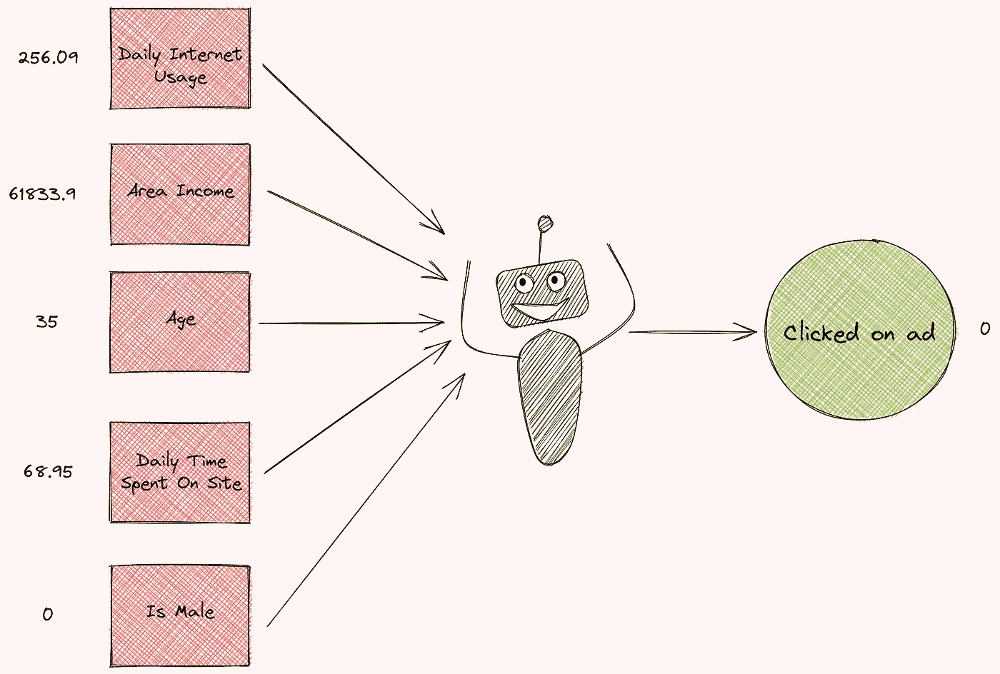

作者图片

但是为什么这个模型预测到了这一点呢？每个特征对预测的贡献有多大？如果您能看到一个如下图所示的曲线图，显示每个要素对预测的贡献大小，那不是很好吗？


作者图片

这就是 Shapley 值派上用场的时候。

# 什么是沙普利值？

Shapley 值是博弈论中使用的一种方法，它涉及到将收益和成本公平地分配给联盟中的参与者。

由于每个参与者对联盟的贡献不同，沙普利值确保每个参与者**根据他们贡献的多少得到公平的份额。**


作者图片

## 简单的例子

Shapley 值广泛用于质疑一个组中每个工作者/特征的贡献的问题。为了理解 Shapley value 是如何工作的，让我们想象一下你的公司刚刚进行了 A/B 测试，他们测试了不同的广告策略组合。

每个策略在特定月份的收入如下:

*   没有广告:150 美元
*   社交媒体:300 美元
*   谷歌广告:200 美元
*   电子邮件营销:350 美元
*   社交媒体和谷歌广告 320 美元
*   社交媒体和电子邮件营销:400 美元
*   谷歌广告和电子邮件营销:350 美元
*   电子邮件营销、谷歌广告和社交媒体:450 美元

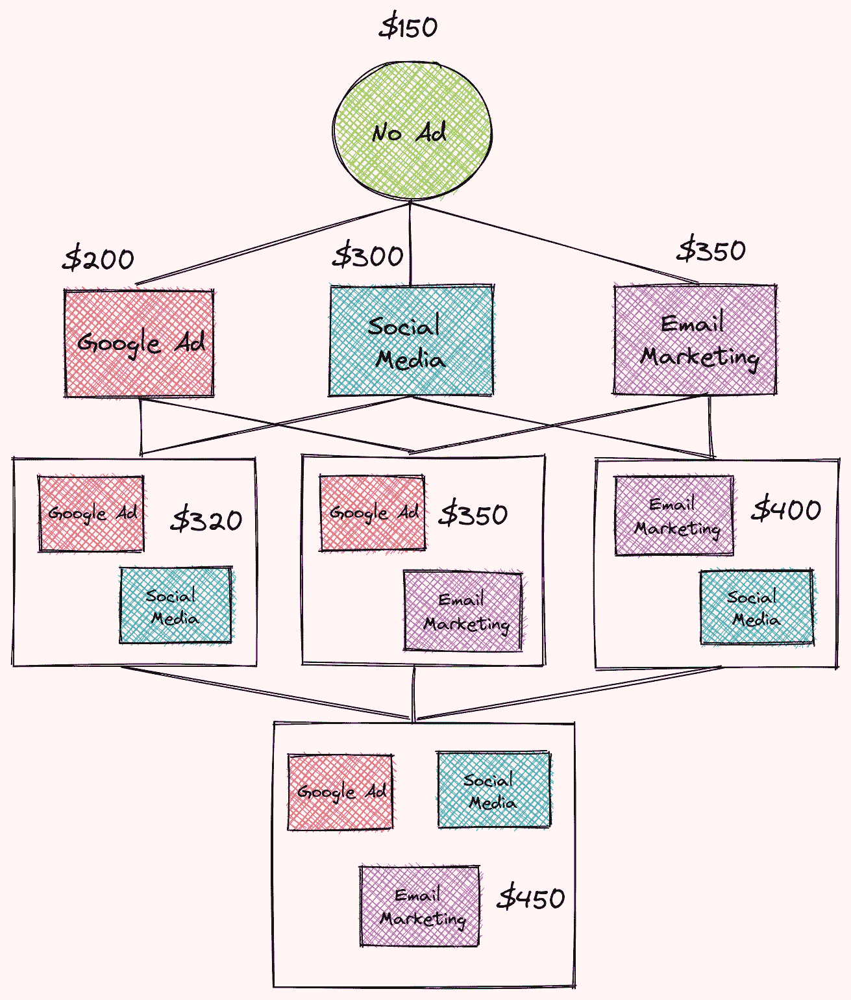

作者图片

使用三个广告和不使用广告的收入相差 300 美元。**每个广告对这种差异的贡献有多大？**

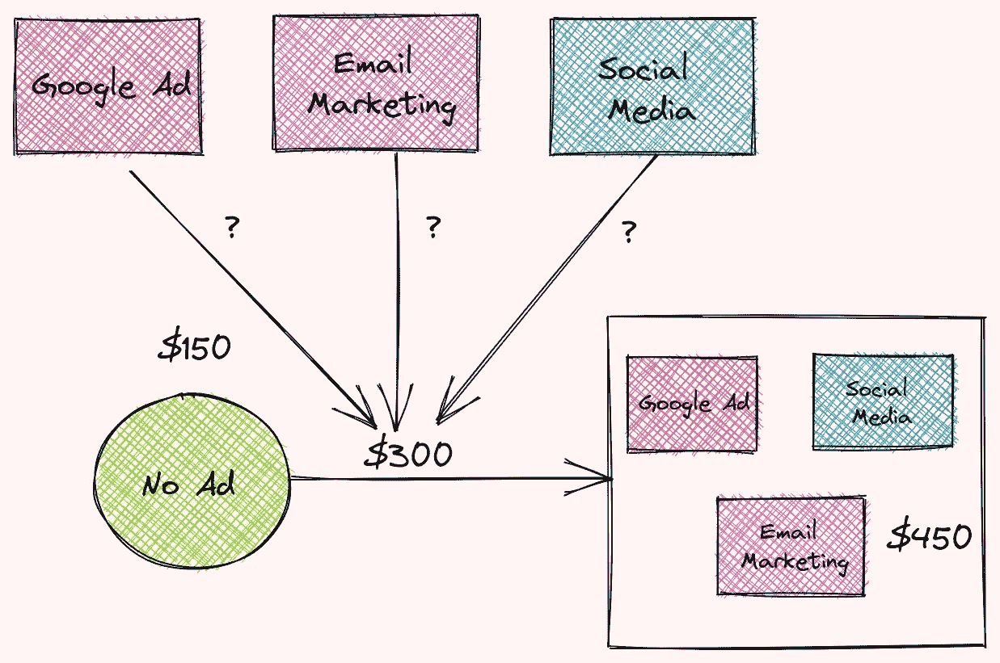

作者图片

我们可以通过计算每种广告的 Shapley 值来找出答案。[这篇文章](/shap-explained-the-way-i-wish-someone-explained-it-to-me-ab81cc69ef30)提供了一个计算 Shap 值的好方法。我在这里总结一下。

我们首先计算谷歌广告对公司收入的总贡献。谷歌广告的总贡献可以通过以下公式计算:


作者图片

让我们找出谷歌广告的边际贡献和权重。

## 寻找谷歌广告的边际贡献

首先，我们会发现谷歌广告对以下群体的边际贡献:

*   没有广告
*   谷歌广告+社交媒体
*   谷歌广告+电子邮件营销
*   谷歌广告+电子邮件营销+社交媒体

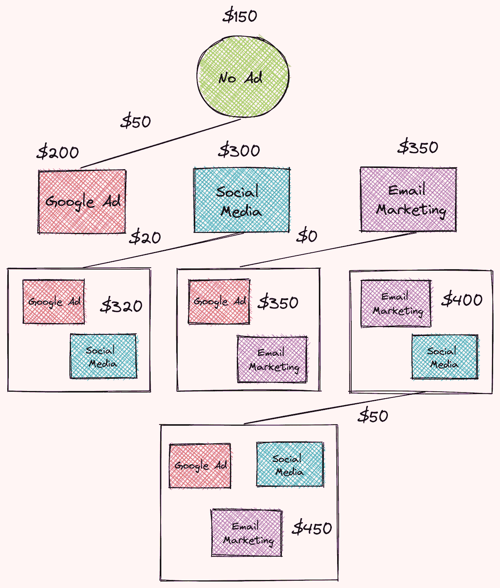

作者图片

谷歌广告对无广告的边际贡献是:


作者图片

谷歌广告对谷歌广告和社交媒体集团的边际贡献是:


作者图片

谷歌广告对谷歌广告和电子邮件营销集团的边际贡献是:


作者图片

谷歌广告对谷歌广告、电子邮件营销和社交媒体集团的边际贡献是:


作者图片

## 寻找重量

为了找到权重，我们将把不同广告策略的组合组织成多个层次，如下所示。每个级别对应于每个组合中广告策略的数量。

然后，我们将根据每个级别中的边数来分配权重。我们看到:

*   第一层包含 **3 条边**，因此每条边的权重将是**的 1/3**
*   第二层包含 **6 条边**，因此每条边的权重为 **1/6**
*   第三层包含 **3 条边**，因此每条边的权重将为 **1/3**

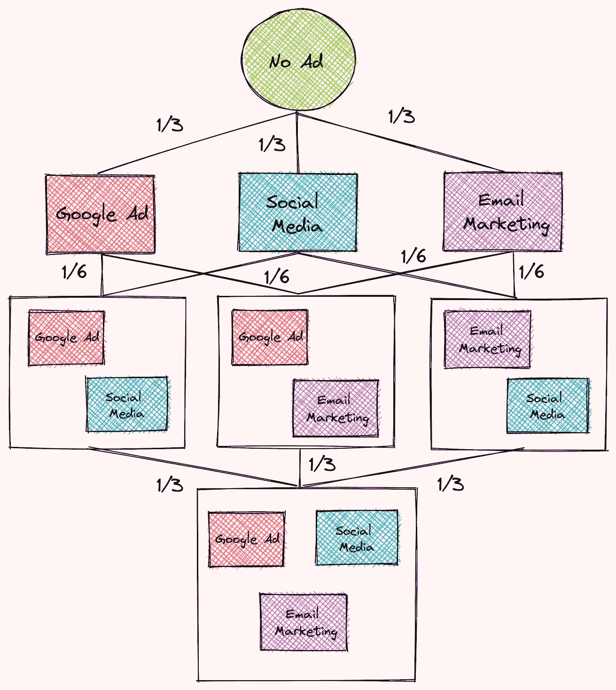

作者图片

## 找出谷歌广告的总贡献

现在我们已经准备好根据之前找到的权重和边际贡献来找到谷歌广告的总贡献了！

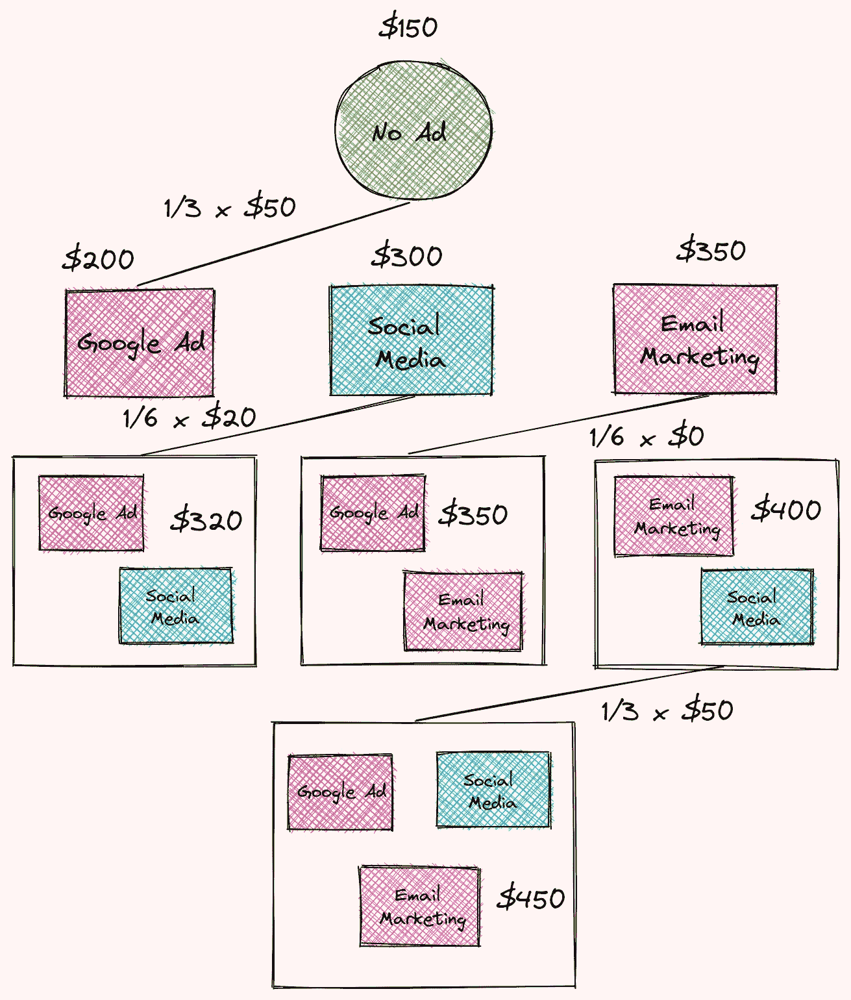

作者图片


作者图片

酷！因此，谷歌广告为使用 3 种广告策略和不使用广告之间的总收入差异贡献了 36.67 美元。36.67 是谷歌广告的 Shapey 值。

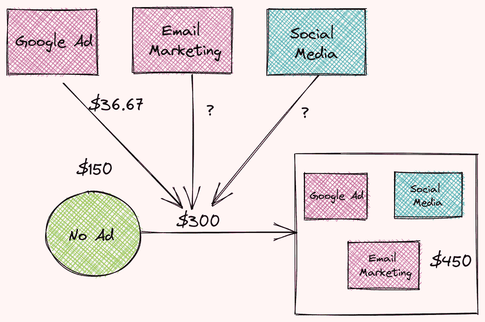

对另外两种广告策略重复上述步骤，我们可以看到:

*   电子邮件营销贡献了 151.67 美元
*   社交媒体贡献了 111.67 美元
*   谷歌广告贡献 36.67 美元


作者图片

他们共同贡献了 300 美元来区别使用 3 种不同类型的广告和不使用广告！很酷，不是吗？

现在我们已经了解了 Shapley 值，让我们看看如何使用它来解释机器学习模型。

# SHAP——用 Python 解释任何机器学习模型

[SHAP](https://github.com/slundberg/shap) 是一个 Python 库，它使用 Shapley 值来解释任何机器学习模型的输出。

要安装 SHAP，请键入:

```
pip install shap
```

## 训练模特

为了理解 SHAP 是如何工作的，我们将使用一个[广告数据集](https://drive.google.com/file/d/1oMUOmXf67DxPe5CV6YJTiEm9TeozKK5H/view?usp=sharing)进行实验:

我们将建立一个机器学习模型，根据用户的一些信息来预测用户是否点击了广告。

我们将使用 [Patsy](/patsy-build-powerful-features-with-arbitrary-python-code-bb4bb98db67a#3be4-4bcff97738cd) 将数据帧转换成一个特性数组和一个目标值数组:

将数据分为训练集和测试集:

接下来，我们将使用 XGBoost 构建模型并进行预测:

为了了解模型的表现，我们将使用 F1 分数:

```
0.9619047619047619
```

相当不错！

## 解释模型

该模型在预测用户是否点击广告方面做得很好。但它是如何得出这样的预测的呢？**每个特征对最终预测和平均预测之间的差异有多大贡献？**

请注意，这个问题与我们在文章开头提到的问题非常相似。

这就是为什么找到每个特征的 Shapley 值可以帮助我们确定它们的贡献。获得特征 I 的重要性的步骤，其中 I 是特征的索引，与前面类似:

*   获取不包含特征 I 的所有子集
*   找出特征 I 对每个子集的边际贡献
*   合计所有边际贡献以计算特征 I 的贡献

要使用 SHAP 找到 Shapley 值，只需将训练好的模型插入`shap.Explainer`:

# SHAP 瀑布图

想象第一个预言的解释:


作者图片

啊哈！现在我们知道了每个特征对第一次预测的贡献。对上图的解释:


作者图片

*   蓝色条显示特定特征降低预测值的程度。
*   红色条显示了特定特征对预测值的增加程度。
*   负值意味着该人点击广告的概率小于 0.5

对于这些子集中的每一个，SHAP 不会删除一个特征，然后重新训练模型，而是用该特征的平均值替换该特征，然后生成预测。

我们应该期望总贡献等于预测值和平均预测值之差。让我们检查一下:


作者图片

酷！他们是平等的。

想象第二个预言的解释:

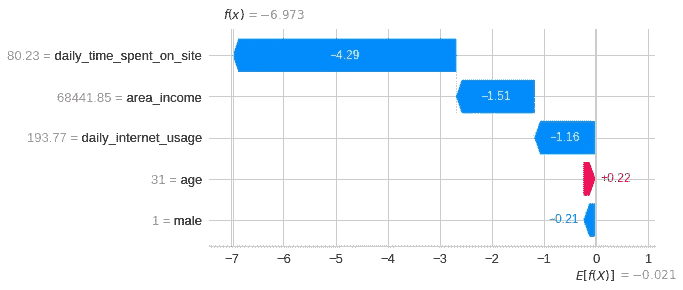

作者图片

# SHAP 汇总图

我们不需要查看每个单独的实例，而是可以使用 SHAP 汇总图直观显示这些功能对多个实例的总体影响:

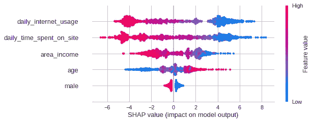

作者图片

SHAP 汇总图告诉我们最重要的要素及其对数据集的影响范围。

从上面的图中，我们可以对模型的预测获得一些有趣的见解:

*   用户的日常互联网使用对该用户是否点击广告有最大的影响。
*   随着**日常互联网使用** **的增加，**用户点击广告**的可能性**降低。****
*   随着**每天花在网站上的时间增加，**用户点击广告的**可能性降低**。
*   随着**地区收入的增加，**用户**点击广告**的可能性**降低。**
*   随着年龄的增加，用户更有可能点击广告。
*   如果用户**是男性**，那么这个用户**不太可能**点击广告**。**

# SHAP 条形图

我们还可以使用 SHAP 条形图来绘制全局特征重要性图。


作者图片

# SHAP 相关散点图

我们可以使用 SHAP 相关散点图观察单个特征对模型做出的所有预测的影响。

## 日常互联网使用

日常互联网使用功能散点图:

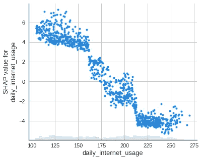

作者图片

从上面的图中，我们可以看到，随着每日互联网使用量的增加，每日互联网使用量的 SHAP 值减少。这证实了我们在早期情节中看到的。

我们还可以通过添加`color=shap_values`来观察日常互联网使用功能与同一情节中其他功能之间的交互。

散点图将试图挑选出与日常互联网使用(即每天花在网站上的时间)互动最强的功能栏。

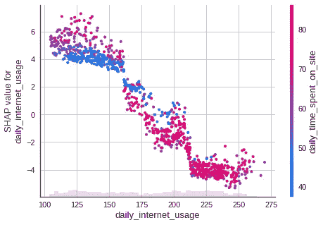

作者图片

酷！从上面的情节中，我们可以看到，一个每天使用互联网 150 分钟，并且每天在网站上花费少量时间的人更有可能点击广告。

让我们看看其他一些特征的散点图:

## 每天在现场花费的时间

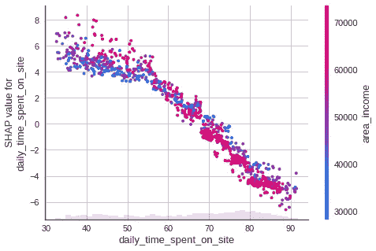

作者图片

## 地区收入

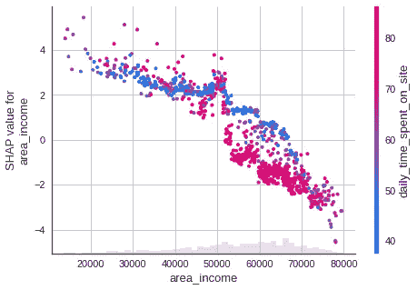

作者图片

## 年龄


作者图片

## 性别

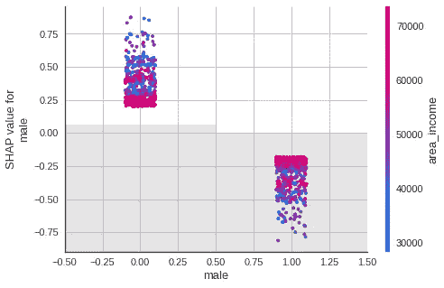

作者图片

# SHAP 相互作用图

您还可以通过 SHAP 交互值汇总图观察功能之间的**交互矩阵。在该图中，主要效应在对角线上，交互效应在对角线外。**

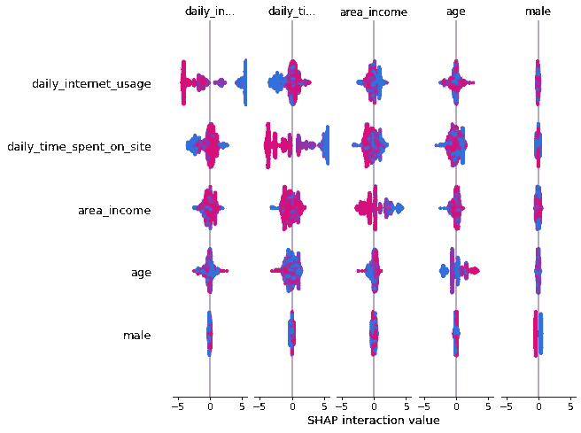

作者图片

相当酷！

# 结论

恭喜你！您刚刚学习了 Shapey 值以及如何使用它来解释机器学习模型。希望这篇文章能给你必要的知识，让你用 Python 解读自己的机器学习模型。

我推荐查看 SHAP 的文档来了解更多关于 SHAP 的其他应用。

您可以随意使用[这个交互式笔记本](https://deepnote.com/project/Data-science-hxlyJpi-QrKFJziQgoMSmQ/%2FData-science%2Fdata_science_tools%2Fshapey_values%2Fshapey_values.ipynb)中的源代码，或者转到我的存储库:

<https://github.com/khuyentran1401/Data-science/blob/master/data_science_tools/shapey_values/shapey_values.ipynb>  

我喜欢写一些基本的数据科学概念，并尝试不同的算法和数据科学工具。你可以在 LinkedIn 和 Twitter 上与我联系。

如果你想查看我写的所有文章的代码，请点击这里。在 Medium 上关注我，了解我的最新数据科学文章，例如:

</how-to-solve-a-production-planning-and-inventory-problem-in-python-45c546f4bcf0>  </how-to-find-best-locations-for-your-restaurants-with-python-b2fadc91c4dd>  </observe-the-friend-paradox-in-facebook-data-using-python-314c23fd49e4>  </how-to-detect-seasonality-outliers-and-changepoints-in-your-time-series-5d0901498cff>  

# 参考

南马赞蒂(2021 年 4 月 21 日)。 *SHAP 解释道，我希望有人能给我解释一下*。中等。检索于 2021 年 9 月 23 日，来自[https://towards data science . com/shap-explained-the-way-I-wish-someone-explained-it-to-me-ab 81 cc 69 ef 30。](/shap-explained-the-way-i-wish-someone-explained-it-to-me-ab81cc69ef30.)