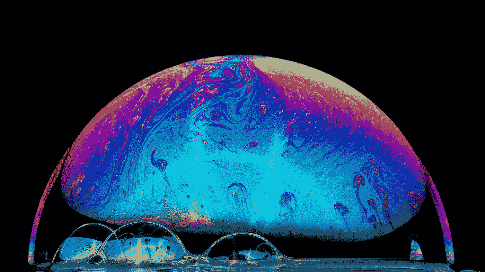
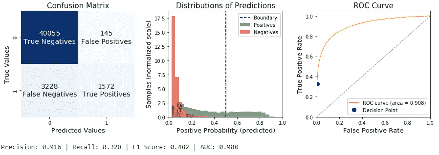
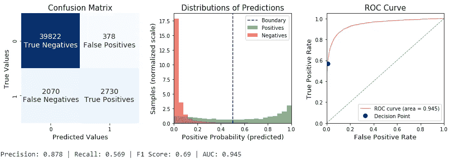
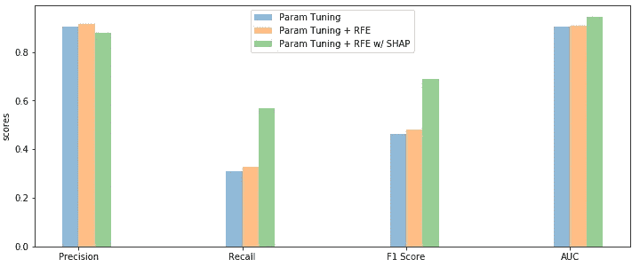

# 用于特征选择和超参数调整的 SHAP

> 原文：<https://towardsdatascience.com/shap-for-feature-selection-and-hyperparameter-tuning-a330ec0ea104?source=collection_archive---------8----------------------->

## 调整参数时，使用 SHAP 进行最佳特征选择

蓝菊·福托雷菲在 [Unsplash](https://unsplash.com?utm_source=medium&utm_medium=referral) 上拍摄的照片

特征选择和超参数调整是每个机器学习任务中的两个重要步骤。大多数情况下，它们有助于提高性能，但缺点是耗费时间。参数组合越多，或者选择过程越精确，持续时间就越长。这是一个实际上我们无法克服的物理极限。我们能做的是利用我们管道中的最佳资源。我们面临不同的可能性，最方便的两种是:

*   **结合调音和选择功能**；
*   **采用 SHAP**(SHapley Additive explaints)使整个过程更具概括性和准确性。

将调整过程与特征的最佳选择相结合可能是每个基于排序的选择算法的需要。排序选择包括迭代地丢弃不太重要的特征，同时重新训练模型，直到达到收敛。**用于特征选择的模型可能(在参数配置或类型上)不同于用于最终拟合和预测的模型**。这可能导致次优性能。这是例如 RFE(递归特征消除)或 Boruta 的情况，其中由算法通过可变重要性选择的特征被另一个算法用于最终拟合。

当我们使用基于排名的算法进行特征选择时，SHAP 会有所帮助。我们不使用梯度增强生成的默认变量重要性，而是选择最佳特征，如具有最高 shapley 值的特征。**使用 SHAP 的好处显而易见，因为基于原生树的特征重要性存在偏差**。标准方法倾向于高估连续或高基数分类变量的重要性。这使得在特征转移或类别数量变化的情况下计算的重要性不可信。

为了克服这些不足，我们开发了[**shap-hype tune**](https://github.com/cerlymarco/shap-hypetune):*一个 python 包，用于同时进行超参数调整和特性选择。*它允许将超参数调整和特征选择结合到一个具有梯度增强模型的管道中。它支持网格搜索、随机搜索或贝叶斯搜索，并提供分级特征选择算法，如递归特征消除(RFE)、递归特征添加(RFA)或 Boruta。额外的提升包括提供使用 SHAP 重要性进行特征选择的可能性。

在本帖中，我们展示了在执行监督预测任务时采用 [**shap-hypetune**](https://github.com/cerlymarco/shap-hypetune) 的实用程序。我们尝试搜索最佳参数配置，同时选择具有(和不具有)SHAP 的最佳特征集。我们的实验分为三次试验。给定分类场景中的数据集，首先我们简单地通过优化参数来拟合 LightGBM。然后，我们尝试在优化参数的同时，使用默认的基于树的特征重要性来操作标准 RFE。最后，我们做同样的事情，但选择 SHAP 的功能。为了让事情更有趣，我们使用了一个不平衡的二进制目标和一些高基数的分类特征。

# 参数调谐

在第一部分中，我们计算训练集的拟合，只搜索最佳参数组合。最好的模型达到了高于 0.9 的精度，但是在我们的测试数据上具有低召回率。

测试数据上的性能(图片由作者提供)

让我们看看是否能做得更好。

# 参数调整+功能选择

通常，引入特征选择是为了从原始数据集中去除有噪声的预测值。在搜索最佳参数集时，我们使用递归特征消除(RFE)。换句话说，对于每个参数配置，我们在初始训练数据上迭代 RFE。可以通过配置适当的拟合参数来加速该过程，例如提前停止，或者在删除较差特征的同时设置较大的步长。存储在验证集上具有最佳分数的管道，并准备在推断时使用。

测试数据上的性能(图片由作者提供)

在这种情况下，我们总体上有所提高，但召回率和 F1 得分仍然较低。

# SHAP 参数调整+功能选择

最后，我们重新提出和以前一样的程序，但是用 SHAP 代替 RFE。当与基于树的模型结合使用时，SHAP 非常有效。它使用一种*树路径*方法来跟踪这些树，并提取沿着每片叶子向下的训练样本的数量，以提供背景计算。它也不容易过于自信，因为我们可以在验证集而不是在训练数据上计算重要性(像经典的基于树的重要性)。

测试数据上的性能(图片由作者提供)

我们在召回率和 F1 分数方面取得了巨大进步。SHAP 能够排出低质量的分类特征，只保留最佳预测值。

测试数据上的性能对比(图片由作者提供)

# 摘要

在这篇文章中，我们介绍了 [**shap-hypetune**](https://github.com/cerlymarco/shap-hypetune) ，作为一个有用的框架，用于对梯度增强模型进行参数调整和最佳特征搜索。我们展示了一个应用程序，其中我们使用了网格搜索和递归特征消除，但随机搜索和 Boruta 也是其他可用的选项。我们还看到了在经典特征重要性方法缺乏性能的情况下，如何使用 SHAP 幂来改进选择过程。

**如果你对题目感兴趣，我建议:**

*   [**博鲁塔和 SHAP 进行更好的特征选择**](/boruta-and-shap-for-better-feature-selection-20ea97595f4a)
*   [**递归特征选择:增加还是消除？**](/recursive-feature-selection-addition-or-elimination-755e5d86a791)
*   [**博鲁塔 SHAP 进行时态特征选择**](/boruta-shap-for-temporal-feature-selection-96a7840c7713)
*   [**漂移检测 SHAP:有效数据漂移监控**](/shap-for-drift-detection-effective-data-shift-monitoring-c7fb9590adb0)

[**查看我的 GITHUB 回购**](https://github.com/cerlymarco/MEDIUM_NoteBook)

保持联系: [Linkedin](https://www.linkedin.com/in/marco-cerliani-b0bba714b/)