# SHAP:沙普利加法解释

> 原文：<https://towardsdatascience.com/shap-shapley-additive-explanations-5a2a271ed9c3?source=collection_archive---------2----------------------->

## 一步一步的指导理解 SHAP 如何工作，以及如何通过使用 SHAP 图书馆解释 ML 模型

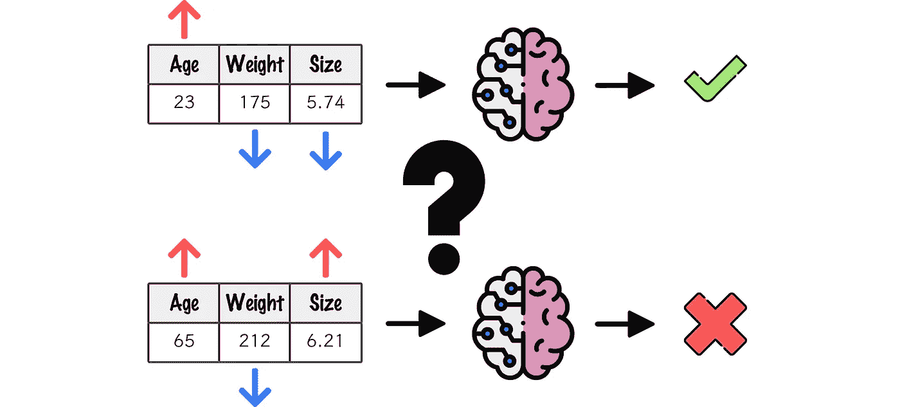

图一。SHAP |作者图片|自由选择的图标

在过去的十年里，我们见证了人工智能时代的爆发，由学术界推动，并被业界接受。人工智能已经融入日常生活，甚至商业模式也围绕着人工智能模式。

人工智能在自然语言处理、计算机视觉等领域已经显示出令人印象深刻的成果。今天，只需要几行代码就可以实现最先进的人工智能模型，这太令人着迷了。然而，作为人类，我们该如何解读 AI 模型做出的预测呢？我们如何衡量模型赋予待推断数据的重要性？嗯，在这个博客中我们将谈论这个有争议的话题:*人工智能模型的可解释性*。

人工智能模型的可解释性是一个活跃的研究领域。近年来已经提出了几种替代方案，在这篇博客中，我们将特别关注其中一个:SHAP(*Shapley Additive explaints*)。

在这个博客中，我们将看到 SHAP 方法的 ML 模型的可解释性，我们将看到 SHAP 是如何工作的，以及它的主要组成部分:Shapley 值。因此，本博客将分为以下几个部分:

*   **什么是沙普利值？**
*   **什么是 SHAP？**
*   **SHAP 在行动:一个分类问题**
*   **结论**

我建议你去喝杯咖啡，放松一下，☕️！

# 什么是匀称的价值观？

Shapley 值是合作博弈论领域的一个概念，其目的是衡量每个玩家对游戏的贡献。获得 Shapley 值的方法是由 Lloyd Shapley [ [1](https://www.degruyter.com/document/doi/10.1515/9781400881970-018/html) ]在 1953 年提出的。Shapley 值产生于这样的背景，其中" *n* "玩家集体参与并获得奖励" *p* "，该奖励旨在根据个人贡献公平地分配给每个" *n* "玩家，这样的贡献是 Shapley 值。

简而言之，Shapley 值是一个特性实例在所有可能组合中的平均边际贡献。平均边际贡献？所有可能的联盟？我们来详细看看这一切指的是什么。

比方说，一群朋友(`A`、`B`、`C`、`D`)正在一起合作获取利润`P`。公平分配利润，意在衡量每个成员的贡献，即每个朋友的沙普利值。为了计算给定成员的 Shapley 值，计算当该成员存在时产生的利润与当该成员不存在时产生的利润之间的差(这种差是给定成员对当前联盟的*边际贡献*),这是针对当你期望为其计算贡献的成员存在时可以产生的所有子组(或联盟)进行的。获得的差值的平均值(平均边际贡献)是 Shapley 值。

在下图中，我们看到了朋友`A`对由朋友`B`、`C`和`D`组成的校对的边际贡献的计算表示。

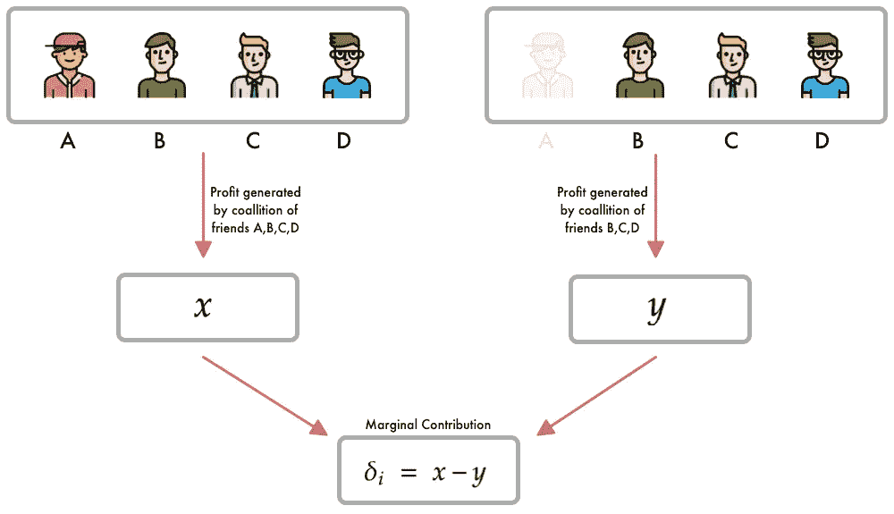

图二。成员“A”对成员 B、C、d 联盟的边际贡献|作者图片|自由选择的图标

例如，为了计算朋友`A`的 Shapley 值，我们将需要构建朋友`A`出现的所有排序，对于每个排序，将计算边际贡献(成员在场时获得的利润与成员不在场时获得的利润之间的差异),并且给定所有边际贡献，将计算平均边际贡献，即 Shapley 值。简单吧？

图 3 显示了朋友`A`的 Shapley 值的计算。

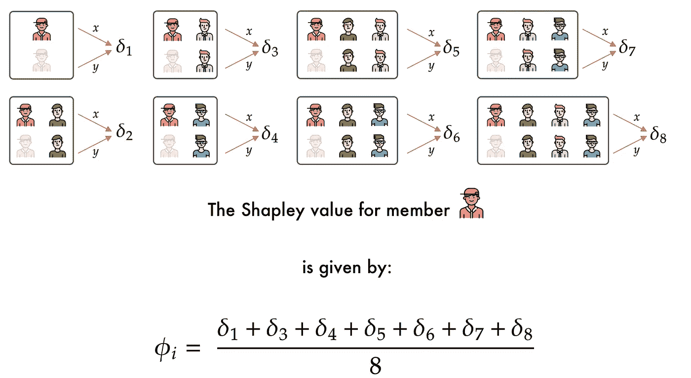

图 3。成员“A”的 Shapely 值计算|作者的图像|自由选择的图标

到目前为止，我们已经知道什么是 Shapley 值，它是如何计算的，以及它的解释是什么。然而，Shapley 值与 ML 模型的可解释性有什么关系？让我们看看这是如何发生的。

在一个 ML 模型的背景下，我们假设我们例子中的每个朋友都是一个特性，游戏是生成预测的函数，利润就是预测。

然而，ML 模型通常具有大量的特征，其中每个特征是离散或连续的变量，这导致计算每个特征的每个实例的 Shapley 值在计算上非常复杂，事实上，这是一个 NP-hard 问题。

正是在这一点上，SHAP 成了主角。在下一节中，我们将看到什么是 SHAP 以及它对 ML 模型的可解释性的方法。

也许是时候重新装满咖啡杯了，☕️！

# 什么是 SHAP？

Shapley Additive Explanations(SHAP)，是 Lundberg 和 Lee 在 2017 年[ [2](https://arxiv.org/pdf/1705.07874.pdf) 推出的一种通过 Shapely 值解释 ML 模型预测的方法。SHAP 的主要思想是为要解释的样本的每个特征计算 Shapley 值，其中每个 Shapley 值代表与其关联的特征在预测中产生的影响。

SHAP 背后的直觉很容易理解，每个特征都有一个相关的沙普利值。然而，SHAP 是如何工作的呢？在上一节中，我们看到 Shapley 值的计算对于许多特征来说可能变得难以处理。为了避免这种情况，作者引入了 Kernel Shap，这是一种从线性时间[ [3](https://arxiv.org/pdf/1602.04938.pdf) ]扩展和改编的方法，用于计算 Shapley 值。

核 Shap 是一种允许用少得多的联合样本计算 Shapley 值的方法。内核 Shap 基于加权线性回归，其中解的系数是 Shapley 值。为了建立加权线性模型，采用样本联盟，对于每个联盟，获得预测，并使用核形状计算权重。最后，拟合加权线性模型，得到的系数是 Shapley 值。

有点复杂，对吧？我们来详细看看。

假设我们想要解释实例`x`，它由特征`f1`、`f2`、`f3`和`f4`组成。该过程从获取一组联合样本开始。例如，联合`(1,0,1,0)`指的是特征`f1`和`f3`的存在，以及特征`f2`和`f4`的不存在。由于 ML 模型不能省略特征来进行推断，所以特征`f2`和`f4`的值被取自训练集的值所替换。然后，对于联合`(1,0,1,0)`，特征`f1`和`f3`的值取自实例`x`，特征`f2`和`f4`的值来自训练集，这样可以正确地进行预测。因此，对于每个联合样本，利用等式 1 中描述的核形状来获得预测并计算权重。求解线性模型，得到的系数就是 Shapley 值。

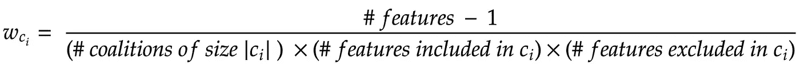

等式 1。内核形状

一切都清楚了吧？没有什么比一张图片更能说明整个过程了。在图 4 中，我们看到了给定实例`X`的 Shapley 值计算的描述过程。

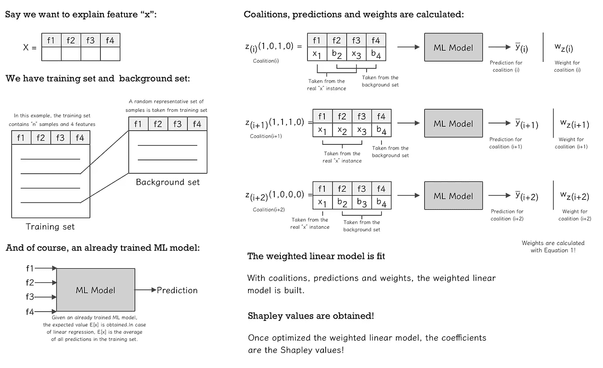

图 4。SHAP 从 ML 模型中获取 Shapley 值的描述过程|图片由作者提供

从上图可以看出，通过核 Shap 从 ML 模型中获取 Shapley 值的过程并不复杂，但却很费力。主要成分是联盟、预测和权重。

值得注意的是，试图计算所有的联盟会使问题变得棘手。这就是采取联盟样本的原因，样本越大，不确定性越低。

最后，很重要的一点是，对于 Shapley 值的计算，Kernel Shap 是唯一与模型无关的方法，也就是说，Kernel Shap 可以解释任何 ML 模型，而不管其性质如何。另一方面，作者还提出了基于不同类型的模型(如树 SHAP、深 SHAP、低阶 SHAP、线性 SHAP 和最大 SHAP)来获得沙普利值的其他变型。

好了，是时候看看 SHAP 的行动了。在下一节中，我们将看到如何使用`shap`库从 ML 模型中获取 Shapley 值。我想是时候重新装满咖啡杯了，☕️！

# SHAP 在行动:一个分类问题

SHAP 及其变体被集成到 python 库`shap`中，该库除了提供计算 Shapely 值的不同方法外，还集成了多种结果可视化和解释方法。

本节的目标是展示如何使用`shap`库来计算、绘制和解释分类问题中的 Shapley 值。所以，让我们努力吧！

> 完整的项目，以及本文中显示的例子，可以在下面找到:[https://github . com/FernandoLpz/SHAP-分类-回归](https://github.com/FernandoLpz/SHAP-Classification-Regression)

## 数据集

对于这个例子，我们将使用乳腺癌威斯康星(诊断)数据集[ [4](https://archive.ics.uci.edu/ml/datasets/Breast+Cancer+Wisconsin+%28Diagnostic%29) ]，其特征描述了肿瘤的特征，并且目标是预测肿瘤是良性还是恶性。数据集包含 100 个样本，8 个独立特征(`radius`、`texture`、`perimeter`、`area`、`smoothness`、`compactness`、`symmetry`和`fractal_dimension`)和一个从属特征(`diagnosis_result`，目标特征)。

目标特征包含两个类别`M = Malign`和`B = Benign`。出于实用目的，我们将类别编码如下:`0 = Malign`和`1 = Benign`。

## 模型

针对这个问题，我们实现并优化了一个基于随机森林的模型，在测试集中获得了`92%`的准确率。下面的代码片段显示了分类器的实现。

代码片段 1。随机森林分类器的训练和优化

在上面的代码片段中，我们实现了一个基于随机森林的分类器，它已经使用`Optuna`库进行了优化。从这一点上来说，我们已经有了一个能做出预测的模型，我们打算用 SHAP 来解释它，所以让我们来看看我们是怎么做的吧！

## 释义:沙普利价值观

假设我们有两个想要解释的样本，一个样本属于类别`1` ( `Benign`)，另一个样本属于类别`0` ( `Malign`)，分别如图 5 和图 6 所示。

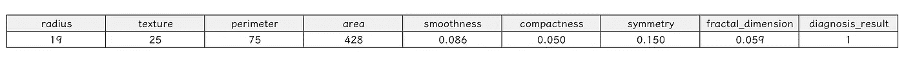

图 5。阳性样本|类别=良性

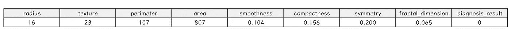

图 6。负样本| Class = Malign

由于我们的 ML 模型是基于决策树的，为了获得 Shapley 值，我们将使用 TreeShap。因此，我们首先需要导入库，并通过将我们的分类器作为参数传递来初始化解释器，如下面的代码片段所示:

代码片段 2。TreeExplainer 初始化

接下来，我们需要计算 Shapley 值的样本。在这种情况下，我从训练数据集中提取分别对应于图 5 和图 6 中所示的样本(重要的是要提到，出于解释的目的，我一次使用一个样本，但是也可以使用整个数据集)。

代码片段 3。阳性和阴性样本

只是为了检查，每个样本的预测是:

代码片段 4。阳性和阴性样本的预测

为了计算 Shapley 值，我们使用从 explainer 扩展而来的`shap_values`方法。它接收到的参数就是我们想要解释的样本:

代码片段 5。获取阳性和阴性样本的 Shapley 值

这就是我们的沙普利值！但是等一下，我们如何解读这些价值观呢？为什么从索引`[1]`打印出来？好吧，我们来详细看看这个。

首先，变量`shap_values_positive`和`shap_values_negative`包含对应于正类和负类的每个特征的 Shapley 值，因此，`shap_values_positive[0]`包含每个特征相对于类`0`(或`Malign`)的 Shapley 值，`shap_values_positive[1]`包含每个特征相对于类`1`(或`Benign`)的 Shapley 值，这同样适用于`shap_values_negative`。为了实用，我们使用关于类`1`的结果。

然后，对于`positive`和`negative`样本，我们获得 8 个值的列表，它们对应于每个特征的 Shapley 值。在下图中，我们可以更清楚地看到每个样本及其各自的 Shapley 值:

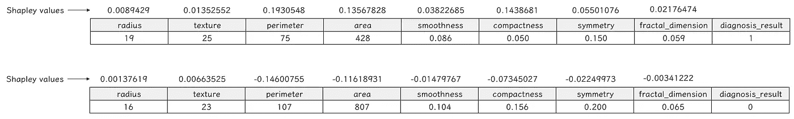

图 7。每个阳性和阴性样本的每个特征的 Shapley 值

你还记得第一部分中解释的 Shapley 值的本质吗？这里发生了完全相同的事情，具有高 Shapley 值的要素影响较大，具有低 Shapley 值的要素对预测的影响较小。我们也可以将 Shapley 值解释为，具有高 shap 值的特征*将*推向一个类，而具有低 shap 值的特征*将*推向另一个类。

从正面样本中，我们看到 Shapley 值最高的特征是`perimeter`、`compactness`和`area`。从负样本来看，Shapley 值最低的特征是`perimeter`、`area`和`compactness`。

正如我们提到的，`shap`库也提供了生成图的工具。让我们看看如何为阳性和阴性样本绘制一个名为`force_plot`的图:

代码片段 6。绘制阳性和阴性样本

每个样品的结果图如下:

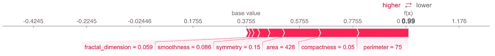

图 8。阳性样本的强制绘图| Class =良性|作者提供的图像

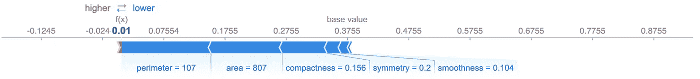

图 9。负样本的强制绘图| Class = Malign |作者的图像

正如我们从两个图中看到的，每个特性的影响对应于图 7 中描述的 Shapely 值。在红色中我们看到高 Shapley 值，即它们向类`1`(或`Benign`)推进，在蓝色中我们看到低 Shapley 值，即它们向类`0`(或`Malign`)推进。`force_plot`是一个很好的可视化工具，可以用来理解每个特性对给定预测的特定样本的影响。

`force_plot()`是理解每个特性对特定样本的影响的一个很好的可视化工具，同样`shap`库提供了各种类型的可视化工具来帮助解释 Shapley 值。例如，`summary_plot()`方法通过改变每个特性的值来提供关于特性重要性以及 Shapley 值影响的信息。

对于本例，`summary_plot()`由下式给出:

代码片段 7。汇总图

生成以下图:

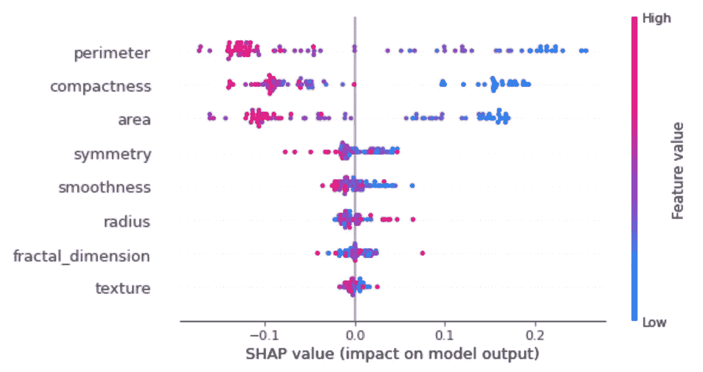

图 10。汇总图

在左侧，我们观察根据重要性排序的每个特性。`perimeter`特征最重要，而`texture`特征最不重要。颜色代表每个要素可以采用的值，红色代表高值，蓝色代表低值。因此，对于特性`perimeter`，如果值较高(红色)，则 Shapley 值将较低，因此将推向等级`0`(或`Malign`)，否则，当值较低(蓝色)时，Shapley 值将较高，因此将推向等级`1`(或`Benign`)。这可以分别用图 8 和图 9 所示的结果来验证。

另一个重要的观察结果是，`perimeter`、`compactness`和`area`特征是在给定其相关 Shapely 值的情况下对预测产生最大影响的特征，也就是说，它们的 Shapley 值非常高或非常低。另一方面，其余的特征不会产生太大的影响，因为它们的相关 Shapley 值更接近于零。

图`summary_plot()`的一个变体，以条形图的形式显示了每个特性的影响，这样的图可以通过以下方式获得:

代码片段 8。汇总图，条形图

生成以下图:

图 11。汇总图，条形图

如图 10 所示，在图 11 中，我们可以看到每个特性根据其相关 Shapley 值的影响进行排序。同样，我们观察到特征`perimeter`、`compactness`和`area`是对模型影响最大的特征。

> 完整的项目，以及本文中显示的例子，可以在下面找到:[https://github . com/FernandoLpz/SHAP-分类-回归](https://github.com/FernandoLpz/SHAP-Classification-Regression)

喝了几杯咖啡后，现在我们已经到了终点！

# 结论

在这篇博客中，我们看到了什么是 SHAP。

在第一节中，我们谈到了从 Shapely 价值观的起源和解释。在第二部分中，我们学习了什么是 SHAP，它是如何工作的，以及它对 ML 模型可解释性的基于石灰和 Shapely 值的支持。最后，在第三部分中，我们看到了如何使用`shap`库，并展示了一个示例来解释 shap 库返回的结果。

`shap`库提供了大量可视化和解释 ML 模型的工具。在这篇博客中，我们只看到了几个例子。建议看一下文档，以便从这个伟大的库获得最大的好处。

> “阅读、学习、写作、分享。重复“T1”——费尔南多·洛佩斯·维拉斯科。

# 参考

[1][n 人游戏的一个数值。L.S .沙普利。1953 年](https://www.degruyter.com/document/doi/10.1515/9781400881970-018/html)

[2] [解释模型预测的统一方法](https://arxiv.org/pdf/1705.07874.pdf)

【3】[“我为什么要相信你？”解释任何分类器的预测](https://arxiv.org/pdf/1602.04938.pdf)

[4] [乳腺癌威斯康星(诊断)](https://archive.ics.uci.edu/ml/datasets/Breast+Cancer+Wisconsin+%28Diagnostic%29)