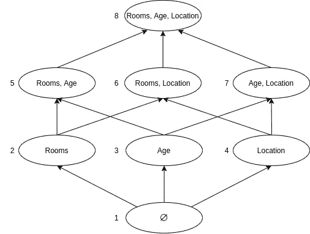
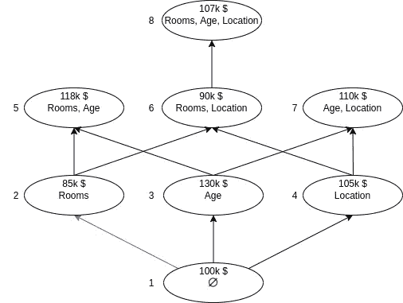
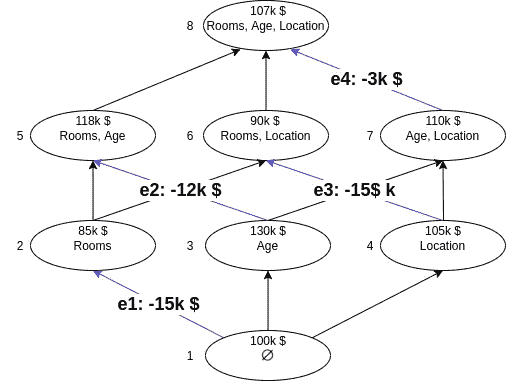
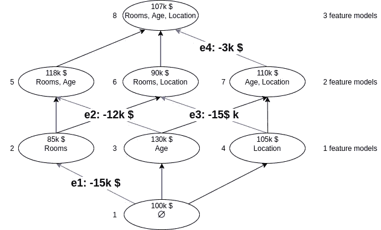
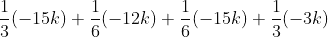
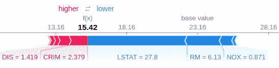
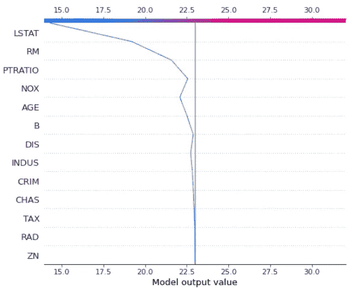

# 模型解释的 SHAP 值

> 原文：<https://towardsdatascience.com/shap-values-for-model-interpretation-268680a25012?source=collection_archive---------30----------------------->

## 用博弈论的概念解释一个模型

来源( [Unsplash](https://unsplash.com/) )

在越来越多的领域，机器学习模型已经开始被赋予更高的标准。模型预测已经不够了。现在，公司可以对其模型产生的任何虚假预测负责。随着这一转变，模型的可解释性可以说已经优先于预测能力。准确性和 R2 分数等指标已经退居二线，而能够**解释**模型预测已经变得越来越重要。我们已经研究了几种方法来解释您的模型，并更好地理解它们是如何工作的。在这里，我们将研究 SHAP 值，这是一种解释来自机器学习模型的预测的强大方法。

SHapley 意思是 SHapley 附加解释是一种解释来自机器学习模型的*个体*预测的方法。这超出了另一篇文章中讨论的依赖系数进行模型解释的常用方法。

它们是如何工作的？

SHAP 是基于**沙普利价值观**，一个来自[博弈论](https://en.wikipedia.org/wiki/Game_theory) 的概念，由经济学家劳埃德·沙普利发展而来。该方法通过让我们看到每个特征对模型预测的贡献大小来帮助我们解释模型。我们模型中的每个特征将代表一个“玩家”，而“游戏”将是模型的预测。实际上，我们将试图了解每个玩家对游戏的贡献。

这样做的过程包括计算具有特征的模型**和没有特征**的模型**的预测。通过获得这两个预测之间的差异，我们可以看到该特征对模型预测的贡献有多大。这是特性的边际贡献。**我们对特征的每个子集都这样做，并取这些贡献的平均值来获得特征的 Shapley 值。

**计算边际分布**

每个特征子集的可视化表示

对于我们的例子，假设我们有一个预测房价的模型。上图以图表的形式展示了这一点。我们将有三个特性:`Rooms`、`Age`和`Location`。总的来说，我们将有 8 个不同的功能子集。图中的每个节点将代表一个单独的模型，因此我们也将有 8 个不同的模型。我们将在相应的子集上训练每个模型，并预测同一行数据。

每个特征子集的预测

我们图中的每个节点都通过有向边与另一个节点相连。节点 1 将没有任何功能，这意味着它将只预测在我们的训练数据中看到的平均值(100k $)。沿着通向节点 2 的蓝色边，我们看到具有单个特征`Rooms`的模型预测较低的值为 85k $。这意味着`Rooms`对以`Rooms`为唯一特征的模型的边际贡献是 **-15k $** (85k $ - 100k $)。我们已经为一个型号这样做了，但是有几个型号的`Rooms`是一个特性。我们将对添加了`Rooms`功能的每个型号进行计算。

计算边际贡献

上图突出显示了添加了`Rooms`特征的每条边，还显示了该特征在每个模型中的边际贡献。接下来我们要做的是取这些边际贡献的平均值。唯一的问题是我们将如何在我们的平均值中权衡它们。你可能会认为我们可以平等地权衡它们，但事实并非如此。功能越少的模型意味着每个功能的边际贡献越大。因此，具有相同数量特征的模型应该具有相同的权重。

按要素数量对节点进行分组

我们可以像上面看到的那样把图表分成几行。每一行都有包含不同数量特征的模型。在平均我们的边际贡献时，我们希望每一行都有相等的权重。因为我们有 3 行，每一行的权重是 1/3。对于我们有两个特征模型的行，我们有两个具有特征`Rooms`的模型，所以每个模型的权重应该是 1/6。我们对每种“类型”模型的重量细分如下:

*   1 特征模型:1/3
*   2 个特征模型:1/6
*   3 个特征模型:1/3

我们的最终计算结果如下:

因此，我们对于`Rooms`特性的 SHAP 值将是**-10.5 千美元**。然后，我们可以对模型中的每个特性重复这个过程，以找到所有特性的值。这种特殊方法的好处在于，我们可以看到特征如何影响单个预测，而不仅仅是对数据集中所有示例的平均影响。

**实施**

从头开始实现这一切看起来很痛苦，对吗？幸运的是，与 Python 中的大多数数据科学任务一样，我们可以使用一个名为 [shap](https://pypi.org/project/shap/) 的库来完成这项任务。根据上面的示例，我们将使用来自 Kaggle 的[房地产数据集。我将检查代码，以便能够做到这一点。](https://www.kaggle.com/arslanali4343/real-estate-dataset)

为模型定型并获取单行数据的 SHAP 值

单行数据的 SHAP 值图

上面的图表向我们展示了几条重要的信息。这栋房子的价值预计为 15.42 英镑。在图的右侧，我们看到了 23.16 的基础值。我们还看到两组不同的特征，分别是红色和蓝色。以红色突出显示的要素有助于提高预测，而以蓝色突出显示的要素有助于降低预测。每个要素在图中所占的大小显示了它对预测的影响程度。我们看到特征`LSTAT`(较低的人口状况百分比)对降低预测值贡献最大，而特征`CRIM`(按城镇划分的人均犯罪率)对提高预测值贡献最大。

你可能已经注意到的另一件事是，我使用了一个名为`TreeExplainer`的类。这是因为我们在这个例子中使用了基于树的模型(随机森林)。shap 库中有几个‘解释器’。适用于非基于树的模型的更通用的解释器是 [KernelExplainer](https://shap-lrjball.readthedocs.io/en/latest/generated/shap.KernelExplainer.html) 。或者，你也可以使用深度学习模型的[深度解释器](https://shap.readthedocs.io/en/latest/example_notebooks/image_examples/image_classification/Front%20Page%20DeepExplainer%20MNIST%20Example.html)。

我们可以通过上面的决策图来观察这个个体预测。我们在基础值 23.16 处看到一条黑色的垂直线。从底部开始，沿着图向上移动，我们看到我们遇到的每个特征如何影响我们模型的预测，直到我们到达顶部，这是我们对这一特定数据行的最终预测。还有许多其他方法可以将模型中的 SHAP 值可视化；这些例子只是让你开始。

**结论**

我们研究了 SHAP 值，这是一种解释机器学习模型预测的方法。通过这种方法，我们可以查看单个预测，并了解每个特征如何影响结果。我们通过查看一个决定房屋价格的模型，逐步完成了 SHAP 值的示例计算。我们还研究了 Python 中的 shap 库，以便能够快速计算和可视化 SHAP 值。特别是，我们讨论了可视化 SHAP 值的力图和决策图。

感谢您的阅读！

**消息来源**

*   南 Lundberg，S. Lee，[解释模型预测的统一方法，2017 年](https://arxiv.org/abs/1705.07874)。

您可以通过以下渠道与我联系:

*   [中等](https://zito-relova.medium.com/)
*   [领英](https://www.linkedin.com/in/zrelova/)。
*   [Github](https://github.com/zitorelova)
*   [卡格尔](https://www.kaggle.com/zitorelova)