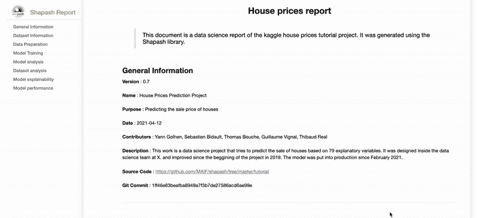
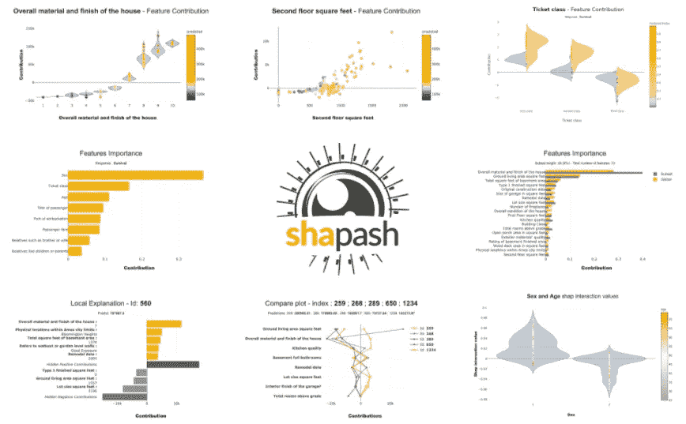
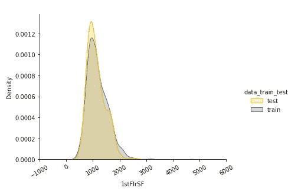
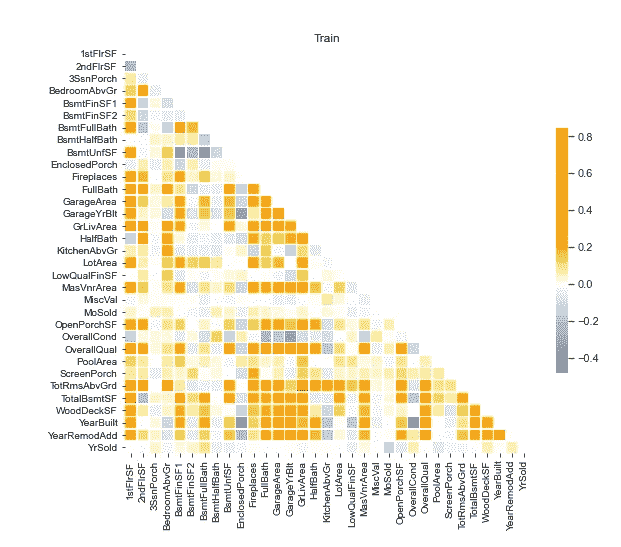
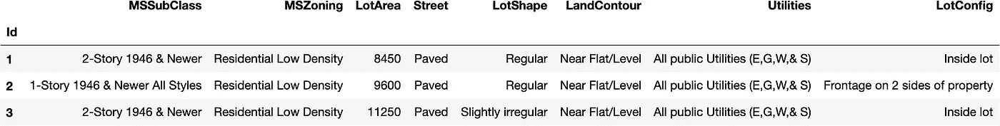

# Shapash 1.3.2，宣布了更多可审计人工智能的新功能

> 原文：<https://towardsdatascience.com/shapash-1-3-2-announcing-new-features-for-more-auditable-ai-64a6db71c919?source=collection_archive---------37----------------------->


由[AMIT·马哈托](https://unsplash.com/@amitkar98?utm_source=medium&utm_medium=referral)在 [Unsplash](https://unsplash.com?utm_source=medium&utm_medium=referral) 上拍摄的照片

## [Shapash](https://github.com/MAIF/shapash) 版本 1.3.2 现已发布，该库增加了一个新特性:Shapash 报告，一个帮助你的模型可审计的 HTML 文档！



[**Shapash**](https://github.com/MAIF/shapash)**是由 [**MAIF**](https://www.maif.fr/) 数据团队于 2021 年 1 月发布的一个 Python 库，旨在让机器学习模型能够被所有人理解。**

**[**沙帕什**](https://github.com/MAIF/shapash) 允许:**

*   **数据科学家能够轻松地分析他的模型，与客户分享并验证他的方法**
*   **最终用户理解来自 ML 模型的推荐/预测，这要归功于引导它的标准的适应总结。**

**[**Shapash**](https://github.com/MAIF/shapash)**当前正在使用一个 [Shap](https://github.com/slundberg/shap) 后端来计算本地贡献。[**Shapash**](https://github.com/MAIF/shapash)**提供了易读的可视化和一个 [web app](https://shapash-demo.ossbymaif.fr/) 。它以适当的措辞显示结果(预处理反向、后处理等)******

******[你会在这篇文章](https://www.kdnuggets.com/2021/04/shapash-machine-learning-models-understandable.html)里找到 Shapash 的大概介绍。******

********版本 1.3.2 现已推出，**<https://github.com/MAIF/shapash>****允许数据科学家记录他发布到生产中的每个模型。**在几行代码内，他可以在一个 HTML 报告中包含关于他的模型(及其相关性能)、他使用的数据、他的学习策略……该报告旨在与数据保护官员、内部审计部门、风险控制部门、合规部门或任何想要了解他的工作的人轻松共享。********

# ****语境****

> ****人工智能很吓人:“个人数据有什么用途？AI 是为了什么目的而开发的？对就业有什么影响？我们的自由吗？…"****

****如此多的问题往往没有答案，并留下了猜测的空间。这是一个非常热门的话题，许多玩家都在讨论。****

****首先，公共当局:在法国，[ACPR 在 2020 年发表了一份关于人工智能算法治理的讨论文件](https://acpr.banque-france.fr/en/acprs-consultation-document-ai-governance-scientific-workshops-held-july)。欧盟已经与 GDPR 建立了第一个框架，该框架可能很快会通过一项关于人工智能的法规来完成，该法规将主要解决治理、*可审计性*和控制等问题。****

****在法律框架之外，各组织都在致力于建立一种负责任、值得信赖的数据科学。例如，**[**subra Foundation**](https://assessment.substra.ai/en/)**共享了一个评估工具，允许每个公司独立评估其数据科学实践，并确定需要改进的领域。********

******最后，一些私营公司是其组织内值得信赖的人工智能的参与者。一些法国公司已经建立了人工智能道德的治理机制。在这个问题上，Impact IA 智库在 2020 年底发布了一份[指南](https://www.impact-ai.fr/en/)，介绍了建立可信人工智能治理的具体案例。最后，其他玩家已经实现了最佳实践指南并正在分享它们。******

******在这个新版本 1.3.2 中，MAIF 的 Shapash 通过使用模板促进这些模型的系统化文档化，对模型可审计性的主要问题做出了更进一步的贡献。******

************

# ******沙帕什报告:******

******[*Shapash Report*](https://shapash.readthedocs.io/en/latest/report.html)*是一个“独立的”HTML 文档，由数据科学家在将他的模型部署到生产中时用一行代码生成。它允许他记录他的项目，并且将与他的模型的训练和上游步骤(数据准备、范围界定等)相关的所有信息冻结在“当前快照”中。*******

*******这份报告通过详细记录每个部署的算法，有助于改善人工智能治理。它允许组织中的每个人理解为什么、如何、用什么数据以及为了什么目的而构建模型。*******

*******我们希望它将成为模型审计和更好的人工智能治理的一个有价值的工具！*******

## *******一个开放的工具:每个组织都可以修改其 Shapash 报告的内容。*******

*******在等待为该文档指定标准内容的法规时，提供一个开放的解决方案对我们来说很重要。因此，每个公司都可以调整该工具，并定义自己的“标准”，每个数据科学家都将在自己的项目中实施该标准。*******

## *******关于模板的建议*******

*******Shapash 1.3.2 提出了一个每个人都能适应的模板。你会在该项目的 Github repo 上找到一个教程，展示如何实现这个模板，以及如何按照你的意愿修改它。在我们提出的示例中，您会发现以下信息:*******

*   *******一般信息:项目名称、描述、目的、模板开发人员、时间…*******

****************************

*   *******Dataprep:数据从哪里来，哪里可以找到数据准备程序，…*******
*   *******特征工程和培训策略:实施的策略是什么，与该部分相关的计划是什么。*******
*   *******关于模型的信息:什么类型的模型？使用了哪些超参数？*******
*   *******训练和测试数据集的分析:模型中引入的所有特征的描述和相关性分析。*******
*   *******整体模型可解释性:模型的主要特征是什么？每个特征对推荐/预测有什么影响？*******
*   *******模型的性能:恢复与模型相关的度量，测试数据集上预测的分布。*******

*******这份报告的内容非常完整。此外，为了便于导航， [*Shapash Report*](https://shapash.readthedocs.io/en/latest/report.html) 提供了“目录”部分以及不同的菜单按钮。*******

*******[*Shapash 报告*](https://shapash.readthedocs.io/en/latest/report.html) 受益于所有的 [**Shapash**](https://github.com/MAIF/shapash) 数据措辞功能:与每个特性相关联的功能标签都呈现在这个 HTML 文档中，以便所有人都能理解共享的内容，尤其是那些没有参与模型构建的人。*******

# *****如何创建此报告？*****

*****例如，让我们在一个具体的数据集上一起测试 [**Shapash**](https://github.com/MAIF/shapash) 并创建这个报告。同样，我们建议您使用我们喜爱的著名 Kaggle House 数据集:“[房价](https://www.kaggle.com/c/house-prices-advanced-regression-techniques)数据集。我们来拟合一个预测房价的回归变量吧！首先加载数据集:*****

```
***import pandas as pd
from shapash.data.data_loader import data_loading
house_df, house_dict = data_loading('house_prices')
y_df=house_df['SalePrice'].to_frame()
X_df=house_df[house_df.columns.difference(['SalePrice'])]house_df.head(3)***
```

**********

*****对分类特征进行编码:*****

```
***from category_encoders import OrdinalEncodercategorical_features = [col for col in X_df.columns if X_df[col].dtype == ‘object’]
encoder = OrdinalEncoder(cols=categorical_features).fit(X_df)
X_df=encoder.transform(X_df)***
```

*****训练、测试分割和模型拟合。*****

```
***Xtrain, Xtest, ytrain, ytest = train_test_split(X_df, y_df, train_size=0.75)
regressor = RandomForestRegressor(n_estimators=50).fit(Xtrain, ytrain)***
```

*****干得好，你有一个模型可以投入生产了！但在此之前，让我们记录我们的项目！*****

## *****填写您的项目信息*****

*******第一步:**创建一个包含项目信息的 YML 文件。
您可以在这里使用可用的[示例文件。](https://github.com/MAIF/shapash/blob/master/tutorial/report/utils/project_info.yml)*****

*****欢迎您将此文件用作自己报告的模板。*****

*****现在，您已经指定了想要显示的所有信息，您可以使用 Shapash 来创建报告。*****

*******第二步:声明并编译 SmartExplainer 对象*******

```
*****from** **shapash.explainer.smart_explainer** **import** SmartExplainer

xpl = SmartExplainer(features_dict=house_dict) *#Optional: Labels* xpl.compile(
    x=Xtest,
    model=regressor,
    preprocessing=encoder, *# Optional: Apply inverse_transform* 
)***
```

*****在这一步，您可以使用任何方法来探索和理解您的模型。但让我们保持专注，创建我们的 Shapash 报告。*****

*****您需要传递`x_train`、`y_train`和`y_test`参数，以便探索训练模型时使用的数据。您还将指定要在报告中显示的指标。*****

```
***xpl.generate_report(
 output_file=’output/report.html’, 
 project_info_file=’utils/project_info.yml’,
 x_train=Xtrain,
 y_train=ytrain,
 y_test=ytest,
 title_story=”House prices report”,
 title_description=”””This document is a data science report of the kaggle house prices tutorial project. 
 It was generated using the Shapash library.”””,
 metrics=[
 {
 ‘path’: ‘sklearn.metrics.mean_absolute_error’,
 ‘name’: ‘Mean absolute error’, 
 },
 {
 ‘path’: ‘sklearn.metrics.mean_squared_error’,
 ‘name’: ‘Mean squared error’,
 }
 ]
)***
```

*****搞定了！你创建了这个[报告](https://shapash.readthedocs.io/en/latest/report.html)！*****

# *****定制您自己的报告！*****

******你可以更进一步！让我们通过添加一些新的部分来自定义你的报告。******

*   *****首先，**复制基地报告笔记本**这里可以找到[。这是用于生成 Shapash 报告的笔记本。它被执行，然后转换成一个 HTML 文件。只保留每个单元格的输出，删除代码。](https://github.com/MAIF/shapash/blob/master/shapash/report/base_report.ipynb)*****
*   *****然后，根据您想要更改的内容删除或添加单元格。*****
*   *****最后，在`generate_report`方法中添加参数`notebook_path="path/to/your/custom/report.ipynb"`。*****

*****更多详情请点击查看[。](https://github.com/MAIF/shapash/blob/master/tutorial/report/tuto-shapash-report01.ipynb)*****

# *****💡分享你的想法！*****

*****请随意访问 [**Shapash**](https://github.com/MAIF/shapash) GitHub:你会找到关于这个新特性的详尽文档。您也可以在那里留下您的消息(讨论选项卡)，并通过共享您的模板或任何其他想法来为解决方案做出贡献。愿 [**Shapash**](https://github.com/MAIF/shapash) 为开发一个值得信赖的 AI 做出贡献！*****