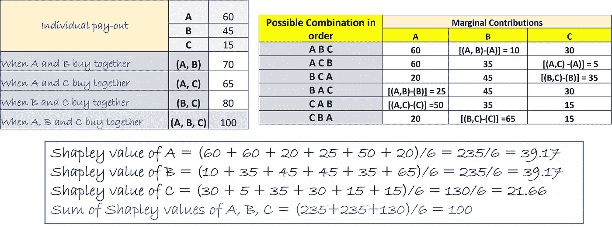
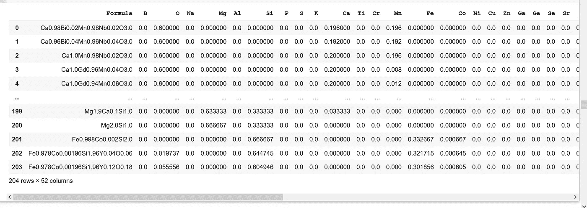
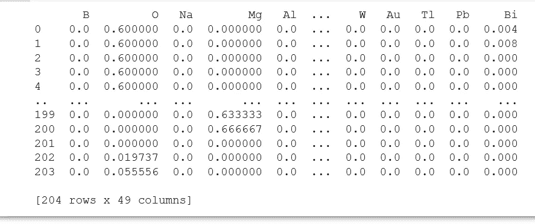
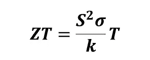
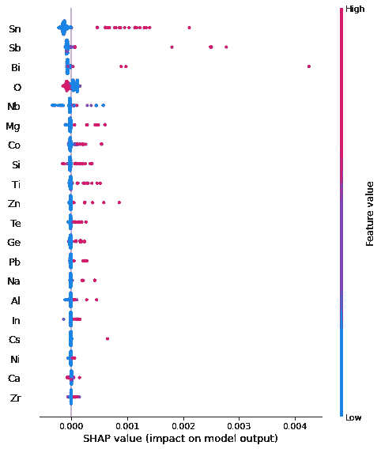
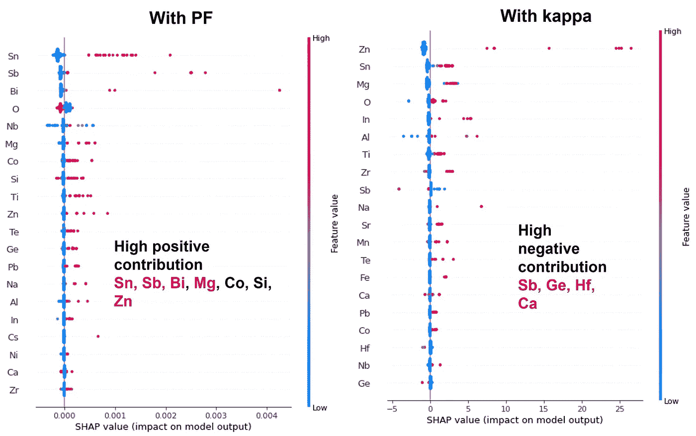
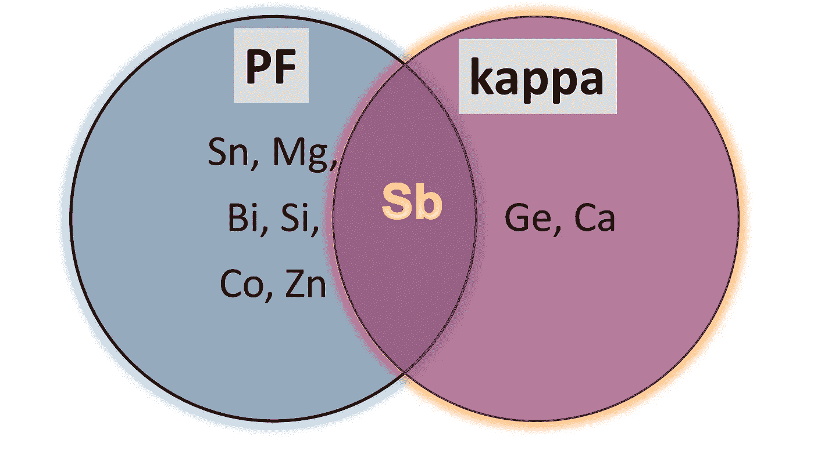

# Shapley 值辅助材料配方设计

> 原文：<https://towardsdatascience.com/shapley-value-aided-recipe-for-materials-design-d122fb851cef?source=collection_archive---------9----------------------->

## 追求新材料时解码特征的重要性


[杰瑞米·托马斯](https://unsplash.com/@jeremythomasphoto?utm_source=unsplash&utm_medium=referral&utm_content=creditCopyText)在 [Unsplash](https://unsplash.com/s/photos/colors?utm_source=unsplash&utm_medium=referral&utm_content=creditCopyText) 上拍照

*“数据只是成千上万个故事的总结——讲几个这样的故事来帮助数据变得有意义。”—丹·希斯*

**简介**

在我之前的[文章](/uncovering-the-potential-of-materials-data-using-matminer-and-pymatgen-83126fadde1c) " **使用 Matminer 和 Pymatgen 揭示材料数据的潜力"**中，我展示了材料数据挖掘工具的应用，以从材料数据集中提取基本信息，并使用它们来表征数据集。

现在所有的特征都可用了，是时候确定它们在机器学习(ML)模型中的相关性了。因此，在本文中，我将重点关注“特征重要性”这一方面，并展示它如何在寻找具有改进性能的材料中发挥至关重要的作用。


约翰·麦克阿瑟在 Unsplash 上的照片

数据集可能包含大量与目标变量相关的要素或预测值。现在，所有这些功能可能对实现目标的贡献并不相等。一些可能比另一些对 ML 模型的结果有更大的影响。这些特征基于它们的重要性被分级。

让我们以设计飞机机身的轻质(低密度)材料为例。这是一个多目标优化问题，其中设计要求结合低密度、高强度、抗冲击性和耐腐蚀性。飞行器主体主要是铝(Al)合金，其中具有低原子量和低密度的元素 Al 是主要成分。这种合金还含有其他元素，如铜、镁和硅。*特征“Al”*在密度特征重要性列表中占据最高位置。与此同时，其他因素的重要性也不容忽视。例如，当目标变量是强度时，铜排在首位。

因此，特征的相关性在很大程度上取决于目标属性。这就像烹饪一道特殊的菜肴，菜谱要求不同的配料*(相当于 ML 中的“特征】)*(与“特征重要性”相关)以获得最佳的味道。

因此，从海量数据中提取重要特征的艺术为技术进步铺平了道路。然而，通过部署可解释的人工智能(XAI)算法，这项回收和重用数据的庞大任务变得更加顺利。可解释性因素又由描述符的特征重要性决定。有鉴于此，Shapley 值算法被发现在产生决策洞察数据方面非常有效。

**沙普利值概述**


Andrey Metelev 在 [Unsplash](https://unsplash.com/s/photos/game?utm_source=unsplash&utm_medium=referral&utm_content=creditCopyText) 上拍摄的照片

[Shapley 值](https://christophm.github.io/interpretable-ml-book/shapley.html)源于博弈论的概念，最早由 L . S Shapley 提出。*该值是从事件结果中涉及的不同因素或参数的所有可能排列所获得的边际贡献的平均总和计算出来的。让我用一个例子来解释一下。三个朋友 A、B 和 C 一起购买了价值 100 美元的食物。现在，我们将做出以下假设:*

1.如果他们单独购买食物，A、B 和 C 将分别花费 60 美元、45 美元和 15 美元。

2.A 和 B 一起将花费 70 美元，A 和 C 一起将支付 65 美元，而 B 和 C 一起将花费 80 美元。

3.如果 A、B 和 C 合作一起购买食物，那么按照他们参与的顺序，六种可能的排列是可能的:(A、B、C)；(甲、丙、乙)；(乙、丙、甲)；(B，A，C)；(C，A，B)和(C，B，A)。

4.请注意，所有这些排列的总和应为 100 美元。

在这样的合作场景中，每个参与者的边际贡献取决于他们贡献的顺序。根据 A、B 和 C 的边际贡献，可以计算每个玩家的预期边际贡献或 Shapley 值。这些列表如下:



同样的概念被应用于解释和诠释机器学习预测，否则，机器学习预测将被视为黑盒。Shapley 值已被证明在具有一致性和准确性的分类(基于概率的)和回归模型中有效地解释了个体特征在最终预测中的作用。

由[李和斯隆伯格](https://arxiv.org/abs/1705.07874)开发的 [SHAP](https://shap.readthedocs.io/en/latest/index.html) ( *沙普利附加解释* ) API 足够灵活，可以应用于任何基于树和非树的 ML 以及深度学习系统。TreeExplainer()和 KernelExplainer()函数分别与基于树的 ML 和基于非树的 ML 相关联，用于获得最终预测中涉及的每个特征的贡献。

现在，让我从几种成分的可用实验数据库开始，展示 SHAP 值在设计高性能热电材料蓝图的策略中的有用性。我已经用 Google Colab 运行了全部代码。

**基于 SHAP 的系统化方法，用于发现具有所需功能的材料**

***导入相关库，加载数据集，预处理***

在运行任何机器学习算法之前，一个重要的基本规则是导入所有需要的库。在这种情况下，除了导入标准 Python 库，如 NumPy、Pandas 和 Matplotlib，还安装了其他基于材质的 Python 包，如 Matminer、Pymatgen 和 SHAP。

我收集了 204 种成分/材料的数据集(显示在公式栏中)，以及它们的室温特性(PF 和 kappa)。按照我上一篇文章中提到的步骤对数据集进行预处理。下面显示了准备用于训练的细化数据集的片段。



可工作数据集的输出片段

**注意，在用于材料勘探的真实世界数据集中，包含过程变量是优化的必要条件。*

**定义 X(特征/描述符)和 y(响应/目标)**

这里，有 49 个特征/描述符被指定为 X，并且这些是构成公式的单独元素。有趣的是，该数据集涉及两个响应/目标——PF(目标 A)和 kappa(目标 B ),指定为 y。目标变量——PF 和 kappa，一次考虑一个用于训练。因此，y 分支为 y_pf 和 y _κ，分别为 pf 和κ。对于两种训练，X 保持不变。

```
X = ds_RT.iloc[:, 1: 50]
print(X)
```



显示预处理数据集的输出片段

```
y_pf = ds_RT.iloc[:, -1]
print(y_pf)y_kappa = ds_RT.iloc[:, -2]
print(y_kappa)
```

*证明多个目标的合理性*

你可能想知道选择 PF 和 kappa 这两个目标背后的基本原理是什么。

因此，在详述代码之前，我想解释一下与数据集相关的科学术语，以便恰当地捕捉材料设计方面的数据分析的重要性。

该数据集整理了材料及其两个重要的室温特性——PF(功率因数)和 kappa，κ(热导率)。这些材料是热电材料，通过热量发电，反之亦然，被认为是绿色能源。由于这类材料涉及热和电，因此它们的κ和电导率(σ)参数与计算性能指标(ZT 或品质因数)密切相关。此外，对于 ZT 计算，还有一个关键参数，称为塞贝克系数(S)，这是一个控制热能和电能转换的转换系数。在绝对温度 T 下，ZT 与所有这三个参数 S、σ和κ的关系为:



S 与σ的平方之积称为功率因数(PF)。从该关系式可以清楚地看出，潜在的热电材料应该具有高的 PF 和低的κ。

我的代码旨在建立一个机器学习模型，以识别元素的可能组合，形成具有高 PF 和低κ理想特性的新型热电材料。因此，选择这两个参数作为目标是合理的。在这里，我将展示各种元素与 PF 和 kappa 的独立相关性，然后计算它们的 SHAP 值，这将最终有助于设计新的组成。

**目标为 A (PF)的培训 1**

***将数据集拆分成训练和测试批次***

预处理的数据集按照 80:20 的比例分为训练和测试批次，如下面的代码片段所示。

```
from sklearn.model_selection import train_test_splitX_train_p, X_test_p, y_train_p, y_test_p = train_test_split(X, y_pf, test_size = 0.2, random_state = 0)
```

***拟合成机器学习算法***

训练批次 X_train 和 y_train_p 用随机森林回归器算法拟合。

```
from sklearn.ensemble import RandomForestRegressor
rf = RandomForestRegressor(n_estimators = 50, random_state = 0)
rf.fit(X_train_p, y_train_p)
```

***计算 SHAP 值来评估每个特征的贡献***

使用 TreeExplainer()获得影响 PF 的元素的 SHAP 值。与随机森林算法的特征重要性等级相比，这种分析更加可靠。后一类不区分密切相关的变量，只突出一个变量的重要性，而忽略另一个变量。这个缺点被 SHAP 方法克服了，该方法努力地预测每个变量的贡献。此外，强调每个特征对目标的影响方向，包括正面和负面的，赋予这种方法独特性。

```
import shap
explainer = shap.TreeExplainer(rf)
shap_values_pf = explainer.shap_values(X_train_p)
shap.summary_plot(shap_values_pf, X_train_p)
```

**使用 SHAP 值解释模型结果**

SHAP 值表示目标上每个特征的强贡献和弱贡献，分别用红色和蓝色进行颜色编码。这在《SHAP 概要》情节中刻画得很漂亮。



显示元素对 PF 影响的 SHAP 汇总图

**SHAP 图如何在材料设计中发挥作用？**

X 轴为 SHAP 值，Y 轴代表变量，该图生动地描述了直接提高 PF 的积极贡献。图上的每个点表示数据集中的一行。快速浏览 SHAP 汇总图，可发现可能的元素，如锡、锑、镁、铋、钴、硅、锌，这些元素可用于获得理想的高 PF 值。

然而，要设计一种新颖的热电材料，我们还需要找到有助于降低 kappa 的元素。因此，我们的策略是确定同时满足具有高 PF 和低 kappa 的要求的组合物。这促使了以 kappa 为目标变量的第二次训练。

**目标为 B(κ)的训练 2**

现在，我们使用相同的回归变量训练数据集，但将 kappa(热导率)作为目标变量。SHAP 汇总图的获取方式与训练 1 中的相似。在这种情况下，我们感兴趣的是那些显示出对 kappa 高度负贡献的元素。这是因为最终的成分(材料)应该是不良的热导体。如图所示，只有少数元素如锑、锗、铪和钙有这种影响。

**设计策略和现实世界的例子**

在获得两个 SHAP 概要图之后，我现在可以进入本文的核心和最有趣的部分:材料设计。

让我们仔细观察这两张相邻放置的图，以选择能够导致潜在热电成分的组成元素的排列。



SHAP 汇总图

需要具有高的正 SHAP 值 PF 和高的负 SHAP 值 kappa 的元素组合来实现该任务。从图中可以明显看出，Sn、Mg、Bi 和 Zn 对 PF 具有大的正 SHAP 值，而 Sb 是唯一同时分别对 PF 和κ表现出高的正和高的负 SHAP 值的元素。维恩图很好地说明了 Sb 的相交面积，表明它具有增加 PF 和降低热导率的双重作用。



维恩图

因此，在我们寻找一种有效的新组合物时，Sb 可以被选作组成元素之一。并且新材料的其他成分可以明智地从分别有利于和不利于 PF 和 kappa 的元素范围中选择。

我做了一些研究来验证从生成的 SHAP 图中得到的结果与现实的接近程度。瞧啊。！文献中确实报道了具有从上述 SHAP 总结图中识别的元素的混合和匹配的预期成分。

最近研究的一种这样的合成物是 Sb)₂的 Mg₃(Bi，它在室温下表现出相当高的品质因数。这一直接证据证明了 SHAP 价值观的有用性和适用性。

**结束语**


[巴德·海利森](https://unsplash.com/@budhelisson?utm_source=unsplash&utm_medium=referral&utm_content=creditCopyText)在 [Unsplash](https://unsplash.com/s/photos/glass-transparency?utm_source=unsplash&utm_medium=referral&utm_content=creditCopyText) 上的照片

这篇文章的核心是从长期收集的大量数据中指出 Shapley 值在编织新的高效材料中的重要性。ML 的兴奋围绕着建立一个合适的、可解释的模型，这正是 SHAP 所做的。这种改变游戏规则的技术背后的哲学是透明性，这使得任何 ML 模型都是可解释的和有生产力的。

我希望这篇文章激励越来越多的材料工程师和科学家探索 Shapley 技术，努力协调元素的相关属性，以获得适合应用的新成分。

在结束之前，[这里的](https://github.com/Bjoyita/SHAP_MaterialsDesign)是整个代码的链接。

如果您觉得此工具有用，请分享您的意见和反馈。

感谢阅读！