# 围绕一个定制的网络

> 原文：<https://towardsdatascience.com/shapling-around-a-custom-network-636b97b40628?source=collection_archive---------32----------------------->

## 博弈论能扭转局面吗？

[Rbm](https://medium.com/@rb.m) ，[托马斯 G.](https://medium.com/@tomgorb) ，[本杰明拉鲁斯](https://medium.com/@benj.larrousse)

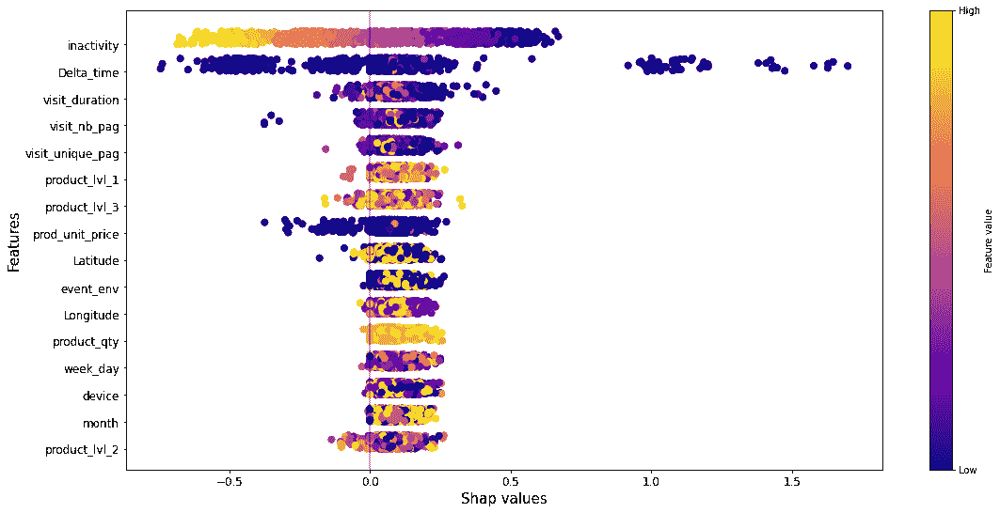

*这是一项研究的第二部分，在这项研究中，将莱姆和 SHAP 应用于神经网络，以预测一个人的购买概率。关于网络架构的细节，连同应用 LIME 的结果我们参考* [*前面的文章*](/squeezing-lime-in-a-custom-network-7aa30386d342) *。*

在可解释性领域，仅次于莱姆的另一个头条新闻是 SHAP(SHapley Additive exPlanations 的缩写)。

比如 LIME，SHAP 是一个模型不可知的解释者，他的目标是提供对模型输出的局部洞察。与 LIME 的主要区别是解释器的严格的数学基础:它允许为可解释性定义一个通用框架，该框架包括几个已经存在的算法(包括 LIME)。

接下来的部分简要介绍了 SHAP 及其在我们用例中的应用结果。

## SHAP 或合作的艺术

远不止是一个新的解释者，SHAP 结合了不同的已经开发的方法，从而强调了某些共同的特征，并提供了一个共享的背景，允许将它们归入同一保护伞下，并确保一个坚实的数学基础。

根据我们的用例，介绍集中在方法内核 SHAP，这是一个石灰和沙普利值的组合。关于其他方法的更多信息和对 SHAP 的更深入理解，我们参考最初的[论文](https://proceedings.neurips.cc/paper/2017/hash/8a20a8621978632d76c43dfd28b67767-Abstract.html)。为简单起见，在下面几节中，我们将“内核 SHAP”写成“SHAP”。

比如莱姆，SHAP 旨在用拟合附近的线性模型对实例进行解释。LIME 和 SHAP 之间的第一个区别是用于拟合线性模型的训练数据的生成方式。

LIME 基于模型的训练集的特征(或者基于训练集本身，如果可用的话)生成一组扰动数据。SHAP 生成从实例中保留或删除的特征的联盟以进行解释(想象它是在实例上应用“0/1”的掩码，其中“0 =删除特征”和“1=保留特征”)，并用一些“代表”值替换要丢弃的特征。这些值可以基于训练数据，也可以是特定的。

例如在 LIME 中，然后将扰动的集合传递给原始模型，以便生成相应的标签。

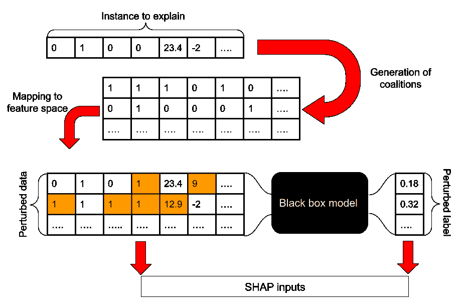

*为 SHAP 生成输入数据和标签的方案。*(图片作者提供)

一旦产生了扰动的数据，就通过最小化加权 RMSE 来训练可解释的模型，就像在 LIME 中一样。

那么有什么好大惊小怪的呢？到目前为止，用不同的微扰方法，SHAP 似乎与石灰相同。然而，SHAP 为加权函数和复杂性度量提供了具体的选择:*这些是解释者满足局部准确性、遗漏性和一致性*的唯一有效选择。

为什么我们想要这些财产？

这些属性确保我们在评估特征贡献时获得每个特征的 Shapley 值(或 Shapley 值的估计值)。

Shapley 值是合作游戏的一种可能的解决方案，即，它是将游戏的输出“公平地”分配给每个玩家的唯一解决方案。它评估一个玩家在所有可能的排列上的平均边际贡献，这代表了该玩家与其他人的联盟。

在我们的场景中，游戏是模型的输出，玩家是对输出有贡献的特性。

我们知道这个概念对读者来说可能并不十分清楚；解释了这么几行之后，事情就不清楚了。核心思想是，在 SHAP，加权函数和复杂性度量的选择有一个坚实的理论背景，这是缺乏在石灰在这些条款是可定制的参数。

## 将两块拼图拼在一起

因为 SHAP 只是一个对参数有不同选择的 LIME 解释者(请回忆一下，我们正在含蓄地谈论“KernelSHAP”)，我们认为我们可以很容易地将其应用到我们的定制模型中(关于模型架构的细节，我们可以参考[以前的文章](/squeezing-lime-in-a-custom-network-7aa30386d342))。我们当然错了😅。

LIME 中出现的一些问题也会在 SHAP 中出现，例如处理一次性编码或相关的要素。这些问题可以通过我们为石灰构建的相同的预处理/后处理步骤来解决。

我们无法在 SHAP 执行的转换是将输入数据从原始模型所需的形状重新整形为 SHAP(和石灰)所需的 2D 形状。当然，困难并不在于实际的整形行动(我们很清楚 Numpy 的存在)，而在于手术在 SHAP 会产生的后果。

在时间上，这种转换涉及到 2D 阵列中 LSTM 细胞输入的整形；第二维的大小为 n_f*n_s，其中 n_f 是特征的数量，n_s 是实例的序列的数量。因为我们想对不同的实例使用相同的解释器，所以序列的数量必须是所有实例中序列的最大数量。

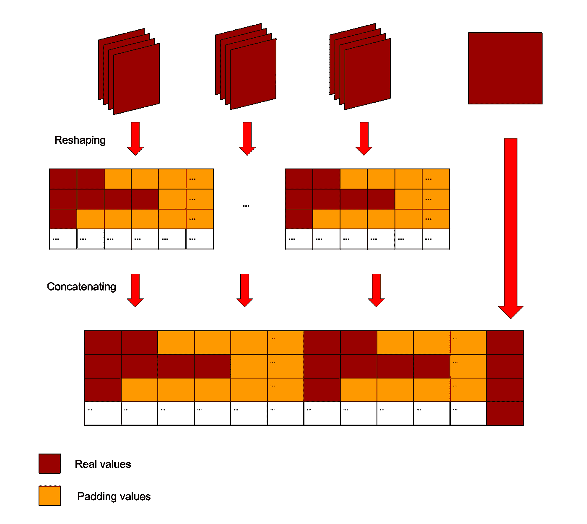

*从模型输入到石灰输入的转换。*(图片作者提供)

让我们想象同样的数据转换方法应用于 SHAP。

因为 SHAP 评估沙普利值，准确的评估需要生成大量扰动数据，这些数据能够探索对模型输出有贡献的所有特征的所有可能排列。

当应用与 LIME，2^(n_f*max(n_s)中相同的变换方法时，得到置换，这对于我们的模型是难以处理的。减少如此大量的扰动数据将会降低最终 Shapley 值的准确性。

而且，层序数量的分布向低位层序倾斜；因此，大部分数据将由填充值组成，不必要地过度计算。

基于这些考虑，我们修改了 SHAP 在石灰方面的应用。我们不是将原始输入转换为单个 2D 阵列，而是递归地将 SHAP 应用于实例的每个序列步骤以进行解释，从而仅针对每次迭代中的最后一个序列生成扰动数据。这减少了对 n_s*2^n_f.最优扰动的数量

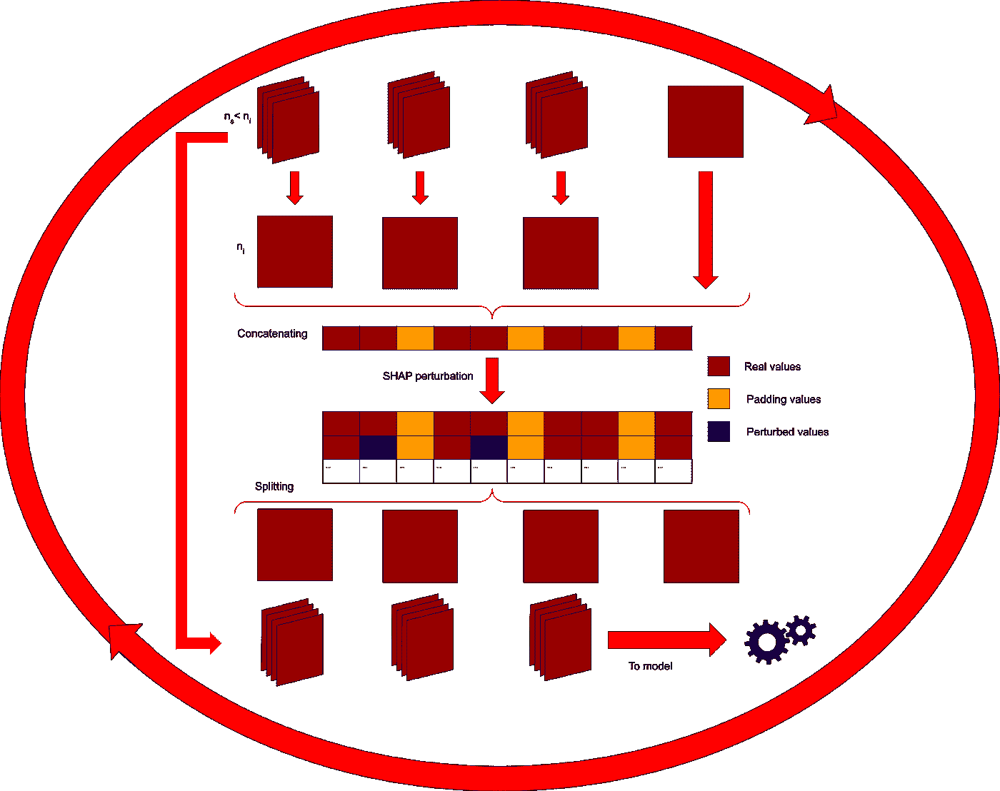

*从模型输入到 SHAP 输入的转换。*(图片作者提供)

## 跳进水里之前先感受一下水

所有这些工作完成后，我们可以开始看有趣的事情:获得的实际解释。

SHAP 的一大特点是可以通过汇总不同实例的解释来收集大量信息。这也可以用石灰来完成；然而，在 SHAP，由于使用 Shapley 值而不是权重来衡量影响，由此产生的综合解释有一个更坚实的背景。

虽然这是一个很好的属性，但在顺序输入的特定情况下(如在我们的模型中)，正确地组合 Shapley 值以获得对模型的洞察可能是困难的。

最常见的 SHAP 应用涉及二维输入(例如，观察值和特征)，因此解释以可理解的方式呈现了不同实例中 Shapley 值和特征值之间的关系(我们基本上是在处理三维集合)。

在我们的例子中，还依赖于事件序列中的位置；在进行解释时，必须考虑这个额外的方面。为游戏中所有不同玩家之间的关系提供有意义的见解可能是一项艰巨的任务。

我们将在下一节中解决这个问题。

让我们从简单地解释一个事件序列的最后一步开始。

为了建立与之前关于 LIME 的工作的连续性，下图用与上一篇文章相似的布局(针对同一用户)给出了解释。我们在解释中明确省略了与产品评级相关的两个特征，因为我们在之前的研究中发现数据可能缺失。

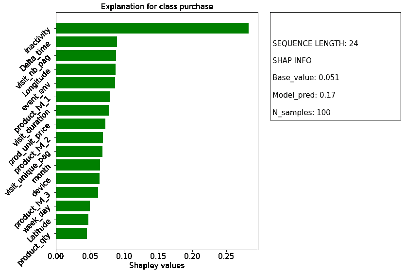

*使用 SHAP 解释单个实例的最后一步。*(图片作者提供)

从解释中清楚地显现出两个方面:首先，*不活动时间*(即，在该用户的最后动作和预测日期之间经过的时间)是最重要的特征；第二，所有的功能都有助于增加购买的概率。

第一个见解与我们用石灰获得的相同。然而，尽管 SHAP 对*的不活动时间*赋予了正面影响，但莱姆赋予了负面影响，即*的不活动时间*降低了预测的购买概率。

这两个结果哪个是正确的？

其实两个结果都是对的。这种差异是由于莱姆和 SHAP 提供了不同的解释。

SHAP 定义了相对于从训练数据获得的预测的基值的特征影响。具有积极影响的*不活动 _ 时间*意味着该用户的*不活动 _ 时间*的值相对于模型的基础值增加了购买的可能性。

下图中 SHAP 图书馆的 *force_plot* 可视化方法清晰地呈现了这种解释。

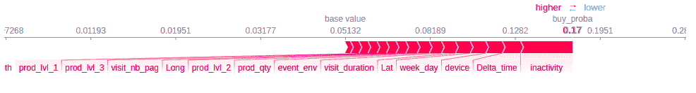

*使用基本 SHAP force_plot 函数解释单个实例的最后一步。*(图片作者提供)

从训练数据获得的基值低于该用户的预测值；此外，所有特性都有助于将购买概率从基准值转移到预测值(*注意:基准值低于预测值并不一定意味着所有特性都有积极影响；我们可以让具有负面影响的功能与具有更强正面影响的其他功能相平衡*。

其他功能的影响比*不活动时间*小得多，彼此之间只有细微的差别。

请记住，此解释指的是该用户的一系列事件的最后一步。因为利用 SHAP 的当前实现，我们可以在每个步骤中获得一个解释*(而不是对所有步骤的一个解释，例如在 LIME 中)，所以所评估的影响应该被认为如下:*作为特征 X 相对于序列*的最后一步中的基值对预测的贡献。*

到目前为止，SHAP 和莱姆提供的见解是相似的。它们都强调了*不活动时间*相对于其他特征的优势。然而，在解释这两种情况下的结果时应该保持谨慎。

本节考虑了对序列最后一步中的单个实例的解释。这个用户的其他步骤呢？这个例子的结论也是全局有效的吗？

使用在 SHAP 评估的 Shapley 值，我们可以为沿路特征的影响以及它们对单个用户的整体影响建立一个有趣的解释。开始了。

## 沿着小路漫步

SHAP 的有效性和受欢迎程度与其坚实的基础、计算效率以及通过结合不同实例的本地解释而提供的全局洞察力有关。

用同样的潜力来为单个用户产生一个对整个事件序列的解释怎么样？

我们确实可以将每个步骤的 Shapley 值聚合到序列中，以了解某个功能的影响演变、整个功能对序列的影响，甚至某个步骤相对于其他步骤的重要性。可能性很多。

首先，在序列中的不同事件期间是否发生了一些有趣的事情？

直觉的回答是“是的”。例如，一些特征在用户交互开始时可能具有更大的影响。下图展示了这一想法。

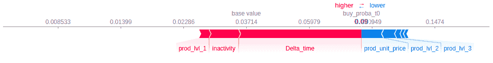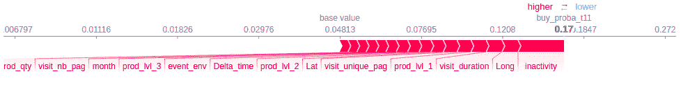

*使用 SHAP 力图函数解释序列的第一、中间和最后步骤中的单个实例。*(图片作者提供)

该特征的影响确实可以在不同的步骤中改变，这也是由于不同步骤中不同的基值和不同的预测概率(*因为 SHAP 解释器在序列的每个步骤中被训练，所以我们在每个步骤中都有基值和预测概率)*。

前面的数字似乎证实了我们最初的假设(序列中的位置对最终预测也有影响)。

对中间步骤和最后步骤的解释显示了一些相似之处:*inactive _ time*具有正面影响的主要角色，其他功能紧随其后。

相比之下，对第一步的解释是不同的。

首先，在这种情况下，只有几个特征对预测有影响。

*不活动时间*不再是最重要的功能；它已经被替换为 *delta_time* (即，在用户的先前交互之后经过的时间)。

这个观察很奇怪。初始步骤中的 *delta_time* 被设置为零，因为没有先前的步骤。该特征在事件开始时的重要性可能表明 *delta_time* 越短，购买概率越大(这是合理的直觉)。或者，它可以简单地强调第一步的重要性，作为购买途径的初始步骤。

在第一步中，我们可以看到对预测概率有负面影响的特征；值得注意的是，它们是与产品相关的特性。

仅根据这三个数字，可以建立关于特征在购买预测中的作用的一些假设:

*   初始步骤是基于他/她的交互(根据序列开始时的 *delta_time* 的影响)来预测用户的购买概率的基础；
*   用户看到的第一个产品可能会对购买概率产生显著的负面影响；
*   用户交互越多(从而增加序列长度)，个别功能的影响就越小，除了*不活动时间。*

我们记得我们正在查看单个用户的解释*；因此，我们还不能将这些假设推断为一个全球性的解释。我们会到达那里。*

这些都是有趣的(但多少有限的)见解；我们应该通过观察所有特征对所有序列步骤的影响来验证它们。

在这个方向上，下图显示了四个特征的 Shapley 值的演变。

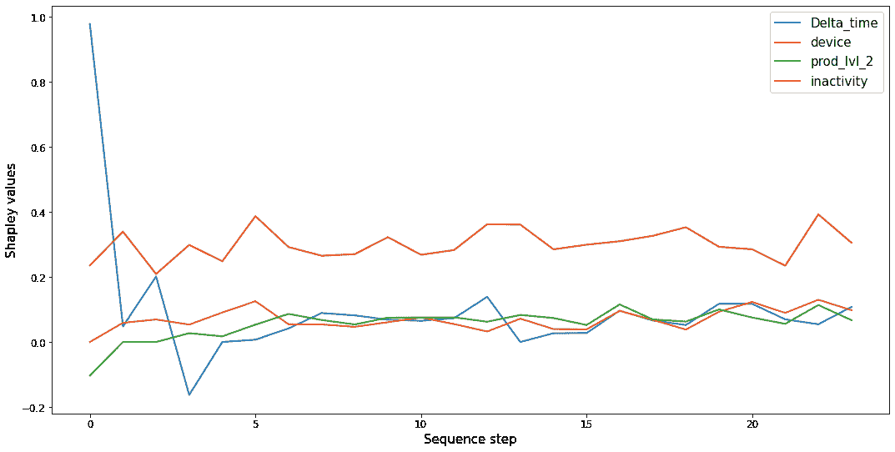

*作为序列步长函数的四个特征的 Shapley 值的演化。*(图片作者提供)

*不活动时间*始终优于其他功能；它保持了一种近似恒定的积极影响。

除了 *delta_time* 的影响外，其他特征的影响相当弱；所有的特征在序列结束时都趋向于接近零的影响。此外，直到大约第五步，特征的影响才表现出明显的差异。

这个假设应该被其他特征所证实，并获得这个实例的所有特征的进化的更一般的概述。

为了实现这一目标，以下两个图显示了每个特征的 Shapley 值及其在每个序列步骤中的等级的热图。

第一个图证实了之前获得的结论:在第五步之后，特征的总体低影响进一步降低(除了*不活动时间*)。

第二张图显示了根据 Shapley 值的绝对值确定的特征等级的演变。虽然该图显示了某种程度上更丰富的行为，但所有功能的影响之间的实际差异相当小。

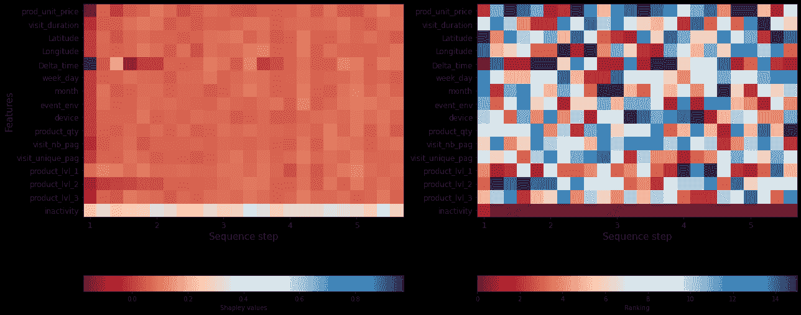

*热图显示 1)每个序列步骤中每个特征的 Shapley 值；2)每个特征和每个序列步骤的排序。*(图片作者提供)

通过堆叠每个序列步骤的结果，我们可以用包中的 *force_plot* 函数可视化；这种情况类似于多个实例的情况，只是在这种情况下，不同的实例是不同的序列步骤。

下图分别比较了根据原始顺序对序列进行排序的堆叠表示，以及它们基于 Shapley 值的相似性。

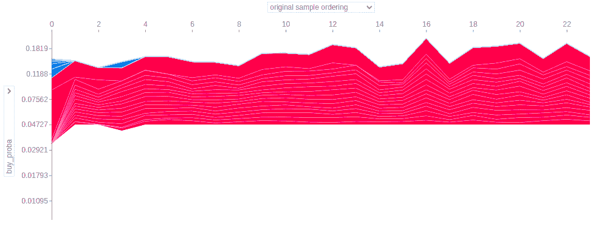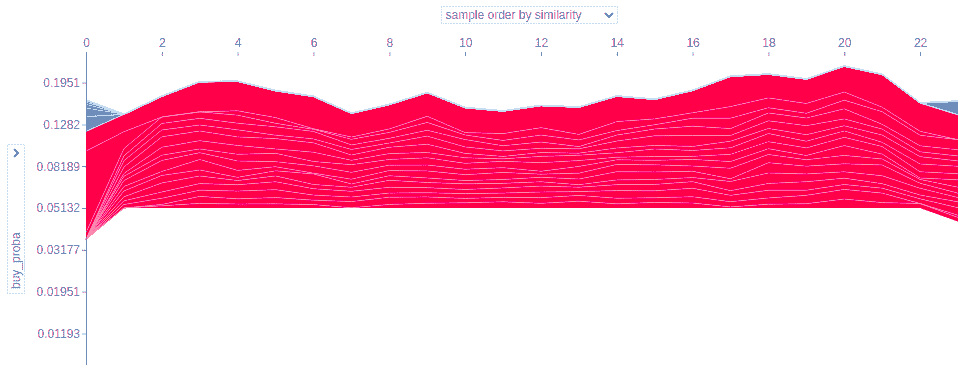

*使用内置函数 force_plot 对不同序列步骤的堆叠说明:1)对原始序列顺序的堆叠说明；2)具有按相似性排序的序列的堆叠解释。*(图片作者提供)

序列已被重新排列；因此，一些不一定彼此接近的步骤表现出相似性。因为每一步的 base_value 都不同，所以在这种情况下考虑所有序列的平均值。

到目前为止，我们还没有考虑一个特性的价值和它对 Shapley 值的影响是否相关。对这种相关性的深入了解通常可以通过 SHAP 现有的内置汇总图获得。因此，下面两个图展示了重新创建的蜂群图；在这种情况下，每个点代表同一实例的一个序列步骤，而不是实例本身。

第一个是 SHAP 软件包中绘图程序的复制品；Shapley 值和特征分别呈现在 x 轴和 y 轴上，并根据所有序列的 Shapley 值总和的绝对值排序。颜色代表特征值。

第二个图形与第一个几乎相同；但是，点的颜色代表序列中的位置。

根据这两个图，所有的特征通过将输出从基础值推至预测值，大多具有积极的影响。

第一个数字没有显示出 Shapley 值和特征值之间的任何显著关系。

Shapley 值和序列步长之间似乎有一种更有趣的关系:最大的负面影响发生在序列的第一步，并且总是在路径的最开始获得 *delta_time* 的极值。

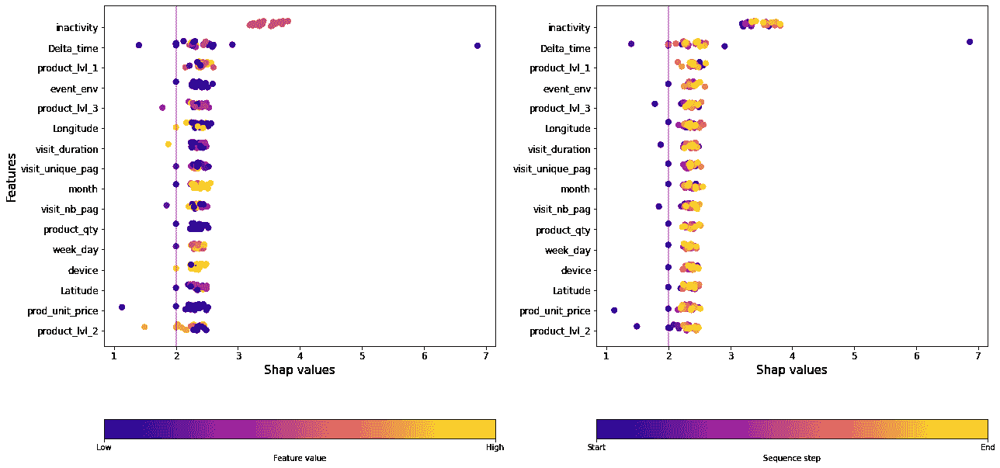

*蜂群图具有根据沿序列的 Shapley 值的绝对值之和排列的特征。1)点的颜色代表特征值；2)点的颜色代表顺序步骤。*(图片作者提供)

我们可以公平地说，对于这个用户来说，事件序列中的位置对预测的购买概率有很大的影响，并且初始步骤是至关重要的。

## 从本地到全球

一个简单的例子已经为我们提供了许多关于特征对预测的影响的信息。此外，我们对序列步骤的作用获得了有趣的见解。

如果我们将 SHAP 应用于几个实例，会发生什么？

因此，我们试图通过结合对几个用户的解释来了解这些特性对模型结果的整体影响。

如前所述，为了获得关于特性影响的信息，我们准备了下图，为三个不同的用户在他们的路径的最后一步提供一个单一的解释。

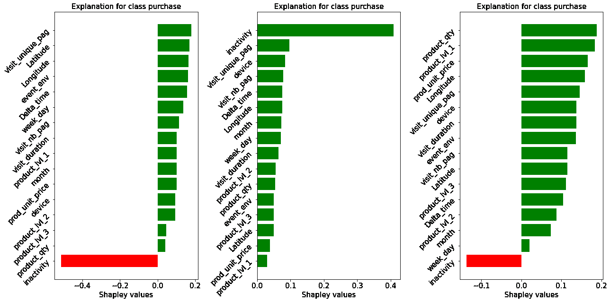

*使用 SHAP 解释最后一步中的三个不同实例。*(图片作者提供)

这三种解释互不相同。在其中的两个例子中，*不活动时间*具有负面影响，这与前一个例子形成对比，并恢复了我们使用 LIME 找到的解释(请回忆一下两个解释的不同含义)。

在最后一个中，*不活动时间*不再是最具影响力的功能。

如果我们想要获得一些全球的洞察力，这个观察必须被更彻底地调查。

我们可以从再次查看内置的 force_plot 开始，它在各自的最后一个序列步骤中堆叠了不同的实例。下图显示了两个实例家族的存在:在一个家族中， *inactivity_time* 对最终预测有积极的影响(左)，而在另一个家族中，它表现出相反的趋势(右)。

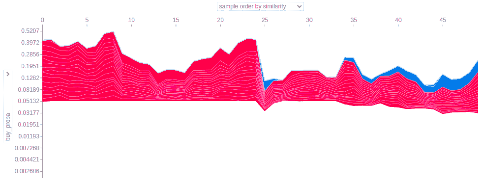

*使用 SHAP 内置函数 force_plot 对最后一个序列步骤中的不同实例进行堆叠解释。*(图片作者提供)

我们能获得更多的定量信息吗？序列的其他步骤会发生什么？

*不活动时间*真的是唯一有趣的特性吗？

这些都是有趣的问题。在这种情况下，由于额外的维度(我们应该在每个步骤和每个实例中呈现每个特性的影响，包括特性值对其影响的效果),很难提供结果的正确表示；相当多的信息要压缩在单个数字中)。

获得额外洞察力的简单方法是对实例的 Shapley 值进行平均；其结果是类似于上一节中呈现的那些表示；然而，这种表示指的是所有用户之间的平均影响。

下图显示了在序列的最后一步中特性的影响(实例的平均值)。

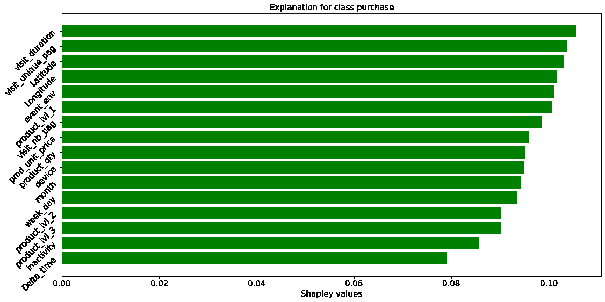

*序列最后一步中特征的平均影响。*(图片作者提供)

显然，平均行为与上一节中介绍的单个实例有很大不同；*不活动时间*和*增量时间*是影响最小的特征。

当然，作为一个平均值，对不同实例具有负面和正面影响的特性的净影响可能低于对每个用户具有较小影响但符号相同的特性的净影响。

通过查看平均绝对值，可以更深入地了解特性的重要性。

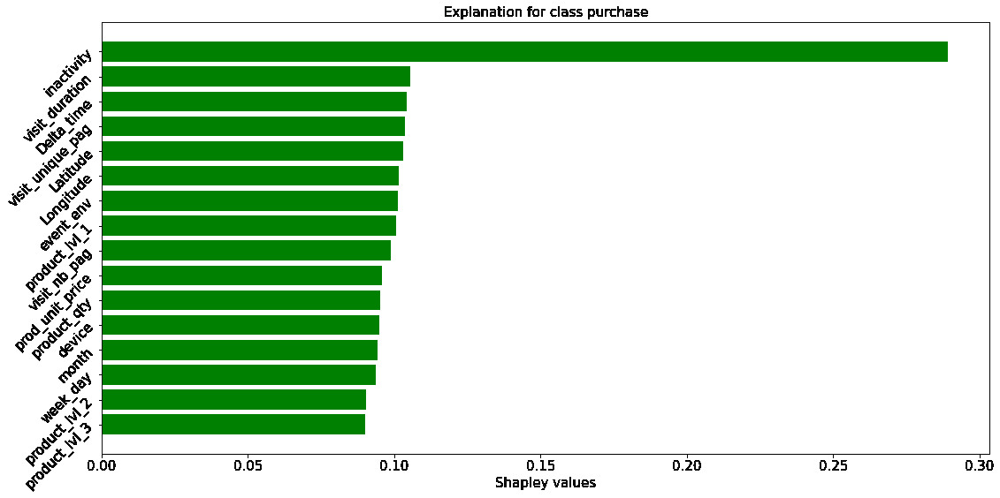

*序列最后一步中特征影响的平均绝对值。*(图片作者提供)

根据上图，*不活动时间*仍然是最重要的特性，其他特性在事件序列的最后一步也有类似的影响。

让我们试着从最后一个步骤开始，更深入地了解整个过程。我们可以用概要图再做一次。

下图显示了所有序列步骤中所有实例的所有特征；颜色代表标准化的特征值。

*蜂群图，其特征根据用户和序列的 Shapley 值的绝对值之和进行排序。这些点代表每个序列步骤中的每个实例。点的颜色代表归一化的特征值。*(图片作者提供)

虽然大多数特性在 Shapley 值和特性值之间没有表现出明显的关系，但是对于 *inactivity_time* 却不是这样:显然，值越高，影响越负面。

我们发现*不活动时间*和预测购买概率之间的直观关系:用户的最后一次交互越老，对购买预测的负面影响越大。

如前一节所述，我们可以通过明确考虑事件序列中的位置来呈现结果。

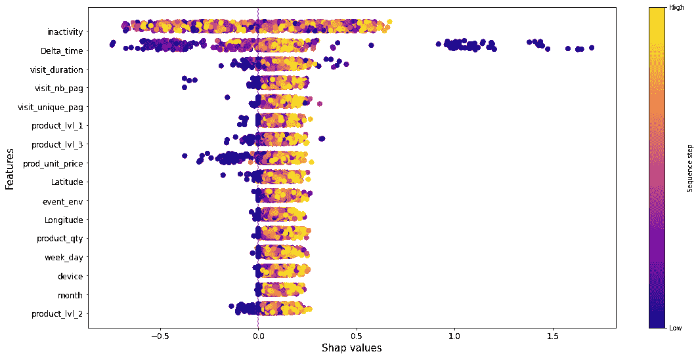

*蜂群图，其特征根据用户和序列的 Shapley 值的绝对值之和进行排序。这些点代表每个序列步骤中的每个实例。点的颜色表示沿序列的位置。*(图片作者提供)

在这种情况下，除了 *inactivity_time* 之外，大多数特征都呈现出清晰的模式。这些结果似乎证实了上一节的结果:这些特征在序列开始时具有负的 Shapley 值，然后在序列的发展过程中向正的影响转变。

到目前为止，我们已经关注了不同步骤和不同输入值的特性和影响。让我们考虑一下顺序本身。有影响吗？(答案是“是”:我们已经看到了序列中初始步骤和最后步骤之间的显著差异)。

为了进一步了解序列中各个位置的影响，我们准备了下图。我们总结了每一步中不同特征的 Shapley 值。结果图显示了不同实例之间的分布情况；这些序列是根据重要性排序的。

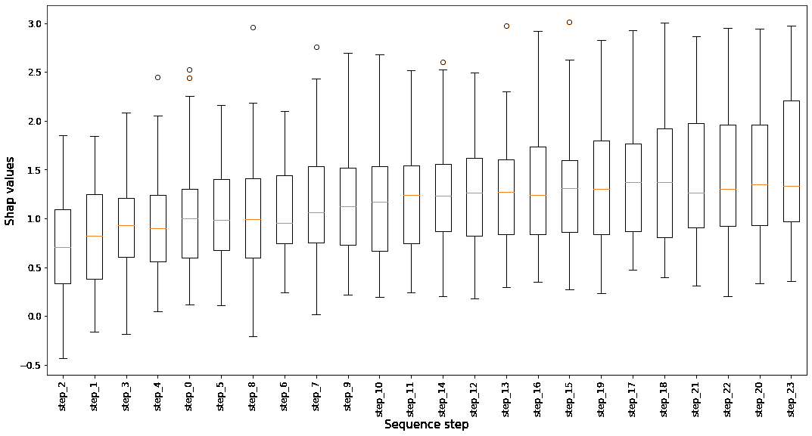

*Box_plot，根据特征上 Shapley 值的绝对值之和对序列进行排序。*(图片作者提供)

同样，我们在序列中走得越远，积极的影响就越大；就 Shapley 值的绝对值而言，最显著的影响是在最后的步骤中。

我们已经深入研究了 SHAP 在现实世界应用中的潜力，包括递归神经网络的使用。

当将解释器应用于这种神经网络时，我们发现了与应用石灰类似的困难。此外，我们发现需要修改预处理流水线，以便更好地适应 SHAP。

这远非简单明了，但努力是值得的。

> SHAP 的解释能力令人印象深刻。

它可能不如 LIME 直观，而且对于 KernelExplainer 来说，计算量仍然很大；然而，Shapley 值的组成特性允许建立丰富多样的解释。

为递归神经网络的三维情况建立深刻的解释可能具有挑战性；然而，沙普利价值观为实现这一目标提供了基础。其余方面取决于最终用户的需求和他/她的创造力。

这项工作已经在 [easyence](https://www.easyence.com/) 数据实验室内完成。