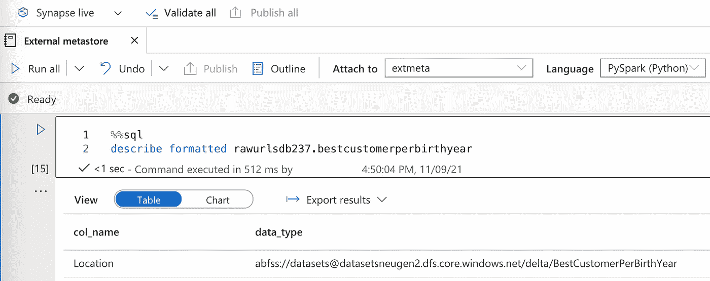
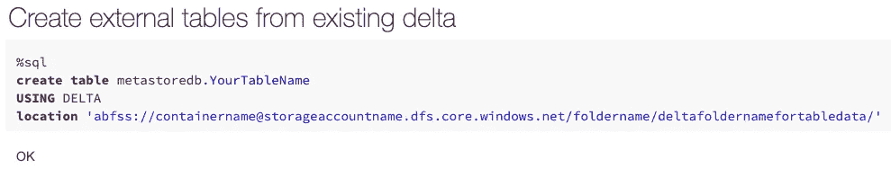

# 具有 Azure 数据块和 Synapse 火花池的共享外部配置单元 Metastore

> 原文：<https://towardsdatascience.com/shared-external-hive-metastore-with-azure-databricks-and-synapse-spark-pools-8d611c677688?source=collection_archive---------2----------------------->

## *了解如何设置共享的外部配置单元 metastore，以便在多个数据块工作区和 Synapse Spark 池中使用(预览)*


图片由 [Tumis](https://pixabay.com/users/tumisu-148124/) u 在 [Pixelbay](https://pixabay.com/) 上

# 1 背景

为了帮助构建数据湖中的数据，您可以在 Hive metastore 中以表格的形式注册和共享数据。Hive metastore 是一个数据库，它保存关于我们数据的元数据，例如数据湖中数据的路径和数据的格式(parquet、delta、CSV 等)。


图片作者。

Azure Databricks 中的每个工作区都带有一个托管的内置 metastore。过一会儿，您会有新的团队或项目创建多个 Databricks 工作区，并开始注册它们的表。其他 spark 用户可能会使用 Synapse Spark Pools。然后，您意识到您想要共享来自不同工作区的表，但是每个元存储都是独立的，并且只能从每个工作区内访问。

您可能还想使用 metastore 在业务中共享表，将 [Databricks SQL](https://docs.microsoft.com/en-us/azure/databricks/sql/admin/data-access-configuration#supported-properties) 与 metastore 结合起来为 BI 用户服务。

一种解决方案是创建一个共享的 metastore，以便不同的工作空间可以将其数据注册到一个共享的 metastore 中。

# 2 个共享外部 metastore

我们希望创建一个共享的外部 metastore。一个好的开始通常是查看文档:[外部 Apache Hive metastore—Azure data bricks | Microsoft Docs](https://docs.microsoft.com/en-us/azure/databricks/data/metastores/external-hive-metastore)

文档中有很多信息。你必须选择:

*   Hive metastore 版本
*   metastore 的数据库

我们需要 Databricks 运行时、为外部 metastore 保存元数据的数据库以及使其工作的 Hive 版本的正确组合。

## 2.1 数据块 spark 配置设置和外部 metastore

在我们进入匹配配置单元版本和后端数据库的细节之前，我们先看看如何告诉 Databricks 集群使用哪个 metastore。我们在集群的 spark 配置中提供我们的设置:


图片作者。


图片作者。

我们需要提供:

*   要使用的配置单元架构的版本

```
spark.sql.hive.metastore.version X.Y.Z
```

*   作为 metastore 后端的数据库的驱动程序和 URI。下面的例子使用 MySql 的“org.mariadb.jdbc.Driver”。

```
javax.jdo.option.ConnectionDriverName org.mariadb.jdbc.Driver
javax.jdo.option.ConnectionURL jdbc:mysql://mysqlserveruri.mysql.database.azure.com:3306/myextmetadb013?useSSL=true&requireSSL=false
```

*   连接到数据库的凭据

```
javax.jdo.option.ConnectionPassword {{secrets/databricks/databricksmetastorepass}}
javax.jdo.option.ConnectionUserName {{secrets/databricks/databricksmetastoreuser}}
```

请注意，我们使用占位符来表示存储在 Azure KeyVault 中的凭据。你可以在 spark 配置中直接引用 Azure KeyVault 中的秘密。语法是:

```
{{secrets/scope/secretname}}
```

其中 scope 是您注册的作用域名称，secretname 是 Azure KeyVault 中的机密名称。如果你忘记了或者还没有向密钥库注册一个作用域，你可以在这里查看:[https://docs . Microsoft . com/en-us/azure/databricks/security/secrets/secret-scopes](https://docs.microsoft.com/en-us/azure/databricks/security/secrets/secret-scopes)了解如何注册。

如果您忘记了作用域名称和秘密，您总是可以使用 dbutils 来查看:

```
dbutils.secrets.listScopes()
dbutils.secrets.list(scope="myscopename")
```

确保为低于 2 的配置单元版本创建配置单元架构(第一次):

```
datanucleus.autoCreateSchema true
datanucleus.schema.autoCreateTables true
```

注意:模式的自动创建不适用于配置单元版本 2 和更高版本

*   我们需要的任何罐子(0.13 不需要)
*   其他一些可选设置不验证模式(第一次)，因为我们创建了模式，但无法验证它。

```
datanucleus.fixedDatastore false
hive.metastore.schema.verification.record.version false hive.metastore.schema.verification false
```

当您为 metastore 创建了模式后，您可以设置回该属性:

```
datanucleus.fixedDatastore true
```

这可以防止对 metastore 数据库进行任何意外的结构更改。

## 2.2 选择 Hive 版本和学习

根据您选择的配置单元版本，配置单元的行为会有所不同。一些区别是:

*   并非所有数据库都支持作为后端
*   配置单元可以/不能自己创建架构。
*   一些错误修复和功能。在这里查看所有版本和变更日志:【apache.org 下载

**用蜂巢学习 0.13**

我第一次尝试用的是 Hive 0.13(工作区默认内置版本)。使用 0.13 有一些好处。0.13 版可以通过设置属性“data nucleus . autocreateschema true”来为 metastore 生成模式。此外，所需的 jar 由 databricks 提供。

不要将 Hive 0.13 用于 Azure SQL DB。在我的测试中，由于在删除 metastore 中注册的表时 Datanucleus 中的一个[错误](https://github.com/datanucleus/datanucleus-rdbms/issues/110),这种组合不起作用。虽然文档说它应该可以工作，但是它没有。

Azure MySql DB 5.7 与 Hive 0.13 配合良好，但请确保您设置了服务器参数*将 lower_case_table_names* 更改为 2。在为 metastore 创建数据库和表之前，请执行此操作。

这可以在 Azure 门户中完成:


图片作者。

然后在 MySql 服务器中创建一个数据库。在用 JDBC 连接字符串将数据块连接到数据库之前，我们需要创建数据库。

使用您喜欢的工具登录 MySQL 服务器，并使用您选择的名称为 metastore 创建一个数据库。示例:

```
CREATE DATABASE extmetadb013;
```

将以下内容添加到要使用的 Databricks 集群的 Spark 配置中，替换:

```
xxxscope, xxxsecretname, xxxserverurl, xxxdatabasename, xxxuser
```

使用您的数据库 URL 和凭据:

```
spark.sql.hive.metastore.version 0.13javax.jdo.option.ConnectionDriverName org.mariadb.jdbc.Driver
javax.jdo.option.ConnectionURL jdbc:mysql://xxxserverurl.mysql.database.azure.com:3306/xxxdatabasename?useSSL=true&requireSSL=false
javax.jdo.option.ConnectionUserName xxxuser
javax.jdo.option.ConnectionPassword {{secrets/xxxscope/xxxsecretname}}
datanucleus.fixedDatastore false
hive.metastore.schema.verification false
datanucleus.schema.autoCreateTables truehive.metastore.schema.verification.record.version false
datanucleus.autoCreateSchema true
```

在数据块中重新启动集群，以在 metastore 存储数据库中创建表。

在此之后，您应该能够看到新的数据库和创建的模式。

## **学习 Hive 2.3.7**

Hive 2.3.7 使用 Azure SQL DB 作为后端。

**突触**

如果您想要在数据块和 Synapse Spark 池之间共享相同的外部 metastore，您可以使用数据块和 Synapse Spark 都支持的 Hive 2 . 3 . 7 版。在 manage 选项卡下链接 metastore 数据库，然后设置一个 spark 属性:

```
spark.hadoop.hive.synapse.externalmetastore.linkedservice.name HIVEMetaStoreLinkedName
```

请注意，这仍处于预览阶段(在我的测试中有点不稳定)，因此还不适合生产工作负载。请参阅:[将外部配置单元 Metastore 用于 Synapse Spark Pool(预览)](https://docs.microsoft.com/en-us/azure/synapse-analytics/spark/apache-spark-external-metastore)以获得逐步指南。

**数据砖块**

Hive 版本 2.3.7 要求您在 Databricks 的 spark.config 中设置一个属性，告诉 spark 使用什么 jar:

```
spark.sql.hive.metastore.jars builtin
```

jar 是提供的/内置的，所以您不必自己下载 jar。注意:对于 Hive 1.x 和 3.x，您必须提供一个包含 jar 的文件夹，或者您可以在集群启动时使用 Maven 下载 jar，但是 jar 的下载需要相当长的时间，因此如果您以前下载过一次 jar，将会缩短启动时间。

**手动创建 metastore 表**

Hive 版本 2.3.7(版本 2.x 和更高版本)不会为您创建 metastore 表，并且[文档](https://docs.microsoft.com/en-us/azure/databricks/kb/metastore/hive-metastore-troubleshooting#solution)没有清楚地告诉您如何创建表。我尝试了两种有效的方法:

*   使用配置单元[模式工具](https://cwiki.apache.org/confluence/display/Hive/Hive+Schema+Tool)
*   使用配置单元 SQL 脚本

**使用 Hive schematool 创建 metastore 表**

要使用 Hive schematool 二进制文件(/Apache-Hive-2 . 3 . 9-bin/bin/schema tool)，您需要下载 Hive 和，下载 Hadoop Core，并在 hive-site.xml 中设置连接属性(您可以使用 proto-hive-site.xml 作为模板)。然后运行 schematool，它将连接到您的数据库并创建表。即使它确实有效，我也不会在这里详细讨论。我建议使用下面描述的 SQL 脚本。

**使用 Hive SQL 脚本创建 metastore 表**

有一种更简单的方法来为特定的 Hive 版本创建表/模式。您可以下载并运行 SQL 脚本。

从这里下载并解压最新的 2.3.x HIVE 版本:[https://hive.apache.org/downloads.html](https://hive.apache.org/downloads.html)

您将看到一个文件夹，其中包含不同配置单元版本和不同数据库的脚本:


图片作者。

例如，如果我们选择 mssql 文件夹(如果我们使用该数据库，则选择您的数据库)，我们将找到不同模式版本的脚本:


图片作者。

在我们的例子中，我们将运行 Hive 2.3.7，并希望创建模式版本 2.3.0。在您喜欢的 SQL 编辑器中运行或粘贴脚本:

```
hive-schema-2.3.0.mssql.sql
```

来创建表格。

我们需要为集群设置 spark 配置，以使用 Hive 2.3.7 和我们的 Azure SqlDB:

在 Spark 配置中，用您的值替换:XXXDNSXXX、XXXDATABASEXXX、XXXUSERXXX 和 XXXPASSORDXXX，最好使用如上所述的 Azure KeyVault，以避免明文机密。

```
spark.sql.hive.metastore.jars builtin
javax.jdo.option.ConnectionURL jdbc:sqlserver://XXXDNSXXX.database.windows.net:1433;database=XXXDATABASEXXX;encrypt=true;trustServerCertificate=false;hostNameInCertificate=*.database.windows.net;loginTimeout=30;
javax.jdo.option.ConnectionUserName XXXUSERXXX
javax.jdo.option.ConnectionPassword XXXPASSORDXXX
javax.jdo.option.ConnectionDriverName com.microsoft.sqlserver.jdbc.SQLServerDriver
hive.metastore.schema.verification.record.version true
hive.metastore.schema.verification true
spark.sql.hive.metastore.version 2.3.7
```

如果您愿意，可以将 metastore 的 spark 配置设置移动到一个共享的 init 脚本中，这样它就可以被许多集群使用。

# 3 通过共享 metastore 访问数据

现在我们有了一个共享的 metastore，可以用来从表名读取数据湖中的数据。

使用 metastore 查询数据块中的表:


使用相同的 metastore 查询 Synapse Spark 池中的相同表:


图片作者。

这要求不同的工作区和集群拥有对数据的读取权限。当使用共享 metastore 时，我们应该使用对数据湖的直接访问，即不使用装载来访问数据，因为装载可能因工作空间而异。如果我们查询关于在 metastore 中注册的表的信息，我们可以查看表后面的数据位置(直接访问 URL):


图片作者。



作者图片

我们可以看到，Databricks 和 Synapse 都使用在 metastore 中注册的直接访问 URL。

位置必须被所有读者理解。如果位置是直接 URL，它将跨用于读取数据的所有技术工作(只要读取器有访问权)。在数据湖中挂载文件夹是行不通的，因为这会要求读者在工作空间中拥有完全相同的挂载点。此外，其他工具，如 Synapse Spark Pools，可能希望使用 metastore，但可能无法挂载数据。

# 4 始终创建外部表

在数据块中创建表格时，使用:

```
df.write.saveAsTable("MyManagedTableName")
```

默认位置是将数据存储在本地 DBFS 文件夹下:

```
/dbfs/user/hive/warehouse/MyManagedTableName 
```

在 Databricks 工作区。

DBFS 属于工作空间，而不是您的数据湖。此外，一般建议是不要向 DBFS 写入任何敏感数据。我们应该通过在创建表时给出数据的位置来确保只创建外部的表。我们应该使用直接的 URL 到数据表，而不是挂载路径。下面是一个简单的例子，给出了在数据湖中的现有数据(增量格式)之上创建表时数据的位置:



图片作者。

我们必须说出数据的格式(上例中的 delta ),并指向数据所在的文件夹，以便在现有数据的基础上创建我们的表。

如果您想了解更多关于托管表和非托管表的信息，这里还有另一篇文章: [3 种使用 Apache Spark 创建表的方法|作者 AnBento |介绍了不同的选项。另外，官方文档在这里:](/3-ways-to-create-tables-with-apache-spark-32aed0f355ab)[数据库和表格——Azure Databricks |微软文档](https://docs.microsoft.com/en-us/azure/databricks/data/tables)。

# 5 允许集群直接访问数据

您可能已经注意到，我们还没有讨论如何直接访问数据湖中我们需要的数据。这可以在 spark 配置中使用 Azure KeyVault 来存储秘密。如何使用密钥或服务主体访问数据湖是另一个故事，但这里有文档的链接:
[使用 OAuth 2.0 和 Azure 服务主体](https://docs.microsoft.com/en-us/azure/databricks/data/data-sources/azure/adls-gen2/azure-datalake-gen2-sp-access)
访问 Azure 数据湖存储 Gen2，具体来说，您不想挂载，而是使用直接访问:
[直接访问 ADLS gen 2](https://docs.microsoft.com/en-us/azure/databricks/data/data-sources/azure/adls-gen2/azure-datalake-gen2-sp-access#access-adls-gen2-directly)

在 synapse workspace 中，您可以在“管理”选项卡下链接存储帐户，方法是使用密钥、服务主体、托管身份或用户分配的托管身份(预览)将存储帐户添加为链接的服务。

# 6 下一步是什么

一如既往，在这篇文章中，我想分享一些关于设置共享外部元商店的学习，例如在 Azure Databricks 和 Synapse Spark Pools 中使用。我希望您在开发下一个外部 metastore 的过程中获得了一些新的见解。